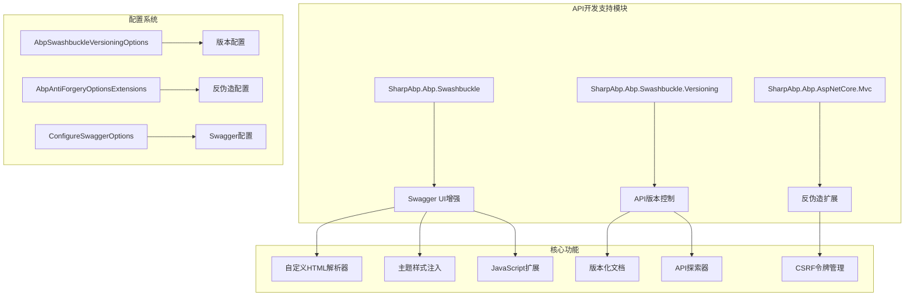
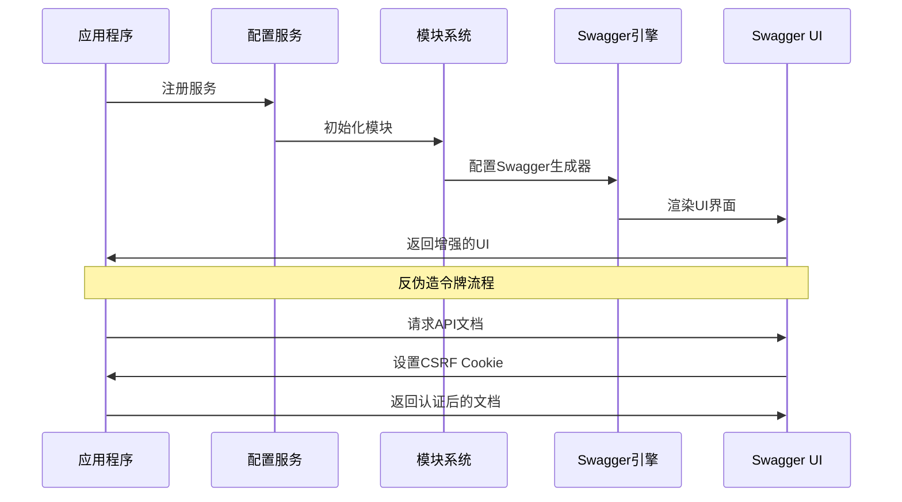
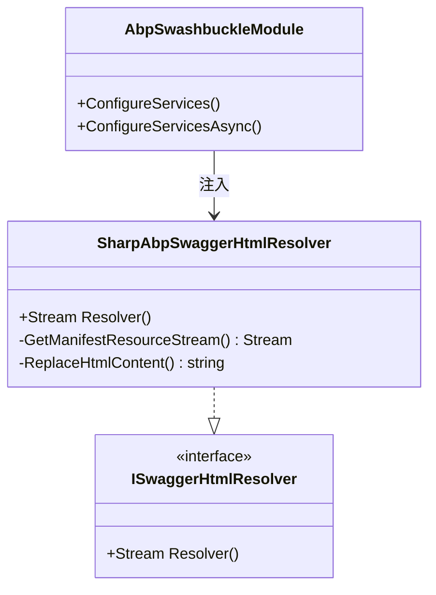
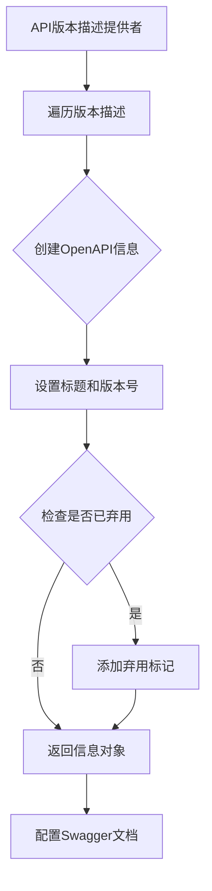
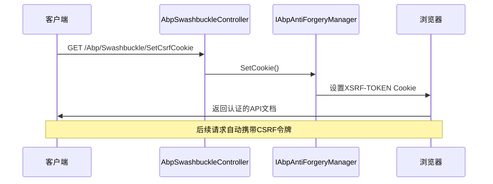
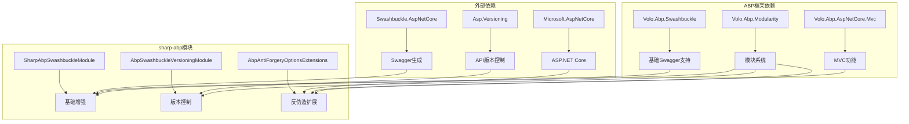

# sharp-abp API开发支持

<cite>
**本文档中引用的文件**
- [AbpSwashbuckleVersioningModule.cs](file://framework/src/SharpAbp.Abp.Swashbuckle.Versioning/SharpAbp/Abp/Swashbuckle/Versioning/AbpSwashbuckleVersioningModule.cs)
- [ConfigureSwaggerOptions.cs](file://framework/src/SharpAbp.Abp.Swashbuckle.Versioning/SharpAbp/Abp/Swashbuckle/Versioning/ConfigureSwaggerOptions.cs)
- [AbpSwashbuckleVersioningOptions.cs](file://framework/src\SharpAbp.Abp.Swashbuckle.Versioning\SharpAbp\Abp\Swashbuckle\Versioning\AbpSwashbuckleVersioningOptions.cs)
- [AbpAntiForgeryOptionsExtensions.cs](file://framework/src\SharpAbp.Abp.AspNetCore.Mvc\SharpAbp\Abp\AspNetCore\Mvc\AbpAntiForgeryOptionsExtensions.cs)
- [AbpSwaggerUIBuilderExtensions.cs](file://framework/src\SharpAbp.Abp.Swashbuckle\Microsoft\AspNetCore\Builder\AbpSwaggerUIBuilderExtensions.cs)
- [SharpAbpSwaggerHtmlResolver.cs](file://framework/src\SharpAbp.Abp.Swashbuckle\SharpAbp\Abp\Swashbuckle\SharpAbpSwaggerHtmlResolver.cs)
- [AbpSwaggerGenOptionsExtensions.cs](file://framework/src\SharpAbp.Abp.Swashbuckle\Microsoft\AspNetCore\Extensions\DependencyInjection\AbpSwaggerGenOptionsExtensions.cs)
- [AbpSwashbuckleController.cs](file://framework/src\SharpAbp.Abp.Swashbuckle\SharpAbp\Abp\Swashbuckle\AbpSwashbuckleController.cs)
- [AbpSwaggerGenServiceCollectionExtensions.cs](file://framework/src\SharpAbp.Abp.Swashbuckle\Microsoft\AspNetCore\Extensions\DependencyInjection\AbpSwaggerGenServiceCollectionExtensions.cs)
- [abp.js](file://framework/src\SharpAbp.Abp.Swashbuckle\wwwroot\swagger\ui\abp.js)
- [abp.swagger.js](file://framework/src\SharpAbp.Abp.Swashbuckle\wwwroot\swagger\ui\abp.swagger.js)
</cite>

## 目录
1. [简介](#简介)
2. [项目结构](#项目结构)
3. [核心组件](#核心组件)
4. [架构概览](#架构概览)
5. [详细组件分析](#详细组件分析)
6. [依赖关系分析](#依赖关系分析)
7. [性能考虑](#性能考虑)
8. [故障排除指南](#故障排除指南)
9. [结论](#结论)

## 简介

sharp-abp是一个基于ABP框架的扩展库，专门提供了强大的API开发支持功能。本文档重点介绍了其Swagger集成和API版本控制功能，包括自定义的`SharpAbp.Abp.Swashbuckle`模块如何增强ABP的Swagger UI，以及`SharpAbp.Abp.Swashbuckle.Versioning`模块如何通过`AbpSwashbuckleVersioningOptions`和`ConfigureSwaggerOptions`实现API的版本管理。

该框架还提供了反伪造（AntiForgery）功能扩展，增强了Web API的安全性。通过这些功能，开发者可以轻松地配置Swagger UI主题、添加API版本支持和启用反伪造令牌，从而生成专业且安全的API文档界面。

## 项目结构

sharp-abp的API开发支持功能主要分布在以下模块中：

**图表来源**
- [AbpSwashbuckleVersioningModule.cs](file://framework/src/SharpAbp.Abp.Swashbuckle.Versioning/SharpAbp/Abp/Swashbuckle/Versioning/AbpSwashbuckleVersioningModule.cs#L1-L94)
- [AbpAntiForgeryOptionsExtensions.cs](file://framework/src/SharpAbp.Abp.AspNetCore.Mvc/SharpAbp/Abp/AspNetCore/Mvc/AbpAntiForgeryOptionsExtensions.cs#L1-L35)

**章节来源**
- [AbpSwashbuckleVersioningModule.cs](file://framework/src/SharpAbp.Abp.Swashbuckle.Versioning/SharpAbp/Abp/Swashbuckle/Versioning/AbpSwashbuckleVersioningModule.cs#L1-L94)
- [AbpAntiForgeryOptionsExtensions.cs](file://framework/src/SharpAbp.Abp.AspNetCore.Mvc/SharpAbp/Abp/AspNetCore/Mvc/AbpAntiForgeryOptionsExtensions.cs#L1-L35)

## 核心组件

### SharpAbp.Abp.Swashbuckle模块

`SharpAbp.Abp.Swashbuckle`模块是Swagger UI增强的核心组件，提供了以下关键功能：

1. **自定义HTML解析器**：通过`SharpAbpSwaggerHtmlResolver`替换默认的HTML解析器，注入自定义的JavaScript和CSS资源
2. **主题样式支持**：提供预配置的主题样式，改善Swagger UI的视觉体验
3. **JavaScript扩展**：包含增强的JavaScript功能，如反伪造令牌处理和租户占位符替换

### SharpAbp.Abp.Swashbuckle.Versioning模块

`SharpAbp.Abp.Swashbuckle.Versioning`模块专注于API版本控制，提供了：

1. **版本化文档生成**：自动为每个API版本生成独立的Swagger文档
2. **API探索器集成**：与ASP.NET Core API版本控制功能深度集成
3. **版本配置选项**：通过`AbpSwashbuckleVersioningOptions`进行灵活配置

### 反伪造扩展模块

`SharpAbp.Abp.AspNetCore.Mvc`模块提供了反伪造功能扩展，包括：

1. **反伪造选项扩展**：通过`AbpAntiForgeryOptionsExtensions`提供便捷的配置方法
2. **CSRF令牌管理**：自动设置和管理CSRF令牌
3. **控制器支持**：提供专用的控制器用于CSRF令牌设置

**章节来源**
- [SharpAbpSwaggerHtmlResolver.cs](file://framework/src/SharpAbp.Abp.Swashbuckle/SharpAbp/Abp/Swashbuckle/SharpAbpSwaggerHtmlResolver.cs#L1-L25)
- [ConfigureSwaggerOptions.cs](file://framework/src/SharpAbp.Abp.Swashbuckle.Versioning/SharpAbp/Abp/Swashbuckle/Versioning/ConfigureSwaggerOptions.cs#L1-L44)
- [AbpAntiForgeryOptionsExtensions.cs](file://framework/src/SharpAbp.Abp.AspNetCore.Mvc/SharpAbp/Abp/AspNetCore/Mvc/AbpAntiForgeryOptionsExtensions.cs#L1-L35)

## 架构概览

sharp-abp的API开发支持采用模块化架构设计，各组件之间通过依赖注入和服务注册机制进行协作：

**图表来源**
- [AbpSwashbuckleVersioningModule.cs](file://framework/src/SharpAbp.Abp.Swashbuckle.Versioning/SharpAbp/Abp/Swashbuckle/Versioning/AbpSwashbuckleVersioningModule.cs#L20-L40)
- [AbpSwaggerUIBuilderExtensions.cs](file://framework/src/SharpAbp.Abp.Swashbuckle/Microsoft/AspNetCore/Builder/AbpSwaggerUIBuilderExtensions.cs#L10-L26)

## 详细组件分析

### SharpAbpSwaggerHtmlResolver分析

`SharpAbpSwaggerHtmlResolver`是Swagger UI增强的核心组件，负责替换默认的HTML解析器并注入自定义资源：

**图表来源**
- [SharpAbpSwaggerHtmlResolver.cs](file://framework/src/SharpAbp.Abp.Swashbuckle/SharpAbp/Abp/Swashbuckle/SharpAbpSwaggerHtmlResolver.cs#L10-L25)

该组件的主要功能包括：
- **HTML内容替换**：将默认的`SwaggerUIBundle`调用替换为`abp.SwaggerUIBundle`
- **资源流处理**：从嵌入式资源中读取原始HTML内容
- **依赖注入**：通过`ReplaceServices = true`特性替换默认实现

### API版本控制配置分析

`ConfigureSwaggerOptions`类实现了API版本控制的核心逻辑：

**图表来源**
- [ConfigureSwaggerOptions.cs](file://framework/src/SharpAbp.Abp.Swashbuckle.Versioning/SharpAbp/Abp/Swashbuckle/Versioning/ConfigureSwaggerOptions.cs#L25-L44)

该组件的关键特性：
- **版本化文档生成**：为每个API版本创建独立的Swagger文档
- **弃用版本处理**：自动识别并标记已弃用的API版本
- **配置灵活性**：通过`AbpSwashbuckleVersioningOptions`进行全局配置

### 反伪造令牌管理分析

反伪造功能通过多个组件协同工作：

**图表来源**
- [AbpSwashbuckleController.cs](file://framework/src/SharpAbp.Abp.Swashbuckle/SharpAbp/Abp/Swashbuckle/AbpSwashbuckleController.cs#L20-L28)

**章节来源**
- [SharpAbpSwaggerHtmlResolver.cs](file://framework/src/SharpAbp.Abp.Swashbuckle/SharpAbp/Abp/Swashbuckle/SharpAbpSwaggerHtmlResolver.cs#L1-L25)
- [ConfigureSwaggerOptions.cs](file://framework/src/SharpAbp.Abp.Swashbuckle.Versioning/SharpAbp/Abp/Swashbuckle/Versioning/ConfigureSwaggerOptions.cs#L1-L44)
- [AbpSwashbuckleController.cs](file://framework/src/SharpAbp.Abp.Swashbuckle/SharpAbp/Abp/Swashbuckle/AbpSwashbuckleController.cs#L1-L28)

## 依赖关系分析

sharp-abp的API开发支持模块具有清晰的依赖层次结构：

**图表来源**
- [AbpSwashbuckleVersioningModule.cs](file://framework/src/SharpAbp.Abp.Swashbuckle.Versioning/SharpAbp/Abp/Swashbuckle/Versioning/AbpSwashbuckleVersioningModule.cs#L10-L18)

**章节来源**
- [AbpSwashbuckleVersioningModule.cs](file://framework/src/SharpAbp.Abp.Swashbuckle.Versioning/SharpAbp/Abp/Swashbuckle/Versioning/AbpSwashbuckleVersioningModule.cs#L1-L94)

## 性能考虑

在使用sharp-abp的API开发支持功能时，需要考虑以下性能因素：

1. **资源加载优化**：嵌入式资源的加载效率较高，但需要注意内存使用
2. **版本控制开销**：API版本越多，生成的文档数量也会相应增加
3. **反伪造令牌处理**：每次访问API文档都会触发CSRF令牌设置，可能影响首次加载速度
4. **缓存策略**：合理配置静态资源缓存以提高用户体验

## 故障排除指南

### 常见问题及解决方案

1. **Swagger UI不显示自定义主题**
   - 检查`abp.swagger.js`和`swagger_theme.css`文件是否正确加载
   - 确认`UseSharpAbpSwaggerUI`扩展方法是否正确调用

2. **API版本控制失效**
   - 验证`AbpSwashbuckleVersioningModule`是否正确注册
   - 检查`AbpSwashbuckleVersioningOptions`配置是否正确

3. **反伪造令牌问题**
   - 确认`AbpSwashbuckleController`路由是否正确
   - 检查CSRF Cookie设置是否成功

**章节来源**
- [AbpSwashbuckleController.cs](file://framework/src/SharpAbp.Abp.Swashbuckle/SharpAbp/Abp/Swashbuckle/AbpSwashbuckleController.cs#L1-L28)
- [AbpSwaggerUIBuilderExtensions.cs](file://framework/src/SharpAbp.Abp.Swashbuckle/Microsoft/AspNetCore/Builder/AbpSwaggerUIBuilderExtensions.cs#L1-L26)

## 结论

sharp-abp的API开发支持功能为ABP应用程序提供了强大而灵活的API文档生成功能。通过`SharpAbp.Abp.Swashbuckle`模块的Swagger UI增强、`SharpAbp.Abp.Swashbuckle.Versioning`模块的API版本控制，以及反伪造功能扩展，开发者可以轻松构建专业、安全且易于使用的API文档界面。

这些功能不仅简化了API文档的配置过程，还提供了丰富的定制选项，使开发者能够根据具体需求调整Swagger UI的行为和外观。通过模块化的架构设计，这些功能可以独立使用或组合使用，满足不同项目的复杂需求。