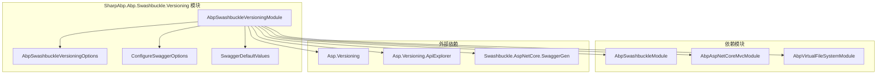
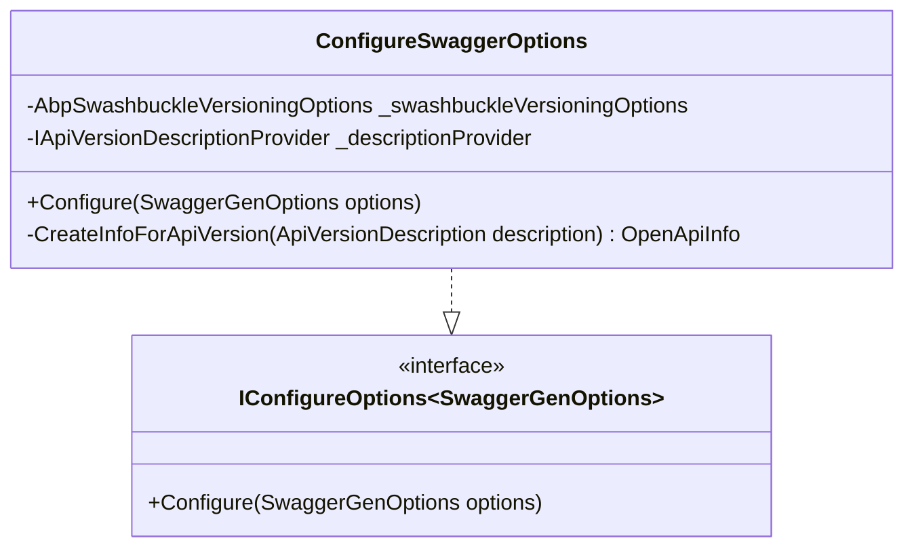
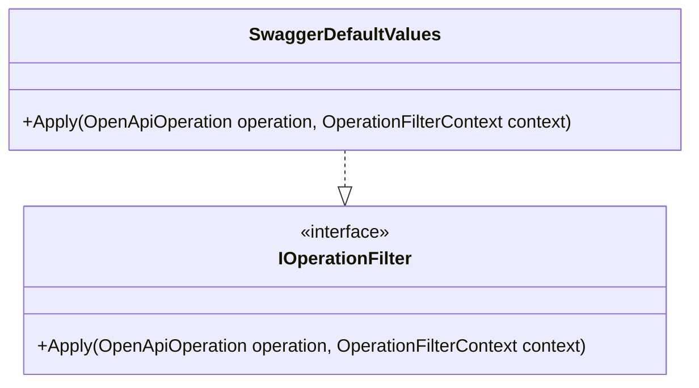
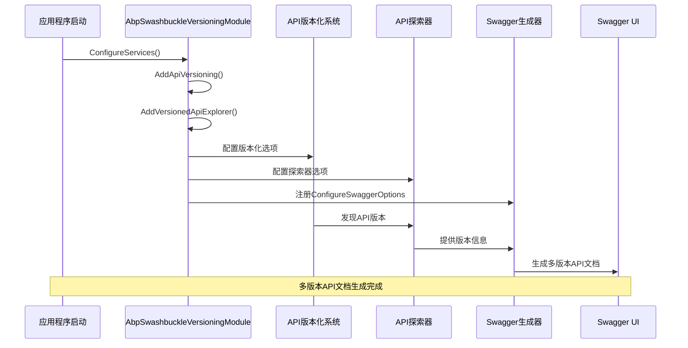
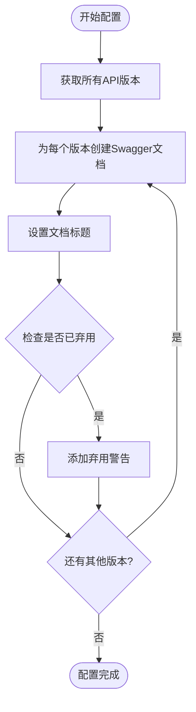

# API 版本控制

<cite>
**本文档中引用的文件**
- [AbpSwashbuckleVersioningModule.cs](file://framework/src/SharpAbp.Abp.Swashbuckle.Versioning/SharpAbp/Abp/Swashbuckle/Versioning/AbpSwashbuckleVersioningModule.cs)
- [AbpSwashbuckleVersioningOptions.cs](file://framework/src/SharpAbp.Abp.Swashbuckle.Versioning/SharpAbp/Abp/Swashbuckle/Versioning/AbpSwashbuckleVersioningOptions.cs)
- [ConfigureSwaggerOptions.cs](file://framework/src/SharpAbp.Abp.Swashbuckle.Versioning/SharpAbp/Abp/Swashbuckle/Versioning/ConfigureSwaggerOptions.cs)
- [SwaggerDefaultValues.cs](file://framework/src\SharpAbp.Abp.Swashbuckle.Versioning\SharpAbp\Abp\Swashbuckle\Versioning\SwaggerDefaultValues.cs)
</cite>

## 目录
1. [简介](#简介)
2. [项目结构](#项目结构)
3. [核心组件](#核心组件)
4. [架构概览](#架构概览)
5. [详细组件分析](#详细组件分析)
6. [配置选项](#配置选项)
7. [使用示例](#使用示例)
8. [最佳实践](#最佳实践)
9. [故障排除指南](#故障排除指南)
10. [结论](#结论)

## 简介

`SharpAbp.Abp.Swashbuckle.Versioning` 模块是 SharpAbp 框架中专门用于处理 API 版本管理的核心模块。该模块基于 ASP.NET Core 的版本化 API 功能，结合 Swashbuckle 提供了强大的 API 文档生成功能，支持多版本 API 的统一管理和展示。

该模块的主要功能包括：
- 自动化的 API 版本发现和管理
- 基于 Swagger 的 API 文档生成
- 多版本 API 的路由解析和参数处理
- 向后兼容性支持和弃用策略
- 开发者友好的 API 测试界面

## 项目结构



**图表来源**
- [AbpSwashbuckleVersioningModule.cs](file://framework/src/SharpAbp.Abp.Swashbuckle.Versioning/SharpAbp/Abp/Swashbuckle/Versioning/AbpSwashbuckleVersioningModule.cs#L1-L94)

**章节来源**
- [AbpSwashbuckleVersioningModule.cs](file://framework/src/SharpAbp.Abp.Swashbuckle.Versioning/SharpAbp/Abp/Swashbuckle/Versioning/AbpSwashbuckleVersioningModule.cs#L1-L94)

## 核心组件

### AbpSwashbuckleVersioningModule

这是模块的主入口点，负责配置整个版本控制系统。它继承自 `AbpModule` 并实现了以下关键功能：

- **服务注册**：自动注册必要的服务，包括 Swagger 配置器和 API 版本提供者
- **版本化配置**：设置默认 API 版本和版本报告行为
- **API 探索器集成**：配置 API 探索器以支持版本化端点
- **控制器模型配置**：禁用控制器模型的 API 探索组名变更

### AbpSwashbuckleVersioningOptions

这是一个简单的配置选项类，目前只包含一个可选的标题属性：

```csharp
public class AbpSwashbuckleVersioningOptions
{
    public string? Title { get; set; }
}
```

该选项允许开发者自定义 Swagger 文档的标题，这对于多模块应用程序特别有用。

### ConfigureSwaggerOptions

这是核心的 Swagger 配置类，实现了 `IConfigureOptions<SwaggerGenOptions>` 接口：



**图表来源**
- [ConfigureSwaggerOptions.cs](file://framework/src\SharpAbp.Abp.Swashbuckle.Versioning\SharpAbp\Abp\Swashbuckle\Versioning\ConfigureSwaggerOptions.cs#L10-L45)

### SwaggerDefaultValues

这个类实现了 `IOperationFilter` 接口，用于为 API 操作添加默认值和文档：



**图表来源**
- [SwaggerDefaultValues.cs](file://framework/src\SharpAbp.Abp.Swashbuckle.Versioning\SharpAbp\Abp\Swashbuckle\Versioning\SwaggerDefaultValues.cs#L15-L70)

**章节来源**
- [AbpSwashbuckleVersioningModule.cs](file://framework/src/SharpAbp.Abp.Swashbuckle.Versioning/SharpAbp/Abp/Swashbuckle/Versioning/AbpSwashbuckleVersioningModule.cs#L1-L94)
- [AbpSwashbuckleVersioningOptions.cs](file://framework/src/SharpAbp.Abp.Swashbuckle.Versioning/SharpAbp/Abp/Swashbuckle/Versioning/AbpSwashbuckleVersioningOptions.cs#L1-L8)
- [ConfigureSwaggerOptions.cs](file://framework/src\SharpAbp.Abp.Swashbuckle.Versioning\SharpAbp\Abp\Swashbuckle\Versioning\ConfigureSwaggerOptions.cs#L1-L46)
- [SwaggerDefaultValues.cs](file://framework/src\SharpAbp.Abp.Swashbuckle.Versioning\SharpAbp\Abp\Swashbuckle\Versioning\SwaggerDefaultValues.cs#L1-L71)

## 架构概览



**图表来源**
- [AbpSwashbuckleVersioningModule.cs](file://framework/src/SharpAbp.Abp.Swashbuckle.Versioning/SharpAbp/Abp/Swashbuckle/Versioning/AbpSwashbuckleVersioningModule.cs#L20-L94)

## 详细组件分析

### API 版本化配置

`AbpSwashbuckleVersioningModule` 中的 `AddApiVersioning` 方法配置了核心的 API 版本化功能：

```csharp
context.Services.AddAbpApiVersioning(options =>
{
    options.ReportApiVersions = true;
    options.AssumeDefaultVersionWhenUnspecified = true;
    options.DefaultApiVersion = new ApiVersion(1, 0);
});
```

这个配置的关键特性：
- **ReportApiVersions**: 启用 API 版本报告，使客户端能够发现可用的版本
- **AssumeDefaultVersionWhenUnspecified**: 当未指定版本时，默认使用 1.0 版本
- **DefaultApiVersion**: 设置默认 API 版本为 1.0

### API 探索器配置

`AddVersionedApiExplorer` 方法配置了 API 探索器：

```csharp
context.Services.AddApiVersioning(options => { })
    .AddApiExplorer(options =>
    {
        options.GroupNameFormat = "'v'VVV";
        options.SubstituteApiVersionInUrl = true;
    });
```

配置选项说明：
- **GroupNameFormat**: 定义版本组名称格式，使用 `'v'VVV` 表示 `v1.0`、`v2.0` 等格式
- **SubstituteApiVersionInUrl**: 在 URL 中替换 API 版本号

### Swagger 文档生成流程



**图表来源**
- [ConfigureSwaggerOptions.cs](file://framework/src\SharpAbp.Abp.Swashbuckle.Versioning\SharpAbp\Abp\Swashbuckle\Versioning\ConfigureSwaggerOptions.cs#L22-L37)

**章节来源**
- [AbpSwashbuckleVersioningModule.cs](file://framework/src/SharpAbp.Abp.Swashbuckle.Versioning/SharpAbp/Abp/Swashbuckle/Versioning/AbpSwashbuckleVersioningModule.cs#L49-L92)

## 配置选项

### AbpSwashbuckleVersioningOptions 配置

虽然当前版本的配置选项非常简单，但可以通过以下方式扩展：

```csharp
Configure<AbpSwashbuckleVersioningOptions>(options =>
{
    options.Title = "我的应用程序 API 文档";
});
```

### 默认版本配置

模块默认配置如下：
- **默认版本**: 1.0
- **版本格式**: `v1.0`, `v2.0` 等
- **URL 替换**: 启用版本号在 URL 中的替换

### API 探索器配置

API 探索器的配置直接影响 Swagger 文档的生成：
- **组名称格式**: `'v'VVV`
- **URL 替换**: `true`
- **支持的响应类型**: 自动检测和过滤

**章节来源**
- [AbpSwashbuckleVersioningOptions.cs](file://framework/src/SharpAbp.Abp.Swashbuckle.Versioning/SharpAbp/Abp/Swashbuckle/Versioning/AbpSwashbuckleVersioningOptions.cs#L1-L8)
- [AbpSwashbuckleVersioningModule.cs](file://framework/src/SharpAbp.Abp.Swashbuckle.Versioning/SharpAbp/Abp/Swashbuckle/Versioning/AbpSwashbuckleVersioningModule.cs#L53-L85)

## 使用示例

### 基本配置

要在应用程序中启用 API 版本控制，需要在模块中添加依赖：

```csharp
[DependsOn(
    typeof(AbpSwashbuckleVersioningModule),
    typeof(AbpSwashbuckleModule)
)]
public class MyApplicationModule : AbpModule
{
    // 模块配置
}
```

### 定义多个 API 版本

假设我们有一个用户管理 API，需要支持多个版本：

```csharp
// v1 版本控制器
[ApiVersion("1.0")]
[ApiController]
[Route("api/v{version:apiVersion}/users")]
public class UsersControllerV1 : ControllerBase
{
    [HttpGet]
    public IActionResult GetUsersV1()
    {
        return Ok(new { version = "1.0", message = "用户列表 v1" });
    }
}

// v2 版本控制器
[ApiVersion("2.0")]
[ApiController]
[Route("api/v{version:apiVersion}/users")]
public class UsersControllerV2 : ControllerBase
{
    [HttpGet]
    public IActionResult GetUsersV2()
    {
        return Ok(new { version = "2.0", message = "用户列表 v2" });
    }
}
```

### 在 Swagger UI 中测试

启动应用程序后，访问 Swagger UI (`/swagger`) 将看到：
- 所有可用的 API 版本
- 每个版本的完整 API 文档
- 版本切换功能
- 弃用标记的 API

### 版本参数处理

`SwaggerDefaultValues` 类自动处理版本参数的默认值：

```csharp
// 自动设置版本参数的默认值
if (parameter.Schema.Default == null && description.DefaultValue != null)
{
    var json = JsonSerializer.Serialize(description.DefaultValue, description.ModelMetadata!.ModelType);
    parameter.Schema.Default = OpenApiAnyFactory.CreateFromJson(json);
}
```

这确保了版本参数在 Swagger UI 中有正确的默认值和描述。

**章节来源**
- [SwaggerDefaultValues.cs](file://framework/src\SharpAbp.Abp.Swashbuckle.Versioning\SharpAbp\Abp\Swashbuckle\Versioning\SwaggerDefaultValues.cs#L45-L55)

## 最佳实践

### 版本控制策略

1. **语义版本控制**: 使用 `主版本.次版本.修订版本` 格式
2. **向后兼容**: 新版本应保持与旧版本的向后兼容性
3. **弃用策略**: 为过时的功能提供明确的弃用时间表
4. **文档更新**: 及时更新 API 文档以反映版本变化

### 性能考虑

- **缓存策略**: 合理使用缓存以提高 API 性能
- **资源优化**: 优化 API 响应大小和加载时间
- **并发处理**: 支持高并发请求的处理能力

### 错误处理

- **版本不匹配**: 提供清晰的错误消息
- **弃用通知**: 提前通知 API 弃用计划
- **降级机制**: 实现适当的降级策略

## 故障排除指南

### 常见问题

1. **版本未显示在 Swagger UI 中**
   - 检查 API 版本配置
   - 确认控制器上有 `[ApiVersion]` 属性
   - 验证路由配置

2. **版本参数缺失**
   - 确认 `SwaggerDefaultValues` 已正确注册
   - 检查参数描述配置

3. **API 文档不完整**
   - 验证 API 探索器配置
   - 检查控制器模型配置

### 调试技巧

- 使用日志记录 API 版本发现过程
- 检查 Swagger 文档生成的中间状态
- 验证 API 响应格式和内容

**章节来源**
- [ConfigureSwaggerOptions.cs](file://framework/src\SharpAbp.Abp.Swashbuckle.Versioning\SharpAbp\Abp\Swashbuckle\Versioning\ConfigureSwaggerOptions.cs#L22-L37)
- [SwaggerDefaultValues.cs](file://framework/src\SharpAbp.Abp.Swashbuckle.Versioning\SharpAbp\Abp\Swashbuckle\Versioning\SwaggerDefaultValues.cs#L25-L70)

## 结论

`SharpAbp.Abp.Swashbuckle.Versioning` 模块为 ASP.NET Core 应用程序提供了强大而灵活的 API 版本管理功能。通过自动化的版本发现、智能的 Swagger 文档生成和完善的参数处理，该模块大大简化了多版本 API 的开发和维护工作。

主要优势包括：
- **自动化配置**: 减少手动配置的工作量
- **完整的文档**: 自动生成多版本 API 文档
- **开发者友好**: 提供直观的测试界面
- **向后兼容**: 支持平滑的版本升级

该模块是构建现代 Web API 应用程序的重要组成部分，特别适合需要支持多个客户端版本或进行渐进式 API 迁移的应用场景。