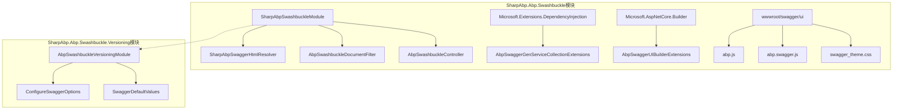
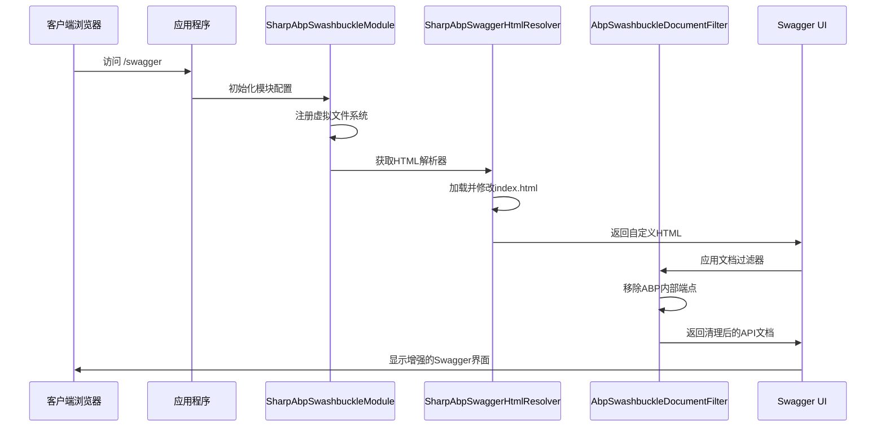
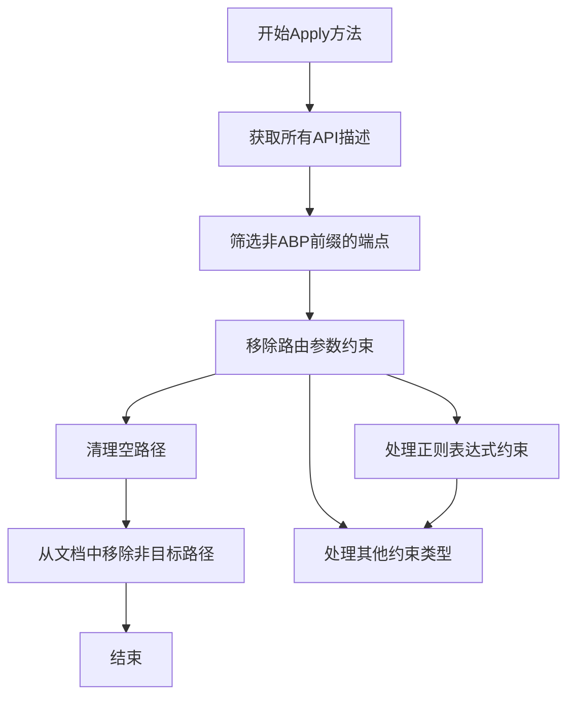
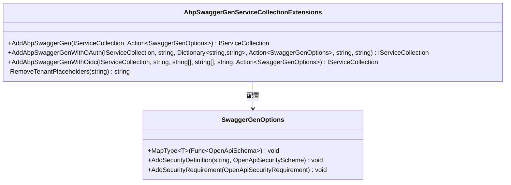
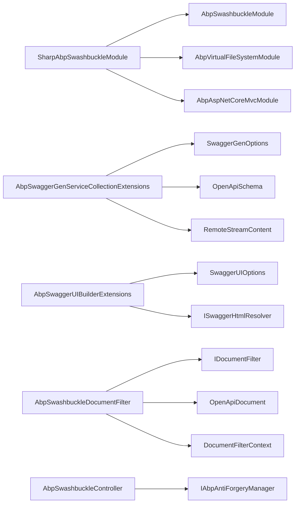

# Swagger集成

<cite>
**本文档引用的文件**
- [SharpAbpSwashbuckleModule.cs](file://framework/src/SharpAbp.Abp.Swashbuckle/SharpAbp/Abp/Swashbuckle/SharpAbpSwashbuckleModule.cs)
- [SharpAbpSwaggerHtmlResolver.cs](file://framework/src/SharpAbp.Abp.Swashbuckle/SharpAbp/Abp/Swashbuckle/SharpAbpSwaggerHtmlResolver.cs)
- [AbpSwashbuckleDocumentFilter.cs](file://framework/src/SharpAbp.Abp.Swashbuckle/SharpAbp/Abp/Swashbuckle/AbpSwashbuckleDocumentFilter.cs)
- [AbpSwaggerGenServiceCollectionExtensions.cs](file://framework/src/SharpAbp.Abp.Swashbuckle/Microsoft/AspNetCore/Extensions/DependencyInjection/AbpSwaggerGenServiceCollectionExtensions.cs)
- [AbpSwaggerUIBuilderExtensions.cs](file://framework/src/SharpAbp.Abp.Swashbuckle/Microsoft/AspNetCore/Builder/AbpSwaggerUIBuilderExtensions.cs)
- [AbpSwashbuckleController.cs](file://framework/src/SharpAbp.Abp.Swashbuckle/SharpAbp/Abp/Swashbuckle/AbpSwashbuckleController.cs)
- [AbpSwashbuckleVersioningModule.cs](file://framework/src/SharpAbp.Abp.Swashbuckle.Versioning/SharpAbp/Abp/Swashbuckle/Versioning/AbpSwashbuckleVersioningModule.cs)
- [abp.js](file://framework/src/SharpAbp.Abp.Swashbuckle/wwwroot/swagger/ui/abp.js)
- [abp.swagger.js](file://framework/src/SharpAbp.Abp.Swashbuckle/wwwroot/swagger/ui/abp.swagger.js)
- [swagger_theme.css](file://framework/src/SharpAbp.Abp.Swashbuckle/wwwroot/swagger/ui/swagger_theme.css)
</cite>

## 目录
1. [简介](#简介)
2. [项目结构](#项目结构)
3. [核心组件](#核心组件)
4. [架构概览](#架构概览)
5. [详细组件分析](#详细组件分析)
6. [依赖关系分析](#依赖关系分析)
7. [性能考虑](#性能考虑)
8. [故障排除指南](#故障排除指南)
9. [结论](#结论)

## 简介

`SharpAbp.Abp.Swashbuckle`模块是一个专门为ABP框架设计的Swagger集成解决方案，它深度集成了Swagger UI，提供了增强的功能和ABP框架特性的支持。该模块通过自定义的文档过滤器、HTML解析器和扩展方法，为开发者提供了更加友好和功能丰富的API文档体验。

主要特性包括：
- 动态修改Swagger文档以支持ABP框架特性
- 自定义Swagger UI HTML输出
- 多租户支持
- OAuth/OIDC认证支持
- 版本化API支持
- 主题定制和样式支持

## 项目结构



**图表来源**
- [SharpAbpSwashbuckleModule.cs](file://framework/src/SharpAbp.Abp.Swashbuckle/SharpAbp/Abp/Swashbuckle/SharpAbpSwashbuckleModule.cs#L1-L28)
- [AbpSwashbuckleVersioningModule.cs](file://framework/src/SharpAbp.Abp.Swashbuckle.Versioning/SharpAbp/Abp/Swashbuckle/Versioning/AbpSwashbuckleVersioningModule.cs#L1-L94)

**章节来源**
- [SharpAbpSwashbuckleModule.cs](file://framework/src/SharpAbp.Abp.Swashbuckle/SharpAbp/Abp/Swashbuckle/SharpAbpSwashbuckleModule.cs#L1-L28)
- [AbpSwashbuckleVersioningModule.cs](file://framework/src/SharpAbp.Abp.Swashbuckle.Versioning/SharpAbp/Abp/Swashbuckle/Versioning/AbpSwashbuckleVersioningModule.cs#L1-L94)

## 核心组件

### SharpAbpSwashbuckleModule

这是模块的核心入口点，继承自`AbpModule`，负责配置服务和虚拟文件系统。

```csharp
[DependsOn(typeof(AbpSwashbuckleModule))]
public class SharpAbpSwashbuckleModule : AbpModule
{
    public override void ConfigureServices(ServiceConfigurationContext context)
    {
        AsyncHelper.RunSync(() => ConfigureServicesAsync(context));
    }

    public override Task ConfigureServicesAsync(ServiceConfigurationContext context)
    {
        Configure<AbpVirtualFileSystemOptions>(options =>
        {
            options.FileSets.AddEmbedded<SharpAbpSwashbuckleModule>();
        });
        return Task.CompletedTask;
    }
}
```

### SharpAbpSwaggerHtmlResolver

实现了`ISwaggerHtmlResolver`接口，用于自定义Swagger UI的HTML输出，注入ABP特定的JavaScript和CSS文件。

```csharp
[Dependency(ReplaceServices = true)]
[ExposeServices(typeof(ISwaggerHtmlResolver))]
public class SharpAbpSwaggerHtmlResolver : ISwaggerHtmlResolver, ITransientDependency
{
    public virtual Stream Resolver()
    {
        var stream = typeof(SwaggerUIOptions).GetTypeInfo().Assembly
            .GetManifestResourceStream("Swashbuckle.AspNetCore.SwaggerUI.index.html");

        var html = new StreamReader(stream!)
            .ReadToEnd()
            .Replace("SwaggerUIBundle(configObject)", "abp.SwaggerUIBundle(configObject)");

        return new MemoryStream(Encoding.UTF8.GetBytes(html));
    }
}
```

**章节来源**
- [SharpAbpSwashbuckleModule.cs](file://framework/src/SharpAbp.Abp.Swashbuckle/SharpAbp/Abp/Swashbuckle/SharpAbpSwashbuckleModule.cs#L1-L28)
- [SharpAbpSwaggerHtmlResolver.cs](file://framework/src/SharpAbp.Abp.Swashbuckle/SharpAbp/Abp/Swashbuckle/SharpAbpSwaggerHtmlResolver.cs#L1-L25)

## 架构概览



**图表来源**
- [SharpAbpSwashbuckleModule.cs](file://framework/src/SharpAbp.Abp.Swashbuckle/SharpAbp/Abp/Swashbuckle/SharpAbpSwashbuckleModule.cs#L15-L25)
- [SharpAbpSwaggerHtmlResolver.cs](file://framework/src/SharpAbp.Abp.Swashbuckle/SharpAbp/Abp/Swashbuckle/SharpAbpSwaggerHtmlResolver.cs#L12-L25)
- [AbpSwashbuckleDocumentFilter.cs](file://framework/src/SharpAbp.Abp.Swashbuckle/SharpAbp/Abp/Swashbuckle/AbpSwashbuckleDocumentFilter.cs#L17-L32)

## 详细组件分析

### AbpSwashbuckleDocumentFilter

这个文档过滤器负责动态修改Swagger文档，移除ABP框架内部的端点，只保留用户定义的API端点。



**图表来源**
- [AbpSwashbuckleDocumentFilter.cs](file://framework/src/SharpAbp.Abp.Swashbuckle/SharpAbp/Abp/Swashbuckle/AbpSwashbuckleDocumentFilter.cs#L17-L32)

```csharp
public virtual void Apply(OpenApiDocument swaggerDoc, DocumentFilterContext context)
{
    var actionUrls = context.ApiDescriptions
        .Select(apiDescription => apiDescription.ActionDescriptor)
        .Where(actionDescriptor => !string.IsNullOrEmpty(actionDescriptor.DisplayName) &&
                                   ActionUrlPrefixes.Any(actionUrlPrefix => 
                                       !actionDescriptor.DisplayName.Contains(actionUrlPrefix)))
        .DistinctBy(actionDescriptor => actionDescriptor.AttributeRouteInfo?.Template)
        .Select(RemoveRouteParameterConstraints)
        .Where(actionUrl => !string.IsNullOrEmpty(actionUrl))
        .ToList();

    swaggerDoc
        .Paths
        .RemoveAll(path => !actionUrls.Contains(path.Key));
}
```

### AbpSwaggerGenServiceCollectionExtensions

提供了一系列扩展方法来简化Swagger生成器的配置，特别是针对OAuth/OIDC认证的支持。



**图表来源**
- [AbpSwaggerGenServiceCollectionExtensions.cs](file://framework/src/SharpAbp.Abp.Swashbuckle/Microsoft/AspNetCore/Extensions/DependencyInjection/AbpSwaggerGenServiceCollectionExtensions.cs#L13-L143)

### AbpSwaggerUIBuilderExtensions

扩展了`IApplicationBuilder`接口，提供了`UseSharpAbpSwaggerUI`方法来配置Swagger UI。

```csharp
public static IApplicationBuilder UseSharpAbpSwaggerUI(
    this IApplicationBuilder app,
    Action<SwaggerUIOptions>? setupAction = null)
{
    var resolver = app.ApplicationServices.GetService<ISwaggerHtmlResolver>();

    return app.UseSwaggerUI(options =>
    {
        options.InjectJavascript("ui/abp.js");
        options.InjectJavascript("ui/abp.swagger.js");
        options.InjectStylesheet("ui/swagger_theme.css");
        options.IndexStream = () => resolver?.Resolver();

        setupAction?.Invoke(options);
    });
}
```

**章节来源**
- [AbpSwashbuckleDocumentFilter.cs](file://framework/src/SharpAbp.Abp.Swashbuckle/SharpAbp/Abp/Swashbuckle/AbpSwashbuckleDocumentFilter.cs#L1-L61)
- [AbpSwaggerGenServiceCollectionExtensions.cs](file://framework/src/SharpAbp.Abp.Swashbuckle/Microsoft/AspNetCore/Extensions/DependencyInjection/AbpSwaggerGenServiceCollectionExtensions.cs#L1-L143)
- [AbpSwaggerUIBuilderExtensions.cs](file://framework/src/SharpAbp.Abp.Swashbuckle/Microsoft/AspNetCore/Builder/AbpSwaggerUIBuilderExtensions.cs#L1-L26)

### JavaScript集成

#### abp.js

提供了ABP框架的基础功能，包括安全令牌管理和Cookie操作：

```javascript
// 设置CSRF令牌
abp.security.antiForgery.tokenCookieName = 'XSRF-TOKEN';
abp.security.antiForgery.tokenHeaderName = 'RequestVerificationToken';

abp.security.antiForgery.getToken = function () {
    return abp.utils.getCookieValue(abp.security.antiForgery.tokenCookieName);
};
```

#### abp.swagger.js

增强了Swagger UI的功能，支持OIDC认证和多租户：

```javascript
abp.SwaggerUIBundle = function (configObject) {
    var requestInterceptor = configObject.requestInterceptor;
    var responseInterceptor = configObject.responseInterceptor;

    configObject.requestInterceptor = async function (request) {
        // 自动设置CSRF令牌
        var antiForgeryToken = abp.security.antiForgery.getToken();
        if (antiForgeryToken) {
            request.headers[abp.security.antiForgery.tokenHeaderName] = antiForgeryToken;
        }
        
        // 处理多租户占位符
        if (abp.currentTenant) {
            request.url = request.url
                .replace('{{tenantId}}', abp.currentTenant.id)
                .replace('{{tenantName}}', abp.currentTenant.name);
        }
        
        return request;
    };
    
    return SwaggerUIBundle(configObject);
};
```

**章节来源**
- [abp.js](file://framework/src/SharpAbp.Abp.Swashbuckle/wwwroot/swagger/ui/abp.js#L1-L97)
- [abp.swagger.js](file://framework/src/SharpAbp.Abp.Swashbuckle/wwwroot/swagger/ui/abp.swagger.js#L1-L114)

## 依赖关系分析



**图表来源**
- [SharpAbpSwashbuckleModule.cs](file://framework/src/SharpAbp.Abp.Swashbuckle/SharpAbp/Abp/Swashbuckle/SharpAbpSwashbuckleModule.cs#L8-L11)
- [AbpSwashbuckleVersioningModule.cs](file://framework/src/SharpAbp.Abp.Swashbuckle.Versioning/SharpAbp/Abp/Swashbuckle/Versioning/AbpSwashbuckleVersioningModule.cs#L8-L15)

**章节来源**
- [SharpAbpSwashbuckleModule.cs](file://framework/src/SharpAbp.Abp.Swashbuckle/SharpAbp/Abp/Swashbuckle/SharpAbpSwashbuckleModule.cs#L1-L28)
- [AbpSwashbuckleVersioningModule.cs](file://framework/src/SharpAbp.Abp.Swashbuckle.Versioning/SharpAbp/Abp/Swashbuckle/Versioning/AbpSwashbuckleVersioningModule.cs#L1-L94)

## 性能考虑

1. **延迟加载**: 使用`ITransientDependency`标记的组件确保按需创建
2. **缓存策略**: HTML解析器使用内存流避免重复读取文件
3. **异步配置**: 所有配置都采用异步方式，避免阻塞主线程
4. **资源优化**: 只包含必要的JavaScript和CSS文件

## 故障排除指南

### 常见问题

1. **文档过滤不生效**
   - 检查`ActionUrlPrefixes`配置是否正确
   - 确认API描述符的显示名称格式

2. **OIDC认证失败**
   - 验证发现端点URL是否正确
   - 检查租户占位符替换逻辑

3. **样式加载问题**
   - 确认虚拟文件系统配置正确
   - 检查静态文件中间件配置

**章节来源**
- [AbpSwashbuckleDocumentFilter.cs](file://framework/src/SharpAbp.Abp.Swashbuckle/SharpAbp/Abp/Swashbuckle/AbpSwashbuckleDocumentFilter.cs#L13-L15)
- [abp.swagger.js](file://framework/src/SharpAbp.Abp.Swashbuckle/wwwroot/swagger/ui/abp.swagger.js#L70-L95)

## 结论

`SharpAbp.Abp.Swashbuckle`模块为ABP框架提供了强大而灵活的Swagger集成解决方案。通过深度定制的文档过滤器、HTML解析器和扩展方法，它不仅保持了Swagger的原有功能，还添加了对ABP框架特性的全面支持，包括多租户、安全认证和版本控制等功能。

该模块的设计遵循了ABP框架的最佳实践，提供了良好的可扩展性和可维护性，是构建现代化API文档的理想选择。