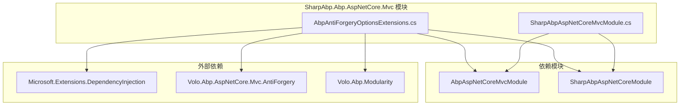
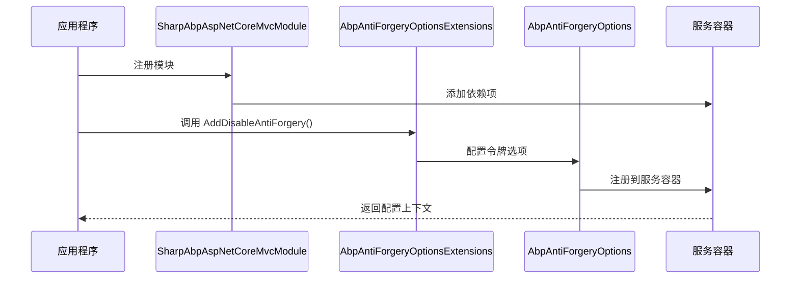
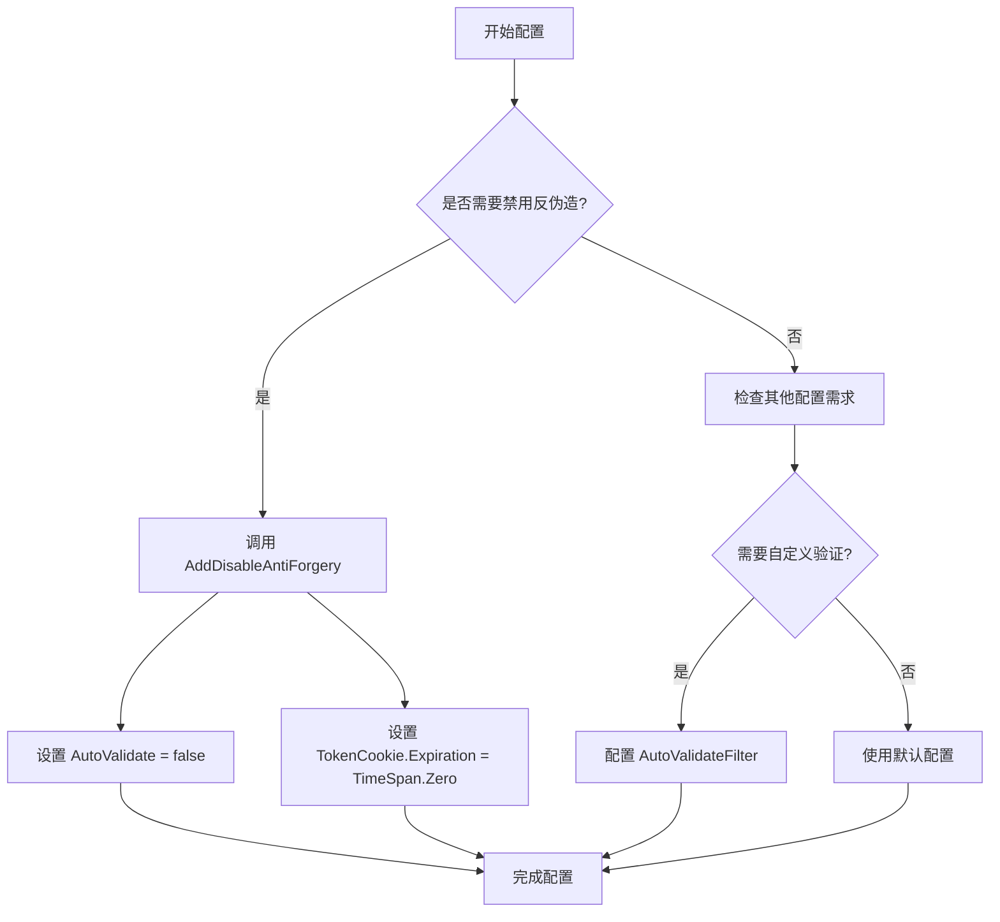
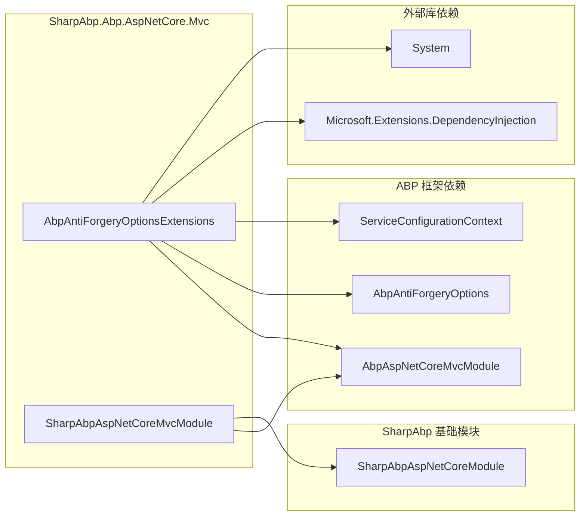

# 反伪造保护

<cite>
**本文档引用的文件**
- [AbpAntiForgeryOptionsExtensions.cs](file://framework/src/SharpAbp.Abp.AspNetCore.Mvc/SharpAbp/Abp/AspNetCore/Mvc/AbpAntiForgeryOptionsExtensions.cs)
- [SharpAbpAspNetCoreMvcModule.cs](file://framework/src/SharpAbp.Abp.AspNetCore.Mvc/SharpAbp/Abp/AspNetCore/Mvc/SharpAbpAspNetCoreMvcModule.cs)
- [abp.swagger.js](file://framework/src/SharpAbp.Abp.Swashbuckle/wwwroot/swagger/ui/abp.swagger.js)
</cite>

## 目录
1. [简介](#简介)
2. [项目结构](#项目结构)
3. [核心组件](#核心组件)
4. [架构概览](#架构概览)
5. [详细组件分析](#详细组件分析)
6. [依赖关系分析](#依赖关系分析)
7. [性能考虑](#性能考虑)
8. [故障排除指南](#故障排除指南)
9. [结论](#结论)

## 简介

SharpAbp.Abp.AspNetCore.Mvc 模块提供了强大的反伪造（Anti-Forgery）功能，专门用于保护 ASP.NET Core MVC 应用程序免受跨站请求伪造（CSRF）攻击。该模块通过 `AbpAntiForgeryOptionsExtensions` 类提供了一系列扩展方法，允许开发者灵活配置反伪造令牌的选项，包括 Cookie 名称、有效期、自动验证等安全属性。

反伪造保护是现代 Web 应用程序安全的重要组成部分，它通过验证请求来源的有效性来防止恶意网站伪造用户身份进行未经授权的操作。SharpAbp 提供的解决方案不仅简化了配置过程，还提供了与前端框架（如 Angular 和 React）的无缝集成支持。

## 项目结构

SharpAbp.Abp.AspNetCore.Mvc 模块采用清晰的分层架构设计，专注于为 ASP.NET Core MVC 应用程序提供反伪造保护功能。



**图表来源**
- [AbpAntiForgeryOptionsExtensions.cs](file://framework/src/SharpAbp.Abp.AspNetCore.Mvc/SharpAbp/Abp/AspNetCore/Mvc/AbpAntiForgeryOptionsExtensions.cs#L1-L35)
- [SharpAbpAspNetCoreMvcModule.cs](file://framework/src/SharpAbp.Abp.AspNetCore.Mvc/SharpAbp/Abp/AspNetCore/Mvc/SharpAbpAspNetCoreMvcModule.cs#L1-L15)

**章节来源**
- [AbpAntiForgeryOptionsExtensions.cs](file://framework/src/SharpAbp.Abp.AspNetCore.Mvc/SharpAbp/Abp/AspNetCore/Mvc/AbpAntiForgeryOptionsExtensions.cs#L1-L35)
- [SharpAbpAspNetCoreMvcModule.cs](file://framework/src/SharpAbp.Abp.AspNetCore.Mvc/SharpAbp/Abp/AspNetCore/Mvc/SharpAbpAspNetCoreMvcModule.cs#L1-L15)

## 核心组件

### AbpAntiForgeryOptionsExtensions 类

`AbpAntiForgeryOptionsExtensions` 是 SharpAbp.Abp.AspNetCore.Mvc 模块的核心组件，它提供了一个静态扩展方法来配置 ASP.NET Core 的反伪造选项。该类的设计遵循了扩展方法模式，使得配置过程更加简洁和直观。

主要功能包括：
- 禁用反伪造令牌验证
- 配置令牌 Cookie 的过期时间
- 自动验证忽略的 HTTP 方法
- 自定义验证过滤器

**章节来源**
- [AbpAntiForgeryOptionsExtensions.cs](file://framework/src/SharpAbp.Abp.AspNetCore.Mvc/SharpAbp/Abp/AspNetCore/Mvc/AbpAntiForgeryOptionsExtensions.cs#L1-L35)

## 架构概览

SharpAbp.Abp.AspNetCore.Mvc 模块的架构设计体现了关注点分离和模块化的原则。整个系统围绕反伪造保护这一核心功能构建，同时保持与其他 SharpAbp 模块的良好集成。



**图表来源**
- [AbpAntiForgeryOptionsExtensions.cs](file://framework/src/SharpAbp.Abp.AspNetCore.Mvc/SharpAbp/Abp/AspNetCore/Mvc/AbpAntiForgeryOptionsExtensions.cs#L21-L33)
- [SharpAbpAspNetCoreMvcModule.cs](file://framework/src\SharpAbp.Abp.AspNetCore.Mvc\SharpAbp\Abp\AspNetCore\Mvc\SharpAbpAspNetCoreMvcModule.cs#L6-L12)

## 详细组件分析

### AbpAntiForgeryOptionsExtensions 扩展方法

#### AddDisableAntiForgery 方法

这是 `AbpAntiForgeryOptionsExtensions` 类中最重要的方法，它提供了一种简单的方式来禁用 ASP.NET Core 的反伪造令牌验证功能。

```csharp
public static ServiceConfigurationContext AddDisableAntiForgery(this ServiceConfigurationContext context)
{
    context.Services.Configure<AbpAntiForgeryOptions>(options =>
    {
        options.TokenCookie.Expiration = TimeSpan.Zero;
        //Disable antiforgery token validation
        options.AutoValidate = false;
    });

    return context;
}
```

**方法特性：**
- **禁用令牌验证**：通过设置 `AutoValidate = false` 完全关闭反伪造令牌的自动验证
- **清除令牌 Cookie**：将 `TokenCookie.Expiration` 设置为零，确保不会生成有效的令牌 Cookie
- **链式调用**：返回 `ServiceConfigurationContext` 支持方法链式调用

#### 配置选项详解

根据代码注释，`AbpAntiForgeryOptionsExtensions` 还支持以下配置选项：

```csharp
/// 其他反伪造选项
/// options.TokenCookie.Expiration = TimeSpan.FromDays(365);
/// options.AutoValidateIgnoredHttpMethods.Add("POST");
/// options.TokenCookie.Expiration = TimeSpan.Zero;
/// options.AutoValidate = false; // 不验证反伪造令牌
/// options.AutoValidateIgnoredHttpMethods.Remove("GET");
/// options.AutoValidateFilter = type => !type.Namespace.StartsWith("MyProject.MyIgnoredNamespace");
```

**配置选项说明：**
- **TokenCookie.Expiration**：设置令牌 Cookie 的过期时间，默认值为 365 天
- **AutoValidateIgnoredHttpMethods**：指定哪些 HTTP 方法可以忽略反伪造验证
- **AutoValidateFilter**：自定义验证过滤器，允许基于类型命名空间进行条件验证

#### 使用场景分析



**图表来源**
- [AbpAntiForgeryOptionsExtensions.cs](file://framework/src\SharpAbp.Abp.AspNetCore.Mvc\SharpAbp\Abp\AspNetCore\Mvc\AbpAntiForgeryOptionsExtensions.cs#L10-L20)

**章节来源**
- [AbpAntiForgeryOptionsExtensions.cs](file://framework/src\SharpAbp.Abp.AspNetCore.Mvc\SharpAbp\Abp\AspNetCore\Mvc\AbpAntiForgeryOptionsExtensions.cs#L1-L35)

### SharpAbpAspNetCoreMvcModule 模块

`SharpAbpAspNetCoreMvcModule` 是 SharpAbp.Abp.AspNetCore.Mvc 模块的主要入口点，它继承自 ABP 框架的 `AbpModule` 基类，并声明了对其他关键模块的依赖。

```csharp
[DependsOn(
    typeof(AbpAspNetCoreMvcModule),
    typeof(SharpAbpAspNetCoreModule)
    )]
public class SharpAbpAspNetCoreMvcModule : AbpModule
{
}
```

**模块依赖关系：**
- **AbpAspNetCoreMvcModule**：提供 ASP.NET Core MVC 的基础功能
- **SharpAbpAspNetCoreModule**：提供 SharpAbp 特定的 ASP.NET Core 功能

这种设计确保了模块之间的松耦合，同时保持了功能的完整性。

**章节来源**
- [SharpAbpAspNetCoreMvcModule.cs](file://framework/src\SharpAbp.Abp.AspNetCore.Mvc\SharpAbp\Abp\AspNetCore\Mvc\SharpAbpAspNetCoreMvcModule.cs#L1-L15)

## 依赖关系分析

SharpAbp.Abp.AspNetCore.Mvc 模块的依赖关系体现了模块化设计的优势，通过明确的接口和依赖注入机制实现了高度的可维护性和可扩展性。



**图表来源**
- [AbpAntiForgeryOptionsExtensions.cs](file://framework/src\SharpAbp.Abp.AspNetCore.Mvc\SharpAbp\Abp\AspNetCore\Mvc\AbpAntiForgeryOptionsExtensions.cs#L1-L5)
- [SharpAbpAspNetCoreMvcModule.cs](file://framework/src\SharpAbp.Abp.AspNetCore.Mvc\SharpAbp\Abp\AspNetCore\Mvc\SharpAbpAspNetCoreMvcModule.cs#L1-L15)

**章节来源**
- [AbpAntiForgeryOptionsExtensions.cs](file://framework/src\SharpAbp.Abp.AspNetCore.Mvc\SharpAbp\Abp\AspNetCore\Mvc\AbpAntiForgeryOptionsExtensions.cs#L1-L35)
- [SharpAbpAspNetCoreMvcModule.cs](file://framework/src\SharpAbp.Abp.AspNetCore.Mvc\SharpAbp\Abp\AspNetCore\Mvc\SharpAbpAspNetCoreMvcModule.cs#L1-L15)

## 性能考虑

在使用 SharpAbp.Abp.AspNetCore.Mvc 模块的反伪造功能时，需要考虑以下几个性能方面的因素：

### 1. 反伪造验证开销

反伪造验证会增加服务器端的处理负担，特别是在高并发场景下。通过合理配置 `AutoValidateIgnoredHttpMethods` 和 `AutoValidateFilter`，可以减少不必要的验证开销。

### 2. Cookie 大小优化

令牌 Cookie 的大小直接影响网络传输效率。建议：
- 使用紧凑的令牌格式
- 合理设置 Cookie 过期时间
- 在不需要时禁用令牌验证

### 3. 缓存策略

对于频繁访问但不需要反伪造保护的资源，可以考虑：
- 使用缓存机制
- 实施适当的缓存策略
- 减少重复的验证操作

## 故障排除指南

### 常见问题及解决方案

#### 1. 反伪造令牌验证失败

**症状**：客户端收到 400 Bad Request 错误，提示反伪造令牌无效。

**解决方案**：
```csharp
// 检查令牌是否正确传递
// 在控制器中添加日志记录
[HttpPost]
public IActionResult SubmitForm(MyModel model)
{
    // 验证逻辑
    return Ok();
}
```

#### 2. AJAX 请求中令牌丢失

**症状**：AJAX 请求无法通过反伪造验证。

**解决方案**：
```javascript
// 在 AJAX 请求中添加令牌
$.ajax({
    url: '/api/endpoint',
    type: 'POST',
    headers: {
        'RequestVerificationToken': $('input[name="__RequestVerificationToken"]').val()
    },
    data: formData
});
```

#### 3. 跨域请求问题

**症状**：跨域请求无法获取反伪造令牌。

**解决方案**：
```csharp
// 配置 CORS 策略
services.AddCors(options =>
{
    options.AddPolicy("AllowSpecificOrigin",
        builder => builder.AllowAnyHeader()
                         .AllowAnyMethod()
                         .AllowCredentials());
});
```

**章节来源**
- [AbpAntiForgeryOptionsExtensions.cs](file://framework/src\SharpAbp.Abp.AspNetCore.Mvc\SharpAbp\Abp\AspNetCore\Mvc\AbpAntiForgeryOptionsExtensions.cs#L10-L20)

## 结论

SharpAbp.Abp.AspNetCore.Mvc 模块通过 `AbpAntiForgeryOptionsExtensions` 类提供了一个简洁而强大的反伪造保护解决方案。该模块不仅简化了 ASP.NET Core MVC 应用程序的反伪造配置，还提供了与前端框架的无缝集成支持。

### 主要优势

1. **简单易用**：通过扩展方法提供直观的配置接口
2. **灵活配置**：支持多种配置选项以满足不同场景需求
3. **模块化设计**：良好的模块依赖关系便于维护和扩展
4. **性能优化**：合理的配置选项帮助优化应用程序性能

### 最佳实践建议

1. **生产环境配置**：始终启用反伪造保护，除非有特殊需求
2. **前端集成**：确保前端框架正确处理反伪造令牌
3. **安全审计**：定期审查反伪造配置以确保安全性
4. **监控告警**：实施监控以检测潜在的安全威胁

通过合理使用 SharpAbp.Abp.AspNetCore.Mvc 模块的反伪造功能，开发者可以显著提升 Web 应用程序的安全性，有效防范跨站请求伪造攻击。