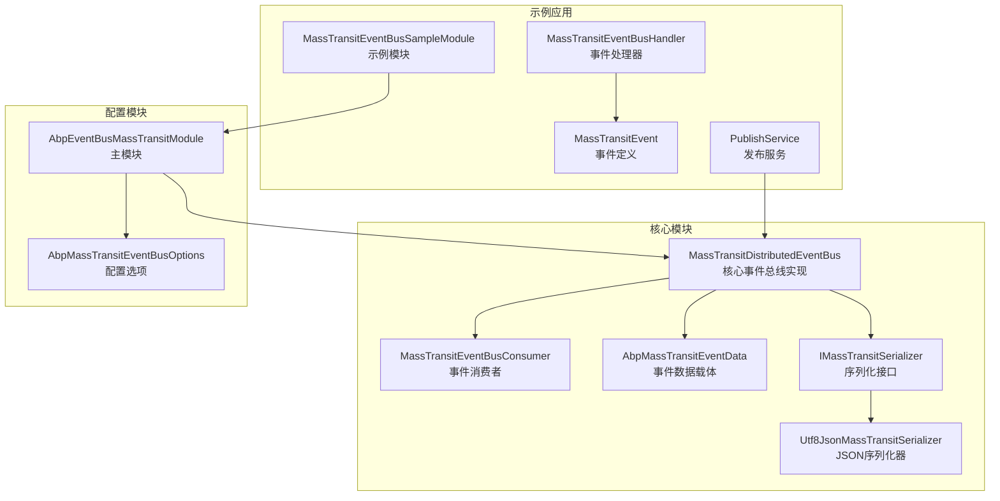
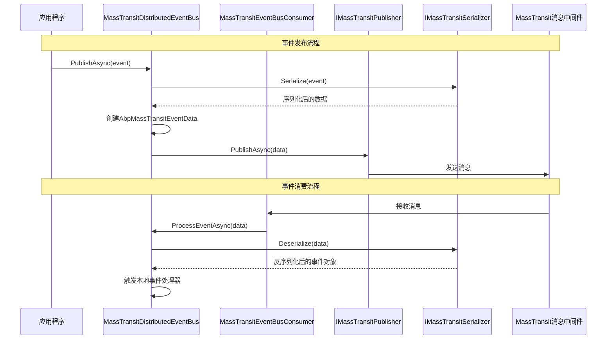
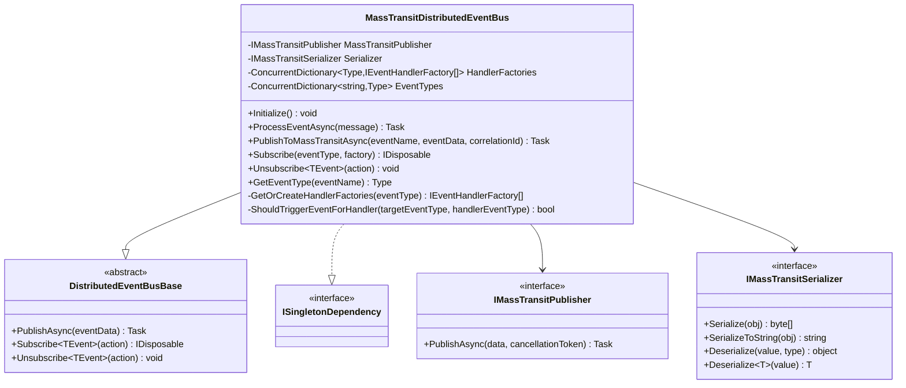
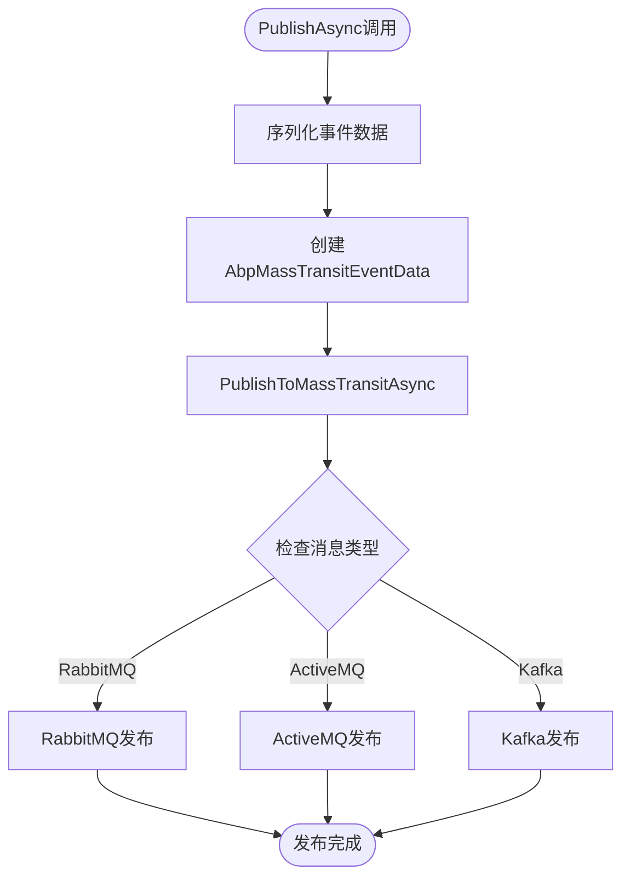
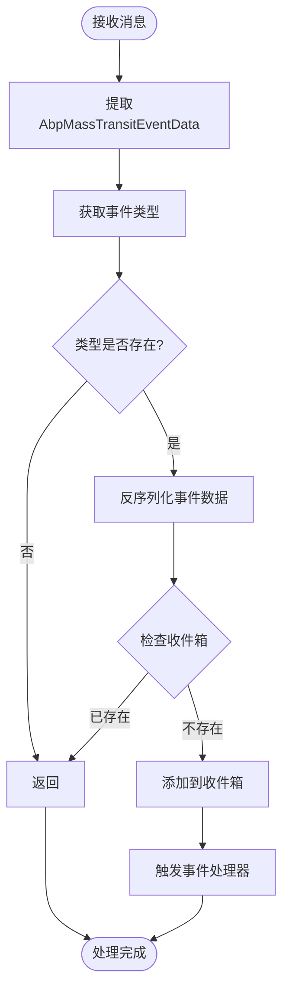
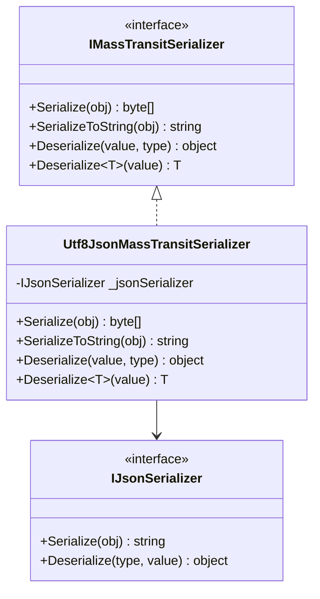
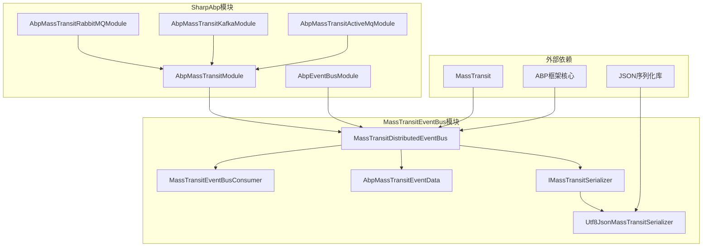

# 事件总线 (MassTransit)

<cite>
**本文档中引用的文件**
- [MassTransitDistributedEventBus.cs](file://framework/src/SharpAbp.Abp.EventBus.MassTransit/SharpAbp/Abp/EventBus/MassTransit/MassTransitDistributedEventBus.cs)
- [MassTransitEventBusConsumer.cs](file://framework/src\SharpAbp.Abp.EventBus.MassTransit\SharpAbp\Abp\EventBus\MassTransit\MassTransitEventBusConsumer.cs)
- [AbpMassTransitEventData.cs](file://framework/src\SharpAbp.Abp.EventBus.MassTransit\SharpAbp\Abp\EventBus\MassTransit\AbpMassTransitEventData.cs)
- [IMassTransitSerializer.cs](file://framework/src\SharpAbp.Abp.EventBus.MassTransit\SharpAbp\Abp\EventBus\MassTransit\IMassTransitSerializer.cs)
- [Utf8JsonMassTransitSerializer.cs](file://framework/src\SharpAbp.Abp.EventBus.MassTransit\SharpAbp\Abp\EventBus\MassTransit\Utf8JsonMassTransitSerializer.cs)
- [AbpEventBusMassTransitModule.cs](file://framework/src\SharpAbp.Abp.EventBus.MassTransit\SharpAbp\Abp\EventBus\MassTransit\AbpEventBusMassTransitModule.cs)
- [AbpMassTransitEventBusOptions.cs](file://framework/src\SharpAbp.Abp.EventBus.MassTransit\SharpAbp\Abp\EventBus\MassTransit\AbpMassTransitEventBusOptions.cs)
- [MassTransitEvent.cs](file://samples\eventbus-sample\src\MassTransitEventBusSample\MassTransitEvent.cs)
- [MassTransitEventBusHandler.cs](file://samples\eventbus-sample\src\MassTransitEventBusSample\MassTransitEventBusHandler.cs)
- [PublishService.cs](file://samples\eventbus-sample\src\MassTransitEventBusSample\PublishService.cs)
- [MassTransitEventBusSampleModule.cs](file://samples\eventbus-sample\src\MassTransitEventBusSample\MassTransitEventBusSampleModule.cs)
</cite>

## 目录
1. [简介](#简介)
2. [项目结构](#项目结构)
3. [核心组件](#核心组件)
4. [架构概览](#架构概览)
5. [详细组件分析](#详细组件分析)
6. [依赖关系分析](#依赖关系分析)
7. [性能考虑](#性能考虑)
8. [故障排除指南](#故障排除指南)
9. [结论](#结论)

## 简介

`SharpAbp.Abp.EventBus.MassTransit` 是一个基于 MassTransit 库构建的分布式事件总线模块。它提供了强大的事件发布和订阅功能，支持跨微服务的事件通信。该模块通过封装 MassTransit 的消息传递能力，为 ABP 框架提供了统一的分布式事件处理接口。

该模块的核心设计理念是：
- 基于 MassTransit 的可靠消息传递
- 支持多种消息中间件（RabbitMQ、ActiveMQ、Kafka）
- 提供事件的序列化和反序列化机制
- 实现事件的可靠传递和处理
- 支持事件的订阅和发布模式

## 项目结构

`SharpAbp.Abp.EventBus.MassTransit` 模块的文件组织结构如下：



**图表来源**
- [MassTransitDistributedEventBus.cs](file://framework/src/SharpAbp.Abp.EventBus.MassTransit/SharpAbp/Abp/EventBus/MassTransit/MassTransitDistributedEventBus.cs#L1-L431)
- [MassTransitEventBusConsumer.cs](file://framework/src/SharpAbp.Abp.EventBus.MassTransit/SharpAbp/Abp/EventBus/MassTransit/MassTransitEventBusConsumer.cs#L1-L20)
- [AbpEventBusMassTransitModule.cs](file://framework/src/SharpAbp.Abp.EventBus.MassTransit/SharpAbp/Abp/EventBus/MassTransit/AbpEventBusMassTransitModule.cs#L1-L73)

**章节来源**
- [MassTransitDistributedEventBus.cs](file://framework/src/SharpAbp.Abp.EventBus.MassTransit/SharpAbp/Abp/EventBus/MassTransit/MassTransitDistributedEventBus.cs#L1-L431)
- [AbpEventBusMassTransitModule.cs](file://framework/src/SharpAbp.Abp.EventBus.MassTransit/SharpAbp/Abp/EventBus/MassTransit/AbpEventBusMassTransitModule.cs#L1-L73)

## 核心组件

### MassTransitDistributedEventBus 类

`MassTransitDistributedEventBus` 是整个模块的核心实现类，继承自 `DistributedEventBusBase`，并实现了分布式事件总线的所有功能。

主要特性：
- **事件发布**：通过 MassTransit 发布事件到消息中间件
- **事件订阅**：自动订阅配置的事件处理器
- **事件处理**：处理来自消息中间件的事件并触发本地处理器
- **序列化支持**：使用可配置的序列化器处理事件数据
- **并发安全**：使用线程安全的数据结构管理事件处理器

### MassTransitEventBusConsumer 类

`MassTransitEventBusConsumer` 是 MassTransit 的消费者实现，负责从消息队列中接收事件并将其转发给事件总线进行处理。

特点：
- 实现了 MassTransit 的 `IConsumer<AbpMassTransitEventData>` 接口
- 通过依赖注入获取 `MassTransitDistributedEventBus` 实例
- 将接收到的消息直接委托给事件总线处理

### AbpMassTransitEventData 数据结构

`AbpMassTransitEventData` 是事件数据的载体，包含事件的基本信息和序列化的事件数据。

属性说明：
- `EventName`：事件名称，用于标识事件类型
- `MessageId`：消息唯一标识符
- `JsonData`：序列化的事件数据
- `CorrelationId`：关联 ID，用于跟踪请求链路

**章节来源**
- [MassTransitDistributedEventBus.cs](file://framework/src/SharpAbp.Abp.EventBus.MassTransit/SharpAbp/Abp/EventBus/MassTransit/MassTransitDistributedEventBus.cs#L25-L102)
- [MassTransitEventBusConsumer.cs](file://framework/src/SharpAbp.Abp.EventBus.MassTransit/SharpAbp/Abp/EventBus/MassTransit/MassTransitEventBusConsumer.cs#L1-L20)
- [AbpMassTransitEventData.cs](file://framework/src/SharpAbp.Abp.EventBus.MassTransit/SharpAbp/Abp/EventBus/MassTransit/AbpMassTransitEventData.cs#L1-L23)

## 架构概览



**图表来源**
- [MassTransitDistributedEventBus.cs](file://framework/src/SharpAbp.Abp.EventBus.MassTransit/SharpAbp/Abp/EventBus/MassTransit/MassTransitDistributedEventBus.cs#L85-L102)
- [MassTransitEventBusConsumer.cs](file://framework/src/SharpAbp.Abp.EventBus.MassTransit/SharpAbp/Abp/EventBus/MassTransit/MassTransitEventBusConsumer.cs#L13-L18)

## 详细组件分析

### MassTransitDistributedEventBus 实现分析



**图表来源**
- [MassTransitDistributedEventBus.cs](file://framework/src/SharpAbp.Abp.EventBus.MassTransit/SharpAbp/Abp/EventBus/MassTransit/MassTransitDistributedEventBus.cs#L25-L102)

#### 事件发布流程



**图表来源**
- [MassTransitDistributedEventBus.cs](file://framework/src/SharpAbp.Abp.EventBus.MassTransit/SharpAbp/Abp/EventBus/MassTransit/MassTransitDistributedEventBus.cs#L380-L431)

#### 事件处理流程



**图表来源**
- [MassTransitDistributedEventBus.cs](file://framework/src/SharpAbp.Abp.EventBus.MassTransit/SharpAbp/Abp/EventBus/MassTransit/MassTransitDistributedEventBus.cs#L85-L102)

### 序列化机制分析



**图表来源**
- [IMassTransitSerializer.cs](file://framework/src/SharpAbp.Abp.EventBus.MassTransit/SharpAbp/Abp/EventBus/MassTransit/IMassTransitSerializer.cs#L1-L14)
- [Utf8JsonMassTransitSerializer.cs](file://framework/src/SharpAbp.Abp.EventBus.MassTransit/SharpAbp/Abp/EventBus/MassTransit/Utf8JsonMassTransitSerializer.cs#L1-L45)

**章节来源**
- [MassTransitDistributedEventBus.cs](file://framework/src/SharpAbp.Abp.EventBus.MassTransit/SharpAbp/Abp/EventBus/MassTransit/MassTransitDistributedEventBus.cs#L25-L431)
- [IMassTransitSerializer.cs](file://framework/src/SharpAbp.Abp.EventBus.MassTransit/SharpAbp/Abp/EventBus/MassTransit/IMassTransitSerializer.cs#L1-L14)
- [Utf8JsonMassTransitSerializer.cs](file://framework/src/SharpAbp.Abp.EventBus.MassTransit/SharpAbp/Abp/EventBus/MassTransit/Utf8JsonMassTransitSerializer.cs#L1-L45)

## 示例代码分析

### 定义事件 DTO

```csharp
// 定义事件类并指定事件名称
[EventName("Event1")]
public class MassTransitEvent1
{
    public int Sequence { get; set; }
    public string? MessageId { get; set; }
    public DateTime? PublishTime { get; set; }
}

// 定义另一个事件类
public class MassTransitEvent2
{
    public int Sequence { get; set; }
    public string? MessageId { get; set; }
    public DateTime? PublishTime { get; set; }
}
```

### 创建事件处理器

```csharp
// 实现事件处理器接口
public class MassTransitEventBusHandler : 
    IDistributedEventHandler<MassTransitEvent1>,
    IDistributedEventHandler<MassTransitEvent2>,
    ITransientDependency
{
    private readonly ILogger _logger;
    
    public MassTransitEventBusHandler(ILogger<MassTransitEventBusHandler> logger)
    {
        _logger = logger;
    }

    // 处理Event1事件
    public Task HandleEventAsync(MassTransitEvent1 eventData)
    {
        _logger.LogInformation("Handle Event1 {Sequence}, Time: {PublishTime}", 
            eventData.Sequence, eventData.PublishTime?.ToString("yyyy-MM-dd HH:mm:ss fff"));
        return Task.CompletedTask;
    }

    // 处理Event2事件
    public Task HandleEventAsync(MassTransitEvent2 eventData)
    {
        _logger.LogInformation("Handle Event2 {Sequence}, Time: {PublishTime}", 
            eventData.Sequence, eventData.PublishTime?.ToString("yyyy-MM-dd HH:mm:ss fff"));
        return Task.CompletedTask;
    }
}
```

### 配置模块

```csharp
[DependsOn(
    typeof(AbpThreadingModule),
    typeof(AbpTimingModule),
    typeof(AbpEventBusMassTransitRabbitMQModule),
    typeof(AbpEventBusMassTransitKafkaModule),
    typeof(AbpEventBusMassTransitActiveMqModule),
    typeof(AbpAutofacModule)
)]
public class MassTransitEventBusSampleModule : AbpModule
{
    public override Task PreConfigureServicesAsync(ServiceConfigurationContext context)
    {
        PreConfigure<AbpMassTransitEventBusOptions>(options =>
        {
            options.Topic = "TestEventBus";
        });

        return Task.CompletedTask;
    }
}
```

### 发布事件

```csharp
public class PublishService : ITransientDependency
{
    protected IDistributedEventBus DistributedEventBus { get; }
    protected IClock Clock { get; }
    
    public async Task PublishMessage1()
    {
        var sequence = Interlocked.Increment(ref Event1Sequence);
        await DistributedEventBus.PublishAsync(new MassTransitEvent1()
        {
            Sequence = sequence,
            MessageId = Guid.NewGuid().ToString("D"),
            PublishTime = Clock.Now
        });
    }
}
```

**章节来源**
- [MassTransitEvent.cs](file://samples\eventbus-sample\src\MassTransitEventBusSample\MassTransitEvent.cs#L1-L25)
- [MassTransitEventBusHandler.cs](file://samples\eventbus-sample\src\MassTransitEventBusSample\MassTransitEventBusHandler.cs#L1-L30)
- [MassTransitEventBusSampleModule.cs](file://samples\eventbus-sample\src\MassTransitEventBusSample\MassTransitEventBusSampleModule.cs#L1-L39)
- [PublishService.cs](file://samples\eventbus-sample\src\MassTransitEventBusSample\PublishService.cs#L1-L80)

## 依赖关系分析



**图表来源**
- [AbpEventBusMassTransitModule.cs](file://framework/src\SharpAbp.Abp.EventBus.MassTransit\SharpAbp\Abp\EventBus\MassTransit\AbpEventBusMassTransitModule.cs#L10-L15)
- [MassTransitDistributedEventBus.cs](file://framework/src\SharpAbp.Abp.EventBus.MassTransit\SharpAbp\Abp\EventBus\MassTransit\MassTransitDistributedEventBus.cs#L1-L25)

**章节来源**
- [AbpEventBusMassTransitModule.cs](file://framework/src\SharpAbp.Abp.EventBus.MassTransit\SharpAbp\Abp\EventBus\MassTransit\AbpEventBusMassTransitModule.cs#L10-L15)
- [MassTransitDistributedEventBus.cs](file://framework/src\SharpAbp.Abp.EventBus.MassTransit\SharpAbp\Abp\EventBus\MassTransit\MassTransitDistributedEventBus.cs#L1-L25)

## 性能考虑

### 并发处理优化

1. **线程安全的数据结构**：使用 `ConcurrentDictionary` 存储事件处理器和类型映射
2. **异步操作**：所有事件处理都是异步的，避免阻塞主线程
3. **批量处理**：支持批量发布事件以提高吞吐量

### 内存管理

1. **对象池化**：使用对象池减少 GC 压力
2. **及时释放**：正确实现 `IDisposable` 接口
3. **弱引用**：避免循环引用导致内存泄漏

### 网络优化

1. **连接池**：复用消息中间件连接
2. **压缩传输**：对大数据包进行压缩
3. **心跳检测**：保持连接活跃状态

## 故障排除指南

### 常见问题及解决方案

#### 1. 事件无法发布

**症状**：调用 `PublishAsync` 后没有收到事件

**可能原因**：
- 消息中间件连接失败
- 序列化器配置错误
- 事件名称不匹配

**解决方案**：
```csharp
// 检查消息中间件连接
// 验证序列化器配置
// 确保事件名称正确设置
```

#### 2. 事件处理器未被调用

**症状**：事件成功发布但处理器未执行

**可能原因**：
- 处理器注册失败
- 事件类型不匹配
- 订阅配置错误

**解决方案**：
```csharp
// 检查处理器是否正确注册
// 验证事件类型匹配
// 确认订阅配置
```

#### 3. 性能问题

**症状**：事件处理延迟高或吞吐量低

**可能原因**：
- 网络延迟
- 处理器逻辑复杂
- 连接池配置不当

**解决方案**：
```csharp
// 优化网络配置
// 简化处理器逻辑
// 调整连接池参数
```

**章节来源**
- [MassTransitDistributedEventBus.cs](file://framework/src/SharpAbp.Abp.EventBus.MassTransit/SharpAbp/Abp/EventBus/MassTransit/MassTransitDistributedEventBus.cs#L85-L102)

## 结论

`SharpAbp.Abp.EventBus.MassTransit` 模块是一个功能强大且设计精良的分布式事件总线实现。它成功地将 MassTransit 的消息传递能力与 ABP 框架的事件处理机制相结合，提供了以下优势：

### 主要优势

1. **高度可扩展性**：支持多种消息中间件
2. **强类型安全**：编译时类型检查确保事件处理正确性
3. **高性能**：异步处理和并发优化
4. **易于使用**：简洁的 API 设计
5. **可靠传输**：内置重试和错误处理机制

### 最佳实践建议

1. **合理设计事件模型**：保持事件数据的简洁性和稳定性
2. **选择合适的序列化器**：根据性能需求选择不同的序列化方案
3. **监控和日志记录**：建立完善的监控体系
4. **错误处理策略**：制定合理的错误处理和恢复策略
5. **性能调优**：根据实际负载调整配置参数

该模块为构建大规模分布式系统提供了坚实的基础，是实现微服务间解耦和异步通信的理想选择。