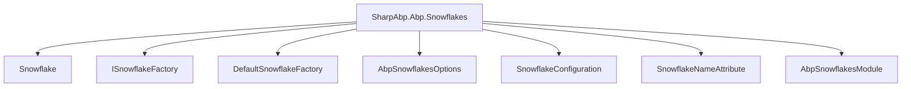
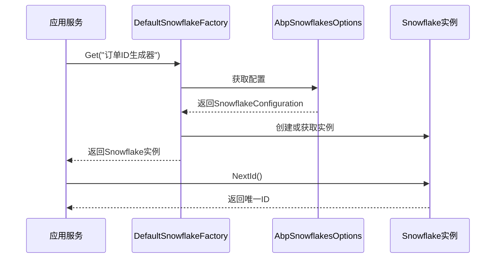
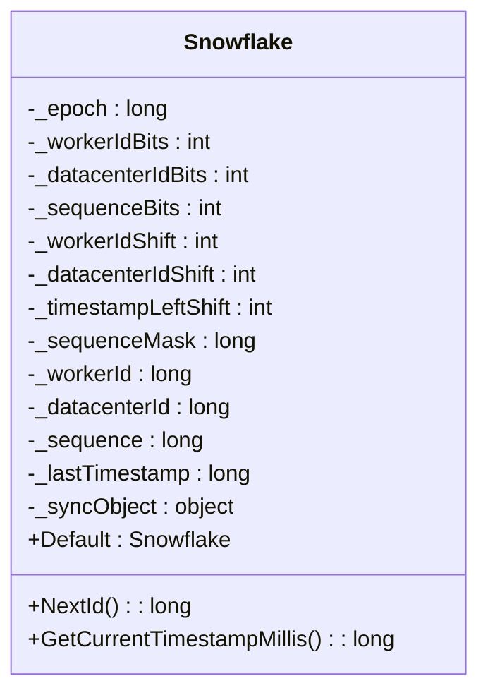

# 分布式ID生成 (Snowflake)

<cite>
**本文档中引用的文件**
- [AbpSnowflakesModule.cs](file://framework/src/SharpAbp.Abp.Snowflakes/SharpAbp/Abp/Snowflakes/AbpSnowflakesModule.cs)
- [AbpSnowflakesOptions.cs](file://framework/src/SharpAbp.Abp.Snowflakes/SharpAbp/Abp/Snowflakes/AbpSnowflakesOptions.cs)
- [SnowflakeConfigurations.cs](file://framework/src/SharpAbp.Abp.Snowflakes/SharpAbp/Abp/Snowflakes/SnowflakeConfigurations.cs)
- [SnowflakeConfiguration.cs](file://framework/src/SharpAbp.Abp.Snowflakes/SharpAbp/Abp/Snowflakes/SnowflakeConfiguration.cs)
- [ISnowflakeFactory.cs](file://framework/src/SharpAbp.Abp.Snowflakes/SharpAbp/Abp/Snowflakes/ISnowflakeFactory.cs)
- [DefaultSnowflakeFactory.cs](file://framework/src/SharpAbp.Abp.Snowflakes/SharpAbp/Abp/Snowflakes/DefaultSnowflakeFactory.cs)
- [SnowflakeNameAttribute.cs](file://framework/src/SharpAbp.Abp.Snowflakes/SharpAbp/Abp/Snowflakes/SnowflakeNameAttribute.cs)
- [Snowflake.cs](file://framework/src/SharpAbp.Abp.Snowflakes/SharpAbp/Abp/Snowflakes/Snowflake.cs)
- [SnowflakeTests.cs](file://framework/test/SharpAbp.Abp.Snowflakes.Tests/SharpAbp/Abp/Snowflakes/SnowflakeTests.cs)
- [SnowflakeFactoryIntegrationTests.cs](file://framework/test/SharpAbp.Abp.Snowflakes.Tests/SharpAbp/Abp/Snowflakes/SnowflakeFactoryIntegrationTests.cs)
</cite>

## 目录
1. [简介](#简介)
2. [项目结构](#项目结构)
3. [核心组件](#核心组件)
4. [架构概述](#架构概述)
5. [详细组件分析](#详细组件分析)
6. [依赖分析](#依赖分析)
7. [性能考虑](#性能考虑)
8. [故障排除指南](#故障排除指南)
9. [结论](#结论)

## 简介
`SharpAbp.Abp.Snowflakes` 模块提供了一个高性能、无冲突的分布式唯一ID生成解决方案，基于Twitter的Snowflake算法实现。该模块通过将64位长整型ID划分为时间戳、工作机器ID和序列号三部分，确保在分布式系统中生成全局唯一的ID。本文档深入分析其核心原理、关键组件及配置方式。

## 项目结构



**图示来源**
- [Snowflake.cs](file://framework/src/SharpAbp.Abp.Snowflakes/SharpAbp/Abp/Snowflakes/Snowflake.cs)
- [ISnowflakeFactory.cs](file://framework/src/SharpAbp.Abp.Snowflakes/SharpAbp/Abp/Snowflakes/ISnowflakeFactory.cs)
- [DefaultSnowflakeFactory.cs](file://framework/src/SharpAbp.Abp.Snowflakes/SharpAbp/Abp/Snowflakes/DefaultSnowflakeFactory.cs)
- [AbpSnowflakesOptions.cs](file://framework/src/SharpAbp.Abp.Snowflakes/SharpAbp/Abp/Snowflakes/AbpSnowflakesOptions.cs)
- [SnowflakeConfiguration.cs](file://framework/src/SharpAbp.Abp.Snowflakes/SharpAbp/Abp/Snowflakes/SnowflakeConfiguration.cs)
- [SnowflakeNameAttribute.cs](file://framework/src/SharpAbp.Abp.Snowflakes/SharpAbp/Abp/Snowflakes/SnowflakeNameAttribute.cs)
- [AbpSnowflakesModule.cs](file://framework/src/SharpAbp.Abp.Snowflakes/SharpAbp/Abp/Snowflakes/AbpSnowflakesModule.cs)

**节来源**
- [AbpSnowflakesModule.cs](file://framework/src/SharpAbp.Abp.Snowflakes/SharpAbp/Abp/Snowflakes/AbpSnowflakesModule.cs)
- [Snowflake.cs](file://framework/src/SharpAbp.Abp.Snowflakes/SharpAbp/Abp/Snowflakes/Snowflake.cs)

## 核心组件

`SharpAbp.Abp.Snowflakes` 模块的核心在于 `Snowflake` 类，它实现了Snowflake算法来生成64位的唯一ID。ID的结构包括41位时间戳、10位机器ID（5位数据中心ID + 5位工作节点ID）和12位序列号，确保了ID的全局唯一性和单调递增性。`ISnowflakeFactory` 和 `DefaultSnowflakeFactory` 提供了工厂模式来管理和创建 `Snowflake` 实例，而 `AbpSnowflakesOptions` 则用于配置不同实例的参数。

**节来源**
- [Snowflake.cs](file://framework/src/SharpAbp.Abp.Snowflakes/SharpAbp/Abp/Snowflakes/Snowflake.cs)
- [ISnowflakeFactory.cs](file://framework/src/SharpAbp.Abp.Snowflakes/SharpAbp/Abp/Snowflakes/ISnowflakeFactory.cs)
- [DefaultSnowflakeFactory.cs](file://framework/src/SharpAbp.Abp.Snowflakes/SharpAbp/Abp/Snowflakes/DefaultSnowflakeFactory.cs)
- [AbpSnowflakesOptions.cs](file://framework/src/SharpAbp.Abp.Snowflakes/SharpAbp/Abp/Snowflakes/AbpSnowflakesOptions.cs)

## 架构概述



**图示来源**
- [DefaultSnowflakeFactory.cs](file://framework/src/SharpAbp.Abp.Snowflakes/SharpAbp/Abp/Snowflakes/DefaultSnowflakeFactory.cs)
- [AbpSnowflakesOptions.cs](file://framework/src/SharpAbp.Abp.Snowflakes/SharpAbp/Abp/Snowflakes/AbpSnowflakesOptions.cs)
- [Snowflake.cs](file://framework/src/SharpAbp.Abp.Snowflakes/SharpAbp/Abp/Snowflakes/Snowflake.cs)

## 详细组件分析

### Snowflake算法核心原理

`Snowflake` 类是ID生成的核心，其64位ID结构如下：
- 1位符号位（始终为0）
- 41位时间戳（毫秒级，自定义纪元起始时间）
- 10位机器标识（5位数据中心ID + 5位工作节点ID）
- 12位序列号（同一毫秒内的递增计数）

这种设计确保了ID在分布式环境下的全局唯一性，并且具有良好的排序性能。

#### Snowflake类图



**图示来源**
- [Snowflake.cs](file://framework/src/SharpAbp.Abp.Snowflakes/SharpAbp/Abp/Snowflakes/Snowflake.cs)

**节来源**
- [Snowflake.cs](file://framework/src/SharpAbp.Abp.Snowflakes/SharpAbp/Abp/Snowflakes/Snowflake.cs)

### 工厂模式与配置管理

`ISnowflakeFactory` 接口定义了获取 `Snowflake` 实例的方法，`DefaultSnowflakeFactory` 是其默认实现，使用单例模式并通过 `ISnowflakeConfigurationProvider` 获取配置。`AbpSnowflakesOptions` 负责管理多个 `Snowflake` 实例的配置，支持从 `appsettings.json` 文件中读取配置。

#### 工厂与配置关系图

```mermaid
classDiagram
    class ISnowflakeFactory {
        <<interface>>
        +Get(name): Snowflake
        +GetDefault(): Snowflake
    }
    
    class DefaultSnowflakeFactory {
        -_snowflakes: ConcurrentDictionary<string, Snowflake>
        -Logger: ILogger
        -ConfigurationProvider: IS