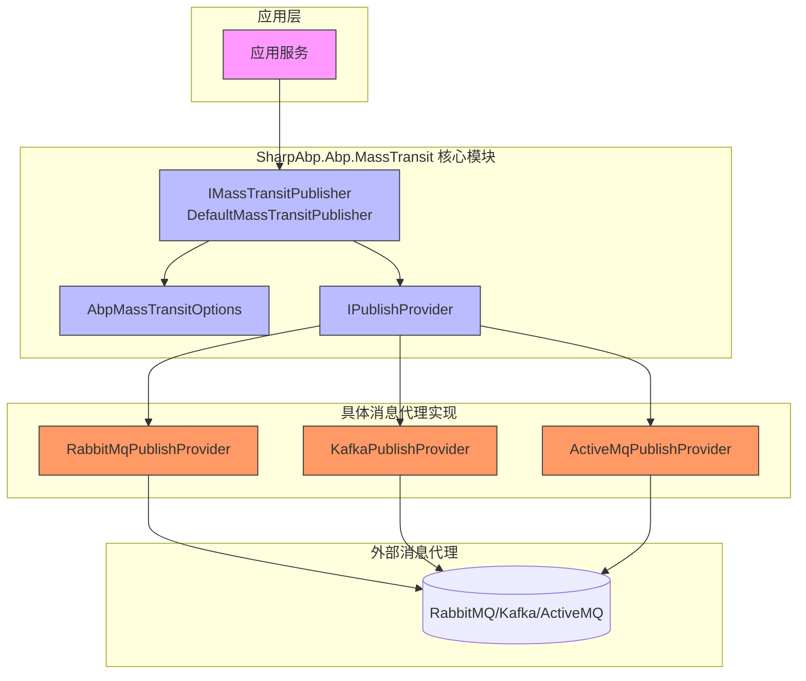
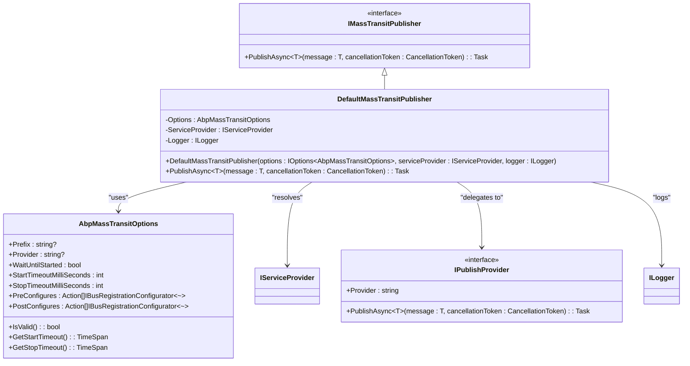

# 发布/订阅模式

<cite>
**本文档中引用的文件**
- [IMassTransitPublisher.cs](file://framework/src/SharpAbp.Abp.MassTransit/SharpAbp/Abp/MassTransit/IMassTransitPublisher.cs)
- [DefaultMassTransitPublisher.cs](file://framework/src/SharpAbp.Abp.MassTransit/SharpAbp/Abp/MassTransit/DefaultMassTransitPublisher.cs)
- [IPublishProvider.cs](file://framework/src/SharpAbp.Abp.MassTransit/SharpAbp/Abp/MassTransit/IPublishProvider.cs)
- [AbpMassTransitOptions.cs](file://framework/src/SharpAbp.Abp.MassTransit/SharpAbp/Abp/MassTransit/AbpMassTransitOptions.cs)
- [AbpMassTransitModule.cs](file://framework/src/SharpAbp.Abp.MassTransit/SharpAbp/Abp/MassTransit/AbpMassTransitModule.cs)
- [RabbitMqPublishProvider.cs](file://framework/src/SharpAbp.Abp.MassTransit.RabbitMQ/SharpAbp/Abp/MassTransit/RabbitMQ/RabbitMqPublishProvider.cs)
- [ProducerService.cs](file://samples/masstransit-sample/src/MassTransitSample.Producer/ProducerService.cs)
</cite>

## 目录
1. [简介](#简介)
2. [核心组件分析](#核心组件分析)
3. [架构概述](#架构概述)
4. [详细组件分析](#详细组件分析)
5. [依赖关系分析](#依赖关系分析)
6. [配置与使用示例](#配置与使用示例)
7. [结论](#结论)

## 简介
`SharpAbp.Abp.MassTransit` 模块为基于 ABP 框架的应用程序提供了强大的消息传递功能，实现了发布/订阅（Publish/Subscribe）模式。该模式允许应用程序解耦其组件，通过消息总线进行异步通信。本模块的核心是 `IMassTransitPublisher` 接口及其默认实现 `DefaultMassTransitPublisher`，它们作为应用层与底层 MassTransit 消息总线之间的桥梁。通过 `IPublishProvider` 接口的设计，该模块支持多种消息代理（如 RabbitMQ、Kafka），并允许为每种代理提供特定的发布配置。`AbpMassTransitOptions` 类则用于集中配置整个发布行为。

## 核心组件分析

`SharpAbp.Abp.MassTransit` 模块的核心在于其清晰的分层设计，将通用的发布逻辑与特定于消息代理的实现分离。`IMassTransitPublisher` 接口定义了应用服务发布消息的标准契约，而 `DefaultMassTransitPublisher` 则负责协调配置和依赖注入，将实际的发布工作委托给具体的 `IPublishProvider` 实现。这种设计确保了应用代码无需关心底层消息代理的具体细节，从而提高了可维护性和灵活性。

**Section sources**
- [IMassTransitPublisher.cs](file://framework/src/SharpAbp.Abp.MassTransit/SharpAbp/Abp/MassTransit/IMassTransitPublisher.cs#L1-L22)
- [DefaultMassTransitPublisher.cs](file://framework/src/SharpAbp.Abp.MassTransit/SharpAbp/Abp/MassTransit/DefaultMassTransitPublisher.cs#L1-L93)
- [IPublishProvider.cs](file://framework/src/SharpAbp.Abp.MassTransit/SharpAbp/Abp/MassTransit/IPublishProvider.cs#L1-L26)

## 架构概述

**Diagram sources**
- [IMassTransitPublisher.cs](file://framework/src/SharpAbp.Abp.MassTransit/SharpAbp/Abp/MassTransit/IMassTransitPublisher.cs)
- [DefaultMassTransitPublisher.cs](file://framework/src/SharpAbp.Abp.MassTransit/SharpAbp/Abp/MassTransit/DefaultMassTransitPublisher.cs)
- [IPublishProvider.cs](file://framework/src/SharpAbp.Abp.MassTransit/SharpAbp/Abp/MassTransit/IPublishProvider.cs)
- [RabbitMqPublishProvider.cs](file://framework/src/SharpAbp.Abp.MassTransit.RabbitMQ/SharpAbp/Abp/MassTransit/RabbitMQ/RabbitMqPublishProvider.cs)

## 详细组件分析

### IMassTransitPublisher 接口与 DefaultMassTransitPublisher 实现

`IMassTransitPublisher` 接口是应用层发布消息的入口点。它定义了一个简单的 `PublishAsync<T>` 方法，接收一个消息对象和一个可选的取消令牌。`DefaultMassTransitPublisher` 是该接口的默认实现，它在构造函数中通过依赖注入获取 `AbpMassTransitOptions`、`IServiceProvider` 和 `ILogger`。当 `PublishAsync` 被调用时，它首先验证传入的消息不为空，并检查全局配置中的 `Provider` 是否已设置。如果配置有效，它会使用 `IServiceProvider.GetRequiredKeyedService<IPublishProvider>(Options.Provider)` 来解析与当前配置的提供者名称（如 "RabbitMQ"）相对应的具体 `IPublishProvider` 实现，并将发布任务委托给该实例。

**Diagram sources**
- [IMassTransitPublisher.cs](file://framework/src/SharpAbp.Abp.MassTransit/SharpAbp/Abp/MassTransit/IMassTransitPublisher.cs#L1-L