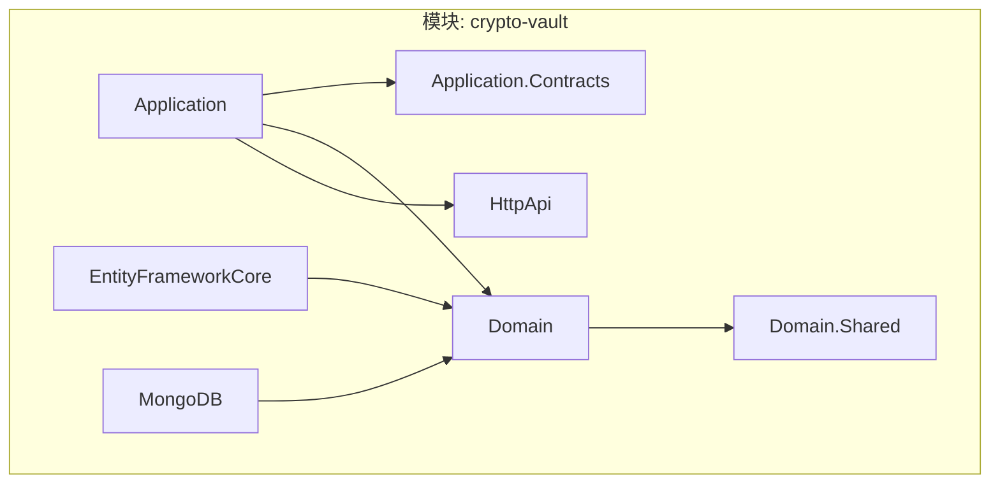
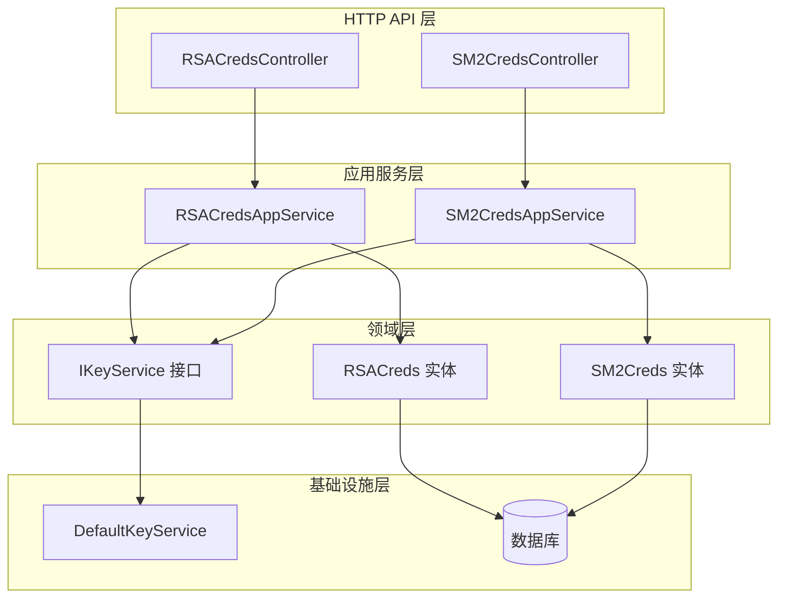
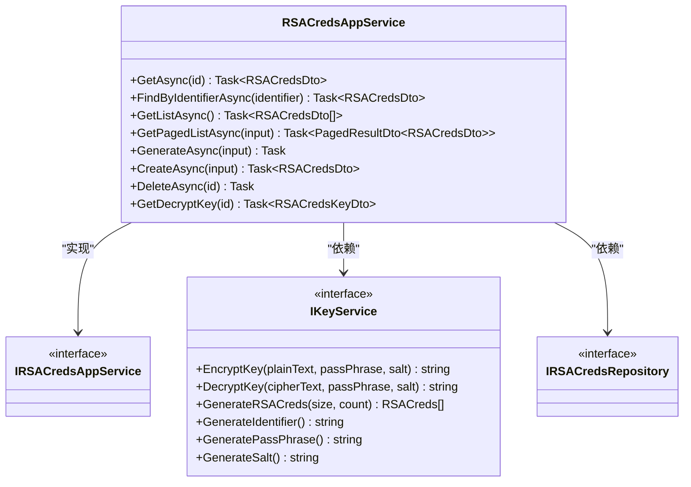
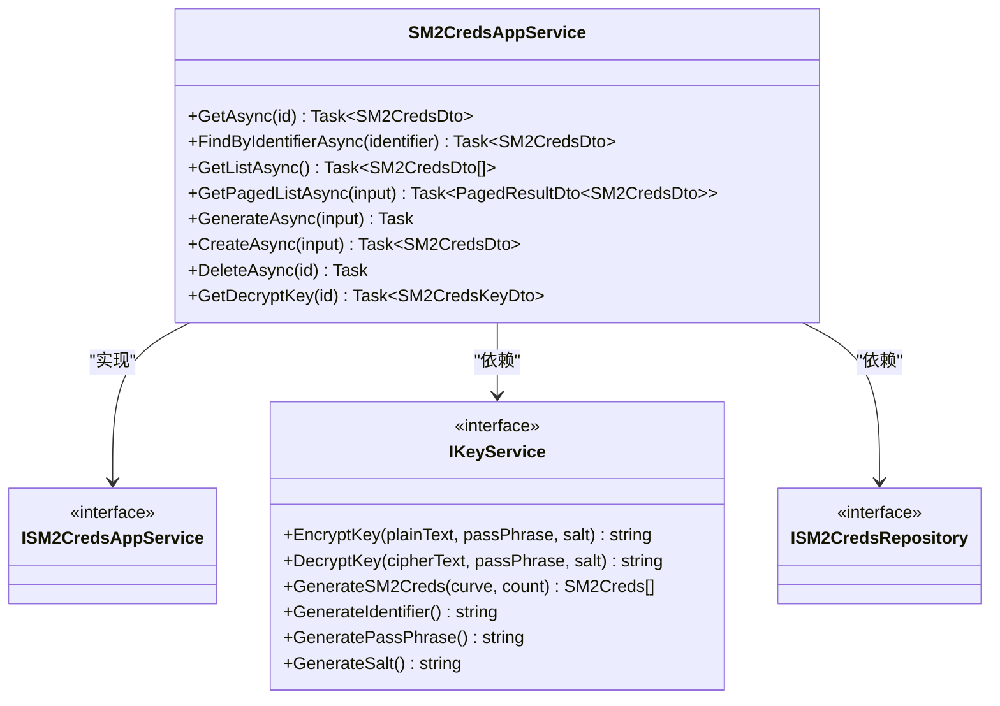
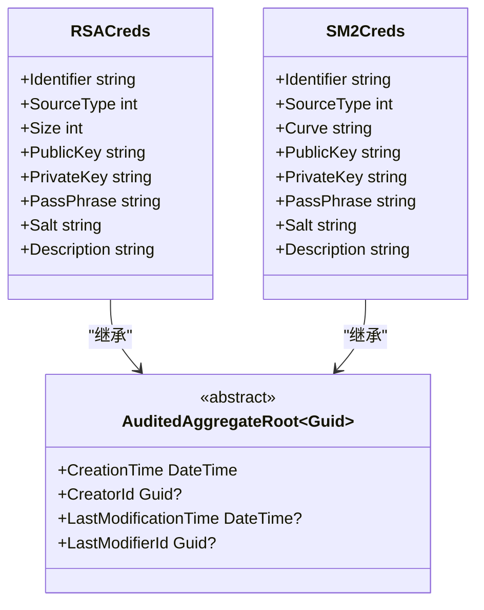

# 加密凭证库模块

<cite>
**本文档中引用的文件**
- [RSACreds.cs](file://modules/crypto-vault/src/SharpAbp.Abp.CryptoVault.Domain/SharpAbp/Abp/CryptoVault/RSACreds.cs)
- [SM2Creds.cs](file://modules/crypto-vault/src/SharpAbp.Abp.CryptoVault.Domain/SharpAbp/Abp/CryptoVault/SM2Creds.cs)
- [RSACredsAppService.cs](file://modules/crypto-vault/src/SharpAbp.Abp.CryptoVault.Application/SharpAbp/Abp/CryptoVault/RSACredsAppService.cs)
- [SM2CredsAppService.cs](file://modules/crypto-vault/src/SharpAbp.Abp.CryptoVault.Application/SharpAbp/Abp/CryptoVault/SM2CredsAppService.cs)
- [RSACredsController.cs](file://modules/crypto-vault/src/SharpAbp.Abp.CryptoVault.HttpApi/SharpAbp/Abp/CryptoVault/RSACredsController.cs)
- [SM2CredsController.cs](file://modules/crypto-vault/src/SharpAbp.Abp.CryptoVault.HttpApi/SharpAbp/Abp/CryptoVault/SM2CredsController.cs)
- [IKeyService.cs](file://modules/crypto-vault/src/SharpAbp.Abp.CryptoVault.Domain/SharpAbp/Abp/CryptoVault/IKeyService.cs)
- [DefaultKeyService.cs](file://modules/crypto-vault/src/SharpAbp.Abp.CryptoVault.Domain/SharpAbp/Abp/CryptoVault/DefaultKeyService.cs)
- [RSACredsConsts.cs](file://modules/crypto-vault/src/SharpAbp.Abp.CryptoVault.Domain.Shared/SharpAbp/Abp/CryptoVault/RSACredsConsts.cs)
- [SM2CredsConsts.cs](file://modules/crypto-vault/src/SharpAbp.Abp.CryptoVault.Domain.Shared/SharpAbp/Abp/CryptoVault/SM2CredsConsts.cs)
- [AbpCryptoVaultPermissionDefinitionProvider.cs](file://modules/crypto-vault/src/SharpAbp.Abp.CryptoVault.Application.Contracts/SharpAbp/Abp/CryptoVault/AbpCryptoVaultPermissionDefinitionProvider.cs)
</cite>

## 目录
1. [简介](#简介)
2. [项目结构](#项目结构)
3. [核心组件](#核心组件)
4. [架构概述](#架构概述)
5. [详细组件分析](#详细组件分析)
6. [依赖关系分析](#依赖关系分析)
7. [性能考虑](#性能考虑)
8. [故障排除指南](#故障排除指南)
9. [结论](#结论)

## 简介
加密凭证库模块是sharp-abp框架中的一个关键安全组件，专门用于安全地存储和管理加密密钥。该模块提供了对RSA和SM2两种主流非对称加密算法的支持，通过一套完整的应用服务、领域实体和API接口，实现了密钥的安全创建、存储、检索和删除功能。本模块的设计遵循了ABP框架的最佳实践，采用了分层架构，确保了代码的可维护性和扩展性。

## 项目结构
加密凭证库模块采用标准的ABP模块化结构，分为多个独立的项目，每个项目负责不同的职责。这种分层设计有助于实现关注点分离，提高代码的可测试性和可维护性。



**图示来源**
- [RSACreds.cs](file://modules/crypto-vault/src/SharpAbp.Abp.CryptoVault.Domain/SharpAbp/Abp/CryptoVault/RSACreds.cs)
- [SM2Creds.cs](file://modules/crypto-vault/src/SharpAbp.Abp.CryptoVault.Domain/SharpAbp/Abp/CryptoVault/SM2Creds.cs)
- [RSACredsAppService.cs](file://modules/crypto-vault/src/SharpAbp.Abp.CryptoVault.Application/SharpAbp/Abp/CryptoVault/RSACredsAppService.cs)
- [SM2CredsAppService.cs](file://modules/crypto-vault/src/SharpAbp.Abp.CryptoVault.Application/SharpAbp/Abp/CryptoVault/SM2CredsAppService.cs)
- [RSACredsController.cs](file://modules/crypto-vault/src/SharpAbp.Abp.CryptoVault.HttpApi/SharpAbp/Abp/CryptoVault/RSACredsController.cs)
- [SM2CredsController.cs](file://modules/crypto-vault/src/SharpAbp.Abp.CryptoVault.HttpApi/SharpAbp/Abp/CryptoVault/SM2CredsController.cs)

## 核心组件
加密凭证库模块的核心组件包括`RSACredsAppService`和`SM2CredsAppService`两个应用服务，它们分别负责管理RSA和SM2类型的加密凭证。这些服务通过调用底层的`IKeyService`来执行实际的加密操作，并与数据库进行交互以持久化存储密钥信息。

**章节来源**
- [RSACredsAppService.cs](file://modules/crypto-vault/src/SharpAbp.Abp.CryptoVault.Application/SharpAbp/Abp/CryptoVault/RSACredsAppService.cs)
- [SM2CredsAppService.cs](file://modules/crypto-vault/src/SharpAbp.Abp.CryptoVault.Application/SharpAbp/Abp/CryptoVault/SM2CredsAppService.cs)
- [IKeyService.cs](file://modules/crypto-vault/src/SharpAbp.Abp.CryptoVault.Domain/SharpAbp/Abp/CryptoVault/IKeyService.cs)

## 架构概述
该模块采用了典型的分层架构，从上到下依次为HTTP API层、应用服务层、领域层和基础设施层。HTTP API层暴露RESTful接口，应用服务层处理业务逻辑，领域层包含核心的领域实体和业务规则，而基础设施层则负责数据访问和加密服务的实现。



**图示来源**
- [RSACredsController.cs](file://modules/crypto-vault/src/SharpAbp.Abp.CryptoVault.HttpApi/SharpAbp/Abp/CryptoVault/RSACredsController.cs)
- [SM2CredsController.cs](file://modules/crypto-vault/src/SharpAbp.Abp.CryptoVault.HttpApi/SharpAbp/Abp/CryptoVault/SM2CredsController.cs)
- [RSACredsAppService.cs](file://modules/crypto-vault/src/SharpAbp.Abp.CryptoVault.Application/SharpAbp/Abp/CryptoVault/RSACredsAppService.cs)
- [SM2CredsAppService.cs](file://modules/crypto-vault/src/SharpAbp.Abp.CryptoVault.Application/SharpAbp/Abp/CryptoVault/SM2CredsAppService.cs)
- [RSACreds.cs](file://modules/crypto-vault/src/SharpAbp.Abp.CryptoVault.Domain/SharpAbp/Abp/CryptoVault/RSACreds.cs)
- [SM2Creds.cs](file://modules/crypto-vault/src/SharpAbp.Abp.CryptoVault.Domain/SharpAbp/Abp/CryptoVault/SM2Creds.cs)
- [IKeyService.cs](file://modules/crypto-vault/src/SharpAbp.Abp.CryptoVault.Domain/SharpAbp/Abp/CryptoVault/IKeyService.cs)
- [DefaultKeyService.cs](file://modules/crypto-vault/src/SharpAbp.Abp.CryptoVault.Domain/SharpAbp/Abp/CryptoVault/DefaultKeyService.cs)

## 详细组件分析
### RSA凭证服务分析
`RSACredsAppService`是管理RSA加密凭证的核心应用服务。它提供了创建、查询、生成和删除RSA密钥对的功能。所有敏感操作都受到权限控制，确保只有授权用户才能访问。

#### 类图


**图示来源**
- [RSACredsAppService.cs](file://modules/crypto-vault/src/SharpAbp.Abp.CryptoVault.Application/SharpAbp/Abp/CryptoVault/RSACredsAppService.cs)
- [IRSACredsAppService.cs](file://modules/crypto-vault/src/SharpAbp.Abp.CryptoVault.Application.Contracts/SharpAbp/Abp/CryptoVault/IRSACredsAppService.cs)
- [IKeyService.cs](file://modules/crypto-vault/src/SharpAbp.Abp.CryptoVault.Domain/SharpAbp/Abp/CryptoVault/IKeyService.cs)
- [IRSACredsRepository.cs](file://modules/crypto-vault/src/SharpAbp.Abp.CryptoVault.Domain/SharpAbp/Abp/CryptoVault/IRSACredsRepository.cs)

### SM2凭证服务分析
`SM2CredsAppService`是管理SM2加密凭证的应用服务，其功能和设计模式与`RSACredsAppService`类似，但针对SM2算法的特点进行了优化。SM2是中国国家密码管理局发布的椭圆曲线公钥密码算法标准。

#### 类图


**图示来源**
- [SM2CredsAppService.cs](file://modules/crypto-vault/src/SharpAbp.Abp.CryptoVault.Application/SharpAbp/Abp/CryptoVault/SM2CredsAppService.cs)
- [ISM2CredsAppService.cs](file://modules/crypto-vault/src/SharpAbp.Abp.CryptoVault.Application.Contracts/SharpAbp/Abp/CryptoVault/ISM2CredsAppService.cs)
- [IKeyService.cs](file://modules/crypto-vault/src/SharpAbp.Abp.CryptoVault.Domain/SharpAbp/Abp/CryptoVault/IKeyService.cs)
- [ISM2CredsRepository.cs](file://modules/crypto-vault/src/SharpAbp.Abp.CryptoVault.Domain/SharpAbp/Abp/CryptoVault/ISM2CredsRepository.cs)

### 领域实体分析
`RSACreds`和`SM2Creds`是两个核心的领域实体，它们继承自`AuditedAggregateRoot<Guid>`，包含了密钥的所有必要属性和生命周期管理功能。

#### 类图


**图示来源**
- [RSACreds.cs](file://modules/crypto-vault/src/SharpAbp.Abp.CryptoVault.Domain/SharpAbp/Abp/CryptoVault/RSACreds.cs)
- [SM2Creds.cs](file://modules/crypto-vault/src/SharpAbp.Abp.CryptoVault.Domain/SharpAbp/Abp/CryptoVault/SM2Creds.cs)

### API接口分析
`RSACredsController`和`SM2CredsController`提供了RESTful API接口，使客户端能够通过HTTP请求与加密凭证库进行交互。

#### 序列图
```mermaid
sequenceDiagram
    participant Client as "客户端"
    participant Controller as "控制器"
    participant Service as "应用服务"
    participant Repository as "仓储"
    participant KeyService as "密钥服务"
    
    Client->>Controller: POST /api/crypto-vault/rsaCreds
    Controller->>Service: CreateAsync(input)
   