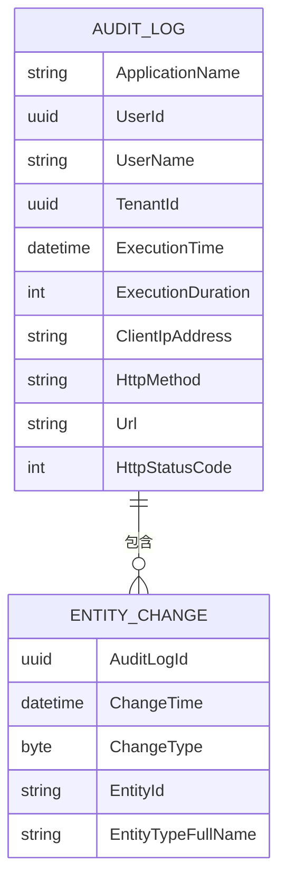
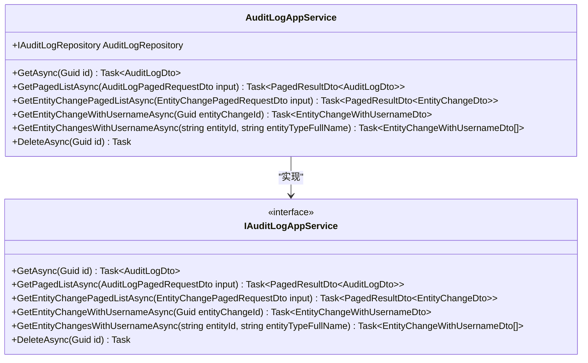
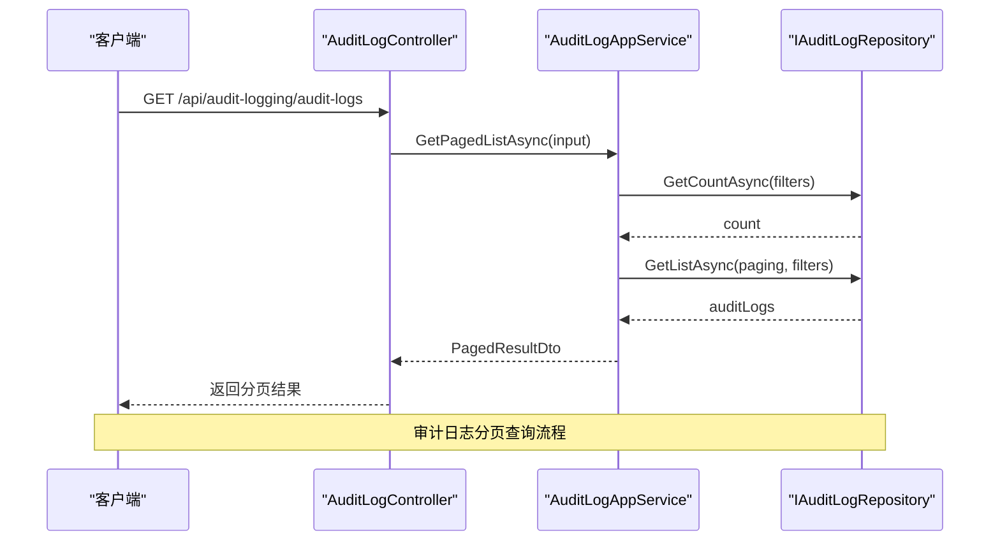
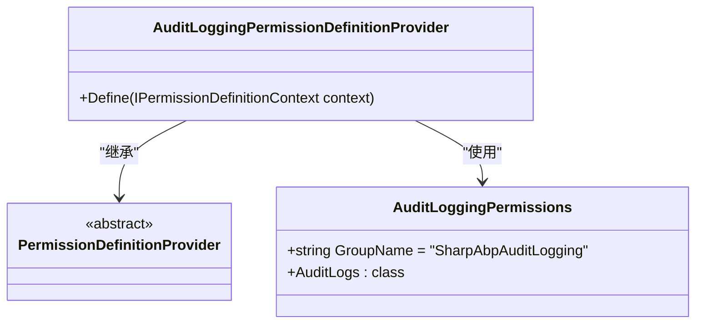

# 审计日志模块

<cite>
**本文档中引用的文件**
- [AuditLogAppService.cs](file://modules\audit-logging\src\SharpAbp.Abp.AuditLogging.Application\SharpAbp\Abp\AuditLogging\AuditLogAppService.cs)
- [AuditLogController.cs](file://modules\audit-logging\src\SharpAbp.Abp.AuditLogging.HttpApi\SharpAbp\Abp\AuditLogging\AuditLogController.cs)
- [AuditLogDto.cs](file://modules\audit-logging\src\SharpAbp.Abp.AuditLogging.HttpApi.Client\ClientProxies\SharpAbp\Abp\AuditLogging\AuditLogDto.cs)
- [EntityChangeDto.cs](file://modules\audit-logging\src\SharpAbp.Abp.AuditLogging.HttpApi.Client\ClientProxies\SharpAbp\Abp\AuditLogging\EntityChangeDto.cs)
- [AuditLogPagedRequestDto.cs](file://modules\audit-logging\src\SharpAbp.Abp.AuditLogging.HttpApi.Client\ClientProxies\SharpAbp\Abp\AuditLogging\AuditLogPagedRequestDto.cs)
- [AuditLoggingPermissions.cs](file://modules\audit-logging\src\SharpAbp.Abp.AuditLogging.Application.Contracts\SharpAbp\Abp\AuditLogging\AuditLoggingPermissions.cs)
- [AuditLoggingDomainSharedModule.cs](file://modules\audit-logging\src\SharpAbp.Abp.AuditLogging.Domain.Shared\SharpAbp\Abp\AuditLogging\AuditLoggingDomainSharedModule.cs)
</cite>

## 目录
1. [简介](#简介)
2. [核心领域模型](#核心领域模型)
3. [审计日志应用服务](#审计日志应用服务)
4. [查询接口与过滤功能](#查询接口与过滤功能)
5. [权限管理](#权限管理)
6. [开发者指南](#开发者指南)

## 简介
sharp-abp审计日志模块提供了一套完整的系统操作日志记录和查询功能。该模块能够自动捕获用户操作、实体变更和执行时间等关键信息，并将其存储为审计日志条目。通过`AuditLogAppService`和`AuditLogController`，开发者可以方便地查询和管理这些日志数据。本模块支持分页、过滤和排序功能，使日志查询更加高效和灵活。

## 核心领域模型
审计日志模块的核心领域模型主要包括`AuditLog`和`EntityChange`两个主要实体。

`AuditLog`实体代表一次系统操作的完整审计记录，包含以下关键属性：
- **ApplicationName**: 应用程序名称
- **UserId**: 用户ID
- **UserName**: 用户名
- **TenantId**: 租户ID
- **ExecutionTime**: 执行时间
- **ExecutionDuration**: 执行持续时间（毫秒）
- **ClientIpAddress**: 客户端IP地址
- **HttpMethod**: HTTP方法
- **Url**: 请求URL
- **HttpStatusCode**: HTTP状态码
- **EntityChanges**: 实体变更集合
- **Actions**: 操作集合

`EntityChange`实体用于记录实体对象的变更信息，包含以下关键属性：
- **AuditLogId**: 关联的审计日志ID
- **ChangeTime**: 变更时间
- **ChangeType**: 变更类型（插入、更新、删除）
- **EntityId**: 实体ID
- **EntityTypeFullName**: 实体类型全名
- **PropertyChanges**: 属性变更集合



**图示来源**
- [AuditLogDto.cs](file://modules\audit-logging\src\SharpAbp.Abp.AuditLogging.HttpApi.Client\ClientProxies\SharpAbp\Abp\AuditLogging\AuditLogDto.cs#L10-L55)
- [EntityChangeDto.cs](file://modules\audit-logging\src\SharpAbp.Abp.AuditLogging.HttpApi.Client\ClientProxies\SharpAbp\Abp\AuditLogging\EntityChangeDto.cs#L10-L30)

## 审计日志应用服务
`AuditLogAppService`是审计日志模块的核心应用服务，负责处理审计日志的获取、查询和删除操作。该服务实现了`IAuditLogAppService`接口，并通过依赖注入获取`IAuditLogRepository`来访问底层数据存储。

服务的主要功能包括：
- 根据ID获取单个审计日志
- 分页获取审计日志列表
- 分页获取实体变更列表
- 获取带用户名的实体变更
- 删除审计日志



**图示来源**
- [AuditLogAppService.cs](file://modules\audit-logging\src\SharpAbp.Abp.AuditLogging.Application\SharpAbp\Abp\AuditLogging\AuditLogAppService.cs#L15-L147)

**本节来源**
- [AuditLogAppService.cs](file://modules\audit-logging\src\SharpAbp.Abp.AuditLogging.Application\SharpAbp\Abp\AuditLogging\AuditLogAppService.cs#L15-L147)

## 查询接口与过滤功能
`AuditLogController`提供了RESTful API接口，允许客户端通过HTTP请求查询审计日志数据。控制器实现了`IAuditLogAppService`接口，并通过路由映射将HTTP请求转发到相应的应用服务方法。

### 分页查询
审计日志支持分页查询，使用`AuditLogPagedRequestDto`作为输入参数，包含以下过滤条件：
- **StartTime/EndTime**: 执行时间范围
- **HttpMethod**: HTTP方法过滤
- **Url**: URL匹配
- **UserId/UserName**: 用户过滤
- **ApplicationName**: 应用程序名称过滤
- **ClientIpAddress**: 客户端IP地址过滤
- **CorrelationId**: 关联ID过滤
- **Max/MinExecutionDuration**: 执行时长范围
- **HasException**: 是否有异常
- **HttpStatusCode**: HTTP状态码



**图示来源**
- [AuditLogController.cs](file://modules\audit-logging\src\SharpAbp.Abp.AuditLogging.HttpApi\SharpAbp\Abp\AuditLogging\AuditLogController.cs#L15-L62)
- [AuditLogAppService.cs](file://modules\audit-logging\src\SharpAbp.Abp.AuditLogging.Application\SharpAbp\Abp\AuditLogging\AuditLogAppService.cs#L39-L73)
- [AuditLogPagedRequestDto.cs](file://modules\audit-logging\src\SharpAbp.Abp.AuditLogging.HttpApi.Client\ClientProxies\SharpAbp\Abp\AuditLogging\AuditLogPagedRequestDto.cs#L10-L38)

### 实体变更查询
除了审计日志本身的查询，模块还提供了实体变更的专门查询接口：
- `GET /api/audit-logging/audit-logs/entity-changes`: 分页获取实体变更
- `GET /api/audit-logging/audit-logs/entity-change-with-username/{entityChangeId}`: 获取带用户名的单个实体变更
- `GET /api/audit-logging/audit-logs/entity-changes-with-username/{entityId}`: 获取特定实体的所有变更记录

**本节来源**
- [AuditLogController.cs](file://modules\audit-logging\src\SharpAbp.Abp.AuditLogging.HttpApi\SharpAbp\Abp\AuditLogging\AuditLogController.cs#L15-L62)
- [AuditLogAppService.cs](file://modules\audit-logging\src\SharpAbp.Abp.AuditLogging.Application\SharpAbp\Abp\AuditLogging\AuditLogAppService.cs#L74-L107)

## 权限管理
审计日志模块集成了ABP框架的权限管理系统，通过`AuditLoggingPermissions`类定义了相关的权限常量。这些权限用于控制对审计日志数据的访问。

权限定义如下：
- **AuditLogs.Default**: 审计日志默认权限
- **AuditLogs.Create**: 创建权限
- **AuditLogs.Update**: 更新权限
- **AuditLogs.Delete**: 删除权限

在`AuditLogAppService`中，通过`[Authorize]`特性应用这些权限：
```csharp
[Authorize(AuditLoggingPermissions.AuditLogs.Default)]
public class AuditLogAppService : AuditLoggingAppServiceBase, IAuditLogAppService
{
    // ...
    
    [Authorize(AuditLoggingPermissions.AuditLogs.Delete)]
    public virtual async Task DeleteAsync(Guid id)
    {
        await AuditLogRepository.DeleteAsync(id);
    }
}
```

权限定义提供者`AuditLoggingPermissionDefinitionProvider`负责在系统启动时注册这些权限：



**图示来源**
- [AuditLoggingPermissions.cs](file://modules\audit-logging\src\SharpAbp.Abp.AuditLogging.Application.Contracts\SharpAbp\Abp\AuditLogging\AuditLoggingPermissions.cs#L5-L21)
- [AuditLogAppService.cs](file://modules\audit-logging\src\SharpAbp.Abp.AuditLogging.Application\SharpAbp\Abp\AuditLogging\AuditLogAppService.cs#L15-L147)
- [AuditLoggingPermissionDefinitionProvider.cs](file://modules\audit-logging\src\SharpAbp.Abp.AuditLogging.Application.Contracts\SharpAbp\Abp\AuditLogging\AuditLoggingPermissionDefinitionProvider.cs#L5-L35)

**本节来源**
- [AuditLoggingPermissions.cs](file://modules\audit-logging\src\SharpAbp.Abp.AuditLogging.Application.Contracts\SharpAbp\Abp\AuditLogging\AuditLoggingPermissions.cs#L5-L21)
- [AuditLogAppService.cs](file://modules\audit-logging\src\SharpAbp.Abp.AuditLogging.Application\SharpAbp\Abp\AuditLogging\AuditLogAppService.cs#L15-L147)

## 开发者指南
### 在自定义服务中记录审计日志
要启用审计日志功能，首先需要在模块依赖中添加`AuditLoggingModule`。然后，可以通过注入`IAuditingManager`来手动创建审计日志：

```csharp
public class MyService : ApplicationService
{
    private readonly IAuditingManager _auditingManager;
    
    public MyService(IAuditingManager auditingManager)
    {
        _auditingManager = auditingManager;
    }
    
    public async Task DoSomething()
    {
        using (var scope = _auditingManager.BeginScope())
        {
            // 执行业务逻辑
            
            // 添加实体变更
            var entityChange = new EntityChangeInfo();
            // 设置变更信息...
            
            scope.Log.EntityChanges.Add(entityChange);
            
            await scope.SaveAsync(); // 保存审计日志
        }
    }
}
```

### 配置日志保留策略
审计日志的保留策略可以通过配置系统进行设置。虽然具体配置选项未在代码中直接体现，但通常可以通过`appsettings.json`或模块配置类来设置日志保留天数、最大日志数量等参数。

### 模块配置
审计日志模块的配置遵循ABP框架的标准模式，在`AuditLoggingDomainSharedModule`中进行基本配置：

```csharp
[DependsOn(
    typeof(AbpValidationModule),
    typeof(AbpAuditLoggingDomainSharedModule)
)]
public class AuditLoggingDomainSharedModule : AbpModule
{
    public override void ConfigureServices(ServiceConfigurationContext context)
    {
        AsyncHelper.RunSync(() => ConfigureServicesAsync(context));
    }

    public override Task ConfigureServicesAsync(ServiceConfigurationContext context)
    {
        Configure<AbpVirtualFileSystemOptions>(options =>
        {
            options.FileSets.AddEmbedded<AuditLoggingDomainSharedModule>();
        });

        Configure<AbpLocalizationOptions>(options =>
        {
            options.Resources
                .Add<AuditLoggingResource>("en")
                .AddBaseTypes(typeof(AbpValidationResource))
                .AddVirtualJson("/SharpAbp/Abp/AuditLogging/Localization/Resources");
        });

        Configure<AbpExceptionLocalizationOptions>(options =>
        {
            options.MapCodeNamespace("SharpAbpAuditLogging", typeof(AuditLoggingResource));
        });
        return Task.CompletedTask;
    }
}
```

**本节来源**
- [AuditLoggingDomainSharedModule.cs](file://modules\audit-logging\src\SharpAbp.Abp.AuditLogging.Domain.Shared\SharpAbp\Abp\AuditLogging\AuditLoggingDomainSharedModule.cs#L5-L48)
- [AuditLoggingDataSeedContributor.cs](file://modules\audit-logging\test\SharpAbp.Abp.AuditLogging.Application.Tests\SharpAbp\Abp\AuditLogging\AuditLoggingDataSeedContributor.cs#L5-L70)