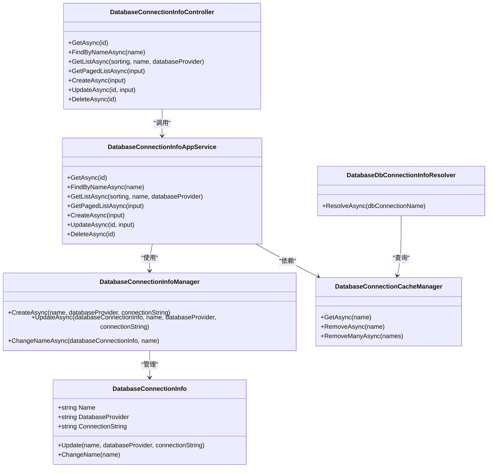
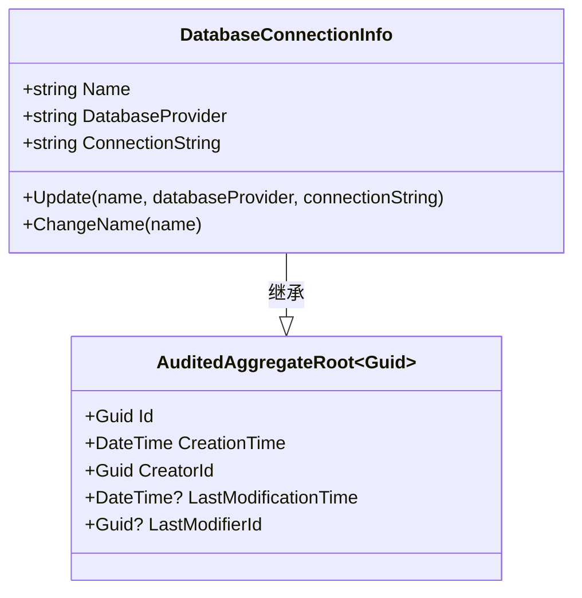
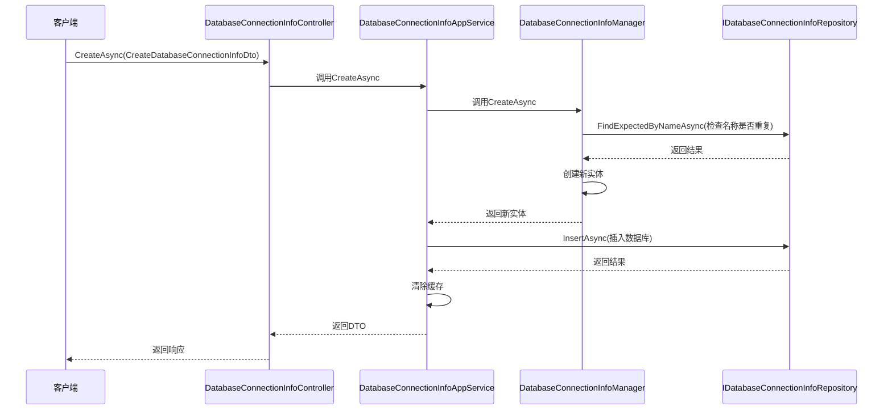

# 数据库连接管理模块

<cite>
**本文档引用的文件**
- [DatabaseConnectionInfoAppService.cs](file://modules/dbconnections/src/SharpAbp.Abp.DbConnectionsManagement.Application/SharpAbp/Abp/DbConnectionsManagement/DatabaseConnectionInfoAppService.cs)
- [DatabaseProviderAppService.cs](file://modules/dbconnections/src/SharpAbp.Abp.DbConnectionsManagement.Application/SharpAbp/Abp/DbConnectionsManagement/DatabaseProviderAppService.cs)
- [DatabaseConnectionInfo.cs](file://modules/dbconnections/src/SharpAbp.Abp.DbConnectionsManagement.Domain/SharpAbp/Abp/DbConnectionsManagement/DatabaseConnectionInfo.cs)
- [DatabaseConnectionInfoManager.cs](file://modules/dbconnections/src/SharpAbp.Abp.DbConnectionsManagement.Domain/SharpAbp/Abp/DbConnectionsManagement/DatabaseConnectionInfoManager.cs)
- [DatabaseConnectionInfoController.cs](file://modules/dbconnections/src/SharpAbp.Abp.DbConnectionsManagement.HttpApi/SharpAbp/Abp/DbConnectionsManagement/DatabaseConnectionInfoController.cs)
- [DatabaseProviderController.cs](file://modules/dbconnections/src/SharpAbp.Abp.DbConnectionsManagement.HttpApi/SharpAbp/Abp/DbConnectionsManagement/DatabaseProviderController.cs)
- [DatabaseConnectionCacheManager.cs](file://modules/dbconnections/src/SharpAbp.Abp.DbConnectionsManagement.Domain/SharpAbp/Abp/DbConnectionsManagement/DatabaseConnectionCacheManager.cs)
- [DatabaseDbConnectionInfoResolver.cs](file://modules/dbconnections/src/SharpAbp.Abp.DbConnectionsManagement.Domain/SharpAbp/Abp/DbConnectionsManagement/DatabaseDbConnectionInfoResolver.cs)
- [DatabaseConnectionInfoConsts.cs](file://modules/dbconnections/src/SharpAbp.Abp.DbConnectionsManagement.Domain.Shared/SharpAbp/Abp/DbConnectionsManagement/DatabaseConnectionInfoConsts.cs)
</cite>

## 目录
1. [简介](#简介)
2. [核心组件分析](#核心组件分析)
3. [领域实体与数据结构](#领域实体与数据结构)
4. [应用服务实现](#应用服务实现)
5. [API接口说明](#api接口说明)
6. [缓存与事件处理机制](#缓存与事件处理机制)
7. [数据库提供程序管理](#数据库提供程序管理)
8. [最佳实践与配置指南](#最佳实践与配置指南)

## 简介
sharp-abp数据库连接管理模块提供了在运行时动态创建、配置和管理多个数据库连接的能力。该模块允许开发者通过API接口灵活地管理不同类型的数据库连接，支持MySQL、PostgreSQL、SQL Server、Oracle和SQLite等多种数据库系统。模块采用分层架构设计，包含领域实体、应用服务、控制器和缓存管理等多个组件，确保了系统的可维护性和扩展性。

## 核心组件分析

**图示来源**
- [DatabaseConnectionInfo.cs](file://modules/dbconnections/src/SharpAbp.Abp.DbConnectionsManagement.Domain/SharpAbp/Abp/DbConnectionsManagement/DatabaseConnectionInfo.cs)
- [DatabaseConnectionInfoManager.cs](file://modules/dbconnections/src/SharpAbp.Abp.DbConnectionsManagement.Domain/SharpAbp/Abp/DbConnectionsManagement/DatabaseConnectionInfoManager.cs)
- [DatabaseConnectionInfoAppService.cs](file://modules/dbconnections/src/SharpAbp.Abp.DbConnectionsManagement.Application/SharpAbp/Abp/DbConnectionsManagement/DatabaseConnectionInfoAppService.cs)
- [DatabaseConnectionInfoController.cs](file://modules/dbconnections/src/SharpAbp.Abp.DbConnectionsManagement.HttpApi/SharpAbp/Abp/DbConnectionsManagement/DatabaseConnectionInfoController.cs)
- [DatabaseConnectionCacheManager.cs](file://modules/dbconnections/src/SharpAbp.Abp.DbConnectionsManagement.Domain/SharpAbp/Abp/DbConnectionsManagement/DatabaseConnectionCacheManager.cs)
- [DatabaseDbConnectionInfoResolver.cs](file://modules/dbconnections/src/SharpAbp.Abp.DbConnectionsManagement.Domain/SharpAbp/Abp/DbConnectionsManagement/DatabaseDbConnectionInfoResolver.cs)

## 领域实体与数据结构

### DatabaseConnectionInfo 实体
`DatabaseConnectionInfo` 是数据库连接信息的核心领域实体，继承自 `AuditedAggregateRoot<Guid>`，包含了数据库连接的基本属性和业务逻辑方法。

**主要属性：**
- **Name**: 连接名称，最大长度64字符
- **DatabaseProvider**: 数据库提供程序类型（如MySql、PostgreSql等）
- **ConnectionString**: 数据库连接字符串，最大长度256字符

**业务方法：**
- **Update**: 更新连接信息，同时发布 `DatabaseConnectionUpdatedEto` 分布式事件
- **ChangeName**: 修改连接名称，同时发布 `DatabaseConnectionNameChangedEto` 分布式事件

**图示来源**
- [DatabaseConnectionInfo.cs](file://modules/dbconnections/src/SharpAbp.Abp.DbConnectionsManagement.Domain/SharpAbp/Abp/DbConnectionsManagement/DatabaseConnectionInfo.cs)

### 常量定义
`DatabaseConnectionInfoConsts` 类定义了数据库连接信息的各种长度限制常量：

- **MaxNameLength**: 名称最大长度，默认64
- **MaxDatabaseProviderLength**: 数据库提供程序最大长度，默认32
- **MaxConnectionStringLength**: 连接字符串最大长度，默认256

这些常量用于DTO验证，确保数据的一致性和完整性。

**节来源**
- [DatabaseConnectionInfoConsts.cs](file://modules/dbconnections/src/SharpAbp.Abp.DbConnectionsManagement.Domain.Shared/SharpAbp/Abp/DbConnectionsManagement/DatabaseConnectionInfoConsts.cs)

## 应用服务实现

### DatabaseConnectionInfoAppService 服务
`DatabaseConnectionInfoAppService` 是数据库连接信息的应用服务，实现了 `IDatabaseConnectionInfoAppService` 接口，提供了完整的CRUD操作。

**主要功能：**
- **获取操作**:
  - `GetAsync`: 根据ID获取单个连接信息
  - `FindByNameAsync`: 根据名称查找连接信息
  - `GetListAsync`: 获取连接信息列表
  - `GetPagedListAsync`: 获取分页的连接信息列表

- **写入操作**:
  - `CreateAsync`: 创建新的数据库连接
  - `UpdateAsync`: 更新现有连接
  - `DeleteAsync`: 删除连接

服务通过依赖注入获取 `IDatabaseConnectionInfoManager` 和 `IDatabaseConnectionCacheManager`，实现了业务逻辑与数据访问的分离。

**图示来源**
- [DatabaseConnectionInfoAppService.cs](file://modules/dbconnections/src/SharpAbp.Abp.DbConnectionsManagement.Application/SharpAbp/Abp/DbConnectionsManagement/DatabaseConnectionInfoAppService.cs)
- [DatabaseConnectionInfoManager.cs](file://modules/dbconnections/src/SharpAbp.Abp.DbConnectionsManagement.Domain/SharpAbp/Abp/DbConnectionsManagement/DatabaseConnectionInfoManager.cs)

### DatabaseProviderAppService 服务
`DatabaseProviderAppService` 专门用于管理可用的数据库提供程序，其主要功能是获取系统支持的所有数据库提供程序列表。

服务通过注入 `IOptions<AbpDbConnectionsOptions>` 获取配置中的数据库提供程序选项