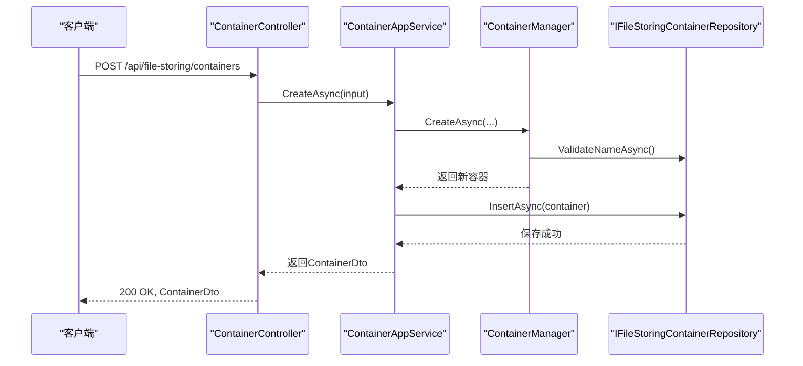
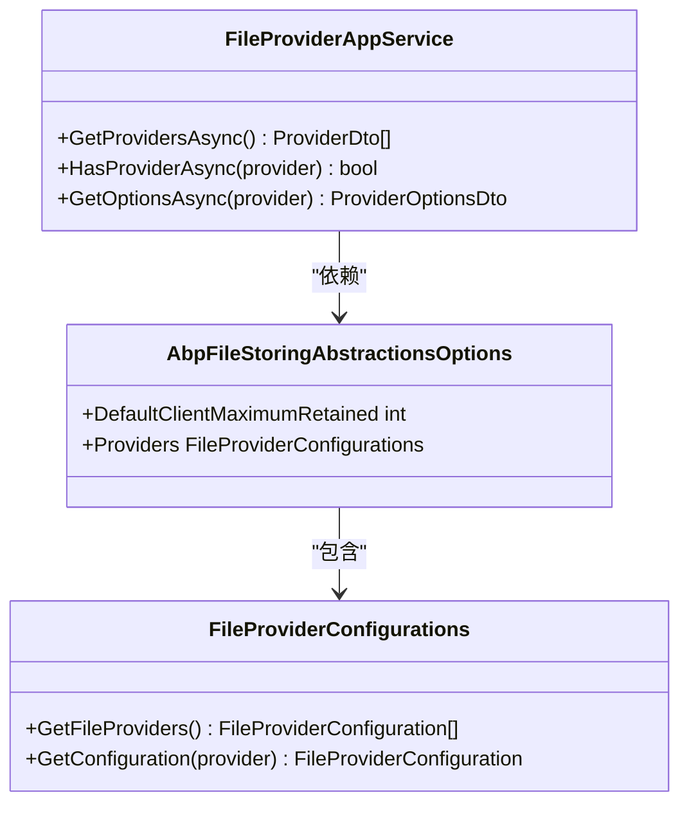

# 文件存储管理模块

<cite>
**本文档中引用的文件**
- [ContainerAppService.cs](file://modules/file-storing-management/src/SharpAbp.Abp.FileStoringManagement.Application/SharpAbp/Abp/FileStoringManagement/ContainerAppService.cs)
- [FileProviderAppService.cs](file://modules/file-storing-management/src/SharpAbp.Abp.FileStoringManagement.Application/SharpAbp/Abp/FileStoringManagement/FileProviderAppService.cs)
- [FileStoringContainer.cs](file://modules/file-storing-management/src/SharpAbp.Abp.FileStoringManagement.Domain/SharpAbp/Abp/FileStoringManagement/FileStoringContainer.cs)
- [ContainerManager.cs](file://modules/file-storing-management/src/SharpAbp.Abp.FileStoringManagement.Domain/SharpAbp/Abp/FileStoringManagement/ContainerManager.cs)
- [ContainerController.cs](file://modules/file-storing-management/src/SharpAbp.Abp.FileStoringManagement.HttpApi/SharpAbp/Abp/FileStoringManagement/ContainerController.cs)
- [FileProviderController.cs](file://modules/file-storing-management/src/SharpAbp.Abp.FileStoringManagement.HttpApi/SharpAbp/Abp/FileStoringManagement/FileProviderController.cs)
- [AbpFileStoringOptions.cs](file://framework/src/SharpAbp.Abp.FileStoring/SharpAbp/Abp/FileStoring/AbpFileStoringOptions.cs)
- [AbpFileStoringAbstractionsOptions.cs](file://framework/src/SharpAbp.Abp.FileStoring.Abstractions/SharpAbp/Abp/FileStoring/AbpFileStoringAbstractionsOptions.cs)
- [AliyunFileProvider.cs](file://framework/src/SharpAbp.Abp.FileStoring.Aliyun/SharpAbp/Abp/FileStoring/Aliyun/AliyunFileProvider.cs)
- [DatabaseFileContainerConfigurationProvider.cs](file://modules/file-storing-management/src/SharpAbp.Abp.FileStoringManagement.Domain/SharpAbp/Abp/FileStoringManagement/DatabaseFileContainerConfigurationProvider.cs)
</cite>

## 目录
1. [简介](#简介)
2. [核心组件](#核心组件)
3. [容器管理](#容器管理)
4. [文件提供商管理](#文件提供商管理)
5. [领域实体与管理逻辑](#领域实体与管理逻辑)
6. [API接口](#api接口)
7. [集成指南](#集成指南)
8. [结论](#结论)

## 简介
sharp-abp文件存储管理模块提供了一个集中配置和管理文件存储容器及提供商的解决方案。该模块支持多种文件存储后端，包括阿里云、AWS、MinIO等，并通过统一的接口进行管理。本文档将详细介绍`ContainerAppService`和`FileProviderAppService`应用服务的实现，以及相关的领域实体和控制器。

## 核心组件
文件存储管理模块的核心组件包括：
- `ContainerAppService`：负责容器的创建、更新和删除操作。
- `FileProviderAppService`：提供文件提供商的配置信息。
- `FileStoringContainer`：表示文件存储容器的领域实体。
- `ContainerManager`：管理容器的业务逻辑。
- `ContainerController`和`FileProviderController`：提供RESTful API接口。

这些组件共同构成了一个完整的文件存储管理系统，允许开发者轻松地集成和管理不同的文件存储后端。

**章节来源**
- [ContainerAppService.cs](file://modules/file-storing-management/src/SharpAbp.Abp.FileStoringManagement.Application/SharpAbp/Abp/FileStoringManagement/ContainerAppService.cs)
- [FileProviderAppService.cs](file://modules/file-storing-management/src/SharpAbp.Abp.FileStoringManagement.Application/SharpAbp/Abp/FileStoringManagement/FileProviderAppService.cs)

## 容器管理
`ContainerAppService`是处理文件存储容器相关操作的主要应用服务。它提供了以下功能：

### 创建容器
通过`CreateAsync`方法可以创建新的文件存储容器。此方法接收`CreateContainerDto`对象作为输入参数，包含容器的基本信息如名称、标题、是否启用多租户等。

### 更新容器
使用`UpdateAsync`方法可以修改现有容器的属性。该方法需要指定容器ID和更新后的配置信息。

### 删除容器
`DeleteAsync`方法用于删除指定ID的容器。在删除前会发布一个分布式事件，通知系统其他部分容器已被删除。

### 查询容器
提供了多种查询方法，包括按ID获取单个容器(`GetAsync`)、按名称查找容器(`FindByNameAsync`)、获取分页列表(`GetPagedListAsync`)和获取所有容器(`GetAllAsync`)。



**图表来源**
- [ContainerAppService.cs](file://modules/file-storing-management/src/SharpAbp.Abp.FileStoringManagement.Application/SharpAbp/Abp/FileStoringManagement/ContainerAppService.cs)
- [ContainerController.cs](file://modules/file-storing-management/src/SharpAbp.Abp.FileStoringManagement.HttpApi/SharpAbp/Abp/FileStoringManagement/ContainerController.cs)

**章节来源**
- [ContainerAppService.cs](file://modules/file-storing-management/src/SharpAbp.Abp.FileStoringManagement.Application/SharpAbp/Abp/FileStoringManagement/ContainerAppService.cs)
- [ContainerController.cs](file://modules/file-storing-management/src/SharpAbp.Abp.FileStoringManagement.HttpApi/SharpAbp/Abp/FileStoringManagement/ContainerController.cs)

## 文件提供商管理
`FileProviderAppService`负责管理和提供文件提供商的相关信息。主要功能包括：

### 获取提供商列表
`GetProvidersAsync`方法返回系统中注册的所有文件提供商。这些信息来源于`AbpFileStoringAbstractionsOptions`中的配置。

### 检查提供商存在性
`HasProviderAsync`方法用于验证特定名称的文件提供商是否存在。

### 获取提供商选项
`GetOptionsAsync`方法返回指定提供商的详细配置选项，包括每个配置项的数据类型、示例值和说明。



**图表来源**
- [FileProviderAppService.cs](file://modules/file-storing-management/src/SharpAbp.Abp.FileStoringManagement.Application/SharpAbp/Abp/FileStoringManagement/FileProviderAppService.cs)
- [AbpFileStoringAbstractionsOptions.cs](file://framework/src/SharpAbp.Abp.FileStoring.Abstractions/SharpAbp/Abp/FileStoring/AbpFileStoringAbstractionsOptions.cs)

**章节来源**
- [FileProviderAppService.cs](file://modules/file-storing-management/src/SharpAbp.Abp.FileStoringManagement.Application/SharpAbp/Abp/FileStoringManagement/FileProviderAppService.cs)

## 领域实体与管理逻辑
### FileStoringContainer领域实体
`FileStoringContainer`是表示文件存储容器的核心领域实体。它包含了容器的各种属性，如提供商、名称、标题、多部分上传设置等。此外，还维护了一个`Items`集合，用于存储具体的配置项。

关键特性：
- 支持多租户模式
- 可配置自动多部分上传
- 提供HTTP访问支持
- 包含详细的配置项管理

### ContainerManager管理逻辑
`ContainerManager`是处理容器业务逻辑的服务类。它的主要职责包括：

#### 容器创建
在创建新容器时，`ContainerManager`会执行以下步骤：
1. 验证容器名称的唯一性
2. 验证提供商的配置值
3. 创建新的`FileStoringContainer`实例
4. 添加配置项

#### 容器更新
更新操作涉及：
1. 验证新名称的唯一性（排除当前容器）
2. 验证提供商配置
3. 更新容器属性
4. 清除并重新添加配置项

#### 验证机制
`ContainerManager`实现了严格的验证机制：
- 使用`ValidateNameAsync`确保容器名称不重复
- 利用`ValidateProviderValues`对提供商特定的配置进行验证
- 通过`LazyServiceProvider.GetKeyedService`获取对应的验证器

```mermaid
flowchart TD
    Start([开始]) --> ValidateInput["验证输入"]
    ValidateInput --> NameValid{"名称有效?"}
    NameValid -->|否| ReturnError["返回错误"]
    NameValid -->|是| CheckProvider["检查提供商"]
    CheckProvider -->