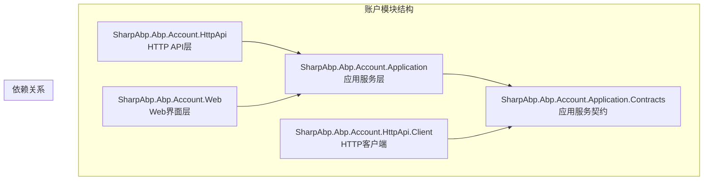
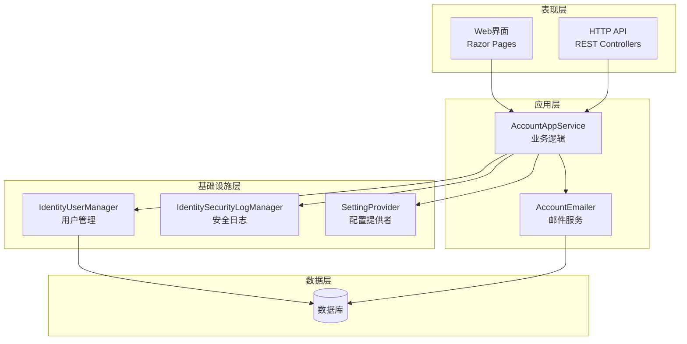
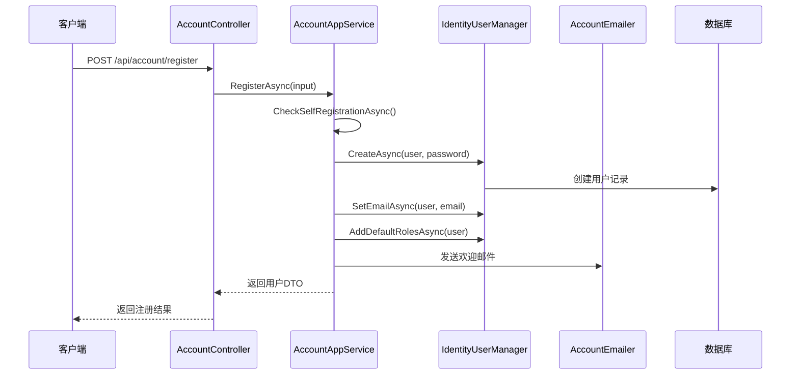
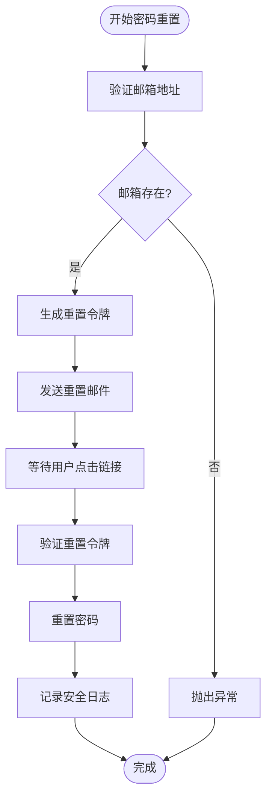
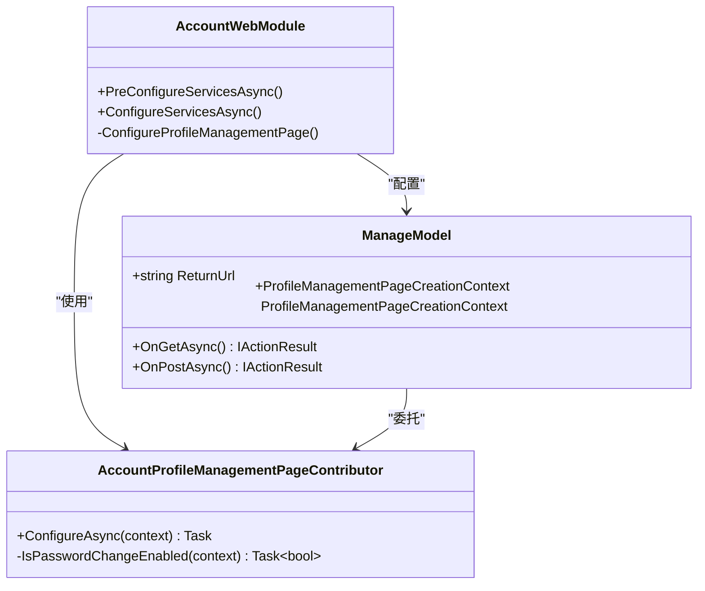
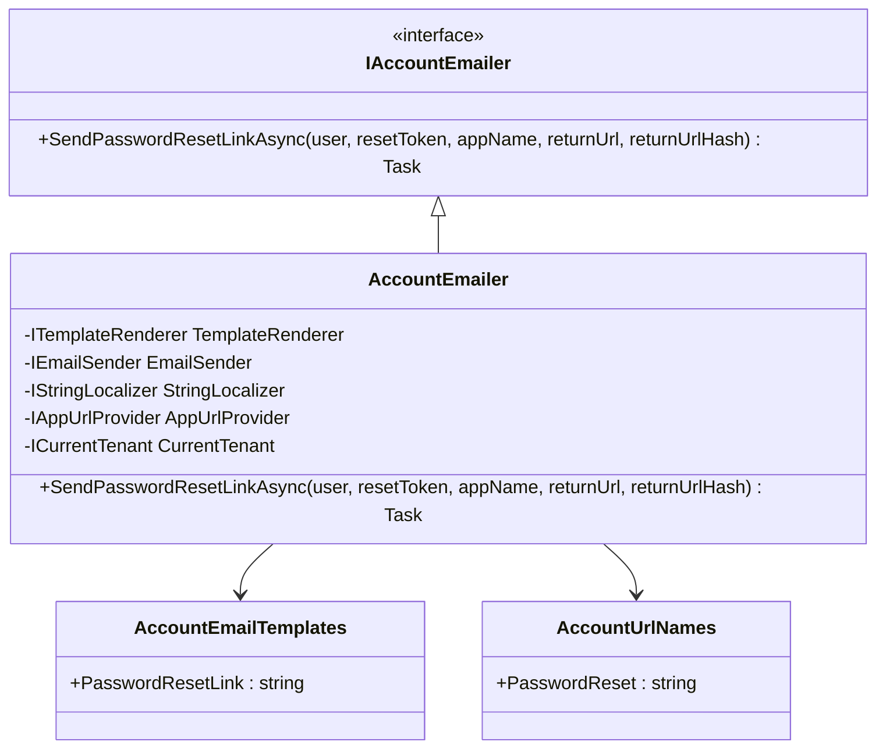
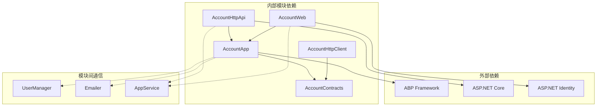

# 账户模块

<cite>
**本文档引用的文件**
- [AccountAppService.cs](file://modules/account/src/SharpAbp.Abp.Account.Application/SharpAbp/Abp/Account/AccountAppService.cs)
- [AccountController.cs](file://modules/account/src/SharpAbp.Abp.Account.HttpApi/SharpAbp/Abp/Account/AccountController.cs)
- [AccountWebModule.cs](file://modules/account/src/SharpAbp.Abp.Account.Web/AccountWebModule.cs)
- [AccountSettingNames.cs](file://modules/account/src/SharpAbp.Abp.Account.Application.Contracts/SharpAbp/Abp/Account/Settings/AccountSettingNames.cs)
- [AccountSettingDefinitionProvider.cs](file://modules/account/src/SharpAbp.Abp.Account.Application/SharpAbp/Abp/Account/Settings/AccountSettingDefinitionProvider.cs)
- [IAccountEmailer.cs](file://modules/account/src/SharpAbp.Abp.Account.Application/SharpAbp/Abp/Account/Emailing/IAccountEmailer.cs)
- [AccountEmailer.cs](file://modules/account/src/SharpAbp.Abp.Account.Application/SharpAbp/Abp/Account/Emailing/AccountEmailer.cs)
- [AccountUrlNames.cs](file://modules/account/src/SharpAbp.Abp.Account.Application/SharpAbp/Abp/Account/AccountUrlNames.cs)
- [ManageModel.cs](file://modules/account/src/SharpAbp.Abp.Account.Web/Pages/Account/Manage.cshtml.cs)
- [AccountProfileManagementPageContributor.cs](file://modules/account/src/SharpAbp.Abp.Account.Web/ProfileManagement/AccountProfileManagementPageContributor.cs)
</cite>

## 目录
1. [简介](#简介)
2. [项目结构](#项目结构)
3. [核心组件](#核心组件)
4. [架构概览](#架构概览)
5. [详细组件分析](#详细组件分析)
6. [依赖关系分析](#依赖关系分析)
7. [性能考虑](#性能考虑)
8. [故障排除指南](#故障排除指南)
9. [结论](#结论)

## 简介

sharp-abp账户模块是一个完整的用户账户管理系统，提供了用户注册、登录、个人资料管理和密码重置等核心功能。该模块基于ABP框架构建，采用分层架构设计，包含应用服务层、HTTP API层和Web界面层，为开发者提供了灵活且可扩展的身份验证解决方案。

账户模块的主要特点包括：
- 支持自注册和本地登录
- 完整的密码重置流程
- 多租户支持
- 可配置的安全设置
- 响应式Web界面
- 集成邮件通知系统

## 项目结构

账户模块采用标准的ABP模块结构，分为多个子模块以实现关注点分离：



**图表来源**
- [AccountAppService.cs](file://modules/account/src/SharpAbp.Abp.Account.Application/SharpAbp/Abp/Account/AccountAppService.cs#L15-L96)
- [AccountController.cs](file://modules/account/src/SharpAbp.Abp.Account.HttpApi/SharpAbp/Abp/Account/AccountController.cs#L9-L41)

**章节来源**
- [AccountAppService.cs](file://modules/account/src/SharpAbp.Abp.Account.Application/SharpAbp/Abp/Account/AccountAppService.cs#L1-L99)
- [AccountWebModule.cs](file://modules/account/src/SharpAbp.Abp.Account.Web/AccountWebModule.cs#L1-L109)

## 核心组件

账户模块的核心组件包括应用服务、控制器、设置管理和邮件服务等关键部分。

### 应用服务层（AccountAppService）

应用服务是业务逻辑的核心，负责处理用户注册、密码重置等主要功能：

```csharp
public class AccountAppService : ApplicationService, IAccountAppService
{
    protected IdentityUserManager UserManager { get; }
    protected IAccountEmailer AccountEmailer { get; }
    protected IdentitySecurityLogManager IdentitySecurityLogManager { get; }
    
    public virtual async Task<IdentityUserDto> RegisterAsync(RegisterDto input)
    {
        await CheckSelfRegistrationAsync();
        await IdentityOptions.SetAsync();
        
        var user = new IdentityUser(GuidGenerator.Create(), input.UserName, input.EmailAddress, CurrentTenant.Id);
        input.MapExtraPropertiesTo(user);
        
        (await UserManager.CreateAsync(user, input.Password)).CheckErrors();
        await UserManager.SetEmailAsync(user, input.EmailAddress);
        await UserManager.AddDefaultRolesAsync(user);
        
        return ObjectMapper.Map<IdentityUser, IdentityUserDto>(user);
    }
}
```

### HTTP API控制器

HTTP API控制器提供了RESTful接口，将应用服务的功能暴露给外部调用者：

```csharp
[RemoteService(Name = AccountRemoteServiceConsts.RemoteServiceName)]
[Area("account")]
[Route("api/account")]
public class AccountController : AbpController, IAccountAppService
{
    [HttpPost]
    [Route("register")]
    public virtual Task<IdentityUserDto> RegisterAsync(RegisterDto input)
    {
        return AccountAppService.RegisterAsync(input);
    }
}
```

**章节来源**
- [AccountAppService.cs](file://modules/account/src/SharpAbp.Abp.Account.Application/SharpAbp/Abp/Account/AccountAppService.cs#L15-L96)
- [AccountController.cs](file://modules/account/src\SharpAbp.Abp.Account.HttpApi\SharpAbp\Abp\Account\AccountController.cs#L9-L41)

## 架构概览

账户模块采用分层架构设计，确保了关注点分离和高内聚低耦合：



**图表来源**
- [AccountAppService.cs](file://modules/account/src/SharpAbp.Abp.Account.Application/SharpAbp/Abp/Account/AccountAppService.cs#L15-L37)
- [AccountWebModule.cs](file://modules/account/src/SharpAbp.Abp.Account.Web/AccountWebModule.cs#L20-L106)

## 详细组件分析

### 用户注册功能

用户注册功能通过`RegisterAsync`方法实现，支持自注册检查和默认角色分配：



**图表来源**
- [AccountAppService.cs](file://modules/account/src/SharpAbp.Abp.Account.Application/SharpAbp/Abp/Account/AccountAppService.cs#L39-L55)
- [AccountController.cs](file://modules/account/src/SharpAbp.Abp.Account.HttpApi/SharpAbp/Abp/Account/AccountController.cs#L21-L25)

### 密码重置功能

密码重置功能包含两个主要步骤：发送重置代码和执行密码重置：



**图表来源**
- [AccountAppService.cs](file://modules/account/src/SharpAbp.Abp.Account.Application/SharpAbp/Abp/Account/AccountAppService.cs#L57-L75)

### Web界面层

Web界面层提供了完整的用户交互体验，包括登录、注册和个人资料管理：



**图表来源**
- [AccountWebModule.cs](file://modules/account/src/SharpAbp.Abp.Account.Web/AccountWebModule.cs#L20-L106)
- [ManageModel.cs](file://modules/account/src/SharpAbp.Abp.Account.Web/Pages/Account/Manage.cshtml.cs#L9-L40)
- [AccountProfileManagementPageContributor.cs](file://modules/account/src/SharpAbp.Abp.Account.Web/ProfileManagement/AccountProfileManagementPageContributor.cs#L13-L31)

**章节来源**
- [AccountAppService.cs](file://modules/account/src/SharpAbp.Abp.Account.Application/SharpAbp/Abp/Account/AccountAppService.cs#L39-L75)
- [AccountWebModule.cs](file://modules/account/src/SharpAbp.Abp.Account.Web/AccountWebModule.cs#L20-L106)
- [ManageModel.cs](file://modules/account/src/SharpAbp.Abp.Account.Web/Pages/Account/Manage.cshtml.cs#L9-L40)

### 设置管理

账户模块提供了灵活的配置选项，支持自注册和本地登录的启用/禁用：

```csharp
public class AccountSettingNames
{
    public const string IsSelfRegistrationEnabled = "SharpAbp.Account.IsSelfRegistrationEnabled";
    public const string EnableLocalLogin = "SharpAbp.Account.EnableLocalLogin";
}
```

设置定义提供了默认值和本地化支持：

```csharp
public override void Define(ISettingDefinitionContext context)
{
    context.Add(
        new SettingDefinition(
            AccountSettingNames.IsSelfRegistrationEnabled, 
            "true", 
            L("DisplayName:Abp.Account.IsSelfRegistrationEnabled"), 
            L("Description:Abp.Account.IsSelfRegistrationEnabled"), 
            isVisibleToClients: true
        )
    );
}
```

**章节来源**
- [AccountSettingNames.cs](file://modules/account/src/SharpAbp.Abp.Account.Application.Contracts/SharpAbp/Abp/Account/Settings/AccountSettingNames.cs#L1-L8)
- [AccountSettingDefinitionProvider.cs](file://modules/account/src/SharpAbp.Abp.Account.Application/SharpAbp/Account/Settings/AccountSettingDefinitionProvider.cs#L7-L32)

### 邮件服务

邮件服务负责发送密码重置链接和其他重要通知：



**图表来源**
- [IAccountEmailer.cs](file://modules/account/src/SharpAbp.Abp.Account.Application/SharpAbp/Abp/Account/Emailing/IAccountEmailer.cs#L6-L15)
- [AccountEmailer.cs](file://modules/account/src/SharpAbp.Abp.Account.Application/SharpAbp/Abp/Account/Emailing/AccountEmailer.cs#L15-L38)
- [AccountEmailTemplates.cs](file://modules/account/src/SharpAbp.Abp.Account.Application/SharpAbp/Abp/Account/Emailing/Templates/AccountEmailTemplates.cs#L3-L6)
- [AccountUrlNames.cs](file://modules/account/src/SharpAbp.Abp.Account.Application/SharpAbp/Abp/Account/AccountUrlNames.cs#L3-L6)

**章节来源**
- [IAccountEmailer.cs](file://modules/account/src/SharpAbp.Abp.Account.Application/SharpAbp/Abp/Account/Emailing/IAccountEmailer.cs#L6-L15)
- [AccountEmailer.cs](file://modules/account/src/SharpAbp.Abp.Account.Application/SharpAbp/Abp/Account/Emailing/AccountEmailer.cs#L15-L71)

## 依赖关系分析

账户模块的依赖关系体现了清晰的分层架构：



**图表来源**
- [AccountWebModule.cs](file://modules/account/src/SharpAbp.Abp.Account.Web/AccountWebModule.cs#L20-L30)

**章节来源**
- [AccountWebModule.cs](file://modules/account/src/SharpAbp.Abp.Account.Web/AccountWebModule.cs#L20-L106)

## 性能考虑

账户模块在设计时充分考虑了性能优化：

1. **异步操作**：所有I/O密集型操作都采用异步模式
2. **缓存策略**：合理利用ABP框架的缓存机制
3. **连接池**：数据库连接采用连接池管理
4. **批量操作**：支持批量用户操作以提高效率

## 故障排除指南

### 常见问题及解决方案

1. **自注册被禁用**
   - 检查设置：`IsSelfRegistrationEnabled`是否为true
   - 验证权限配置

2. **邮件发送失败**
   - 检查邮件服务器配置
   - 验证模板文件是否存在
   - 确认SMTP设置正确

3. **密码重置链接无效**
   - 验证URL提供程序配置
   - 检查重置令牌生成逻辑
   - 确认返回URL格式正确

**章节来源**
- [AccountAppService.cs](file://modules/account/src/SharpAbp.Abp.Account.Application/SharpAbp/Abp/Account/AccountAppService.cs#L77-L85)

## 结论

sharp-abp账户模块是一个功能完整、架构清晰的用户账户管理系统。它提供了以下核心优势：

1. **模块化设计**：清晰的分层架构便于维护和扩展
2. **多层暴露**：同时支持HTTP API和Web界面访问
3. **灵活配置**：丰富的设置选项适应不同业务需求
4. **安全可靠**：完善的错误处理和安全日志记录
5. **易于集成**：标准化的接口设计便于与其他模块协作

该模块为开发者提供了开箱即用的身份验证解决方案，同时保持了高度的可定制性和扩展性。通过合理的配置和适当的集成，可以快速构建满足业务需求的用户管理系统。