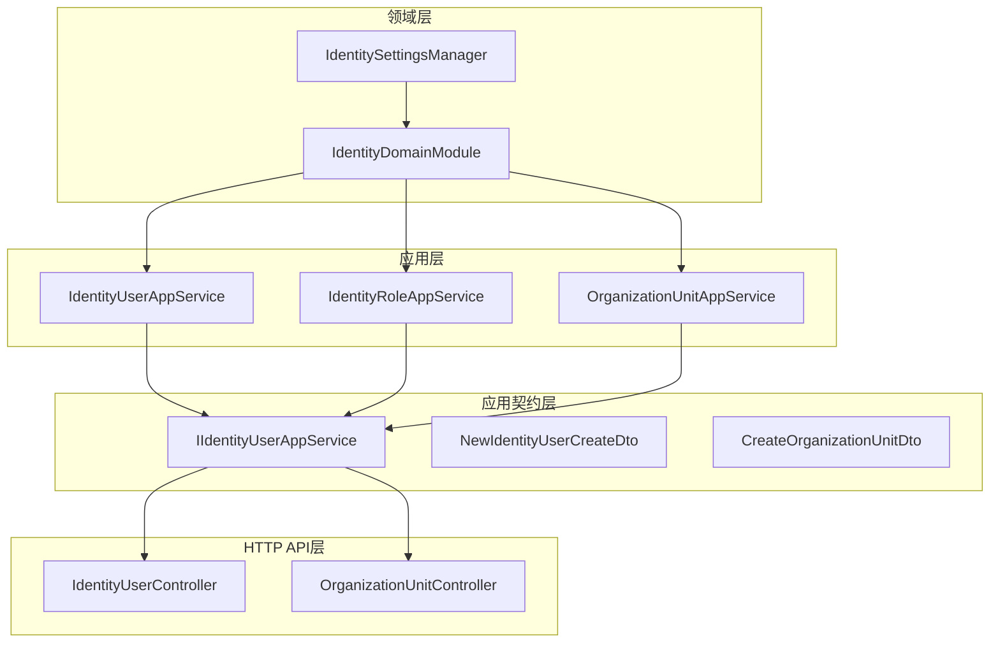
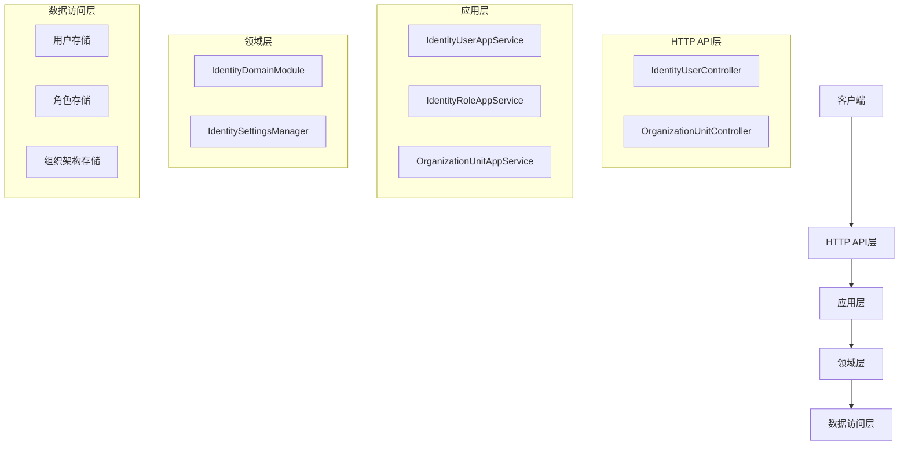
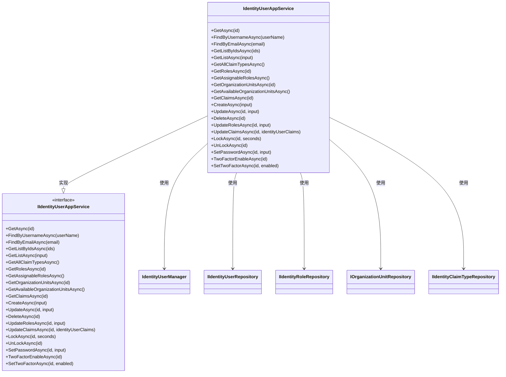

# 身份模块

<cite>
**本文档中引用的文件**
- [IdentityDomainModule.cs](file://modules/Identity/src/SharpAbp.Abp.Identity.Domain/SharpAbp/Abp/Identity/IdentityDomainModule.cs)
- [IdentityUserAppService.cs](file://modules/Identity/src/SharpAbp.Abp.Identity.Application/SharpAbp/Abp/Identity/IdentityUserAppService.cs)
- [IdentityRoleAppService.cs](file://modules/Identity/src/SharpAbp.Abp.Identity.Application/SharpAbp/Abp/Identity/IdentityRoleAppService.cs)
- [OrganizationUnitAppService.cs](file://modules/Identity/src/SharpAbp.Abp.Identity.Application/SharpAbp/Abp/Identity/OrganizationUnitAppService.cs)
- [IdentityController.cs](file://modules/Identity/src/SharpAbp.Abp.Identity.HttpApi/SharpAbp/Abp/Identity/IdentityController.cs)
- [IdentityUserController.cs](file://modules/Identity/src/SharpAbp.Abp.Identity.HttpApi/SharpAbp/Abp/Identity/IdentityUserController.cs)
- [OrganizationUnitController.cs](file://modules/Identity/src/SharpAbp.Abp.Identity.HttpApi/SharpAbp/Abp/Identity/OrganizationUnitController.cs)
- [IIdentityUserAppService.cs](file://modules/Identity/src/SharpAbp.Abp.Identity.Application.Contracts/SharpAbp/Abp/Identity/IIdentityUserAppService.cs)
- [NewIdentityUserCreateDto.cs](file://modules/Identity/src/SharpAbp.Abp.Identity.Application.Contracts/SharpAbp/Abp/Identity/NewIdentityUserCreateDto.cs)
- [CreateOrganizationUnitDto.cs](file://modules/Identity/src/SharpAbp.Abp.Identity.Application.Contracts/SharpAbp/Abp/Identity/CreateOrganizationUnitDto.cs)
- [IdentitySettingsManager.cs](file://modules/Identity/src/SharpAbp.Abp.Identity.Domain/SharpAbp/Abp/Identity/IdentitySettingsManager.cs)
</cite>

## 目录
1. [简介](#简介)
2. [项目结构](#项目结构)
3. [核心组件](#核心组件)
4. [架构概述](#架构概述)
5. [详细组件分析](#详细组件分析)
6. [依赖关系分析](#依赖关系分析)
7. [性能考虑](#性能考虑)
8. [故障排除指南](#故障排除指南)
9. [结论](#结论)

## 简介
sharp-abp身份模块提供了一套完整的用户、角色、组织架构和安全日志管理功能。该模块基于ABP框架构建，实现了对用户身份验证、授权、组织架构管理和安全策略配置的全面支持。本文档将详细介绍`IdentityUserAppService`、`IdentityRoleAppService`和`OrganizationUnitAppService`等应用服务的实现，解释`IdentityDomainModule`中定义的核心领域实体和业务规则，并说明`IdentityController`和`OrganizationUnitController`提供的REST API接口。

## 项目结构
身份模块采用分层架构设计，包含应用层、领域层、共享层和HTTP API层。各层职责分明，遵循领域驱动设计原则。



**图示来源**
- [IdentityUserAppService.cs](file://modules/Identity/src/SharpAbp.Abp.Identity.Application/SharpAbp/Abp/Identity/IdentityUserAppService.cs)
- [IdentityRoleAppService.cs](file://modules/Identity/src/SharpAbp.Abp.Identity.Application/SharpAbp/Abp/Identity/IdentityRoleAppService.cs)
- [OrganizationUnitAppService.cs](file://modules/Identity/src/SharpAbp.Abp.Identity.Application/SharpAbp/Abp/Identity/OrganizationUnitAppService.cs)
- [IdentityDomainModule.cs](file://modules/Identity/src/SharpAbp.Abp.Identity.Domain/SharpAbp/Abp/Identity/IdentityDomainModule.cs)
- [IdentitySettingsManager.cs](file://modules/Identity/src/SharpAbp.Abp.Identity.Domain/SharpAbp/Abp/Identity/IdentitySettingsManager.cs)
- [IIdentityUserAppService.cs](file://modules/Identity/src/SharpAbp.Abp.Identity.Application.Contracts/SharpAbp/Abp/Identity/IIdentityUserAppService.cs)
- [NewIdentityUserCreateDto.cs](file://modules/Identity/src/SharpAbp.Abp.Identity.Application.Contracts/SharpAbp/Abp/Identity/NewIdentityUserCreateDto.cs)
- [CreateOrganizationUnitDto.cs](file://modules/Identity/src/SharpAbp.Abp.Identity.Application.Contracts/SharpAbp/Abp/Identity/CreateOrganizationUnitDto.cs)
- [IdentityUserController.cs](file://modules/Identity/src/SharpAbp.Abp.Identity.HttpApi/SharpAbp/Abp/Identity/IdentityUserController.cs)
- [OrganizationUnitController.cs](file://modules/Identity/src/SharpAbp.Abp.Identity.HttpApi/SharpAbp/Abp/Identity/OrganizationUnitController.cs)

## 核心组件
身份模块的核心组件包括用户管理、角色管理、组织架构管理和安全设置管理。这些组件通过清晰的接口定义和实现分离，提供了灵活的扩展性和可维护性。

**节来源**
- [IdentityUserAppService.cs](file://modules/Identity/src/SharpAbp.Abp.Identity.Application/SharpAbp/Abp/Identity/IdentityUserAppService.cs)
- [IdentityRoleAppService.cs](file://modules/Identity/src/SharpAbp.Abp.Identity.Application/SharpAbp/Abp/Identity/IdentityRoleAppService.cs)
- [OrganizationUnitAppService.cs](file://modules/Identity/src/SharpAbp.Abp.Identity.Application/SharpAbp/Abp/Identity/OrganizationUnitAppService.cs)

## 架构概述
身份模块采用典型的分层架构，包括表现层、应用层、领域层和基础设施层。各层之间通过明确定义的接口进行通信，确保了系统的松耦合和高内聚。



**图示来源**
- [IdentityUserController.cs](file://modules/Identity/src/SharpAbp.Abp.Identity.HttpApi/SharpAbp/Abp/Identity/IdentityUserController.cs)
- [OrganizationUnitController.cs](file://modules/Identity/src/SharpAbp.Abp.Identity.HttpApi/SharpAbp/Abp/Identity/OrganizationUnitController.cs)
- [IdentityUserAppService.cs](file://modules/Identity/src/SharpAbp.Abp.Identity.Application/SharpAbp/Abp/Identity/IdentityUserAppService.cs)
- [IdentityRoleAppService.cs](file://modules/Identity/src/SharpAbp.Abp.Identity.Application/SharpAbp/Abp/Identity/IdentityRoleAppService.cs)
- [OrganizationUnitAppService.cs](file://modules/Identity/src/SharpAbp.Abp.Identity.Application/SharpAbp/Abp/Identity/OrganizationUnitAppService.cs)
- [IdentityDomainModule.cs](file://modules/Identity/src/SharpAbp.Abp.Identity.Domain/SharpAbp/Abp/Identity/IdentityDomainModule.cs)
- [IdentitySettingsManager.cs](file://modules/Identity/src/SharpAbp.Abp.Identity.Domain/SharpAbp/Abp/Identity/IdentitySettingsManager.cs)

## 详细组件分析
### 用户应用服务分析
`IdentityUserAppService`是用户管理的核心服务，提供了用户创建、更新、删除、查询以及角色和声明管理等功能。

#### 类图


**图示来源**
- [IdentityUserAppService.cs](file://modules/Identity/src/SharpAbp.Abp.Identity.Application/SharpAbp/Abp/Identity/IdentityUserAppService.cs)
- [IIdentityUserAppService.cs](file://modules/Identity/src/SharpAbp.Abp.Identity.Application.Contracts/SharpAbp/Abp/Identity/IIdentityUserAppService.cs)

**节来源**
- [IdentityUserAppService.cs](file://modules/Identity/src/SharpAbp.Abp.Identity.Application/SharpAbp/Abp/Identity/IdentityUserAppService.cs)
- [IIdentityUserAppService.cs](file://modules/Identity/src/SharpAbp.Abp.Identity.Application.Contracts/SharpAbp/Abp/Identity/IIdentityUserAppService.cs)

### 角色应用服务分析
`IdentityRoleAppService`负责角色的全生命周期管理，包括角色的创建、更新、删除、查询以及角色声明管理。

#### 序列图
```mermaid
sequenceDiagram
    participant Client as "客户端"
    participant Controller as "IdentityRoleController"
    participant Service as "IdentityRoleAppService"
    participant Manager as "IdentityRoleManager"
    participant Repository as "IIdentityRoleRepository"
    
    Client->>Controller: GET /api/identity/roles
    Controller->>Service: GetListAsync(input)
   