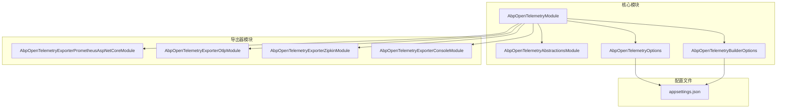
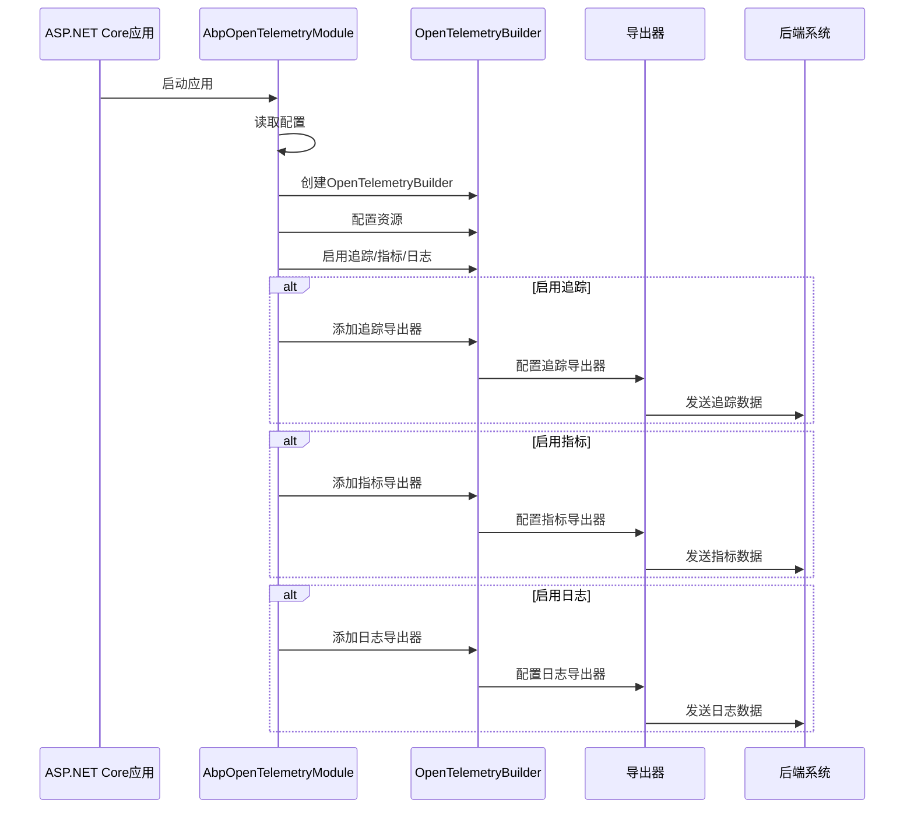
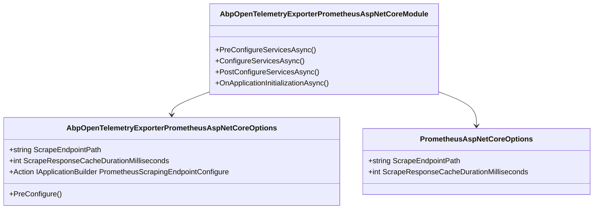
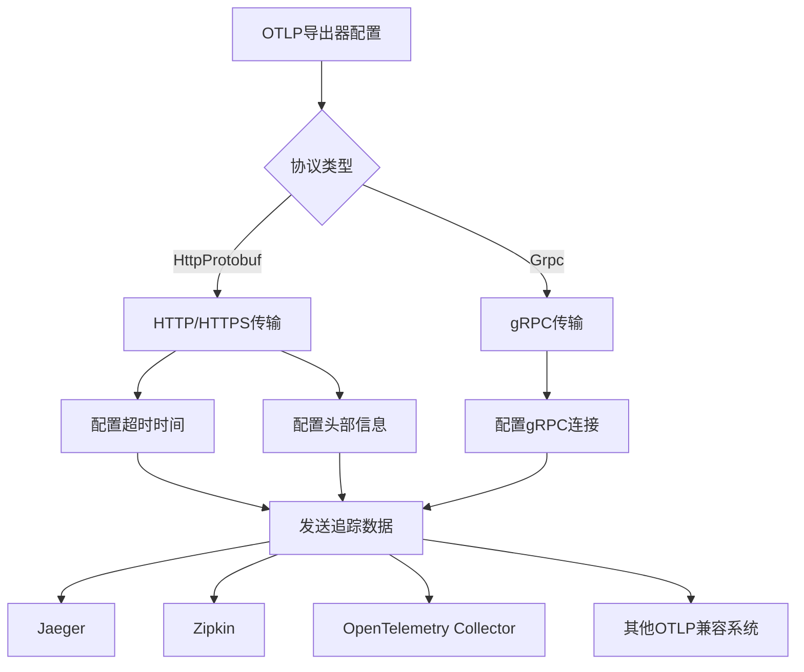
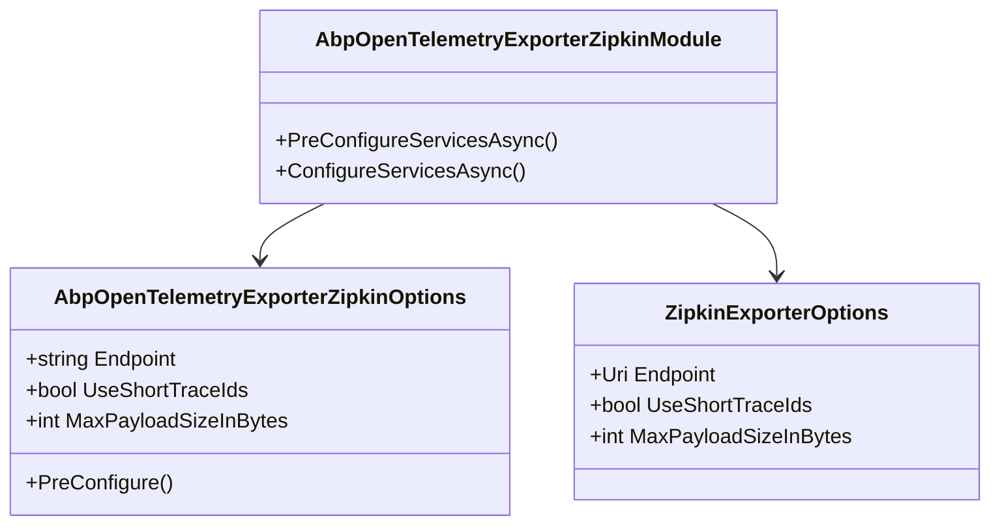
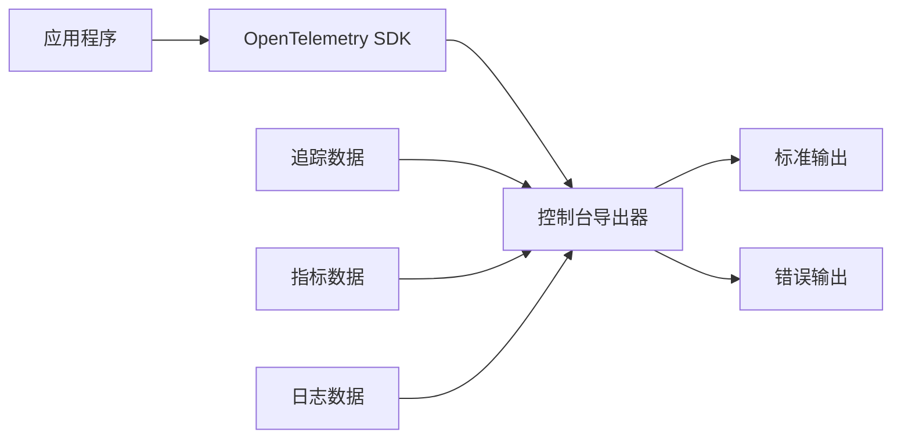
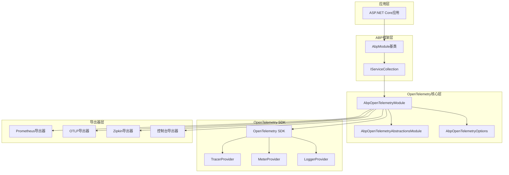

# OpenTelemetry监控与指标

<cite>
**本文档引用的文件**
- [AbpOpenTelemetryModule.cs](file://framework/src/SharpAbp.Abp.OpenTelemetry/SharpAbp/Abp/OpenTelemetry/AbpOpenTelemetryModule.cs)
- [AbpOpenTelemetryOptions.cs](file://framework/src/SharpAbp.Abp.OpenTelemetry/SharpAbp/Abp/OpenTelemetry/AbpOpenTelemetryOptions.cs)
- [AbpOpenTelemetryAbstractionsModule.cs](file://framework/src/SharpAbp.Abp.OpenTelemetry.Abstractions/SharpAbp/Abp/OpenTelemetry/AbpOpenTelemetryAbstractionsModule.cs)
- [AbpOpenTelemetryBuilderOptions.cs](file://framework/src\SharpAbp.Abp.OpenTelemetry\SharpAbp\Abp\OpenTelemetry\AbpOpenTelemetryBuilderOptions.cs)
- [appsettings.json](file://framework/src\SharpAbp.Abp.OpenTelemetry\SharpAbp\Abp\OpenTelemetry\appsettings.json)
- [AbpOpenTelemetryExporterPrometheusAspNetCoreModule.cs](file://framework/src\SharpAbp.Abp.OpenTelemetry.Exporter.Prometheus.AspNetCore\SharpAbp\Abp\OpenTelemetry\Exporter\Prometheus\AbpOpenTelemetryExporterPrometheusAspNetCoreModule.cs)
- [AbpOpenTelemetryExporterPrometheusAspNetCoreOptions.cs](file://framework/src\SharpAbp.Abp.OpenTelemetry.Exporter.Prometheus.AspNetCore\SharpAbp\Abp\OpenTelemetry\Exporter\Prometheus\AbpOpenTelemetryExporterPrometheusAspNetCoreOptions.cs)
- [AbpOpenTelemetryExporterOtlpModule.cs](file://framework/src\SharpAbp.Abp.OpenTelemetry.Exporter.Otlp\SharpAbp\Abp\OpenTelemetry\Exporter\Otlp\AbpOpenTelemetryExporterOtlpModule.cs)
- [AbpOpenTelemetryExporterOtlpOptions.cs](file://framework/src\SharpAbp.Abp.OpenTelemetry.Exporter.Otlp\SharpAbp\Abp\OpenTelemetry\Exporter\Otlp\AbpOpenTelemetryExporterOtlpOptions.cs)
- [AbpOpenTelemetryExporterZipkinModule.cs](file://framework/src\SharpAbp.Abp.OpenTelemetry.Exporter.Zipkin\SharpAbp\Abp\OpenTelemetry\Exporter\Zipkin\AbpOpenTelemetryExporterZipkinModule.cs)
- [AbpOpenTelemetryExporterZipkinOptions.cs](file://framework/src\SharpAbp.Abp.OpenTelemetry.Exporter.Zipkin\SharpAbp\Abp\OpenTelemetry\Exporter\Zipkin\AbpOpenTelemetryExporterZipkinOptions.cs)
- [AbpOpenTelemetryExporterConsoleModule.cs](file://framework/src\SharpAbp.Abp.OpenTelemetry.Exporter.Console\SharpAbp\Abp\OpenTelemetry\Exporter\Console\AbpOpenTelemetryExporterConsoleModule.cs)
- [AbpOpenTelemetryExporterConsoleOptions.cs](file://framework/src\SharpAbp.Abp.OpenTelemetry.Exporter.Console\SharpAbp\Abp\OpenTelemetry\Exporter\Console\AbpOpenTelemetryExporterConsoleOptions.cs)
- [OpenTelemetryExporterNames.cs](file://framework/src\SharpAbp.Abp.OpenTelemetry.Abstractions\SharpAbp\Abp\OpenTelemetry\OpenTelemetryExporterNames.cs)
</cite>

## 目录
1. [简介](#简介)
2. [项目结构](#项目结构)
3. [核心组件](#核心组件)
4. [架构概览](#架构概览)
5. [详细组件分析](#详细组件分析)
6. [依赖关系分析](#依赖关系分析)
7. [性能考虑](#性能考虑)
8. [故障排除指南](#故障排除指南)
9. [结论](#结论)

## 简介

SharpAbp.Abp.OpenTelemetry模块是一个强大的监控与指标收集框架，基于OpenTelemetry标准构建。该模块提供了全面的分布式追踪（Traces）、指标（Metrics）和日志（Logs）功能，支持多种导出器，包括Prometheus、OTLP、Zipkin等主流监控系统。

该模块的核心设计理念是提供一个统一的配置接口，通过AbpOpenTelemetryOptions进行全局配置，并支持灵活的模块化扩展。开发者可以通过简单的配置即可启用OpenTelemetry功能，而无需深入了解底层实现细节。

## 项目结构

OpenTelemetry模块采用分层架构设计，包含核心模块和多个导出器模块：

**图表来源**
- [AbpOpenTelemetryModule.cs](file://framework/src/SharpAbp.Abp.OpenTelemetry/SharpAbp/Abp/OpenTelemetry/AbpOpenTelemetryModule.cs#L1-L252)
- [AbpOpenTelemetryAbstractionsModule.cs](file://framework/src/SharpAbp.Abp.OpenTelemetry.Abstractions/SharpAbp/Abp/OpenTelemetry/AbpOpenTelemetryAbstractionsModule.cs#L1-L47)

**章节来源**
- [AbpOpenTelemetryModule.cs](file://framework/src/SharpAbp.Abp.OpenTelemetry/SharpAbp/Abp/OpenTelemetry/AbpOpenTelemetryModule.cs#L1-L252)
- [appsettings.json](file://framework/src\SharpAbp.Abp.OpenTelemetry\SharpAbp\Abp\OpenTelemetry\appsettings.json#L1-L50)

## 核心组件

### AbpOpenTelemetryModule - 核心模块

AbpOpenTelemetryModule是整个OpenTelemetry系统的入口点，负责协调各个组件的工作。它继承自AbpModule，遵循ABP框架的标准生命周期。

主要功能包括：
- 配置服务注册
- 资源配置管理
- 追踪和指标的统一管理
- 导出器的选择和配置

### AbpOpenTelemetryOptions - 全局配置

AbpOpenTelemetryOptions提供了丰富的配置选项，支持以下功能：

- **追踪配置**：SourceNames、OperationName、SamplerConfigure等
- **指标配置**：MeterNames、MetricsInstrumentationConfigures等
- **日志配置**：WithLogging、LoggingExporter等
- **导出器配置**：支持多种导出器的注册和选择

### AbpOpenTelemetryBuilderOptions - 基础配置

AbpOpenTelemetryBuilderOptions定义了OpenTelemetry的基础配置参数，包括服务名称、版本、实例ID等关键信息。

**章节来源**
- [AbpOpenTelemetryModule.cs](file://framework/src\SharpAbp.Abp.OpenTelemetry\SharpAbp\Abp\OpenTelemetry\AbpOpenTelemetryModule.cs#L15-L252)
- [AbpOpenTelemetryOptions.cs](file://framework/src\SharpAbp.Abp.OpenTelemetry\SharpAbp\Abp\OpenTelemetry\AbpOpenTelemetryOptions.cs#L1-L159)
- [AbpOpenTelemetryBuilderOptions.cs](file://framework/src\SharpAbp.Abp.OpenTelemetry\SharpAbp\Abp\OpenTelemetry\AbpOpenTelemetryBuilderOptions.cs#L1-L32)

## 架构概览

OpenTelemetry模块采用插件式架构，支持多种导出器的动态加载和配置：

**图表来源**
- [AbpOpenTelemetryModule.cs](file://framework/src\SharpAbp.Abp.OpenTelemetry\SharpAbp\Abp\OpenTelemetry\AbpOpenTelemetryModule.cs#L131-L250)

## 详细组件分析

### Prometheus导出器分析

Prometheus导出器模块提供了两种不同的实现方式：ASP.NET Core中间件和HTTP监听器。

#### PrometheusAspNetCore实现

**图表来源**
- [AbpOpenTelemetryExporterPrometheusAspNetCoreModule.cs](file://framework/src\SharpAbp.Abp.OpenTelemetry.Exporter.Prometheus.AspNetCore\SharpAbp\Abp\OpenTelemetry\Exporter\Prometheus\AbpOpenTelemetryExporterPrometheusAspNetCoreModule.cs#L1-L104)
- [AbpOpenTelemetryExporterPrometheusAspNetCoreOptions.cs](file://framework/src\SharpAbp.Abp.OpenTelemetry.Exporter.Prometheus.AspNetCore\SharpAbp\Abp\OpenTelemetry\Exporter\Prometheus\AbpOpenTelemetryExporterPrometheusAspNetCoreOptions.cs#L1-L31)

#### PrometheusHttpListener实现

HTTP监听器实现提供了独立的HTTP服务器来处理Prometheus抓取请求，适用于非ASP.NET Core环境。

### OTLP导出器分析

OTLP（OpenTelemetry Protocol）导出器是最通用的导出器，支持多种协议和后端系统：

**图表来源**
- [AbpOpenTelemetryExporterOtlpModule.cs](file://framework/src\SharpAbp.Abp.OpenTelemetry.Exporter.Otlp\SharpAbp\Abp\OpenTelemetry\Exporter\Otlp\AbpOpenTelemetryExporterOtlpModule.cs#L37-L72)
- [AbpOpenTelemetryExporterOtlpOptions.cs](file://framework/src\SharpAbp.Abp.OpenTelemetry.Exporter.Otlp\SharpAbp\Abp\OpenTelemetry\Exporter\Otlp\AbpOpenTelemetryExporterOtlpOptions.cs#L1-L31)

### Zipkin导出器分析

Zipkin导出器专门用于与Zipkin分布式追踪系统集成：

**图表来源**
- [AbpOpenTelemetryExporterZipkinModule.cs](file://framework/src\SharpAbp.Abp.OpenTelemetry.Exporter.Zipkin\SharpAbp\Abp\OpenTelemetry\Exporter\Zipkin\AbpOpenTelemetryExporterZipkinModule.cs#L1-L60)
- [AbpOpenTelemetryExporterZipkinOptions.cs](file://framework/src\SharpAbp.Abp.OpenTelemetry.Exporter.Zipkin\SharpAbp\Abp\OpenTelemetry\Exporter\Zipkin\AbpOpenTelemetryExporterZipkinOptions.cs#L1-L28)

### 控制台导出器分析

控制台导出器主要用于开发和调试阶段，将追踪、指标和日志输出到控制台：

**图表来源**
- [AbpOpenTelemetryExporterConsoleModule.cs](file://framework/src\SharpAbp.Abp.OpenTelemetry.Exporter.Console\SharpAbp\Abp\OpenTelemetry\Exporter\Console\AbpOpenTelemetryExporterConsoleModule.cs#L1-L73)
- [AbpOpenTelemetryExporterConsoleOptions.cs](file://framework/src\SharpAbp.Abp.OpenTelemetry.Exporter.Console\SharpAbp\Abp\OpenTelemetry\Exporter\Console\AbpOpenTelemetryExporterConsoleOptions.cs#L1-L26)

**章节来源**
- [AbpOpenTelemetryExporterPrometheusAspNetCoreModule.cs](file://framework/src\SharpAbp.Abp.OpenTelemetry.Exporter.Prometheus.AspNetCore\SharpAbp\Abp\OpenTelemetry\Exporter\Prometheus\AbpOpenTelemetryExporterPrometheusAspNetCoreModule.cs#L1-L104)
- [AbpOpenTelemetryExporterOtlpModule.cs](file://framework/src\SharpAbp.Abp.OpenTelemetry.Exporter.Otlp\SharpAbp\Abp\OpenTelemetry\Exporter\Otlp\AbpOpenTelemetryExporterOtlpModule.cs#L1-L72)
- [AbpOpenTelemetryExporterZipkinModule.cs](file://framework/src\SharpAbp.Abp.OpenTelemetry.Exporter.Zipkin\SharpAbp\Abp\OpenTelemetry\Exporter\Zipkin\AbpOpenTelemetryExporterZipkinModule.cs#L1-L60)
- [AbpOpenTelemetryExporterConsoleModule.cs](file://framework/src\SharpAbp.Abp.OpenTelemetry.Exporter.Console\SharpAbp\Abp\OpenTelemetry\Exporter\Console\AbpOpenTelemetryExporterConsoleModule.cs#L1-L73)

## 依赖关系分析

OpenTelemetry模块的依赖关系体现了清晰的分层架构：

**图表来源**
- [AbpOpenTelemetryModule.cs](file://framework/src\SharpAbp.Abp.OpenTelemetry\SharpAbp\Abp\OpenTelemetry\AbpOpenTelemetryModule.cs#L15-L25)
- [AbpOpenTelemetryAbstractionsModule.cs](file://framework/src\SharpAbp.Abp.OpenTelemetry.Abstractions\SharpAbp\Abp\OpenTelemetry\AbpOpenTelemetryAbstractionsModule.cs#L1-L47)

**章节来源**
- [AbpOpenTelemetryModule.cs](file://framework/src\SharpAbp.Abp.OpenTelemetry\SharpAbp\Abp\OpenTelemetry\AbpOpenTelemetryModule.cs#L15-L25)
- [AbpOpenTelemetryAbstractionsModule.cs](file://framework/src\SharpAbp.Abp.OpenTelemetry.Abstractions\SharpAbp\Abp\OpenTelemetry\AbpOpenTelemetryAbstractionsModule.cs#L1-L47)

## 性能考虑

### 指标收集性能

OpenTelemetry模块在设计时充分考虑了性能影响，采用了以下优化策略：

1. **采样机制**：默认使用AlwaysOnSampler，可根据需要调整采样率
2. **异步导出**：所有导出操作都是异步执行，避免阻塞主线程
3. **缓冲机制**：支持批量导出，减少网络开销
4. **资源限制**：可配置最大队列大小和超时时间

### 内存管理

- 使用对象池技术减少GC压力
- 支持指标视图配置，可以过滤不必要的指标
- 提供ExemplarFilter配置，控制采样数据的存储

### 网络优化

- 支持gzip压缩
- 可配置连接池和重试机制
- 提供连接超时和读取超时配置

## 故障排除指南

### 常见问题及解决方案

#### 1. 指标无法暴露给Prometheus

**问题症状**：访问`/metrics`端点返回404错误

**解决方案**：
- 确保启用了PrometheusAspNetCore模块
- 检查ScrapeEndpointPath配置是否正确
- 验证中间件管道顺序

#### 2. OTLP导出失败

**问题症状**：追踪和指标数据无法发送到后端

**解决方案**：
- 检查Endpoint配置是否正确
- 验证网络连接和防火墙设置
- 查看超时配置是否合理
- 检查协议类型是否匹配后端要求

#### 3. 日志输出异常

**问题症状**：日志数据未正确输出

**解决方案**：
- 确保WithLogging设置为true
- 检查LoggingExporter配置
- 验证日志级别设置

**章节来源**
- [AbpOpenTelemetryModule.cs](file://framework/src\SharpAbp.Abp.OpenTelemetry\SharpAbp\Abp\OpenTelemetry\AbpOpenTelemetryModule.cs#L131-L250)
- [appsettings.json](file://framework/src\SharpAbp.Abp.OpenTelemetry\SharpAbp\Abp\OpenTelemetry\appsettings.json#L1-L50)

## 结论

SharpAbp.Abp.OpenTelemetry模块提供了一个完整、灵活且高性能的监控解决方案。通过统一的配置接口和模块化的架构设计，开发者可以轻松地集成各种监控系统，包括Prometheus、Jaeger、Zipkin等主流工具。

该模块的主要优势包括：

1. **统一配置**：通过AbpOpenTelemetryOptions提供一致的配置体验
2. **模块化设计**：支持按需加载不同导出器模块
3. **性能优化**：内置多种性能优化策略
4. **易于扩展**：支持自定义导出器和配置
5. **标准化**：完全遵循OpenTelemetry标准

对于生产环境部署，建议：
- 根据实际需求选择合适的导出器
- 配置适当的采样率和缓冲策略
- 设置合理的超时和重试机制
- 监控OpenTelemetry本身的性能影响

通过合理配置和使用，OpenTelemetry模块能够为ABP应用提供强大的可观测性能力，帮助开发者更好地理解和优化应用性能。