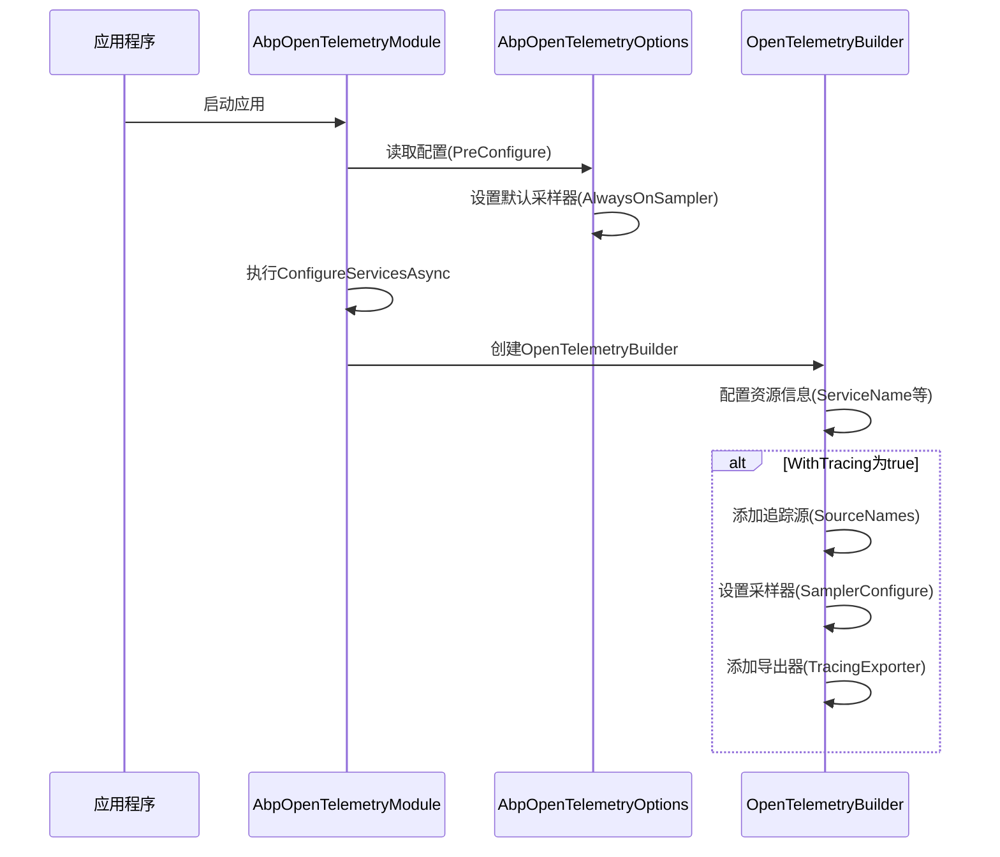
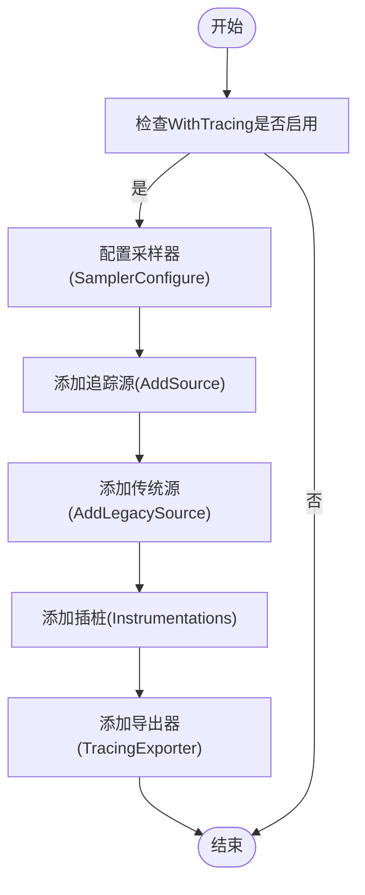
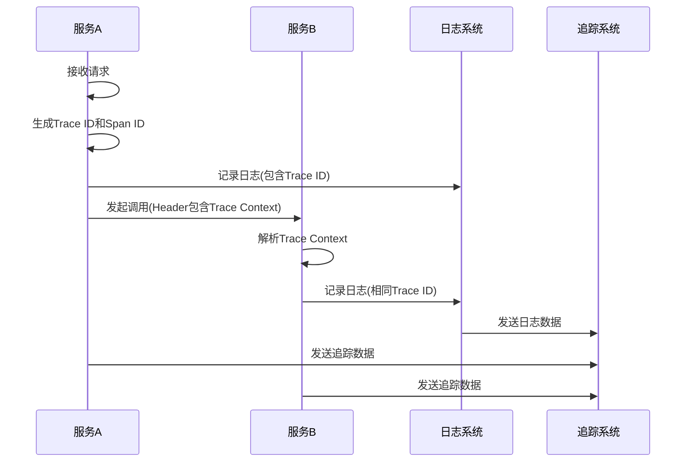

# 分布式追踪

<cite>
**本文档中引用的文件**
- [AbpOpenTelemetryOptions.cs](file://framework\src\SharpAbp.Abp.OpenTelemetry\SharpAbp\Abp\OpenTelemetry\AbpOpenTelemetryOptions.cs)
- [AbpOpenTelemetryModule.cs](file://framework\src\SharpAbp.Abp.OpenTelemetry\SharpAbp\Abp\OpenTelemetry\AbpOpenTelemetryModule.cs)
- [AbpOpenTelemetryBuilderOptions.cs](file://framework\src\SharpAbp.Abp.OpenTelemetry.Abstractions\SharpAbp\Abp\OpenTelemetry\AbpOpenTelemetryBuilderOptions.cs)
- [AbpOpenTelemetryExporterOtlpModule.cs](file://framework\src\SharpAbp.Abp.OpenTelemetry.Exporter.Otlp\SharpAbp\Abp\OpenTelemetry\Exporter\Otlp\AbpOpenTelemetryExporterOtlpModule.cs)
- [AbpOpenTelemetryExporterZipkinModule.cs](file://framework\src\SharpAbp.Abp.OpenTelemetry.Exporter.Zipkin\SharpAbp\Abp\OpenTelemetry\Exporter\Zipkin\AbpOpenTelemetryExporterZipkinModule.cs)
- [AbpOpenTelemetryExporterOtlpOptions.cs](file://framework\src\SharpAbp.Abp.OpenTelemetry.Exporter.Otlp\SharpAbp\Abp\OpenTelemetry\Exporter\Otlp\AbpOpenTelemetryExporterOtlpOptions.cs)
- [AbpOpenTelemetryExporterZipkinOptions.cs](file://framework\src\SharpAbp.Abp.OpenTelemetry.Exporter.Zipkin\SharpAbp\Abp\OpenTelemetry\Exporter\Zipkin\AbpOpenTelemetryExporterZipkinOptions.cs)
</cite>

## 目录
1. [简介](#简介)
2. [核心配置选项](#核心配置选项)
3. [启用分布式追踪](#启用分布式追踪)
4. [采样策略配置](#采样策略配置)
5. [导出器配置](#导出器配置)
6. [上下文传播与日志集成](#上下文传播与日志集成)
7. [配置示例](#配置示例)

## 简介
`SharpAbp.Abp.OpenTelemetry` 模块为 SharpAbp 框架提供了完整的分布式追踪能力，基于 OpenTelemetry 标准实现。该模块允许开发者在微服务架构中跟踪请求的完整流转路径，通过统一的 API 收集、处理和导出追踪数据。本文档详细说明如何配置和使用该模块，包括启用追踪、设置采样策略以及将数据导出到不同的后端系统。

**Section sources**
- [AbpOpenTelemetryModule.cs](file://framework\src\SharpAbp.Abp.OpenTelemetry\SharpAbp\Abp\OpenTelemetry\AbpOpenTelemetryModule.cs#L0-L252)

## 核心配置选项
`SharpAbp.Abp.OpenTelemetry` 模块的核心配置由 `AbpOpenTelemetryOptions` 和 `AbpOpenTelemetryBuilderOptions` 两个类定义。前者负责具体的追踪、指标和日志配置，后者则定义了服务的基本元数据。

### AbpOpenTelemetryBuilderOptions
此选项类定义了服务级别的元信息，用于在追踪系统中标识服务实例：

| 配置项 | 描述 |
|--------|------|
| IsEnabled | 是否启用 OpenTelemetry 功能 |
| ServiceName | 服务名称，用于在追踪系统中标识服务 |
| ServiceNamespace | 服务命名空间，用于组织服务分组 |
| ServiceVersion | 服务版本号 |
| AutoGenerateServiceInstanceId | 是否自动生成服务实例ID |
| ServiceInstanceId | 服务实例的唯一标识符 |

### AbpOpenTelemetryOptions
此选项类包含了详细的追踪配置：

| 配置项 | 描述 |
|--------|------|
| WithTracing | 是否启用分布式追踪功能 |
| SourceNames | 追踪源名称列表，用于过滤追踪数据 |
| OperationName | 传统追踪源的操作名称 |
| SamplerConfigure | 采样器配置委托，用于定义采样策略 |
| TracingInstrumentationConfigures | 追踪插桩配置列表 |
| UseTracingExporter | 指定使用的追踪导出器名称 |
| TracingExporters | 追踪导出器字典，包含不同导出器的配置 |

**Section sources**
- [AbpOpenTelemetryOptions.cs](file://framework\src\SharpAbp.Abp.OpenTelemetry\SharpAbp\Abp\OpenTelemetry\AbpOpenTelemetryOptions.cs#L0-L158)
- [AbpOpenTelemetryBuilderOptions.cs](file://framework\src\SharpAbp.Abp.OpenTelemetry.Abstractions\SharpAbp\Abp\OpenTelemetry\AbpOpenTelemetryBuilderOptions.cs#L0-L33)

## 启用分布式追踪
要启用分布式追踪功能，需要在 `AbpOpenTelemetryOptions` 中设置 `WithTracing` 属性为 `true`，并配置相应的追踪源。模块在启动时会自动读取配置并构建追踪提供程序。



**Diagram sources**
- [AbpOpenTelemetryModule.cs](file://framework\src\SharpAbp.Abp.OpenTelemetry\SharpAbp\Abp\OpenTelemetry\AbpOpenTelemetryModule.cs#L131-L162)
- [AbpOpenTelemetryOptions.cs](file://framework\src\SharpAbp.Abp.OpenTelemetry\SharpAbp\Abp\OpenTelemetry\AbpOpenTelemetryOptions.cs#L15-L30)

**Section sources**
- [AbpOpenTelemetryModule.cs](file://framework\src\SharpAbp.Abp.OpenTelemetry\SharpAbp\Abp\OpenTelemetry\AbpOpenTelemetryModule.cs#L131-L162)

## 采样策略配置
`SharpAbp.Abp.OpenTelemetry` 模块默认使用 `AlwaysOnSampler` 采样器，即对所有追踪进行采样。开发者可以通过 `SamplerConfigure` 委托来自定义采样策略。

采样策略的配置发生在模块的 `PreConfigureServicesAsync` 方法中，通过 `PreConfigure` 机制设置默认的采样器。如果需要自定义采样策略，可以在应用程序的配置中重写 `SamplerConfigure` 委托。



**Diagram sources**
- [AbpOpenTelemetryModule.cs](file://framework\src\SharpAbp.Abp.OpenTelemetry\SharpAbp\Abp\OpenTelemetry\AbpOpenTelemetryModule.cs#L131-L162)
- [AbpOpenTelemetryOptions.cs](file://framework\src\SharpAbp.Abp.OpenTelemetry\SharpAbp\Abp\OpenTelemetry\AbpOpenTelemetryOptions.cs#L20-L25)

**Section sources**
- [AbpOpenTelemetryModule.cs](file://framework\src\SharpAbp.Abp.OpenTelemetry\SharpAbp\Abp\OpenTelemetry\AbpOpenTelemetryModule.cs#L131-L162)

## 导出器配置
`SharpAbp.Abp.OpenTelemetry` 模块支持多种导出器，通过专门的扩展模块实现。主要的导出器包括 OTLP 和 Zipkin。

### OTLP 导出器
`SharpAbp.Abp.OpenTelemetry.Exporter.Otlp` 模块提供了对 OTLP 协议的支持，可以将追踪数据导出到任何支持 OTLP 的后端（如 Jaeger、Prometheus 等）。

```mermaid
classDiagram
class AbpOpenTelemetryExporterOtlpModule {
+PreConfigureServicesAsync()
+ConfigureServicesAsync()
}
class AbpOpenTelemetryExporterOtlpOptions {
+string? Name
+string? Endpoint
+string? Headers
+int TimeoutMilliseconds
+OtlpExportProtocol Protocol
}
class AbpOpenTelemetryOptions {
+Dictionary~string, Action~TracerProviderBuilder~~ TracingExporters
+Dictionary~string, Action~MeterProviderBuilder~~ MetricsExporters
+Dictionary~string, Action~OpenTelemetryLoggerOptions~~ LoggingExporters
}
AbpOpenTelemetryExporterOtlpModule --> AbpOpenTelemetryExporterOtlpOptions : "使用"
AbpOpenTelemetryExporterOtlpModule --> AbpOpenTelemetryOptions : "配置"
AbpOpenTelemetryOptions --> "OTLP" : "添加导出器"
```

**Diagram sources**
- [AbpOpenTelemetryExporterOtlpModule.cs](file://framework\src\SharpAbp.Abp.OpenTelemetry.Exporter.Otlp\SharpAbp\Abp\OpenTelemetry\Exporter\Otlp\AbpOpenTelemetryExporterOtlpModule.cs#L0-L73)
- [AbpOpenTelemetryExporterOtlpOptions.cs](file://framework\src\SharpAbp.Abp.OpenTelemetry.Exporter.Otlp\SharpAbp\Abp\OpenTelemetry\Exporter\Otlp\AbpOpenTelemetryExporterOtlpOptions.cs#L0-L32)

### Zipkin 导出器
`SharpAbp.Abp.OpenTelemetry.Exporter.Zipkin` 模块提供了对 Zipkin 的直接支持，可以将追踪数据导出到 Zipkin 服务器。

```mermaid
classDiagram
class AbpOpenTelemetryExporterZipkinModule {
+PreConfigureServicesAsync()
+ConfigureServicesAsync()
}
class AbpOpenTelemetryExporterZipkinOptions {
+string? Name
+string? Endpoint
+bool UseShortTraceIds
+int? MaxPayloadSizeInBytes
}
class AbpOpenTelemetryOptions {
+Dictionary~string, Action~TracerProviderBuilder~~ TracingExporters
}
AbpOpenTelemetryExporterZipkinModule --> AbpOpenTelemetryExporterZipkinOptions : "使用"
AbpOpenTelemetryExporterZipkinModule --> AbpOpenTelemetryOptions : "配置"
AbpOpenTelemetryOptions --> "Zipkin" : "添加导出器"
```

**Diagram sources**
- [AbpOpenTelemetryExporterZipkinModule.cs](file://framework\src\SharpAbp.Abp.OpenTelemetry.Exporter.Zipkin\SharpAbp\Abp\OpenTelemetry\Exporter\Zipkin\AbpOpenTelemetryExporterZipkinModule.cs#L0-L60)
- [AbpOpenTelemetryExporterZipkinOptions.cs](file://framework\src\SharpAbp.Abp.OpenTelemetry.Exporter.Zipkin\SharpAbp\Abp\OpenTelemetry\Exporter\Zipkin\AbpOpenTelemetryExporterZipkinOptions.cs#L0-L29)

**Section sources**
- [AbpOpenTelemetryExporterOtlpModule.cs](file://framework\src\SharpAbp.Abp.OpenTelemetry.Exporter.Otlp\SharpAbp\Abp\OpenTelemetry\Exporter\Otlp\AbpOpenTelemetryExporterOtlpModule.cs#L0-L73)
- [AbpOpenTelemetryExporterZipkinModule.cs](file://framework\src\SharpAbp.Abp.OpenTelemetry.Exporter.Zipkin\SharpAbp\Abp\OpenTelemetry\Exporter\Zipkin\AbpOpenTelemetryExporterZipkinModule.cs#L0-L60)

## 上下文传播与日志集成
`SharpAbp.Abp.OpenTelemetry` 模块实现了完整的上下文传播机制，确保追踪ID和跨度ID能够在服务间正确传递。同时，模块还支持将追踪信息集成到日志中，实现全链路追踪。

当 `WithLogging` 选项启用时，模块会配置 OpenTelemetry 日志提供程序，将追踪上下文注入到日志条目中。这使得开发者可以在日志系统中通过 Trace ID 关联同一请求的所有日志记录。



**Diagram sources**
- [AbpOpenTelemetryModule.cs](file://framework\src\SharpAbp.Abp.OpenTelemetry\SharpAbp\Abp\OpenTelemetry\AbpOpenTelemetryModule.cs#L190-L223)
- [AbpOpenTelemetryOptions.cs](file://framework\src\SharpAbp.Abp.OpenTelemetry\SharpAbp\Abp\OpenTelemetry\AbpOpenTelemetryOptions.cs#L80-L88)

**Section sources**
- [AbpOpenTelemetryModule.cs](file://framework\src\SharpAbp.Abp.OpenTelemetry\SharpAbp\Abp\OpenTelemetry\AbpOpenTelemetryModule.cs#L190-L223)

## 配置示例
以下是一个完整的配置示例，展示了如何在 `appsettings.json` 文件中配置 `SharpAbp.Abp.OpenTelemetry` 模块：

```json
{
  "OpenTelemetryBuilderOptions": {
    "IsEnabled": true,
    "ServiceName": "MyService",
    "ServiceNamespace": "Production",
    "ServiceVersion": "1.0.0"
  },
  "OpenTelemetryOptions": {
    "WithTracing": true,
    "SourceNames": [ "MyService" ],
    "UseTracingExporter": "Otlp"
  },
  "OpenTelemetryOptions:Exporters:Otlp": {
    "Endpoint": "http://jaeger-collector:4317",
    "Protocol": "HttpProtobuf"
  }
}
```

此配置启用了分布式追踪功能，并将数据通过 OTLP 协议导出到 Jaeger 收集器。开发者可以根据实际需求调整配置参数，如更改导出器为 Zipkin 或调整采样策略。

**Section sources**
- [AbpOpenTelemetryBuilderOptions.cs](file://framework\src\SharpAbp.Abp.OpenTelemetry.Abstractions\SharpAbp\Abp\OpenTelemetry\AbpOpenTelemetryBuilderOptions.cs#L0-L33)
- [AbpOpenTelemetryOptions.cs](file://framework\src\SharpAbp.Abp.OpenTelemetry\SharpAbp\Abp\OpenTelemetry\AbpOpenTelemetryOptions.cs#L0-L158)
- [AbpOpenTelemetryExporterOtlpOptions.cs](file://framework\src\SharpAbp.Abp.OpenTelemetry.Exporter.Otlp\SharpAbp\Abp\OpenTelemetry\Exporter\Otlp\AbpOpenTelemetryExporterOtlpOptions.cs#L0-L32)