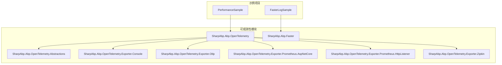
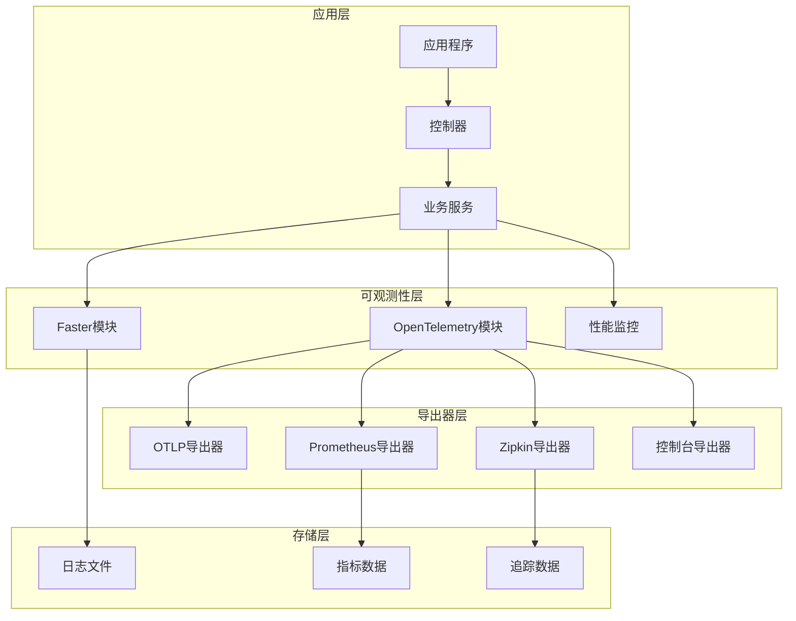
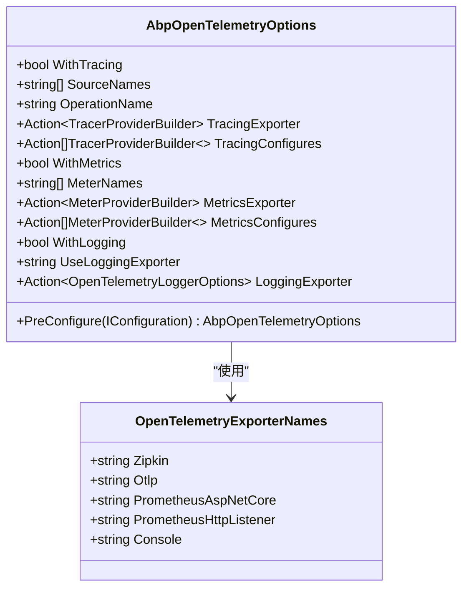
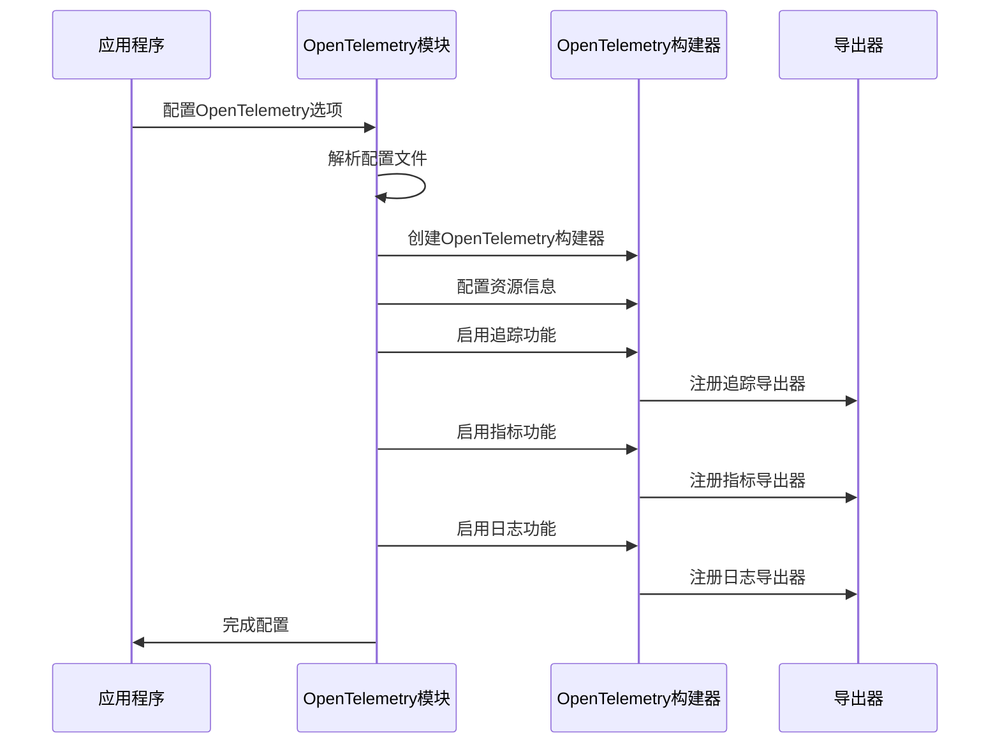
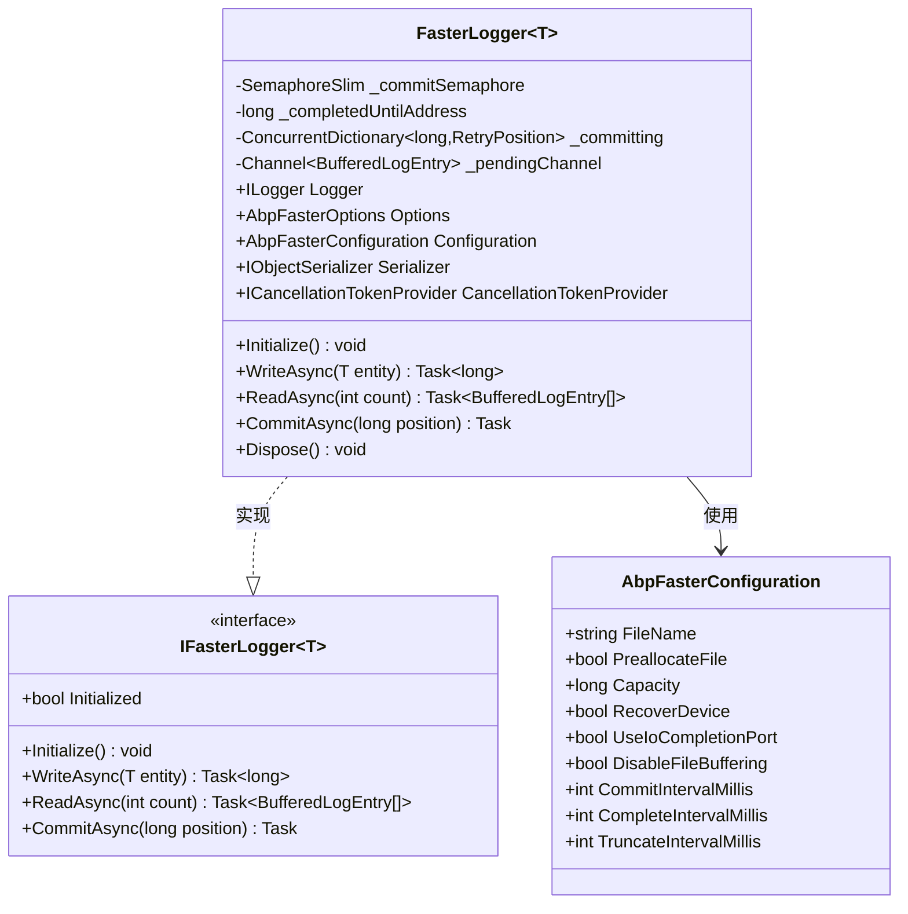
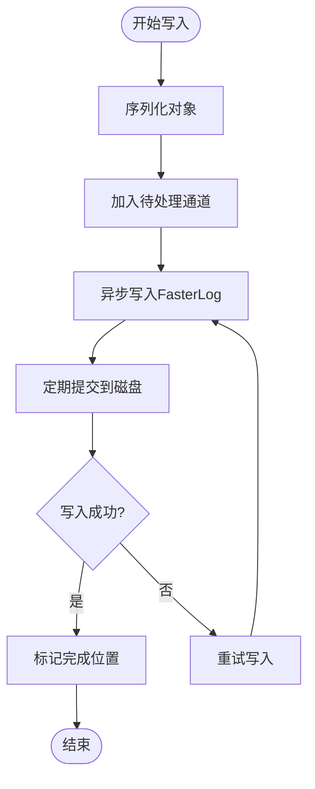
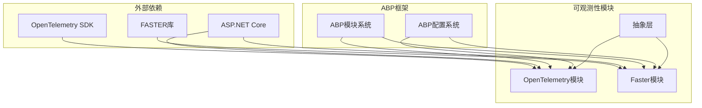

# 可观测性

<cite>
**本文档引用的文件**
- [AbpOpenTelemetryModule.cs](file://framework/src/SharpAbp.Abp.OpenTelemetry/SharpAbp/Abp/OpenTelemetry/AbpOpenTelemetryModule.cs)
- [AbpOpenTelemetryOptions.cs](file://framework/src/SharpAbp.Abp.OpenTelemetry/SharpAbp/Abp/OpenTelemetry/AbpOpenTelemetryOptions.cs)
- [OpenTelemetryExporterNames.cs](file://framework/src/SharpAbp.Abp.OpenTelemetry.Abstractions/SharpAbp/Abp/OpenTelemetry/OpenTelemetryExporterNames.cs)
- [appsettings.json](file://framework/src/SharpAbp.Abp.OpenTelemetry/SharpAbp/Abp/OpenTelemetry/appsettings.json)
- [FasterLogger.cs](file://framework/src/SharpAbp.Abp.Faster/SharpAbp/Abp/Faster/FasterLogger.cs)
- [AbpFasterOptions.cs](file://framework/src/SharpAbp.Abp.Faster/SharpAbp/Abp/Faster/AbpFasterOptions.cs)
- [AbpFasterConfiguration.cs](file://framework/src/SharpAbp.Abp.Faster/SharpAbp/Abp/Faster/AbpFasterConfiguration.cs)
- [IFasterLogger.cs](file://framework/src/SharpAbp.Abp.Faster/SharpAbp/Abp/Faster/IFasterLogger.cs)
- [DefaultFasterLoggerFactory.cs](file://framework/src/SharpAbp.Abp.Faster/SharpAbp/Abp/Faster/DefaultFasterLoggerFactory.cs)
- [FasterLogSampleModule.cs](file://samples/fasterlog-sample/src/FasterLogSample/FasterLogSampleModule.cs)
- [FasterLogService.cs](file://samples/fasterlog-sample/src/FasterLogSample/FasterLogService.cs)
- [PerformanceSampleModule.cs](file://samples/performance-sample/src/PerformanceSample/PerformanceSampleModule.cs)
</cite>

## 目录
1. [简介](#简介)
2. [项目结构](#项目结构)
3. [核心组件](#核心组件)
4. [架构概览](#架构概览)
5. [详细组件分析](#详细组件分析)
6. [依赖关系分析](#依赖关系分析)
7. [性能考虑](#性能考虑)
8. [故障排除指南](#故障排除指南)
9. [结论](#结论)

## 简介

sharp-abp可观测性解决方案是一个全面的监控、追踪和日志记录框架，旨在为.NET应用程序提供强大的可观测性能力。该解决方案主要包含两个核心模块：`SharpAbp.Abp.OpenTelemetry`用于集成OpenTelemetry框架进行分布式追踪和指标收集，以及`SharpAbp.Abp.Faster`用于提供高性能的日志记录系统。

OpenTelemetry模块支持多种导出器（Exporter），包括OTLP后端导出、Prometheus指标暴露等，而Faster模块则提供了基于内存映射文件的高性能日志记录系统，具有异步写入和持久化存储能力。

## 项目结构

可观测性解决方案的项目结构围绕两个主要模块组织：

**图表来源**
- [AbpOpenTelemetryModule.cs](file://framework/src/SharpAbp.Abp.OpenTelemetry/SharpAbp/Abp/OpenTelemetry/AbpOpenTelemetryModule.cs#L1-L20)
- [AbpFasterOptions.cs](file://framework/src/SharpAbp.Abp.Faster/SharpAbp/Abp/Faster/AbpFasterOptions.cs#L1-L15)

## 核心组件

### OpenTelemetry模块

OpenTelemetry模块是整个可观测性解决方案的核心，负责集成OpenTelemetry框架并提供统一的配置接口。

**章节来源**
- [AbpOpenTelemetryModule.cs](file://framework/src/SharpAbp.Abp.OpenTelemetry/SharpAbp/Abp/OpenTelemetry/AbpOpenTelemetryModule.cs#L1-L50)
- [AbpOpenTelemetryOptions.cs](file://framework/src/SharpAbp.Abp.OpenTelemetry/SharpAbp/Abp/OpenTelemetry/AbpOpenTelemetryOptions.cs#L1-L50)

### Faster模块

Faster模块提供了高性能的日志记录系统，基于内存映射文件技术实现快速读写操作。

**章节来源**
- [FasterLogger.cs](file://framework/src/SharpAbp.Abp.Faster/SharpAbp/Abp/Faster/FasterLogger.cs#L1-L50)
- [AbpFasterOptions.cs](file://framework/src/SharpAbp.Abp.Faster/SharpAbp/Abp/Faster/AbpFasterOptions.cs#L1-L30)

## 架构概览

可观测性解决方案采用分层架构设计，将监控、追踪和日志记录功能分离但相互协作：

**图表来源**
- [AbpOpenTelemetryModule.cs](file://framework/src/SharpAbp.Abp.OpenTelemetry/SharpAbp/Abp/OpenTelemetry/AbpOpenTelemetryModule.cs#L131-L250)
- [FasterLogger.cs](file://framework/src/SharpAbp.Abp.Faster/SharpAbp/Abp/Faster/FasterLogger.cs#L62-L132)

## 详细组件分析

### OpenTelemetry模块详细分析

OpenTelemetry模块提供了完整的分布式追踪和指标收集功能，支持多种导出器配置。

#### 配置选项

**图表来源**
- [AbpOpenTelemetryOptions.cs](file://framework/src/SharpAbp.Abp.OpenTelemetry/SharpAbp/Abp/OpenTelemetry/AbpOpenTelemetryOptions.cs#L10-L157)
- [OpenTelemetryExporterNames.cs](file://framework/src/SharpAbp.Abp.OpenTelemetry.Abstractions/SharpAbp/Abp/OpenTelemetry/OpenTelemetryExporterNames.cs#L1-L10)

#### 导出器配置流程

**图表来源**
- [AbpOpenTelemetryModule.cs](file://framework/src/SharpAbp.Abp.OpenTelemetry/SharpAbp/Abp/OpenTelemetry/AbpOpenTelemetryModule.cs#L131-L250)

**章节来源**
- [AbpOpenTelemetryModule.cs](file://framework/src/SharpAbp.Abp.OpenTelemetry/SharpAbp/Abp/OpenTelemetry/AbpOpenTelemetryModule.cs#L131-L250)
- [appsettings.json](file://framework/src/SharpAbp.Abp.OpenTelemetry/SharpAbp/Abp/OpenTelemetry/appsettings.json#L1-L49)

### Faster模块详细分析

Faster模块提供了高性能的日志记录系统，基于FASTER（Fast and Scalable RAMCloud）技术实现。

#### FasterLogger类结构

**图表来源**
- [FasterLogger.cs](file://framework/src/SharpAbp.Abp.Faster/SharpAbp/Abp/Faster/FasterLogger.cs#L18-L98)
- [IFasterLogger.cs](file://framework/src/SharpAbp.Abp.Faster/SharpAbp/Abp/Faster/IFasterLogger.cs#L15-L41)
- [AbpFasterConfiguration.cs](file://framework/src/SharpAbp.Abp.Faster/SharpAbp/Abp/Faster/AbpFasterConfiguration.cs#L8-L40)

#### 异步写入机制

**图表来源**
- [FasterLogger.cs](file://framework/src/SharpAbp.Abp.Faster/SharpAbp/Faster/FasterLogger.cs#L129-L161)

**章节来源**
- [FasterLogger.cs](file://framework/src/SharpAbp.Abp.Faster/SharpAbp/Abp/Faster/FasterLogger.cs#L1-L161)
- [AbpFasterOptions.cs](file://framework/src/SharpAbp.Abp.Faster/SharpAbp/Abp/Faster/AbpFasterOptions.cs#L1-L70)

## 依赖关系分析

可观测性模块的依赖关系体现了清晰的分层架构：

**图表来源**
- [AbpOpenTelemetryModule.cs](file://framework/src/SharpAbp.Abp.OpenTelemetry/SharpAbp/Abp/OpenTelemetry/AbpOpenTelemetryModule.cs#L1-L15)
- [AbpFasterOptions.cs](file://framework/src/SharpAbp.Abp.Faster/SharpAbp/Abp/Faster/AbpFasterOptions.cs#L1-L15)

**章节来源**
- [AbpOpenTelemetryModule.cs](file://framework/src/SharpAbp.Abp.OpenTelemetry/SharpAbp/Abp/OpenTelemetry/AbpOpenTelemetryModule.cs#L1-L20)
- [AbpFasterOptions.cs](file://framework/src/SharpAbp.Abp.Faster/SharpAbp/Abp/Faster/AbpFasterOptions.cs#L1-L20)

## 性能考虑

### OpenTelemetry性能优化

OpenTelemetry模块采用了多种性能优化策略：

1. **采样器配置**：默认使用AlwaysOnSampler确保所有追踪都被记录
2. **异步导出**：追踪和指标数据通过异步方式导出，避免阻塞主线程
3. **资源复用**：共享OpenTelemetry构建器实例，减少重复初始化开销

### Faster模块性能特性

Faster模块的性能优势体现在：

1. **内存映射文件**：利用操作系统内存映射功能，实现零拷贝读写
2. **异步I/O**：所有读写操作都是异步的，不会阻塞应用程序线程
3. **批量处理**：支持批量写入和读取，提高吞吐量
4. **自动压缩**：定期截断已读取的数据，释放存储空间

## 故障排除指南

### 常见问题及解决方案

#### OpenTelemetry配置问题

1. **导出器连接失败**
   - 检查导出器配置的端点地址是否正确
   - 验证网络连接和防火墙设置
   - 确认导出器服务是否正常运行

2. **指标数据丢失**
   - 调整指标采样率以减少数据量
   - 检查导出器缓冲区大小配置
   - 确认导出器超时设置是否合理

#### Faster模块问题

1. **日志文件损坏**
   - 启用RecoverDevice选项尝试恢复
   - 检查磁盘空间是否充足
   - 验证文件权限设置

2. **写入性能下降**
   - 调整PreallocateFile设置
   - 优化CommitIntervalMillis参数
   - 检查磁盘I/O性能

**章节来源**
- [FasterLogger.cs](file://framework/src/SharpAbp.Abp.Faster/SharpAbp/Abp/Faster/FasterLogger.cs#L62-L98)
- [AbpFasterConfiguration.cs](file://framework/src/SharpAbp.Abp.Faster/SharpAbp/Abp/Faster/AbpFasterConfiguration.cs#L1-L40)

## 结论

sharp-abp可观测性解决方案提供了一个完整且高效的监控、追踪和日志记录框架。通过OpenTelemetry模块的灵活配置和多种导出器支持，开发者可以轻松集成各种监控系统。而Faster模块则提供了高性能的日志记录能力，特别适合需要大量日志写入的应用场景。

该解决方案的主要优势包括：
- 统一的可观测性配置接口
- 多种导出器选择，适应不同监控需求
- 高性能的日志记录系统
- 易于扩展和定制的架构设计

通过合理的配置和使用，开发者可以显著提升应用程序的可观测性和运维效率。