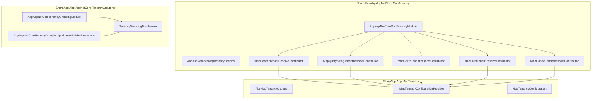
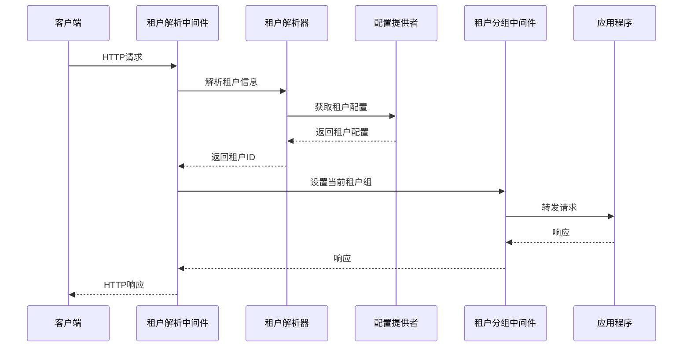
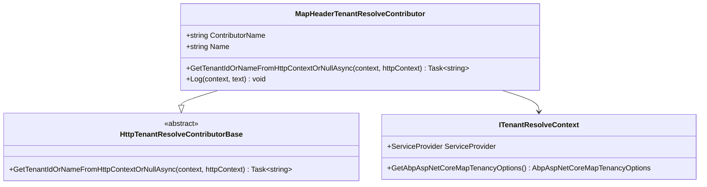
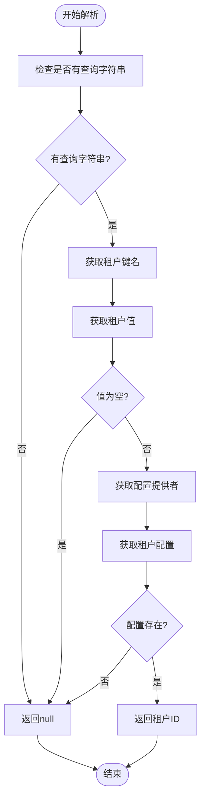
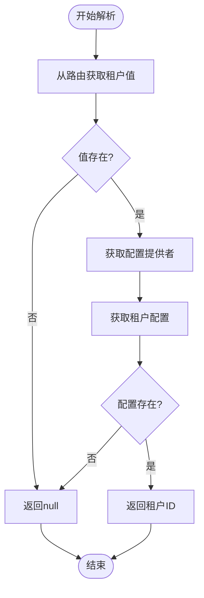
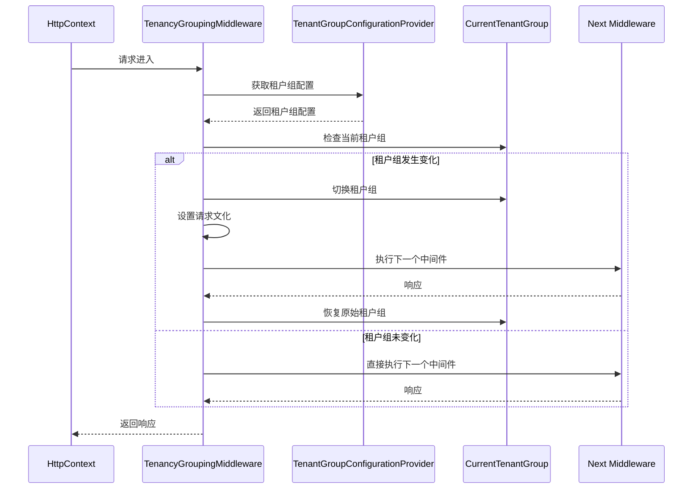
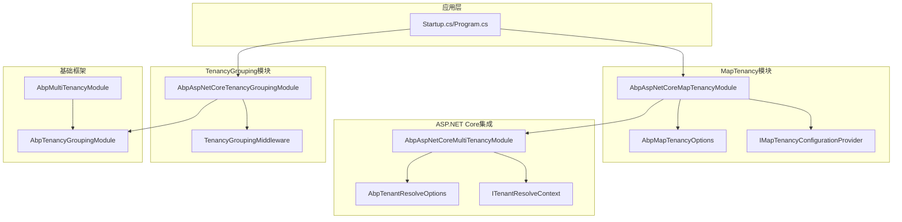

# ASP.NET Core 集成

<cite>
**本文档中引用的文件**
- [AbpAspNetCoreMapTenancyModule.cs](file://framework/src/SharpAbp.Abp.AspNetCore.MapTenancy/SharpAbp/Abp/AspNetCore/MapTenancy/AbpAspNetCoreMapTenancyModule.cs)
- [AbpAspNetCoreMapTenancyOptions.cs](file://framework/src/SharpAbp.Abp.AspNetCore.MapTenancy/SharpAbp/Abp/AspNetCore/MapTenancy/AbpAspNetCoreMapTenancyOptions.cs)
- [MapHeaderTenantResolveContributor.cs](file://framework/src/SharpAbp.Abp.AspNetCore.MapTenancy/SharpAbp/Abp/AspNetCore/MapTenancy/MapHeaderTenantResolveContributor.cs)
- [MapQueryStringTenantResolveContributor.cs](file://framework/src/SharpAbp.Abp.AspNetCore.MapTenancy/SharpAbp/Abp/AspNetCore/MapTenancy/MapQueryStringTenantResolveContributor.cs)
- [MapRouteTenantResolveContributor.cs](file://framework/src\SharpAbp.Abp.AspNetCore.MapTenancy\SharpAbp\Abp\AspNetCore\MapTenancy\MapRouteTenantResolveContributor.cs)
- [MapFormTenantResolveContributor.cs](file://framework\src\SharpAbp.Abp.AspNetCore.MapTenancy\SharpAbp\Abp\AspNetCore\MapTenancy\MapFormTenantResolveContributor.cs)
- [MapCookieTenantResolveContributor.cs](file://framework\src\SharpAbp.Abp.AspNetCore.MapTenancy\SharpAbp\Abp\AspNetCore\MapTenancy\MapCookieTenantResolveContributor.cs)
- [AbpAspNetCoreTenancyGroupingApplicationBuilderExtensions.cs](file://framework/src\SharpAbp.Abp.AspNetCore.TenancyGrouping\Microsoft\AspNetCore\Builder\AbpAspNetCoreTenancyGroupingApplicationBuilderExtensions.cs)
- [TenancyGroupingMiddleware.cs](file://framework/src\SharpAbp.Abp.AspNetCore.TenancyGrouping\SharpAbp\Abp\AspNetCore\TenancyGrouping\TenancyGroupingMiddleware.cs)
- [AbpMapTenancyOptions.cs](file://framework/src\SharpAbp.Abp.MapTenancy\SharpAbp\Abp\MapTenancy\AbpMapTenancyOptions.cs)
- [MapTenancyConfiguration.cs](file://framework/src\SharpAbp.Abp.MapTenancy\SharpAbp\Abp\MapTenancy\MapTenancyConfiguration.cs)
- [IMapTenancyConfigurationProvider.cs](file://framework/src\SharpAbp.Abp.MapTenancy\SharpAbp\Abp\MapTenancy\IMapTenancyConfigurationProvider.cs)
- [DefaultMapTenancyConfigurationProvider.cs](file://framework/src\SharpAbp.Abp.MapTenancy\SharpAbp\Abp\MapTenancy\DefaultMapTenancyConfigurationProvider.cs)
</cite>

## 目录
1. [简介](#简介)
2. [项目结构](#项目结构)
3. [核心组件](#核心组件)
4. [架构概览](#架构概览)
5. [详细组件分析](#详细组件分析)
6. [依赖关系分析](#依赖关系分析)
7. [性能考虑](#性能考虑)
8. [故障排除指南](#故障排除指南)
9. [结论](#结论)

## 简介

SharpAbp.Abp.AspNetCore.MapTenancy 和 SharpAbp.Abp.AspNetCore.TenancyGrouping 是 SharpAbp 框架中的两个重要模块，专门用于处理多租户应用程序中的租户解析和租户分组功能。这些模块为 ASP.NET Core 应用程序提供了强大的租户识别能力，支持从不同的 HTTP 请求源（头部、查询字符串、路由等）提取租户信息，并实现了租户分组中间件来管理租户级别的配置和状态。

MapTenancy 模块通过多种租户解析贡献者（Tenant Resolve Contributors）实现了灵活的租户识别机制，而 TenancyGrouping 模块则提供了基于租户组的中间件管道，确保不同租户组之间的隔离和独立性。

## 项目结构

这两个模块位于 SharpAbp 框架的核心部分，与 ASP.NET Core 集成紧密：



**图表来源**
- [AbpAspNetCoreMapTenancyModule.cs](file://framework/src/SharpAbp.Abp.AspNetCore.MapTenancy/SharpAbp/Abp/AspNetCore/MapTenancy/AbpAspNetCoreMapTenancyModule.cs#L1-L34)
- [AbpAspNetCoreTenancyGroupingApplicationBuilderExtensions.cs](file://framework/src/SharpAbp.Abp.AspNetCore.TenancyGrouping/Microsoft/AspNetCore/Builder/AbpAspNetCoreTenancyGroupingApplicationBuilderExtensions.cs#L1-L14)

**章节来源**
- [AbpAspNetCoreMapTenancyModule.cs](file://framework/src/SharpAbp.Abp.AspNetCore.MapTenancy/SharpAbp/Abp/AspNetCore/MapTenancy/AbpAspNetCoreMapTenancyModule.cs#L1-L34)
- [AbpAspNetCoreTenancyGroupingApplicationBuilderExtensions.cs](file://framework/src/SharpAbp.Abp.AspNetCore.TenancyGrouping/Microsoft/AspNetCore/Builder/AbpAspNetCoreTenancyGroupingApplicationBuilderExtensions.cs#L1-L14)

## 核心组件

### MapTenancy 租户解析贡献者

MapTenancy 模块提供了五个主要的租户解析贡献者，每个都从不同的 HTTP 请求源提取租户信息：

1. **MapHeaderTenantResolveContributor** - 从 HTTP 请求头中提取租户信息
2. **MapQueryStringTenantResolveContributor** - 从查询字符串参数中提取租户信息  
3. **MapRouteTenantResolveContributor** - 从路由参数中提取租户信息
4. **MapFormTenantResolveContributor** - 从表单数据中提取租户信息
5. **MapCookieTenantResolveContributor** - 从 Cookie 中提取租户信息

### TenancyGrouping 中间件

TenancyGrouping 模块提供了一个专门的中间件来处理租户组级别的逻辑，包括：
- 租户组配置的获取和验证
- 当前租户组的切换和管理
- 请求文化设置的自动配置
- 租户组隔离的实现

**章节来源**
- [MapHeaderTenantResolveContributor.cs](file://framework/src/SharpAbp.Abp.AspNetCore.MapTenancy/SharpAbp/Abp/AspNetCore/MapTenancy/MapHeaderTenantResolveContributor.cs#L1-L60)
- [TenancyGroupingMiddleware.cs](file://framework/src/SharpAbp.Abp.AspNetCore.TenancyGrouping/SharpAbp/Abp/AspNetCore/TenancyGrouping/TenancyGroupingMiddleware.cs#L1-L122)

## 架构概览

这两个模块的架构设计遵循了 ASP.NET Core 的中间件模式和依赖注入原则：



**图表来源**
- [MapHeaderTenantResolveContributor.cs](file://framework/src/SharpAbp.Abp.AspNetCore.MapTenancy/SharpAbp/Abp/AspNetCore/MapTenancy/MapHeaderTenantResolveContributor.cs#L20-L45)
- [TenancyGroupingMiddleware.cs](file://framework/src/SharpAbp.Abp.AspNetCore.TenancyGrouping/SharpAbp/Abp/AspNetCore/TenancyGrouping/TenancyGroupingMiddleware.cs#L30-L70)

## 详细组件分析

### MapHeaderTenantResolveContributor 分析

MapHeaderTenantResolveContributor 是从 HTTP 请求头中提取租户信息的主要实现：



**图表来源**
- [MapHeaderTenantResolveContributor.cs](file://framework/src/SharpAbp.Abp.AspNetCore.MapTenancy/SharpAbp/Abp/AspNetCore/MapTenancy/MapHeaderTenantResolveContributor.cs#L15-L45)

该组件的关键特性：
- 支持多个相同的租户头字段，使用第一个值
- 提供详细的日志记录功能
- 通过 IMultiTenancyConfigurationProvider 获取租户配置
- 默认租户键名为 "__tenant"

### MapQueryStringTenantResolveContributor 分析

从查询字符串中提取租户信息的实现：



**图表来源**
- [MapQueryStringTenantResolveContributor.cs](file://framework/src/SharpAbp.Abp.AspNetCore.MapTenancy/SharpAbp/Abp/AspNetCore/MapTenancy/MapQueryStringTenantResolveContributor.cs#L20-L32)

### MapRouteTenantResolveContributor 分析

从路由参数中提取租户信息的实现：



**图表来源**
- [MapRouteTenantResolveContributor.cs](file://framework/src/SharpAbp.Abp.AspNetCore.MapTenancy/SharpAbp/Abp/AspNetCore/MapTenancy/MapRouteTenantResolveContributor.cs#L20-L31)

### TenancyGroupingMiddleware 分析

租户分组中间件的核心逻辑：



**图表来源**
- [TenancyGroupingMiddleware.cs](file://framework/src/SharpAbp.Abp.AspNetCore.TenancyGrouping/SharpAbp/Abp/AspNetCore/TenancyGrouping/TenancyGroupingMiddleware.cs#L30-L70)

**章节来源**
- [MapHeaderTenantResolveContributor.cs](file://framework/src/SharpAbp.Abp.AspNetCore.MapTenancy/SharpAbp/Abp/AspNetCore/MapTenancy/MapHeaderTenantResolveContributor.cs#L1-L60)
- [MapQueryStringTenantResolveContributor.cs](file://framework/src/SharpAbp.Abp.AspNetCore.MapTenancy/SharpAbp/Abp/AspNetCore/MapTenancy/MapQueryStringTenantResolveContributor.cs#L1-L32)
- [MapRouteTenantResolveContributor.cs](file://framework/src/SharpAbp.Abp.AspNetCore.MapTenancy/SharpAbp/Abp/AspNetCore/MapTenancy/MapRouteTenantResolveContributor.cs#L1-L31)
- [TenancyGroupingMiddleware.cs](file://framework/src/SharpAbp.Abp.AspNetCore.TenancyGrouping/SharpAbp/Abp/AspNetCore/TenancyGrouping/TenancyGroupingMiddleware.cs#L1-L122)

## 依赖关系分析

这两个模块的依赖关系展现了清晰的层次结构：



**图表来源**
- [AbpAspNetCoreMapTenancyModule.cs](file://framework/src/SharpAbp.Abp.AspNetCore.MapTenancy/SharpAbp/Abp/AspNetCore/MapTenancy/AbpAspNetCoreMapTenancyModule.cs#L8-L12)
- [AbpAspNetCoreTenancyGroupingModule.cs](file://framework/src/SharpAbp.Abp.AspNetCore.TenancyGrouping/SharpAbp/Abp/AspNetCore/TenancyGrouping/AbpAspNetCoreTenancyGroupingModule.cs#L7-L12)

**章节来源**
- [AbpAspNetCoreMapTenancyModule.cs](file://framework/src/SharpAbp.Abp.AspNetCore.MapTenancy/SharpAbp/Abp/AspNetCore/MapTenancy/AbpAspNetCoreMapTenancyModule.cs#L1-L34)
- [AbpAspNetCoreTenancyGroupingModule.cs](file://framework/src/SharpAbp.Abp.AspNetCore.TenancyGrouping/SharpAbp/Abp/AspNetCore/TenancyGrouping/AbpAspNetCoreTenancyGroupingModule.cs#L1-L13)

## 性能考虑

### 租户解析性能优化

1. **缓存策略**：建议在生产环境中实现租户配置的缓存机制
2. **异步操作**：所有租户解析操作都是异步的，避免阻塞请求线程
3. **早期退出**：如果找到有效的租户信息，立即返回结果
4. **最小化数据库访问**：通过配置提供者接口抽象数据访问层

### 租户分组中间件性能

1. **租户组变更检测**：只有在租户组实际变化时才执行昂贵的操作
2. **上下文切换开销**：使用 `using` 语句确保租户组上下文正确释放
3. **文化设置优化**：仅在需要时设置请求文化，避免不必要的操作

## 故障排除指南

### 常见问题及解决方案

#### 1. 租户解析失败

**症状**：租户解析贡献者无法正确识别租户
**可能原因**：
- 租户键名配置错误
- 租户配置不存在或无效
- HTTP 请求格式不正确

**解决方案**：
```csharp
// 在 Startup.cs 中配置租户键名
services.Configure<AbpAspNetCoreMapTenancyOptions>(options =>
{
    options.MapTenantKey = "custom-tenant-key";
});
```

#### 2. 租户分组中间件不工作

**症状**：租户组切换没有生效
**可能原因**：
- 中间件管道顺序错误
- 租户组配置提供者未正确注册
- 租户组配置无效

**解决方案**：
```csharp
// 在 Startup.cs 中正确添加中间件
app.UseRouting();
app.UseTenancyGrouping(); // 确保在 UseRouting 后调用
app.UseAuthorization();
```

#### 3. 日志记录不足

**症状**：难以诊断租户解析问题
**解决方案**：
启用详细的日志记录：
```csharp
// 在 appsettings.json 中配置
{
  "Logging": {
    "LogLevel": {
      "Default": "Information",
      "SharpAbp.Abp.AspNetCore.MapTenancy": "Debug",
      "SharpAbp.Abp.AspNetCore.TenancyGrouping": "Debug"
    }
  }
}
```

**章节来源**
- [MapHeaderTenantResolveContributor.cs](file://framework/src/SharpAbp.Abp.AspNetCore.MapTenancy/SharpAbp/Abp/AspNetCore/MapTenancy/MapHeaderTenantResolveContributor.cs#L45-L58)
- [TenancyGroupingMiddleware.cs](file://framework/src/SharpAbp.Abp.AspNetCore.TenancyGrouping/SharpAbp/Abp/AspNetCore/TenancyGrouping/TenancyGroupingMiddleware.cs#L50-L70)

## 结论

SharpAbp.Abp.AspNetCore.MapTenancy 和 SharpAbp.Abp.AspNetCore.TenancyGrouping 模块为 ASP.NET Core 应用程序提供了强大而灵活的多租户支持。通过多种租户解析贡献者，系统能够从不同的 HTTP 请求源中提取租户信息，确保了高可用性和灵活性。

TenancyGrouping 中间件则提供了租户组级别的隔离和管理，确保不同租户组之间的独立性，这对于构建安全可靠的多租户应用程序至关重要。

这些模块的设计充分体现了现代软件开发的最佳实践，包括依赖注入、异步编程、中间件模式和清晰的职责分离。开发者可以通过简单的配置和扩展点，轻松地将这些功能集成到现有的 ASP.NET Core 应用程序中。