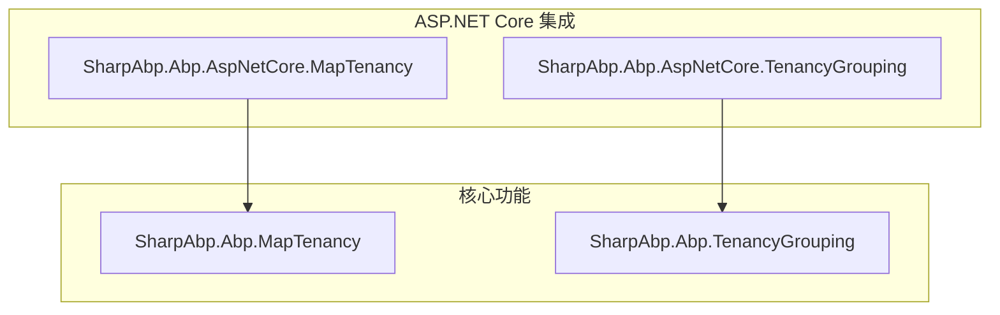

# 多租户

<cite>
**本文档中引用的文件**  
- [AbpMapTenancyModule.cs](file://framework/src/SharpAbp.Abp.MapTenancy/SharpAbp/Abp/MapTenancy/AbpMapTenancyModule.cs)
- [AbpMapTenancyOptions.cs](file://framework/src/SharpAbp.Abp.MapTenancy/SharpAbp/Abp/MapTenancy/AbpMapTenancyOptions.cs)
- [MapTenancyConfigurations.cs](file://framework/src/SharpAbp.Abp.MapTenancy/SharpAbp/Abp/MapTenancy/MapTenancyConfigurations.cs)
- [MapTenancyConfiguration.cs](file://framework/src/SharpAbp.Abp.MapTenancy/SharpAbp/Abp/MapTenancy/MapTenancyConfiguration.cs)
- [MapHeaderTenantResolveContributor.cs](file://framework/src/SharpAbp.Abp.AspNetCore.MapTenancy/SharpAbp/Abp/AspNetCore/MapTenancy/MapHeaderTenantResolveContributor.cs)
- [MapQueryStringTenantResolveContributor.cs](file://framework/src/SharpAbp.Abp.AspNetCore.MapTenancy/SharpAbp/Abp/AspNetCore/MapTenancy/MapQueryStringTenantResolveContributor.cs)
- [MapCookieTenantResolveContributor.cs](file://framework/src/SharpAbp.Abp.AspNetCore.MapTenancy/SharpAbp/Abp/AspNetCore/MapTenancy/MapCookieTenantResolveContributor.cs)
- [MapFormTenantResolveContributor.cs](file://framework/src/SharpAbp.Abp.AspNetCore.MapTenancy/SharpAbp/Abp/AspNetCore/MapTenancy/MapFormTenantResolveContributor.cs)
- [MapRouteTenantResolveContributor.cs](file://framework/src/SharpAbp.Abp.AspNetCore.MapTenancy/SharpAbp/Abp/AspNetCore/MapTenancy/MapRouteTenantResolveContributor.cs)
- [AbpAspNetCoreMapTenancyOptions.cs](file://framework/src/SharpAbp.Abp.AspNetCore.MapTenancy/SharpAbp/Abp/AspNetCore/MapTenancy/AbpAspNetCoreMapTenancyOptions.cs)
- [TenantGroupResolver.cs](file://framework/src/SharpAbp.Abp.TenancyGrouping/SharpAbp/Abp/TenancyGrouping/TenantGroupResolver.cs)
- [DefaultTenantGroupResolveContributor.cs](file://framework/src/SharpAbp.Abp.TenancyGrouping/SharpAbp/Abp/TenancyGrouping/DefaultTenantGroupResolveContributor.cs)
- [DefaultTenantGroupStore.cs](file://framework/src/SharpAbp.Abp.TenancyGrouping/SharpAbp/Abp/TenancyGrouping/ConfigurationStore/DefaultTenantGroupStore.cs)
- [TenantGroupConfigurationProvider.cs](file://framework/src/SharpAbp.Abp.TenancyGrouping/SharpAbp/Abp/TenancyGrouping/TenantGroupConfigurationProvider.cs)
- [TenancyGroupingMiddleware.cs](file://framework/src/SharpAbp.Abp.AspNetCore.TenancyGrouping/SharpAbp/Abp/AspNetCore/TenancyGrouping/TenancyGroupingMiddleware.cs)
- [AbpAspNetCoreTenancyGroupingModule.cs](file://framework/src/SharpAbp.Abp.AspNetCore.TenancyGrouping/SharpAbp/Abp/AspNetCore/TenancyGrouping/AbpAspNetCoreTenancyGroupingModule.cs)
</cite>

## 目录
1. [简介](#简介)
2. [项目结构](#项目结构)
3. [核心组件](#核心组件)
4. [架构概述](#架构概述)
5. [详细组件分析](#详细组件分析)
6. [依赖分析](#依赖分析)
7. [性能考虑](#性能考虑)
8. [故障排除指南](#故障排除指南)
9. [结论](#结论)

## 简介
SharpAbp 是一个基于 ABP 框架的扩展解决方案，提供了强大的多租户功能。本文档重点介绍其两个关键模块：`SharpAbp.Abp.MapTenancy` 和 `SharpAbp.Abp.TenancyGrouping`。前者实现了灵活的租户映射机制，允许通过多种方式（如请求头、查询字符串等）从 HTTP 请求中解析出实际的租户 ID；后者则引入了租户分组的概念，将多个租户组织到逻辑组中，便于统一管理和配置。这两个模块通过 ASP.NET Core 中间件无缝集成到应用管道中，为构建复杂的多租户 SaaS 应用提供了坚实的基础。

## 项目结构
SharpAbp 的多租户解决方案由四个主要模块构成，分别位于框架源码目录下：
- **SharpAbp.Abp.MapTenancy**: 核心租户映射模块，定义了租户映射的配置模型和提供者。
- **SharpAbp.Abp.AspNetCore.MapTenancy**: ASP.NET Core 集成模块，包含用于从 HTTP 上下文中解析租户的贡献者（Contributor）。
- **SharpAbp.Abp.TenancyGrouping**: 核心租户分组模块，定义了租户分组的解析器、存储和配置。
- **SharpAbp.Abp.AspNetCore.TenancyGrouping**: ASP.NET Core 集成模块，包含处理租户分组的中间件。

这些模块遵循分层设计原则，核心逻辑与 ASP.NET Core 特定实现分离，确保了代码的可重用性和可测试性。

**图示来源**
- [项目结构](file://framework/src)

**本节来源**
- [项目结构](file://framework/src)

## 核心组件

`SharpAbp.Abp.MapTenancy` 模块的核心是 `AbpMapTenancyOptions` 和 `MapTenancyConfigurations` 类。`AbpMapTenancyOptions` 作为配置入口，持有 `MapTenancyConfigurations` 实例，后者是一个字典容器，用于存储所有预定义的租户映射关系。每个映射关系由 `MapTenancyConfiguration` 对象表示，它关联了一个外部标识符（`MapCode`）与一个内部租户（`TenantId`）。`SharpAbp.Abp.TenancyGrouping` 模块的核心则是 `TenantGroupResolver` 和 `ITenantGroupStore` 接口。`TenantGroupResolver` 负责协调多个 `TenantGroupResolveContributor` 来确定当前请求所属的租户组，而 `ITenantGroupStore` 则负责存储和检索租户组的配置信息。

**本节来源**
- [AbpMapTenancyOptions.cs](file://framework/src/SharpAbp.Abp.MapTenancy/SharpAbp/Abp/MapTenancy/AbpMapTenancyOptions.cs)
- [MapTenancyConfigurations.cs](file://framework/src/SharpAbp.Abp.MapTenancy/SharpAbp/Abp/MapTenancy/MapTenancyConfigurations.cs)
- [MapTenancyConfiguration.cs](file://framework/src/SharpAbp.Abp.MapTenancy/SharpAbp/Abp/MapTenancy/MapTenancyConfiguration.cs)
- [TenantGroupResolver.cs](file://framework/src/SharpAbp.Abp.TenancyGrouping/SharpAbp/Abp/TenancyGrouping/TenantGroupResolver.cs)
- [DefaultTenantGroupStore.cs](file://framework/src/SharpAbp.Abp.TenancyGrouping/SharpAbp/Abp/TenancyGrouping/ConfigurationStore/DefaultTenantGroupStore.cs)

## 架构概述

整个多租户解决方案的架构可以分为两大部分：租户映射和租户分组。在 ASP.NET Core 请求管道中，首先由 `SharpAbp.Abp.AspNetCore.Map