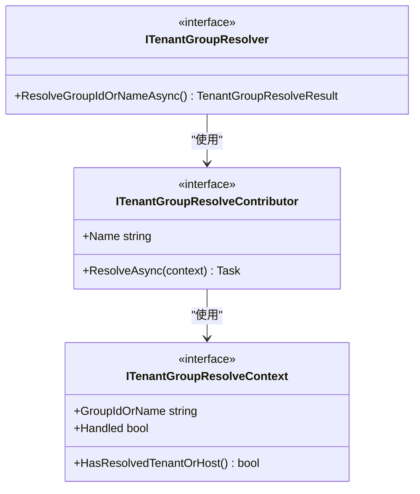

# 租户分组

<cite>
**本文档中引用的文件**
- [AbpTenancyGroupingModule.cs](file://framework/src/SharpAbp.Abp.TenancyGrouping/SharpAbp/Abp/TenancyGrouping/AbpTenancyGroupingModule.cs)
- [TenantGroupResolver.cs](file://framework/src/SharpAbp.Abp.TenancyGrouping/SharpAbp/Abp/TenancyGrouping/TenantGroupResolver.cs)
- [DefaultTenantGroupStore.cs](file://framework/src/SharpAbp.Abp.TenancyGrouping/SharpAbp/Abp/TenancyGrouping/ConfigurationStore/DefaultTenantGroupStore.cs)
- [ITenantGroupResolver.cs](file://framework/src/SharpAbp.Abp.TenancyGrouping.Abstractions/SharpAbp/Abp/TenancyGrouping/ITenantGroupResolver.cs)
- [TenantGroupConfiguration.cs](file://framework/src/SharpAbp.Abp.TenancyGrouping.Abstractions/SharpAbp/Abp/TenancyGrouping/TenantGroupConfiguration.cs)
- [TenancyGroupingMiddleware.cs](file://framework/src/SharpAbp.Abp.AspNetCore.TenancyGrouping/SharpAbp/Abp/AspNetCore/TenancyGrouping/TenancyGroupingMiddleware.cs)
- [TenantGroupConnectionStringResolver.cs](file://framework/src/SharpAbp.Abp.TenancyGrouping/SharpAbp/Abp/TenancyGrouping/TenantGroupConnectionStringResolver.cs)
</cite>

## 目录
1. [引言](#引言)
2. [项目结构](#项目结构)
3. [核心组件](#核心组件)
4. [架构概述](#架构概述)
5. [详细组件分析](#详细组件分析)
6. [依赖关系分析](#依赖关系分析)
7. [性能考虑](#性能考虑)
8. [故障排除指南](#故障排除指南)
9. [结论](#结论)

## 引言
租户分组（Tenant Grouping）是多租户架构中的一个重要概念，它允许将多个租户组织到逻辑组中，以便进行统一管理和资源分配。在SharpAbp框架中，`SharpAbp.Abp.TenancyGrouping`模块提供了完整的租户分组功能实现，包括租户组解析、配置管理、连接字符串解析等核心功能。本文档将深入探讨该模块的设计原理和实现机制。

## 项目结构
`SharpAbp.Abp.TenancyGrouping`模块位于框架的src目录下，主要包含以下结构：


**图示来源**
- [AbpTenancyGroupingModule.cs](file://framework/src/SharpAbp.Abp.TenancyGrouping/SharpAbp/Abp/TenancyGrouping/AbpTenancyGroupingModule.cs)
- [TenantGroupResolver.cs](file://framework/src/SharpAbp.Abp.TenancyGrouping/SharpAbp/Abp/TenancyGrouping/TenantGroupResolver.cs)
- [DefaultTenantGroupStore.cs](file://framework/src/SharpAbp.Abp.TenancyGrouping/SharpAbp/Abp/TenancyGrouping/ConfigurationStore/DefaultTenantGroupStore.cs)

**本节来源**
- [framework/src/SharpAbp.Abp.TenancyGrouping](file://framework/src/SharpAbp.Abp.TenancyGrouping)

## 核心组件
`SharpAbp.Abp.TenancyGrouping`模块的核心组件包括租户组解析器、租户组存储、当前租户组访问器等。这些组件协同工作，实现了租户分组的完整功能。

**本节来源**
- [AbpTenancyGroupingModule.cs](file://framework/src/SharpAbp.Abp.TenancyGrouping/SharpAbp/Abp/TenancyGrouping/AbpTenancyGroupingModule.cs)
- [TenantGroupResolver.cs](file://framework/src/SharpAbp.Abp.TenancyGrouping/SharpAbp/Abp/TenancyGrouping/TenantGroupResolver.cs)

## 架构概述
`SharpAbp.Abp.TenancyGrouping`模块的架构设计遵循了清晰的分层原则，主要包括以下几个层次：


**图示来源**
- [TenancyGroupingMiddleware.cs](file://framework/src/SharpAbp.Abp.AspNetCore.TenancyGrouping/SharpAbp/Abp/AspNetCore/TenancyGrouping/TenancyGroupingMiddleware.cs)
- [TenantGroupResolver.cs](file://framework/src/SharpAbp.Abp.TenancyGrouping/SharpAbp/Abp/TenancyGrouping/TenantGroupResolver.cs)
- [DefaultTenantGroupStore.cs](file://framework/src/SharpAbp.Abp.TenancyGrouping/SharpAbp/Abp/TenancyGrouping/ConfigurationStore/DefaultTenantGroupStore.cs)

## 详细组件分析

### AbpTenancyGroupingModule分析
`AbpTenancyGroupingModule`是租户分组模块的主模块类，负责注册所有相关的服务和配置。


**图示来源**
- [AbpTenancyGroupingModule.cs](file://framework/src/SharpAbp.Abp.TenancyGrouping/SharpAbp/Abp/TenancyGrouping/AbpTenancyGroupingModule.cs)

**本节来源**
- [AbpTenancyGroupingModule.cs](file://framework/src/SharpAbp.Abp.TenancyGrouping/SharpAbp/Abp/TenancyGrouping/AbpTenancyGroupingModule.cs)

### ITenantGroupResolver接口实现机制
`ITenantGroupResolver`接口定义了租户组解析的核心契约，其主要实现是`TenantGroupResolver`类。

#### 接口定义


**图示来源**
- [ITenantGroupResolver.cs](file://framework/src/SharpAbp.Abp.TenancyGrouping.Abstractions/SharpAbp/Abp/TenancyGrouping/ITenantGroupResolver.cs)
- [ITenantGroupResolveContributor.cs](file://framework/src/SharpAbp.Abp.TenancyGrouping.Abstractions/SharpAbp/Abp/TenancyGrouping/ITenantGroupResolveContributor.cs)
- [ITenantGroupResolveContext.cs](file://framework/src/SharpAbp.Abp.TenancyGrouping.Abstractions/SharpAbp/Abp/TenancyGrouping/ITenantGroupResolveContext.cs)

#### 解析流程


**图示来源**
- [TenantGroupResolver.cs](file://framework/src/SharpAbp.Abp.TenancyGrouping/SharpAbp/Abp/TenancyGrouping/TenantGroupResolver.cs)
- [TenantGroupResolveContext.cs](file://framework/src/SharpAbp.Abp.TenancyGrouping/SharpAbp/Abp/TenancyGrouping/TenantGroupResolveContext.cs)

**本节来源**
- [TenantGroupResolver.cs](file://framework/src/SharpAbp.Abp.TenancyGrouping/SharpAbp/Abp/TenancyGrouping/TenantGroupResolver.cs)
- [ITenantGroupResolver.cs](file://framework/src/SharpAbp.Abp.TenancyGrouping.Abstractions/SharpAbp/Abp/TenancyGrouping/ITenantGroupResolver.cs)

### DefaultTenantGroupStore分析
`DefaultTenantGroupStore`是`ITenantGroupStore`接口的默认实现，负责从配置中加载租户组信息。


**图示来源**
- [DefaultTenantGroupStore.cs](file://framework/src/SharpAbp.Abp.TenancyGrouping/SharpAbp/Abp/TenancyGrouping/ConfigurationStore/DefaultTenantGroupStore.cs)
- [AbpDefaultTenantGroupStoreOptions.cs](file://framework/src/SharpAbp.Abp.TenancyGrouping.Abstractions/SharpAbp/Abp/TenancyGrouping/ConfigurationStore/AbpDefaultTenantGroupStoreOptions.cs)

**本节来源**
- [DefaultTenantGroupStore.cs](file://framework/src/SharpAbp.Abp.TenancyGrouping/SharpAbp/Abp/TenancyGrouping/ConfigurationStore/DefaultTenantGroupStore.cs)

### TenantGroupConnectionStringResolver分析
`TenantGroupConnectionStringResolver`负责根据当前租户组解析相应的数据库连接字符串。

```mermaid
sequenceDiagram
    participant Client as "客户端请求"
    participant Resolver as "TenantGroupConnectionStringResolver"
    participant Store as "ITenantGroupStore"
    participant CurrentGroup as "ICurrentTenantGroup"
    
    Client->>Resolver: ResolveAsync(connectionStringName)
    Resolver->>CurrentGroup: 检查当前租户组是否可用
    alt 租户组可用且包含当前租户
       