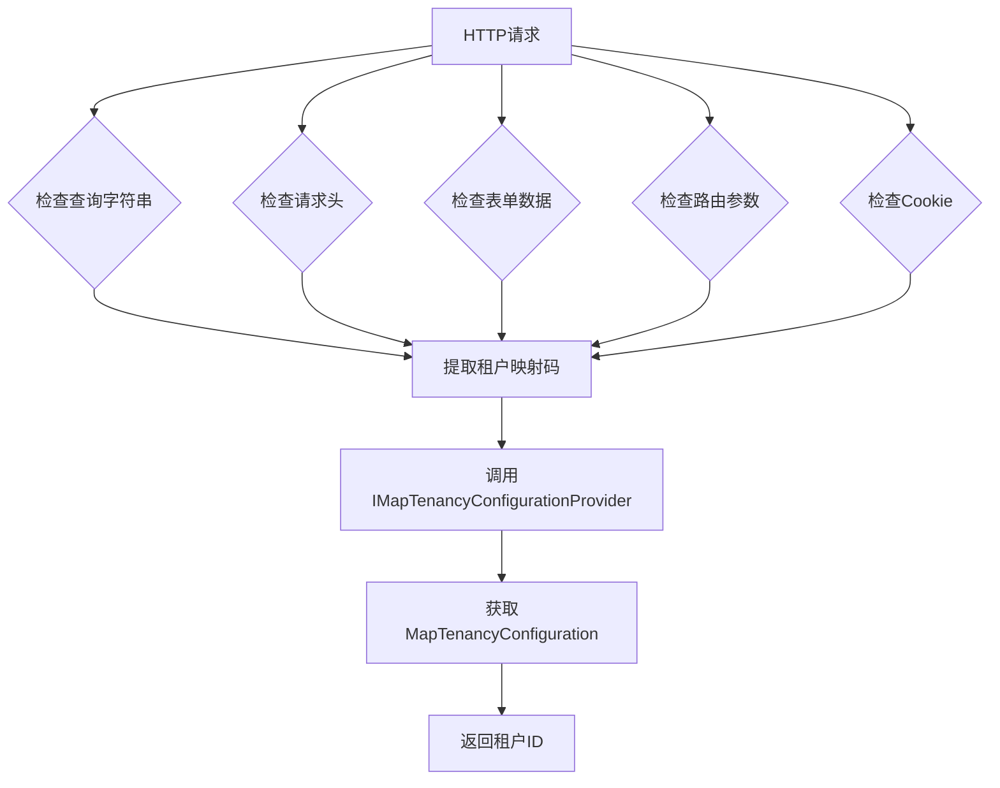

# 租户映射

<cite>
**本文档中引用的文件**  
- [AbpMapTenancyModule.cs](file://framework/src/SharpAbp.Abp.MapTenancy/SharpAbp/Abp/MapTenancy/AbpMapTenancyModule.cs)
- [AbpMapTenancyOptions.cs](file://framework/src/SharpAbp.Abp.MapTenancy/SharpAbp/Abp/MapTenancy/AbpMapTenancyOptions.cs)
- [IMapTenancyConfigurationProvider.cs](file://framework/src/SharpAbp.Abp.MapTenancy/SharpAbp/Abp/MapTenancy/IMapTenancyConfigurationProvider.cs)
- [DefaultMapTenancyConfigurationProvider.cs](file://framework/src/SharpAbp.Abp.MapTenancy/SharpAbp/Abp/MapTenancy/DefaultMapTenancyConfigurationProvider.cs)
- [MapTenancyConfiguration.cs](file://framework/src/SharpAbp.Abp.MapTenancy/SharpAbp/Abp/MapTenancy/MapTenancyConfiguration.cs)
- [MapTenancyConfigurations.cs](file://framework/src/SharpAbp.Abp.MapTenancy/SharpAbp/Abp/MapTenancy/MapTenancyConfigurations.cs)
- [MapTenantResolverConsts.cs](file://framework/src/SharpAbp.Abp.MapTenancy/SharpAbp/Abp/MapTenancy/MapTenantResolverConsts.cs)
- [AbpAspNetCoreMapTenancyModule.cs](file://framework/src/SharpAbp.Abp.AspNetCore.MapTenancy/SharpAbp/Abp/AspNetCore/MapTenancy/AbpAspNetCoreMapTenancyModule.cs)
- [AbpAspNetCoreMapTenancyOptions.cs](file://framework/src/SharpAbp.Abp.AspNetCore.MapTenancy/SharpAbp/Abp/AspNetCore/MapTenancy/AbpAspNetCoreMapTenancyOptions.cs)
- [MapHeaderTenantResolveContributor.cs](file://framework/src/SharpAbp.Abp.AspNetCore.MapTenancy/SharpAbp/Abp/AspNetCore/MapTenancy/MapHeaderTenantResolveContributor.cs)
- [MapQueryStringTenantResolveContributor.cs](file://framework/src/SharpAbp.Abp.AspNetCore.MapTenancy/SharpAbp/Abp/AspNetCore/MapTenancy/MapQueryStringTenantResolveContributor.cs)
- [MapRouteTenantResolveContributor.cs](file://framework/src/SharpAbp.Abp.AspNetCore.MapTenancy/SharpAbp/Abp/AspNetCore/MapTenancy/MapRouteTenantResolveContributor.cs)
- [MapFormTenantResolveContributor.cs](file://framework/src/SharpAbp.Abp.AspNetCore.MapTenancy/SharpAbp/Abp/AspNetCore/MapTenancy/MapFormTenantResolveContributor.cs)
- [MapCookieTenantResolveContributor.cs](file://framework/src/SharpAbp.Abp.AspNetCore.MapTenancy/SharpAbp/Abp/AspNetCore/MapTenancy/MapCookieTenantResolveContributor.cs)
</cite>

## 目录
1. [简介](#简介)
2. [核心功能概述](#核心功能概述)
3. [AbpMapTenancyOptions 配置选项](#abpmaptenancyoptions-配置选项)
4. [租户映射配置提供者与配置定义](#租户映射配置提供者与配置定义)
5. [AbpMapTenancyModule 模块入口点](#abpmaptenancymodule-模块入口点)
6. [租户解析贡献者](#租户解析贡献者)
7. [完整代码示例](#完整代码示例)
8. [总结](#总结)

## 简介
SharpAbp.Abp.MapTenancy 模块为多租户应用程序提供了灵活的租户映射机制。该模块允许将传入的HTTP请求中的特定标识（如查询字符串、请求头、路由参数等）映射到具体的租户，从而实现基于外部系统标识的租户识别。这种机制特别适用于需要与第三方系统集成或通过非标准方式识别租户的场景。

**Section sources**
- [AbpMapTenancyModule.cs](file://framework/src/SharpAbp.Abp.MapTenancy/SharpAbp/Abp/MapTenancy/AbpMapTenancyModule.cs#L1-L25)
- [AbpAspNetCoreMapTenancyModule.cs](file://framework/src/SharpAbp.Abp.AspNetCore.MapTenancy/SharpAbp/Abp/AspNetCore/MapTenancy/AbpAspNetCoreMapTenancyModule.cs#L1-L34)

## 核心功能概述
SharpAbp.Abp.MapTenancy 模块的核心功能是将传入的HTTP请求映射到特定的租户。它通过一个可扩展的机制，从HTTP请求的不同部分（如查询字符串、请求头、表单数据、路由参数和Cookie）提取租户标识，并将其转换为系统内部的租户ID。这一过程由多个“租户解析贡献者”(Tenant Resolve Contributor) 组件协同完成，每个贡献者负责处理一种特定的请求来源。



**Diagram sources**
- [MapQueryStringTenantResolveContributor.cs](file://framework/src/SharpAbp.Abp.AspNetCore.MapTenancy/SharpAbp/Abp/AspNetCore/MapTenancy/MapQueryStringTenantResolveContributor.cs)
- [MapHeaderTenantResolveContributor.cs](file://framework/src/SharpAbp.Abp.AspNetCore.MapTenancy/SharpAbp/Abp/AspNetCore/MapTenancy/MapHeaderTenantResolveContributor.cs)
- [MapFormTenantResolveContributor.cs](file://framework/src/SharpAbp.Abp.AspNetCore.MapTenancy/SharpAbp/Abp/AspNetCore/MapTenancy/MapFormTenantResolveContributor.cs)
- [MapRouteTenantResolveContributor.cs](file://framework/src/SharpAbp.Abp.AspNetCore.MapTenancy/SharpAbp/Abp/AspNetCore/MapTenancy/MapRouteTenantResolveContributor.cs)
- [MapCookieTenantResolveContributor.cs](file://framework/src/SharpAbp.Abp.AspNetCore.MapTenancy/SharpAbp/Abp/AspNetCore/MapTenancy/MapCookieTenantResolveContributor.cs)

## AbpMapTenancyOptions 配置选项
`AbpMapTenancyOptions` 类是模块的主要配置中心，它包含了一个 `MapTenancyConfigurations` 实例，用于存储所有租户映射规则。

### 主要属性
- **Mappers**: 一个 `MapTenancyConfigurations` 对象，用于管理所有的租户映射配置。

### 配置方法
- **Configure(IConfiguration configuration)**: 该方法允许从应用程序的配置文件（如appsettings.json）中加载租户映射配置。它会读取名为 "MapTenancyOptions" 的配置节，并将其反序列化为字典，然后逐个应用这些配置。

```json
{
  "MapTenancyOptions": {
    "tenant1-code": {
      "TenantId": "a1b2c3d4-e5f6-7890-g1h2-i3j4k5l6m7n8",
      "Code": "tenant1-code",
      "MapCode": "external-system-a"
    },
    "tenant2-code": {
      "TenantId": "o9p8q7r6-s5t4-u3v2-w1x0-y9z8a7b6c5d4",
      "Code": "tenant2-code",
      "MapCode": "external-system-b"
    }
  }
}
```

**Section sources**
- [AbpMapTenancyOptions.cs](file://framework/src/SharpAbp.Abp.MapTenancy/SharpAbp/Abp/MapTenancy/AbpMapTenancyOptions.cs#L1-L37)

## 租户映射配置提供者与配置定义
该模块通过 `IMapTenancyConfigurationProvider` 接口和 `MapTenancyConfiguration` 类来定义和管理租户映射规则。

### IMapTenancyConfigurationProvider 接口
此接口定义了获取租户映射配置的契约：
- **GetAsync(string code)**: 根据本地系统的代码（Code）获取对应的租户配置。
- **GetByMapCodeAsync(string mapCode)**: 根据第三方系统的映射码（MapCode）获取对应的租户配置。

### DefaultMapTenancyConfigurationProvider 实现
`DefaultMapTenancyConfigurationProvider` 是该接口的默认实现，它依赖于 `AbpMapTenancyOptions` 中的配置。它通过注入 `IOptions<AbpMapTenancyOptions>` 来访问预定义的映射规则，并根据传入的 `code` 或 `mapCode` 在内存中查找并返回相应的 `MapTenancyConfiguration`。

### MapTenancyConfiguration 类
此类定义了单个租户映射的详细信息：
- **TenantId**: 关联的租户唯一标识符 (Guid?)。
- **TenantName**: 租户名称 (string?)。
- **Code**: 本地系统使用的代码 (string?)。
- **MapCode**: 第三方系统使用的映射码 (string?)