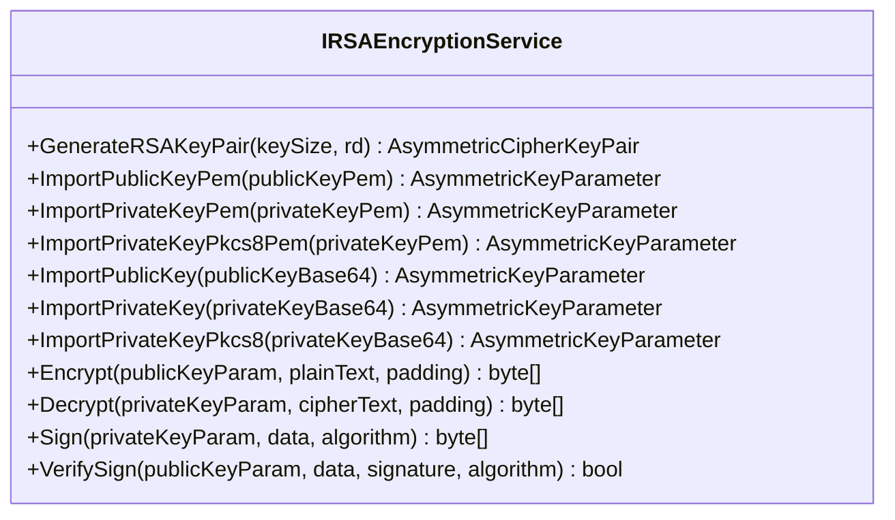
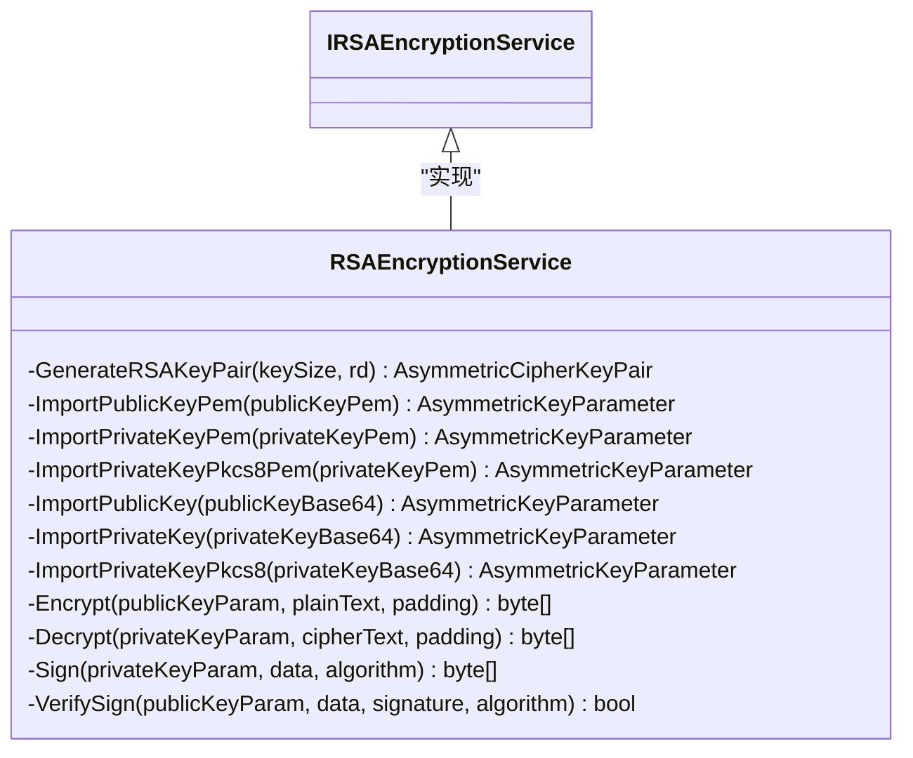
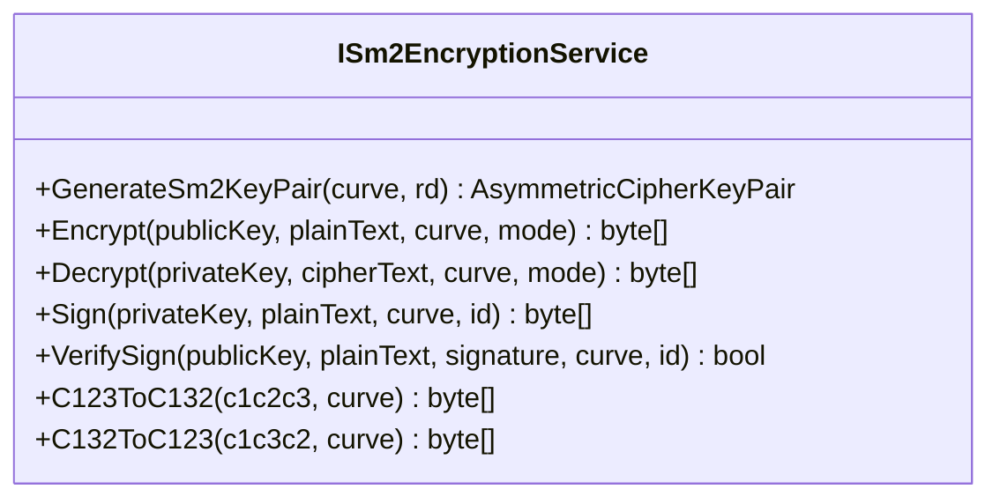
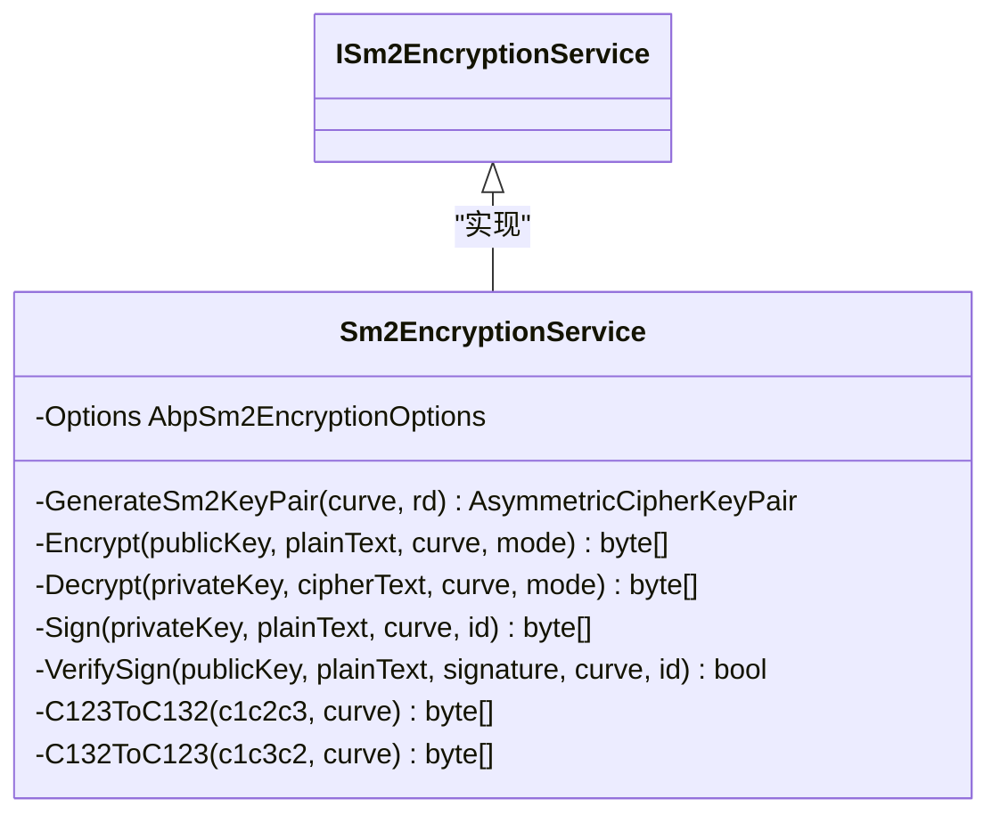

# 加密服务

<cite>
**本文档中引用的文件**
- [AbpCryptoModule.cs](file://framework/src/SharpAbp.Abp.Crypto/SharpAbp/Abp/Crypto/AbpCryptoModule.cs)
- [IRSAEncryptionService.cs](file://framework/src/SharpAbp.Abp.Crypto/SharpAbp/Abp/Crypto/RSA/IRSAEncryptionService.cs)
- [RSAEncryptionService.cs](file://framework/src/SharpAbp.Abp.Crypto/SharpAbp/Abp/Crypto/RSA/RSAEncryptionService.cs)
- [ISm2EncryptionService.cs](file://framework/src/SharpAbp.Abp.Crypto/SharpAbp/Abp/Crypto/SM2/ISm2EncryptionService.cs)
- [Sm2EncryptionService.cs](file://framework/src/SharpAbp.Abp.Crypto/SharpAbp/Abp/Crypto/SM2/Sm2EncryptionService.cs)
- [ISm3EncryptionService.cs](file://framework/src/SharpAbp.Abp.Crypto/SharpAbp/Abp/Crypto/SM3/ISm3EncryptionService.cs)
- [Sm3EncryptionService.cs](file://framework/src/SharpAbp.Abp.Crypto/SharpAbp/Abp/Crypto/SM3/Sm3EncryptionService.cs)
- [ISm4EncryptionService.cs](file://framework/src/SharpAbp.Abp.Crypto/SharpAbp/Abp/Crypto/SM4/ISm4EncryptionService.cs)
- [Sm4EncryptionService.cs](file://framework/src/SharpAbp.Abp.Crypto/SharpAbp/Abp/Crypto/SM4/Sm4EncryptionService.cs)
- [AbpSm2EncryptionOptions.cs](file://framework/src/SharpAbp.Abp.Crypto/SharpAbp/Abp/Crypto/SM2/AbpSm2EncryptionOptions.cs)
- [AbpSm4EncryptionOptions.cs](file://framework/src/SharpAbp.Abp.Crypto/SharpAbp/Abp/Crypto/SM4/AbpSm4EncryptionOptions.cs)
</cite>

## 目录
1. [简介](#简介)
2. [核心加密算法支持](#核心加密算法支持)
3. [RSA加密服务](#rsa加密服务)
4. [国密SM2非对称加密](#国密sm2非对称加密)
5. [国密SM3哈希算法](#国密sm3哈希算法)
6. [国密SM4对称加密](#国密sm4对称加密)
7. [配置选项](#配置选项)
8. [代码示例](#代码示例)
9. [应用场景](#应用场景)

## 简介
sharp-abp加密模块提供了一套完整的加密解决方案，支持多种国际和国家标准的加密算法。该模块基于BouncyCastle密码库实现，提供了统一的接口设计和依赖注入集成，便于在ABP框架应用中使用。本模块主要包含RSA非对称加密、国密SM2非对称加密、国密SM3哈希算法和国密SM4对称加密四大功能组件。

**Section sources**
- [AbpCryptoModule.cs](file://framework/src/SharpAbp.Abp.Crypto/SharpAbp/Abp/Crypto/AbpCryptoModule.cs)

## 核心加密算法支持
sharp-abp加密模块支持以下核心加密算法：

- **RSA非对称加密**：支持PKCS#1和PKCS#8格式的密钥导入导出，提供加解密、签名和验签功能
- **国密SM2非对称加密**：符合中国国家密码管理局标准的椭圆曲线公钥密码算法
- **国密SM3哈希算法**：符合中国国家密码管理局标准的密码杂凑算法
- **国密SM4对称加密**：符合中国国家密码管理局标准的分组密码算法

这些算法通过统一的接口设计和实现类提供服务，确保了API的一致性和易用性。

**Section sources**
- [AbpCryptoModule.cs](file://framework/src/SharpAbp.Abp.Crypto/SharpAbp/Abp/Crypto/AbpCryptoModule.cs)

## RSA加密服务
### IRSAEncryptionService接口
`IRSAEncryptionService`接口定义了RSA加密服务的核心功能，包括密钥生成、密钥导入、加解密和签名验签操作。

**Diagram sources**
- [IRSAEncryptionService.cs](file://framework/src/SharpAbp.Abp.Crypto/SharpAbp/Abp/Crypto/RSA/IRSAEncryptionService.cs)

### RSAEncryptionService实现
`RSAEncryptionService`类实现了`IRSAEncryptionService`接口，提供了完整的RSA加解密、签名和验签功能。该实现支持多种密钥格式，包括PEM格式和Base64编码的DER格式。

**Diagram sources**
- [RSAEncryptionService.cs](file://framework/src/SharpAbp.Abp.Crypto/SharpAbp/Abp/Crypto/RSA/RSAEncryptionService.cs)

### 扩展方法
模块提供了丰富的扩展方法，简化了字符串加解密和Base64编码的操作。这些扩展方法支持从PEM格式或Base64编码的密钥进行操作，提高了API的易用性。

**Section sources**
- [IRSAEncryptionService.cs](file://framework/src/SharpAbp.Abp.Crypto/SharpAbp/Abp/Crypto/RSA/IRSAEncryptionService.cs)
- [RSAEncryptionService.cs](file://framework/src/SharpAbp.Abp.Crypto/SharpAbp/Abp/Crypto/RSA/RSAEncryptionService.cs)
- [RSAEncryptionServiceExtensions.cs](file://framework/src/SharpAbp.Abp.Crypto/SharpAbp/Abp/Crypto/RSA/RSAEncryptionServiceExtensions.cs)

## 国密SM2非对称加密
### ISm2EncryptionService接口
`ISm2EncryptionService`接口定义了SM2加密服务的功能，包括密钥生成、加解密、签名验签以及密文格式转换。

**Diagram sources**
- [ISm2EncryptionService.cs](file://framework/src/SharpAbp.Abp.Crypto/SharpAbp/Abp/Crypto/SM2/ISm2EncryptionService.cs)

### Sm2EncryptionService实现
`Sm2EncryptionService`类实现了`ISm2EncryptionService`接口，提供了完整的SM2算法支持。该实现支持SM2p256v1曲线，并允许通过配置指定默认曲线。

**Diagram sources**
- [Sm2EncryptionService.cs](file://framework/src/SharpAbp.Abp.Crypto/SharpAbp/Abp/Crypto/SM2/Sm2EncryptionService.cs)

**Section sources**
- [ISm2EncryptionService.cs](file://framework/src/SharpAbp.Abp.Crypto/SharpAbp/Abp/Crypto/SM2/ISm2EncryptionService.cs)
- [Sm2EncryptionService.cs](file://framework/src/SharpAbp.Abp.Crypto/SharpAbp/Abp/Crypto/SM2/Sm2EncryptionService.cs)

## 国密SM3哈希算法
### ISm3EncryptionService接口
`ISm3EncryptionService`接口定义了SM3哈希算法的基本功能，仅包含一个计算消息