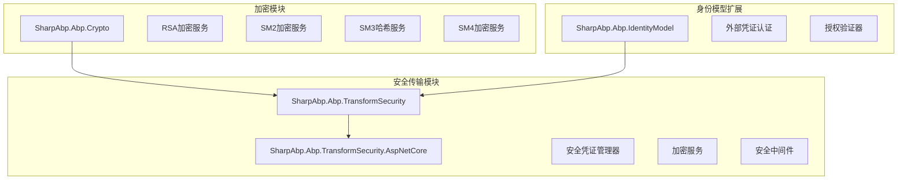
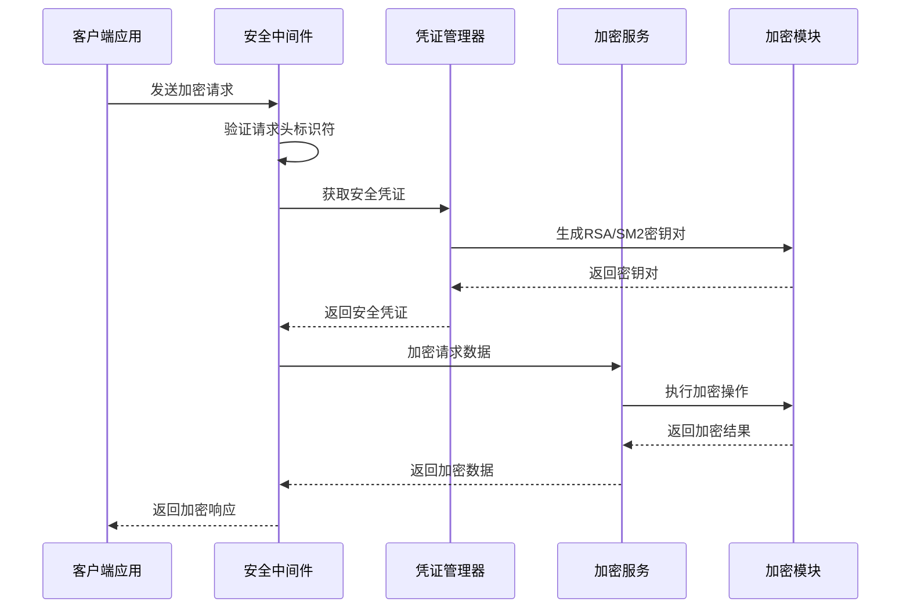
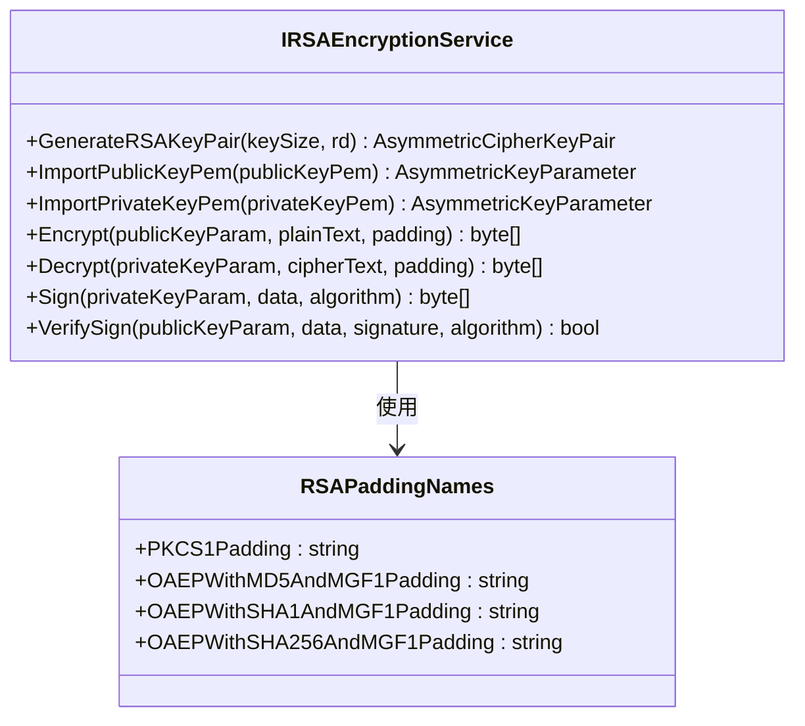
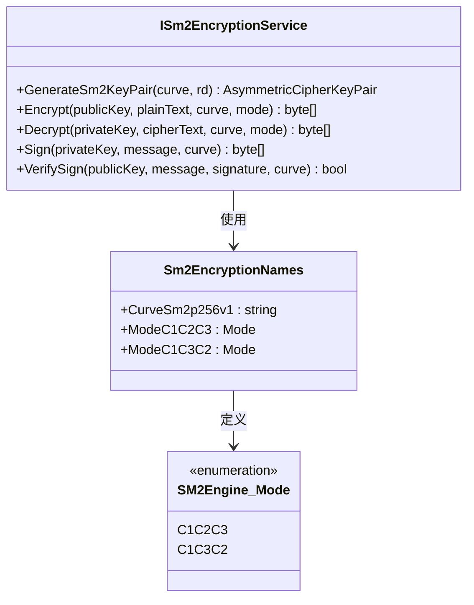
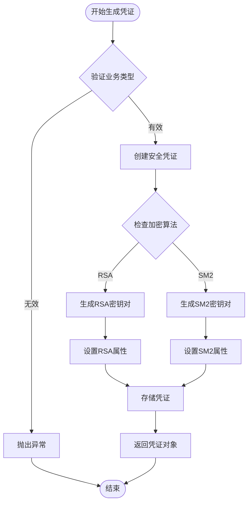
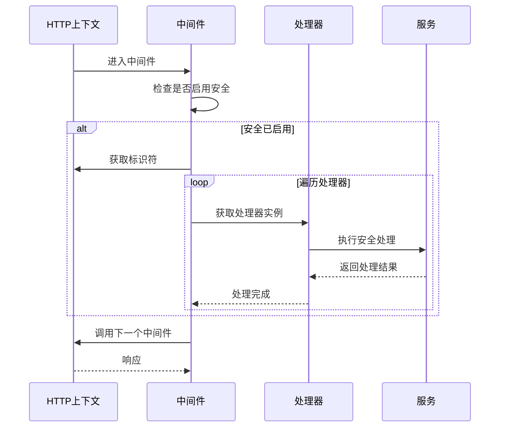
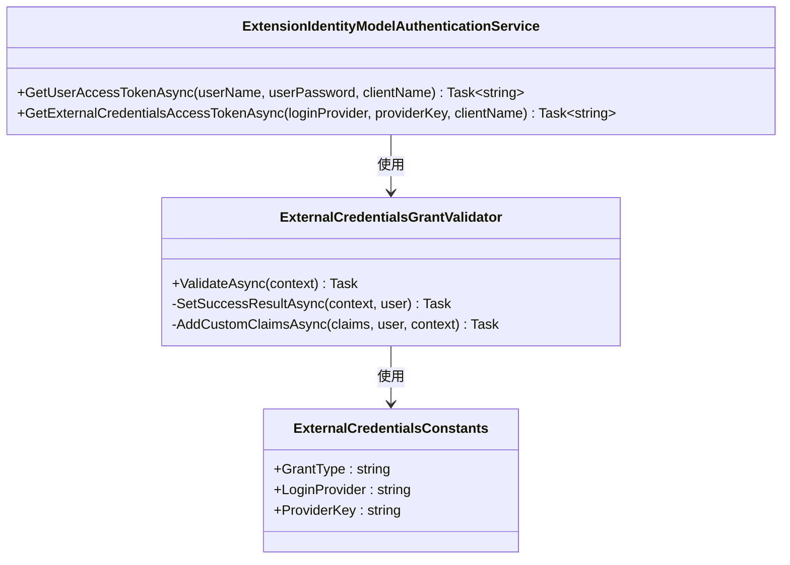
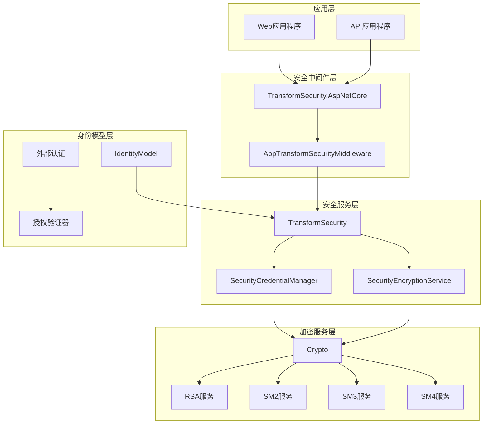

# 安全

<cite>
**本文档引用的文件**
- [AbpCryptoModule.cs](file://framework/src/SharpAbp.Abp.Crypto/SharpAbp/Abp/Crypto/AbpCryptoModule.cs)
- [IRSAEncryptionService.cs](file://framework/src/SharpAbp.Abp.Crypto/SharpAbp/Abp/Crypto/RSA/IRSAEncryptionService.cs)
- [ISm2EncryptionService.cs](file://framework/src/SharpAbp.Abp.Crypto/SharpAbp/Abp/Crypto/SM2/ISm2EncryptionService.cs)
- [ISm3EncryptionService.cs](file://framework/src/SharpAbp.Abp.Crypto/SharpAbp/Abp/Crypto/SM3/ISm3EncryptionService.cs)
- [ISm4EncryptionService.cs](file://framework/src/SharpAbp.Abp.Crypto/SharpAbp/Abp/Crypto/SM4/ISm4EncryptionService.cs)
- [SecurityCredentialManager.cs](file://framework/src/SharpAbp.Abp.TransformSecurity/SharpAbp/Abp/TransformSecurity/SecurityCredentialManager.cs)
- [SecurityEncryptionService.cs](file://framework/src/SharpAbp.Abp.TransformSecurity/SharpAbp/Abp/TransformSecurity/SecurityEncryptionService.cs)
- [AbpTransformSecurityMiddleware.cs](file://framework/src/SharpAbp.Abp.TransformSecurity.AspNetCore/SharpAbp/Abp/TransformSecurity/AspNetCore/AbpTransformSecurityMiddleware.cs)
- [AbpIdentityModelModule.cs](file://framework/src/SharpAbp.Abp.IdentityModel/SharpAbp/Abp/IdentityModel/AbpIdentityModelModule.cs)
- [ExtensionIdentityModelAuthenticationService.cs](file://framework/src/SharpAbp.Abp.IdentityModel/SharpAbp/Abp/IdentityModel/ExtensionIdentityModelAuthenticationService.cs)
- [AbpTransformSecurityOptions.cs](file://framework/src/SharpAbp.Abp.TransformSecurity/SharpAbp/Abp/TransformSecurity/AbpTransformSecurityOptions.cs)
- [AbpTransformSecurityRSAOptions.cs](file://framework/src/SharpAbp.Abp.TransformSecurity/SharpAbp/Abp/TransformSecurity/AbpTransformSecurityRSAOptions.cs)
- [AbpTransformSecuritySM2Options.cs](file://framework/src/SharpAbp.Abp.TransformSecurity/SharpAbp/Abp/TransformSecurity/AbpTransformSecuritySM2Options.cs)
- [AbpTransformSecurityNames.cs](file://framework/src/SharpAbp.Abp.TransformSecurity/SharpAbp/Abp/TransformSecurity/AbpTransformSecurityNames.cs)
- [ExternalCredentialsGrantValidator.cs](file://modules/IdentityServer/src/SharpAbp.Abp.IdentityServer.Extensions/SharpAbp/Abp/IdentityServer/Extensions/ExternalCredentialsGrantValidator.cs)
</cite>

## 目录
1. [简介](#简介)
2. [项目结构](#项目结构)
3. [核心组件](#核心组件)
4. [架构概览](#架构概览)
5. [详细组件分析](#详细组件分析)
6. [依赖关系分析](#依赖关系分析)
7. [性能考虑](#性能考虑)
8. [故障排除指南](#故障排除指南)
9. [结论](#结论)

## 简介

SharpAbp安全特性模块是一套全面的安全解决方案，专注于加密、安全传输和身份模型集成。该框架提供了对多种加密算法的支持，包括RSA、SM2、SM3、SM4等国密标准算法，并实现了安全凭证管理和传输层安全保护。

主要特性包括：
- 多种加密算法支持（RSA、SM2、SM3、SM4）
- 安全凭证管理系统
- 请求加解密中间件
- 扩展的身份认证模型
- 支持外部凭证获取

## 项目结构

SharpAbp安全特性模块采用分层架构设计，主要包含以下核心模块：

**图表来源**
- [AbpCryptoModule.cs](file://framework/src/SharpAbp.Abp.Crypto/SharpAbp/Abp/Crypto/AbpCryptoModule.cs#L1-L33)
- [AbpTransformSecurityModule.cs](file://framework/src/SharpAbp.Abp.TransformSecurity/SharpAbp/Abp/TransformSecurity/AbpTransformSecurityModule.cs#L1-L40)
- [AbpIdentityModelModule.cs](file://framework/src/SharpAbp.Abp.IdentityModel/SharpAbp/Abp/IdentityModel/AbpIdentityModelModule.cs#L1-L13)

## 核心组件

### 加密服务模块

SharpAbp.Abp.Crypto模块提供了完整的加密服务基础设施：

#### RSA加密服务
- **IRSAEncryptionService接口**：定义了RSA加密的核心操作
- **密钥生成**：支持指定密钥长度和随机数生成器
- **公私钥导入**：支持PEM和Base64格式的密钥导入
- **加密解密**：支持多种填充模式
- **数字签名**：支持SHA1、SHA256、SHA384、SHA512算法

#### SM2国密算法支持
- **ISm2EncryptionService接口**：提供SM2椭圆曲线加密服务
- **密钥对生成**：支持自定义曲线参数
- **加密模式**：支持C1C2C3等多种加密模式
- **曲线支持**：默认使用sm2p256v1曲线

#### SM3哈希服务
- **ISm3EncryptionService接口**：提供SM3消息摘要服务
- **哈希计算**：支持字节数组输入的哈希计算

#### SM4对称加密
- **ISm4EncryptionService接口**：提供SM4分组密码服务
- **加密模式**：支持ECB、CBC等模式
- **填充方式**：支持多种填充方式

**章节来源**
- [IRSAEncryptionService.cs](file://framework/src/SharpAbp.Abp.Crypto/SharpAbp/Abp/Crypto/RSA/IRSAEncryptionService.cs#L1-L99)
- [ISm2EncryptionService.cs](file://framework/src/SharpAbp.Abp.Crypto/SharpAbp/Abp/Crypto/SM2/ISm2EncryptionService.cs#L1-L26)
- [ISm3EncryptionService.cs](file://framework/src/SharpAbp.Abp.Crypto/SharpAbp/Abp/Crypto/SM3/ISm3EncryptionService.cs#L1-L11)

### 安全传输模块

#### 安全凭证管理器
- **SecurityCredentialManager**：负责生成和管理安全凭证
- **多算法支持**：支持RSA和SM2两种加密算法
- **业务类型验证**：确保只为配置的业务类型生成凭证
- **自动存储**：生成的凭证自动存储到凭证存储中

#### 加密服务
- **SecurityEncryptionService**：提供统一的加密解密接口
- **凭证验证**：验证请求标识符的有效性
- **异步操作**：支持异步加密解密操作
- **错误处理**：完善的异常处理机制

#### 安全中间件
- **AbpTransformSecurityMiddleware**：ASP.NET Core中间件
- **请求拦截**：拦截HTTP请求并进行安全处理
- **处理器链**：支持多个安全处理器按顺序执行
- **异常恢复**：中间件异常时返回适当的错误响应

**章节来源**
- [SecurityCredentialManager.cs](file://framework/src/SharpAbp.Abp.TransformSecurity/SharpAbp/Abp/TransformSecurity/SecurityCredentialManager.cs#L1-L150)
- [SecurityEncryptionService.cs](file://framework/src/SharpAbp.Abp.TransformSecurity/SharpAbp/Abp/TransformSecurity/SecurityEncryptionService.cs#L1-L40)
- [AbpTransformSecurityMiddleware.cs](file://framework/src/SharpAbp.Abp.TransformSecurity.AspNetCore/SharpAbp/Abp/TransformSecurity/AspNetCore/AbpTransformSecurityMiddleware.cs#L1-L56)

### 身份模型扩展

#### 外部凭证认证
- **ExternalCredentials**：支持外部系统凭证认证
- **登录提供商**：支持多种登录提供商
- **提供者密钥**：支持外部系统的唯一标识
- **令牌获取**：自动获取访问令牌

#### 授权验证器
- **ExternalCredentialsGrantValidator**：外部凭证授权验证器
- **登录提供商验证**：验证登录提供商的有效性
- **提供者密钥验证**：验证提供者密钥的有效性
- **用户认证**：完成外部用户的认证流程

**章节来源**
- [ExtensionIdentityModelAuthenticationService.cs](file://framework/src/SharpAbp.Abp.IdentityModel/SharpAbp/Abp/IdentityModel/ExtensionIdentityModelAuthenticationService.cs#L32-L89)
- [ExternalCredentialsGrantValidator.cs](file://modules/IdentityServer/src/SharpAbp.Abp.IdentityServer.Extensions/SharpAbp/Abp/IdentityServer/Extensions/ExternalCredentialsGrantValidator.cs#L31-L176)

## 架构概览

SharpAbp安全特性采用分层架构设计，各模块职责明确，相互协作：

**图表来源**
- [AbpTransformSecurityMiddleware.cs](file://framework/src/SharpAbp.Abp.TransformSecurity.AspNetCore/SharpAbp/Abp/TransformSecurity/AspNetCore/AbpTransformSecurityMiddleware.cs#L30-L54)
- [SecurityCredentialManager.cs](file://framework/src/SharpAbp.Abp.TransformSecurity/SharpAbp/Abp/TransformSecurity/SecurityCredentialManager.cs#L75-L110)

## 详细组件分析

### RSA加密服务详细分析

RSA加密服务是基于BouncyCastle库实现的完整RSA加密解决方案：

**图表来源**
- [IRSAEncryptionService.cs](file://framework/src/SharpAbp.Abp.Crypto/SharpAbp/Abp/Crypto/RSA/IRSAEncryptionService.cs#L7-L98)

#### 主要功能特性

1. **密钥生成**：支持指定密钥长度（默认2048位）和自定义随机数生成器
2. **密钥导入**：支持PEM格式和Base64编码的公私钥导入
3. **加密填充**：支持多种RSA填充模式，包括PKCS#1 v1.5和OAEP填充
4. **数字签名**：支持多种哈希算法的数字签名和验证

**章节来源**
- [IRSAEncryptionService.cs](file://framework/src/SharpAbp.Abp.Crypto/SharpAbp/Abp/Crypto/RSA/IRSAEncryptionService.cs#L1-L99)

### SM2国密算法详细分析

SM2是中国国家密码标准的椭圆曲线公钥密码算法：

**图表来源**
- [ISm2EncryptionService.cs](file://framework/src/SharpAbp.Abp.Crypto/SharpAbp/Abp/Crypto/SM2/ISm2EncryptionService.cs#L7-L26)

#### 国密标准支持

1. **椭圆曲线**：默认使用sm2p256v1曲线，符合中国国家密码标准
2. **加密模式**：支持C1C2C3和C1C3C2两种加密模式
3. **签名验证**：支持SM2数字签名和验证
4. **密钥管理**：完整的密钥生成、导入导出功能

**章节来源**
- [ISm2EncryptionService.cs](file://framework/src/SharpAbp.Abp.Crypto/SharpAbp/Abp/Crypto/SM2/ISm2EncryptionService.cs#L1-L26)

### 安全凭证管理器详细分析

安全凭证管理器是整个安全传输系统的核心组件：

**图表来源**
- [SecurityCredentialManager.cs](file://framework/src/SharpAbp.Abp.TransformSecurity/SharpAbp/Abp/TransformSecurity/SecurityCredentialManager.cs#L75-L110)

#### 工作流程

1. **业务类型验证**：确保只为配置的业务类型生成凭证
2. **算法选择**：根据配置选择RSA或SM2算法
3. **密钥生成**：调用相应的加密服务生成密钥对
4. **属性设置**：设置凭证的业务类型、过期时间等属性
5. **存储管理**：将凭证存储到持久化存储中
6. **返回结果**：返回完整的安全凭证对象

**章节来源**
- [SecurityCredentialManager.cs](file://framework/src/SharpAbp.Abp.TransformSecurity/SharpAbp/Abp/TransformSecurity/SecurityCredentialManager.cs#L75-L110)

### 安全中间件详细分析

安全中间件作为ASP.NET Core管道中的关键组件：

**图表来源**
- [AbpTransformSecurityMiddleware.cs](file://framework/src/SharpAbp.Abp.TransformSecurity.AspNetCore/SharpAbp/Abp/TransformSecurity/AspNetCore/AbpTransformSecurityMiddleware.cs#L30-L54)

#### 中间件特性

1. **请求拦截**：在请求处理管道中拦截HTTP请求
2. **标识符提取**：从请求头中提取安全标识符
3. **处理器链**：支持多个安全处理器按顺序执行
4. **异常处理**：捕获并处理中间件执行过程中的异常
5. **响应控制**：在异常情况下返回适当的错误响应

**章节来源**
- [AbpTransformSecurityMiddleware.cs](file://framework/src/SharpAbp.Abp.TransformSecurity.AspNetCore/SharpAbp/Abp/TransformSecurity/AspNetCore/AbpTransformSecurityMiddleware.cs#L1-L56)

### 身份模型扩展详细分析

身份模型扩展模块增强了ABP框架的身份认证能力：

**图表来源**
- [ExtensionIdentityModelAuthenticationService.cs](file://framework/src/SharpAbp.Abp.IdentityModel/SharpAbp/Abp/IdentityModel/ExtensionIdentityModelAuthenticationService.cs#L32-L89)
- [ExternalCredentialsGrantValidator.cs](file://modules/IdentityServer/src/SharpAbp.Abp.IdentityServer.Extensions/SharpAbp/Abp/IdentityServer/Extensions/ExternalCredentialsGrantValidator.cs#L31-L176)

#### 外部凭证认证流程

1. **凭证获取**：通过用户名密码或外部凭证获取访问令牌
2. **授权验证**：验证外部凭证的有效性
3. **用户认证**：完成外部用户的认证流程
4. **令牌颁发**：为认证成功的用户提供访问令牌
5. **声明添加**：可选地添加自定义声明

**章节来源**
- [ExtensionIdentityModelAuthenticationService.cs](file://framework/src/SharpAbp.Abp.IdentityModel/SharpAbp/Abp/IdentityModel/ExtensionIdentityModelAuthenticationService.cs#L32-L89)
- [ExternalCredentialsGrantValidator.cs](file://modules/IdentityServer/src/SharpAbp.Abp.IdentityServer.Extensions/SharpAbp/Abp/IdentityServer/Extensions/ExternalCredentialsGrantValidator.cs#L31-L176)

## 依赖关系分析

SharpAbp安全特性模块的依赖关系体现了清晰的分层架构：

**图表来源**
- [AbpTransformSecurityModule.cs](file://framework/src/SharpAbp.Abp.TransformSecurity/SharpAbp/Abp/TransformSecurity/AbpTransformSecurityModule.cs#L1-L40)
- [AbpCryptoModule.cs](file://framework/src/SharpAbp.Abp.Crypto/SharpAbp/Abp/Crypto/AbpCryptoModule.cs#L1-L33)

### 模块依赖关系

1. **TransformSecurity依赖于Crypto**：安全传输模块依赖加密服务模块
2. **TransformSecurity.AspNetCore依赖于TransformSecurity**：中间件层依赖核心安全服务
3. **IdentityModel扩展了基础IdentityModel**：增强身份认证功能
4. **各加密服务独立存在**：提供通用的加密功能支持

**章节来源**
- [AbpTransformSecurityModule.cs](file://framework/src/SharpAbp.Abp.TransformSecurity/SharpAbp/Abp/TransformSecurity/AbpTransformSecurityModule.cs#L1-L40)
- [AbpCryptoModule.cs](file://framework/src/SharpAbp.Abp.Crypto/SharpAbp/Abp/Crypto/AbpCryptoModule.cs#L1-L33)

## 性能考虑

### 加密性能优化

1. **密钥缓存**：安全凭证可以缓存以减少重复生成开销
2. **异步操作**：所有加密解密操作都支持异步执行
3. **算法选择**：根据业务需求选择合适的加密算法
4. **内存管理**：及时释放加密密钥和敏感数据

### 中间件性能

1. **短路执行**：当安全功能未启用时跳过处理
2. **处理器优化**：每个安全处理器应该高效执行
3. **异常处理**：避免异常传播影响整体性能
4. **资源释放**：正确释放HTTP上下文和相关资源

### 缓存策略

1. **凭证缓存**：短期缓存有效的安全凭证
2. **配置缓存**：缓存加密算法配置信息
3. **密钥缓存**：缓存常用的加密密钥
4. **令牌缓存**：缓存身份认证令牌

## 故障排除指南

### 常见问题及解决方案

#### 加密服务初始化失败

**症状**：无法获取加密服务实例
**原因**：依赖注入配置错误或模块未正确注册
**解决方案**：
1. 确保AbpCryptoModule已正确注册
2. 检查服务容器配置
3. 验证依赖项是否正确解析

#### 安全凭证生成失败

**症状**：生成安全凭证时抛出异常
**原因**：业务类型不支持或加密算法配置错误
**解决方案**：
1. 检查AbpTransformSecurityOptions.BizTypes配置
2. 验证加密算法设置是否正确
3. 确认密钥生成服务可用性

#### 中间件处理异常

**症状**：中间件执行过程中出现异常
**原因**：处理器链配置错误或请求数据格式不正确
**解决方案**：
1. 检查MiddlewareHandlers配置
2. 验证请求头标识符格式
3. 添加适当的异常日志记录

**章节来源**
- [SecurityCredentialManager.cs](file://framework/src/SharpAbp.Abp.TransformSecurity/SharpAbp/Abp/TransformSecurity/SecurityCredentialManager.cs#L95-L110)
- [AbpTransformSecurityMiddleware.cs](file://framework/src/SharpAbp.Abp.TransformSecurity.AspNetCore/SharpAbp/Abp/TransformSecurity/AspNetCore/AbpTransformSecurityMiddleware.cs#L35-L50)

## 结论

SharpAbp安全特性模块提供了一套完整而强大的安全解决方案，涵盖了现代应用开发所需的各个方面：

### 主要优势

1. **全面的加密支持**：同时支持国际标准（RSA）和国密标准（SM2、SM3、SM4）
2. **灵活的架构设计**：模块化设计便于扩展和维护
3. **完善的中间件支持**：无缝集成到ASP.NET Core生态系统
4. **强大的身份模型扩展**：支持外部凭证认证和扩展授权流程

### 最佳实践建议

1. **算法选择**：根据安全需求和合规要求选择合适的加密算法
2. **配置管理**：合理配置安全参数和过期时间
3. **监控告警**：建立完善的安全事件监控和告警机制
4. **定期更新**：及时更新加密算法和安全补丁

### 未来发展方向

1. **更多加密算法支持**：考虑支持更多的国密算法标准
2. **硬件安全模块集成**：支持HSM硬件安全模块
3. **零信任架构支持**：适应零信任安全模型的需求
4. **云原生安全**：更好地支持容器化和微服务架构

通过合理使用SharpAbp安全特性模块，开发者可以构建安全可靠的应用程序，满足各种安全合规要求和业务需求。