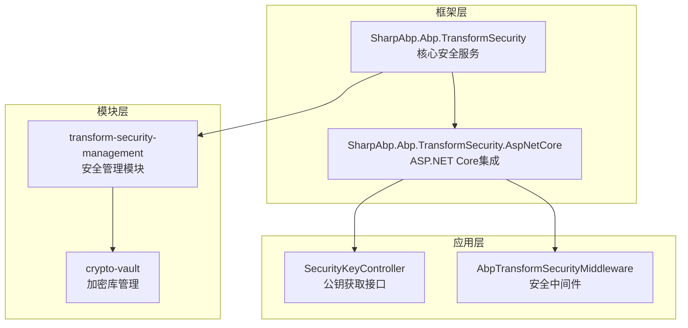
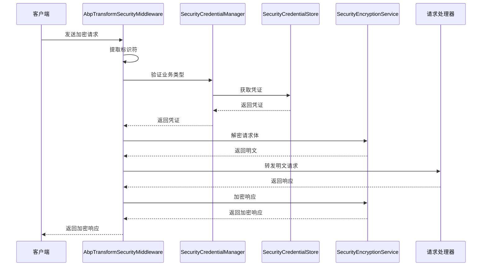
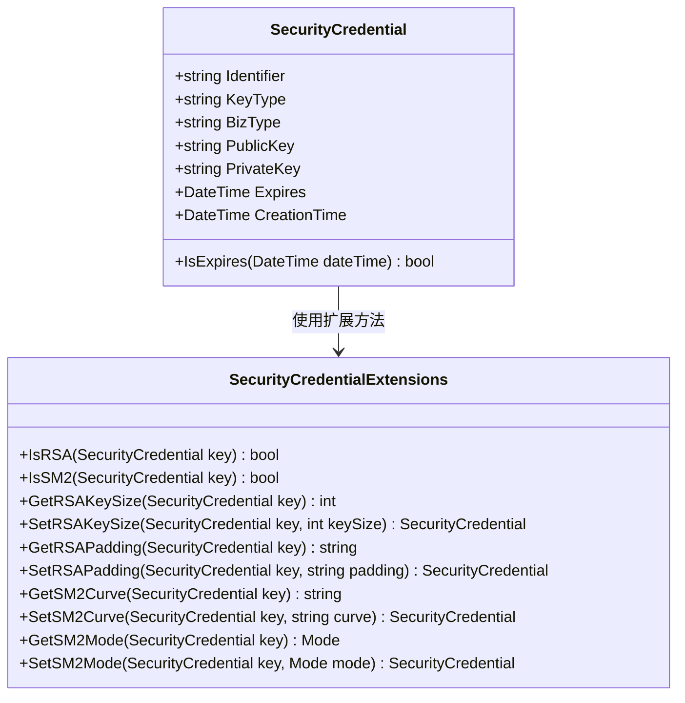
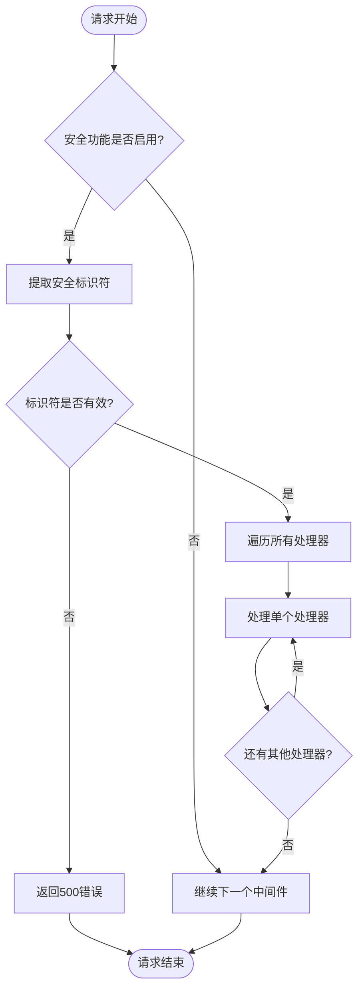
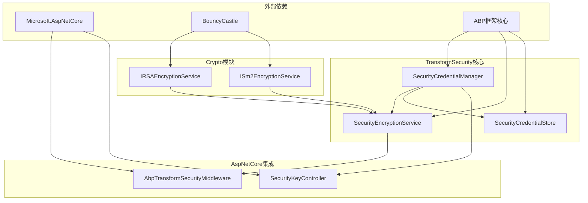

# 安全传输

<cite>
**本文档中引用的文件**
- [SecurityCredentialManager.cs](file://framework/src/SharpAbp.Abp.TransformSecurity/SharpAbp/Abp/TransformSecurity/SecurityCredentialManager.cs)
- [SecurityEncryptionService.cs](file://framework/src/SharpAbp.Abp.TransformSecurity/SharpAbp/TransformSecurity/SecurityEncryptionService.cs)
- [AbpTransformSecurityMiddleware.cs](file://framework/src/SharpAbp.Abp.TransformSecurity.AspNetCore/SharpAbp/Abp/TransformSecurity/AspNetCore/AbpTransformSecurityMiddleware.cs)
- [SecurityKeyController.cs](file://framework/src/SharpAbp.Abp.TransformSecurity.AspNetCore/SharpAbp/TransformSecurity/AspNetCore/Controllers/SecurityKeyController.cs)
- [SecurityCredential.cs](file://framework/src/SharpAbp.Abp.TransformSecurity/SharpAbp/TransformSecurity/SecurityCredential.cs)
- [SecurityCredentialExtensions.cs](file://framework/src/SharpAbp.Abp.TransformSecurity/SharpAbp/TransformSecurity/SecurityCredentialExtensions.cs)
- [AbpTransformSecurityModule.cs](file://framework/src/SharpAbp.Abp.TransformSecurity/SharpAbp/TransformSecurity/AbpTransformSecurityModule.cs)
- [AbpTransformSecurityOptions.cs](file://framework/src/SharpAbp.Abp.TransformSecurity/SharpAbp/TransformSecurity/AbpTransformSecurityOptions.cs)
- [SecurityCredentialStore.cs](file://framework/src/SharpAbp.Abp.TransformSecurity/SharpAbp/TransformSecurity/SecurityCredentialStore.cs)
- [SecurityCredentialManagerTest.cs](file://framework/test/SharpAbp.Abp.TransformSecurity.Tests/SharpAbp/Abp/TransformSecurity/SecurityCredentialManagerTest.cs)
</cite>

## 目录
1. [简介](#简介)
2. [项目结构](#项目结构)
3. [核心组件](#核心组件)
4. [架构概览](#架构概览)
5. [详细组件分析](#详细组件分析)
6. [依赖关系分析](#依赖关系分析)
7. [性能考虑](#性能考虑)
8. [故障排除指南](#故障排除指南)
9. [结论](#结论)

## 简介

sharp-abp的安全传输功能是一个强大的数据保护系统，专门设计用于在HTTP请求层面实现数据的加密和解密。该系统通过提供端到端的加密解决方案，确保敏感数据在传输过程中的安全性，同时保持系统的高性能和可扩展性。

安全传输功能的核心特性包括：
- 基于RSA和SM2算法的双重加密支持
- 动态安全凭证管理
- 中间件级别的自动加密/解密
- RESTful API接口支持
- 分布式缓存机制
- 支持多种业务类型

## 项目结构

安全传输功能的项目结构遵循清晰的分层架构，主要包含以下核心模块：



**图表来源**
- [AbpTransformSecurityModule.cs](file://framework/src/SharpAbp.Abp.TransformSecurity/SharpAbp/Abp/TransformSecurity/AbpTransformSecurityModule.cs#L1-L71)
- [AbpTransformSecurityMiddleware.cs](file://framework/src/SharpAbp.Abp.TransformSecurity.AspNetCore/SharpAbp/Abp/TransformSecurity/AspNetCore/AbpTransformSecurityMiddleware.cs#L1-L56)

**章节来源**
- [AbpTransformSecurityModule.cs](file://framework/src/SharpAbp.Abp.TransformSecurity/SharpAbp/TransformSecurity/AbpTransformSecurityModule.cs#L1-L71)

## 核心组件

### SecurityCredentialManager - 安全凭证管理器

`SecurityCredentialManager`是整个安全传输系统的核心组件，负责管理安全凭证的生命周期，包括凭证的创建、验证和存储。

```csharp
// 核心属性和依赖注入
protected AbpTransformSecurityOptions Options { get; }
protected ISecurityCredentialStore SecurityCredentialStore { get; }
protected IRSAEncryptionService RSAEncryptionService { get; }
protected ISm2EncryptionService Sm2EncryptionService { get; }
```

该组件的主要职责包括：
- **凭证生成**：根据业务类型动态生成RSA或SM2密钥对
- **业务类型验证**：确保只为配置的支持业务类型生成凭证
- **密钥管理**：处理公钥和私钥的格式化和存储
- **过期管理**：自动处理凭证的过期时间

### SecurityEncryptionService - 加密服务

`SecurityEncryptionService`提供了统一的加密和解密接口，支持RSA和SM2两种算法。

```csharp
// 主要加密方法
public virtual async Task<string> EncryptAsync(string plainText, string identifier, CancellationToken cancellationToken = default)
public virtual async Task<string> DecryptAsync(string cipherText, string identifier, CancellationToken cancellationToken = default)
```

该服务的特点：
- **算法透明**：根据凭证类型自动选择合适的加密算法
- **异常处理**：提供详细的错误信息和异常处理
- **性能优化**：通过缓存机制提高重复操作的性能

**章节来源**
- [SecurityCredentialManager.cs](file://framework/src/SharpAbp.Abp.TransformSecurity/SharpAbp/TransformSecurity/SecurityCredentialManager.cs#L1-L150)
- [SecurityEncryptionService.cs](file://framework/src/SharpAbp.Abp.TransformSecurity/SharpAbp/TransformSecurity/SecurityEncryptionService.cs#L1-L174)

## 架构概览

安全传输系统采用中间件模式，在HTTP请求处理管道中实现自动的数据加密和解密。



**图表来源**
- [AbpTransformSecurityMiddleware.cs](file://framework/src/SharpAbp.Abp.TransformSecurity.AspNetCore/SharpAbp/Abp/TransformSecurity/AspNetCore/AbpTransformSecurityMiddleware.cs#L30-L50)
- [SecurityEncryptionService.cs](file://framework/src/SharpAbp.Abp.TransformSecurity/SharpAbp/TransformSecurity/SecurityEncryptionService.cs#L70-L120)

## 详细组件分析

### SecurityCredential - 安全凭证模型

`SecurityCredential`类是系统中最重要的数据模型，封装了加密所需的全部信息：



**图表来源**
- [SecurityCredential.cs](file://framework/src/SharpAbp.Abp.TransformSecurity/SharpAbp/Abp/TransformSecurity/SecurityCredential.cs#L1-L58)
- [SecurityCredentialExtensions.cs](file://framework/src/SharpAbp.Abp.TransformSecurity/SharpAbp/TransformSecurity/SecurityCredentialExtensions.cs#L1-L172)

### AbpTransformSecurityMiddleware - 安全中间件

中间件是整个安全传输系统的核心执行组件，它在HTTP请求处理管道中扮演着关键角色：



**图表来源**
- [AbpTransformSecurityMiddleware.cs](file://framework/src/SharpAbp.Abp.TransformSecurity.AspNetCore/SharpAbp/Abp/TransformSecurity/AspNetCore/AbpTransformSecurityMiddleware.cs#L30-L50)

### SecurityKeyController - 公钥获取接口

`SecurityKeyController`提供了RESTful API接口，允许客户端动态获取公钥信息：

```csharp
[HttpGet]
[Route("public")]
[EnableRateLimiting(TransformSecurityRatelimitNames.SecurityKeyRateLimiting)]
public async Task<SecurityCredentialPublicKeyDto> GetSecurityKeyAsync(string bizType)
```

该控制器的主要功能：
- **业务类型验证**：确保请求的业务类型在配置范围内
- **凭证生成**：为每个业务类型生成新的安全凭证
- **速率限制**：防止恶意请求导致的资源耗尽
- **日志记录**：记录所有公钥请求的操作历史

**章节来源**
- [SecurityKeyController.cs](file://framework/src/SharpAbp.Abp.TransformSecurity.AspNetCore/SharpAbp/TransformSecurity/AspNetCore/Controllers/SecurityKeyController.cs#L1-L86)

## 依赖关系分析

安全传输系统的依赖关系体现了清晰的分层架构设计：



**图表来源**
- [AbpTransformSecurityModule.cs](file://framework/src/SharpAbp.Abp.TransformSecurity/SharpAbp/TransformSecurity/AbpTransformSecurityModule.cs#L1-L71)

**章节来源**
- [AbpTransformSecurityModule.cs](file://framework/src\SharpAbp.Abp.TransformSecurity\SharpAbp\Abp\TransformSecurity\AbpTransformSecurityModule.cs#L1-L71)

## 性能考虑

### 缓存策略

系统采用了多层缓存策略来优化性能：

1. **分布式缓存**：使用ABP框架的分布式缓存机制存储安全凭证
2. **滑动过期**：凭证缓存具有900秒的滑动过期时间
3. **内存优化**：通过对象池减少GC压力

### 并发处理

- **异步操作**：所有I/O密集型操作都采用异步模式
- **线程安全**：使用ABP的依赖注入容器确保线程安全
- **连接池**：利用ABP的连接池机制提高数据库访问效率

### 算法优化

- **算法选择**：根据业务需求选择最适合的加密算法
- **密钥长度**：RSA默认使用2048位密钥，SM2使用标准曲线
- **填充模式**：支持多种填充模式以适应不同场景

## 故障排除指南

### 常见问题及解决方案

#### 1. 凭证生成失败

**症状**：`AbpException`抛出"business type is not supported"

**原因**：业务类型未在配置中注册

**解决方案**：
```csharp
Configure<AbpTransformSecurityOptions>(options =>
{
    options.BizTypes.Add("YourBusinessType");
});
```

#### 2. 加密/解密失败

**症状**：`AbpException`抛出"security credential not found"

**原因**：凭证标识符无效或已过期

**解决方案**：
- 检查请求头中的标识符是否正确
- 验证凭证是否在有效期内
- 查看日志确认凭证生成过程

#### 3. 中间件异常

**症状**：中间件抛出500内部服务器错误

**原因**：处理器链中的某个处理器异常

**解决方案**：
- 检查自定义处理器的实现
- 启用详细错误日志
- 验证依赖注入配置

**章节来源**
- [SecurityCredentialManagerTest.cs](file://framework/test/SharpAbp.Abp.TransformSecurity.Tests/SharpAbp/Abp/TransformSecurity/SecurityCredentialManagerTest.cs#L1-L161)

## 结论

sharp-abp的安全传输功能提供了一个完整、高效且易于使用的数据加密解决方案。通过精心设计的架构和组件，它成功地解决了HTTP请求层面的数据安全传输问题。

### 主要优势

1. **灵活性**：支持RSA和SM2两种主流加密算法
2. **易用性**：提供简洁的API和自动化的中间件集成
3. **性能**：通过缓存和异步处理实现高性能
4. **可扩展**：模块化设计便于功能扩展
5. **安全性**：完整的凭证生命周期管理和严格的权限控制

### 最佳实践建议

1. **合理配置业务类型**：只注册必要的业务类型以减少资源消耗
2. **监控凭证使用**：定期检查凭证的有效性和使用频率
3. **优化缓存策略**：根据实际使用情况调整缓存参数
4. **安全审计**：启用详细的日志记录以便安全审计
5. **定期更新**：及时更新加密算法和密钥参数以应对安全威胁

这个安全传输系统为现代Web应用程序提供了坚实的数据保护基础，确保敏感信息在传输过程中的绝对安全。