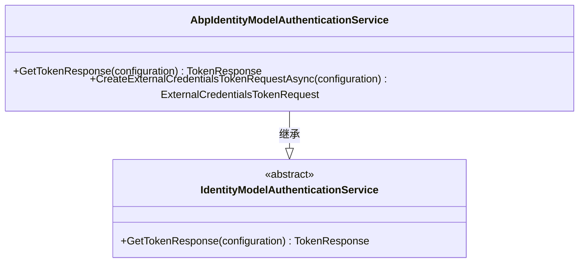
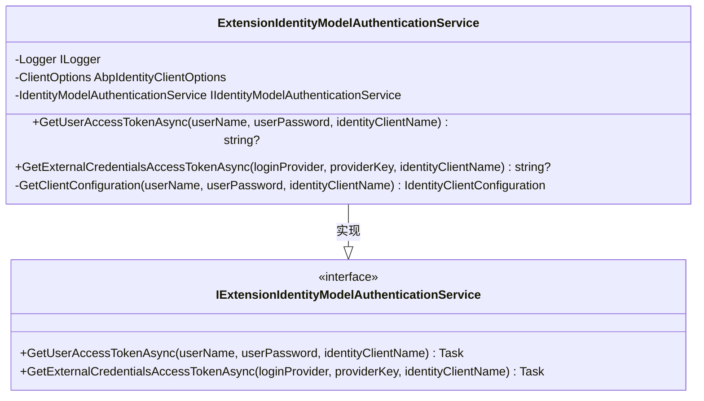

# 身份模型

<cite>
**本文档中引用的文件**
- [AbpIdentityModelAuthenticationService.cs](file://framework\src\SharpAbp.Abp.IdentityModel\SharpAbp\Abp\IdentityModel\AbpIdentityModelAuthenticationService.cs)
- [ExtensionIdentityModelAuthenticationService.cs](file://framework\src\SharpAbp.Abp.IdentityModel\SharpAbp\Abp\IdentityModel\ExtensionIdentityModelAuthenticationService.cs)
- [ExternalCredentialsTokenRequest.cs](file://framework\src\SharpAbp.Abp.IdentityModel\SharpAbp\Abp\IdentityModel\ExternalCredentialsTokenRequest.cs)
- [HttpClientTokenRequestExtensions.cs](file://framework\src\SharpAbp.Abp.IdentityModel\SharpAbp\Abp\IdentityModel\HttpClientTokenRequestExtensions.cs)
- [ExternalCredentialsConstants.cs](file://framework\src\SharpAbp.Abp.IdentityModel\SharpAbp\Abp\IdentityModel\ExternalCredentialsConstants.cs)
- [ExternalCredentialsGrantValidator.cs](file://modules\IdentityServer\src\SharpAbp.Abp.IdentityServer.Extensions\SharpAbp\Abp\IdentityServer\Extensions\ExternalCredentialsGrantValidator.cs)
- [appsettings.json](file://samples\sample\src\SharpSample.HttpApi.Host\appsettings.json)
</cite>

## 目录
1. [简介](#简介)
2. [核心组件分析](#核心组件分析)
3. [外部身份认证流程](#外部身份认证流程)
4. [配置与集成](#配置与集成)
5. [代码示例](#代码示例)

## 简介
sharp-abp框架提供了对标准身份认证流程的扩展，支持通过外部凭证进行身份验证。该功能允许应用程序与外部身份提供者（如IdentityServer）集成，实现跨系统的统一身份管理。本文档详细介绍了`AbpIdentityModelAuthenticationService`和`ExtensionIdentityModelAuthenticationService`如何扩展标准的身份认证流程以支持外部凭证。

## 核心组件分析

### AbpIdentityModelAuthenticationService
`AbpIdentityModelAuthenticationService`类继承自ABP框架的标准`IdentityModelAuthenticationService`，并重写了`GetTokenResponse`方法以支持额外的授权类型。该服务通过检查配置中的`GrantType`来决定使用哪种令牌请求方式。

**图源**
- [AbpIdentityModelAuthenticationService.cs](file://framework\src\SharpAbp.Abp.IdentityModel\SharpAbp\Abp\IdentityModel\AbpIdentityModelAuthenticationService.cs#L31-L89)

**节源**
- [AbpIdentityModelAuthenticationService.cs](file://framework\src\SharpAbp.Abp.IdentityModel\SharpAbp\Abp\IdentityModel\AbpIdentityModelAuthenticationService.cs#L0-L90)

### ExtensionIdentityModelAuthenticationService
`ExtensionIdentityModelAuthenticationService`实现了`IExtensionIdentityModelAuthenticationService`接口，提供了获取用户访问令牌和外部凭证访问令牌的方法。该服务通过依赖注入获取`IIdentityModelAuthenticationService`实例，并利用它来执行实际的令牌获取操作。

**图源**
- [ExtensionIdentityModelAuthenticationService.cs](file://framework\src\SharpAbp.Abp.IdentityModel\SharpAbp\Abp\IdentityModel\ExtensionIdentityModelAuthenticationService.cs#L0-L122)

**节源**
- [ExtensionIdentityModelAuthenticationService.cs](file://framework\src\SharpAbp.Abp.IdentityModel\SharpAbp\Abp\IdentityModel\ExtensionIdentityModelAuthenticationService.cs#L0-L122)

### ExternalCredentialsTokenRequest
`ExternalCredentialsTokenRequest`类继承