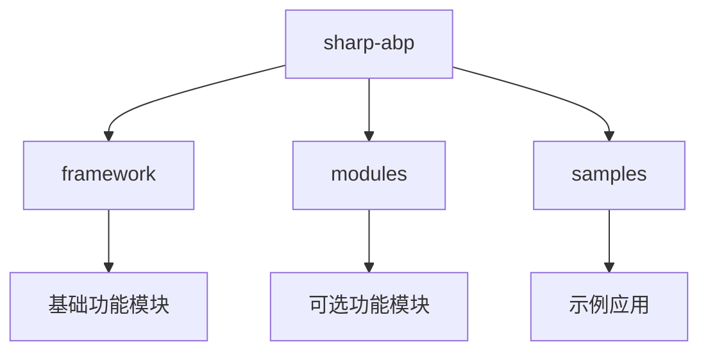
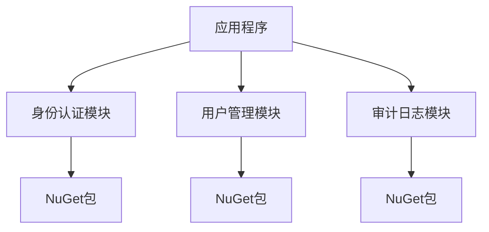
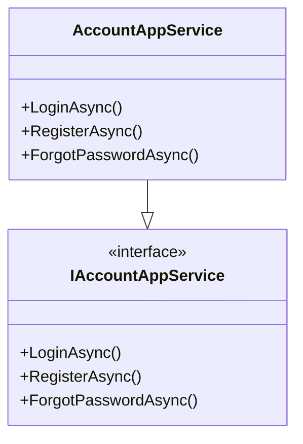
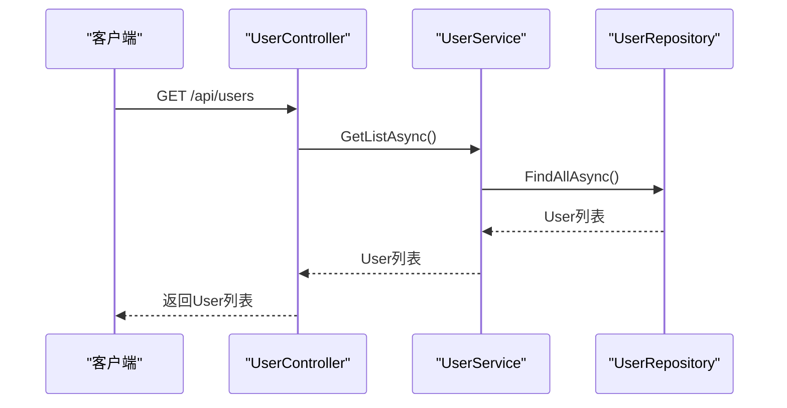
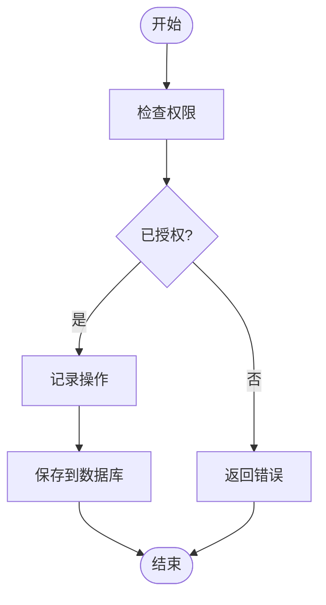
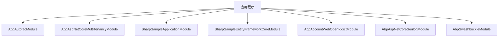

# 快速入门

<cite>
**本文档中引用的文件**
- [Program.cs](file://samples/sample/src/SharpSample.HttpApi.Host/Program.cs)
- [SharpSampleHttpApiHostModule.cs](file://samples/sample/src/SharpSample.HttpApi.Host/SharpSampleHttpApiHostModule.cs)
- [appsettings.json](file://samples/sample/src/SharpSample.HttpApi.Host/appsettings.json)
- [AccountHttpApiModule.cs](file://modules/account/src/SharpAbp.Abp.Account.HttpApi/SharpAbp/Abp/Account/AccountHttpApiModule.cs)
- [IdentityApplicationModule.cs](file://modules/Identity/src/SharpAbp.Abp.Identity.Application/SharpAbp/Abp/Identity/IdentityApplicationModule.cs)
- [AuditLoggingApplicationModule.cs](file://modules/audit-logging/src/SharpAbp.Abp.AuditLogging.Application/SharpAbp/Abp/AuditLogging/AuditLoggingApplicationModule.cs)
</cite>

## 目录
1. [简介](#简介)
2. [项目结构](#项目结构)
3. [核心组件](#核心组件)
4. [架构概述](#架构概述)
5. [详细组件分析](#详细组件分析)
6. [依赖关系分析](#依赖关系分析)
7. [性能考虑](#性能考虑)
8. [故障排除指南](#故障排除指南)
9. [结论](#结论)

## 简介
本指南旨在为开发者提供在新项目中集成和使用sharp-abp框架的详细指导。我们将通过一个从零开始创建包含身份认证（Account）、用户管理（Identity）和审计日志（AuditLogging）功能的最小化Web API应用的分步教程，来展示如何使用该框架。

## 项目结构
sharp-abp是一个基于ABP框架的扩展模块集合，其项目结构分为framework、modules、samples三个主要部分。framework包含基础功能模块，modules包含可选的功能模块，samples则提供了实际的应用示例。

**Diagram sources**
- [README.md](file://README.md)

## 核心组件
sharp-abp的核心组件包括身份认证（Account）、用户管理（Identity）和审计日志（AuditLogging）等模块。这些模块通过NuGet包的形式提供，可以方便地集成到新的项目中。

**Section sources**
- [AccountHttpApiModule.cs](file://modules/account/src/SharpAbp.Abp.Account.HttpApi/SharpAbp/Abp/Account/AccountHttpApiModule.cs)
- [IdentityApplicationModule.cs](file://modules/Identity/src/SharpAbp.Abp.Identity.Application/SharpAbp/Abp/Identity/IdentityApplicationModule.cs)
- [AuditLoggingApplicationModule.cs](file://modules/audit-logging/src/SharpAbp.Abp.AuditLogging.Application/SharpAbp/Abp/AuditLogging/AuditLoggingApplicationModule.cs)

## 架构概述
sharp-abp采用模块化架构设计，每个功能模块都是独立的，可以通过依赖注入的方式集成到主应用中。这种设计使得开发者可以根据需要选择性地引入所需的功能模块。

**Diagram sources**
- [SharpSampleHttpApiHostModule.cs](file://samples/sample/src/SharpSample.HttpApi.Host/SharpSampleHttpApiHostModule.cs)

## 详细组件分析
### 身份认证模块分析
身份认证模块提供了用户登录、注册等功能，通过OpenIddict实现OAuth2.0和OpenID Connect协议支持。

#### 对象导向组件：

**Diagram sources**
- [AccountHttpApiModule.cs](file://modules/account/src/SharpAbp.Abp.Account.HttpApi/SharpAbp/Abp/Account/AccountHttpApiModule.cs)

### 用户管理模块分析
用户管理模块提供了用户信息管理、角色管理等功能，基于ABP框架的Identity模块构建。

#### API/服务组件：

**Diagram sources**
- [IdentityApplicationModule.cs](file://modules/Identity/src/SharpAbp.Abp.Identity.Application/SharpAbp/Abp/Identity/IdentityApplicationModule.cs)

### 审计日志模块分析
审计日志模块用于记录系统中的重要操作，便于后续的安全审计和问题排查。

#### 复杂逻辑组件：

**Diagram sources**
- [AuditLoggingApplicationModule.cs](file://modules/audit-logging/src/SharpAbp.Abp.AuditLogging.Application/SharpAbp/Abp/AuditLogging/AuditLoggingApplicationModule.cs)

**Section sources**
- [AuditLoggingApplicationModule.cs](file://modules/audit-logging/src/SharpAbp.Abp.AuditLogging.Application/SharpAbp/Abp/AuditLogging/AuditLoggingApplicationModule.cs)

## 依赖关系分析
sharp-abp各模块之间存在明确的依赖关系，正确配置这些依赖是确保系统正常运行的关键。

**Diagram sources**
- [SharpSampleHttpApiHostModule.cs](file://samples/sample/src/SharpSample.HttpApi.Host/SharpSampleHttpApiHostModule.cs)

**Section sources**
- [SharpSampleHttpApiHostModule.cs](file://samples/sample/src/SharpSample.HttpApi.Host/SharpSampleHttpApiHostModule.cs)

## 性能考虑
在使用sharp-abp时，需要注意以下性能相关事项：
- 合理配置数据库连接池大小
- 使用Redis缓存频繁访问的数据
- 配置适当的日志级别以减少I/O开销
- 优化Swagger文档生成过程

## 故障排除指南
新手在集成sharp-abp时可能会遇到一些常见问题：

**常见问题及解决方案：**

| 问题 | 原因 | 解决方案 |
|------|------|----------|
| 模块加载顺序错误 | 依赖模块未先加载 | 检查[DependsOn]属性配置 |
| 配置缺失 | appsettings.json中缺少必要配置 | 参考示例项目的appsettings.json文件 |
| 数据库迁移失败 | 连接字符串配置错误 | 检查ConnectionStrings配置 |
| 认证失败 | OpenIddict配置不正确 | 检查AuthServer配置 |

**Section sources**
- [appsettings.json](file://samples/sample/src/SharpSample.HttpApi.Host/appsettings.json)
- [SharpSampleHttpApiHostModule.cs](file://samples/sample/src/SharpSample.HttpApi.Host/SharpSampleHttpApiHostModule.cs)

## 结论
通过本指南，我们展示了如何在新项目中集成和使用sharp-abp框架。从安装NuGet包到配置模块，再到解决常见问题，每一步都提供了详细的说明。希望这份指南能帮助开发者快速上手并成功集成sharp-abp到自己的项目中。