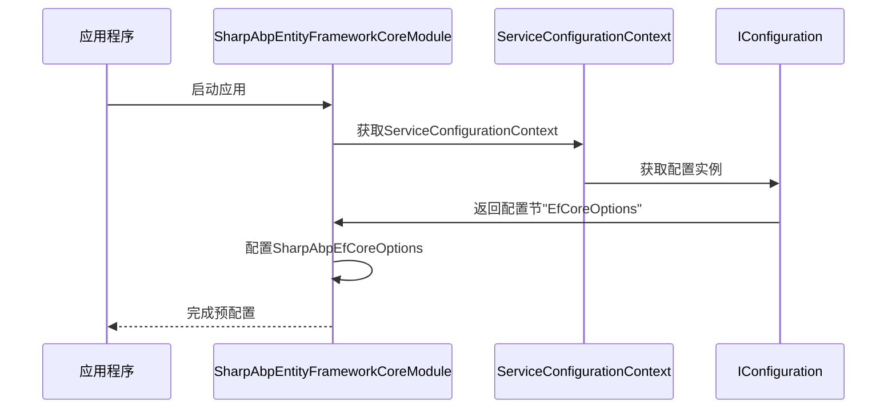
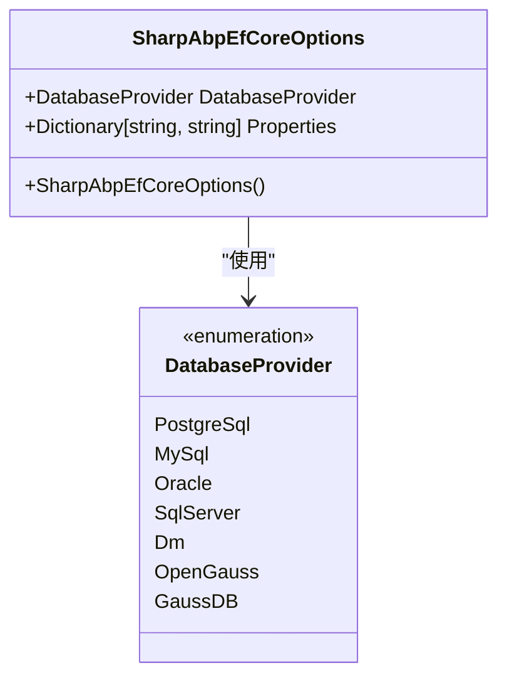
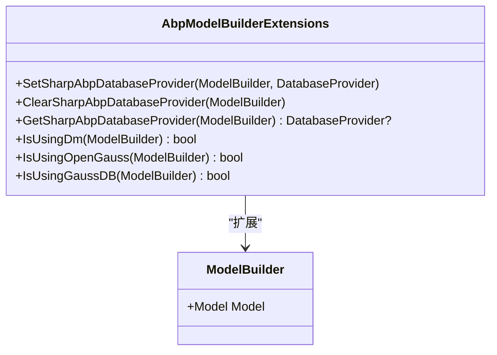

# Entity Framework Core 集成

<cite>
**本文档中引用的文件**   
- [SharpAbpEntityFrameworkCoreModule.cs](file://framework/src/SharpAbp.Abp.EntityFrameworkCore/SharpAbp/Abp/EntityFrameworkCore/SharpAbpEntityFrameworkCoreModule.cs)
- [SharpAbpEfCoreOptions.cs](file://framework/src/SharpAbp.Abp.EntityFrameworkCore/SharpAbp/Abp/EntityFrameworkCore/SharpAbpEfCoreOptions.cs)
- [AbpModelBuilderExtensions.cs](file://framework/src/SharpAbp.Abp.EntityFrameworkCore/Microsoft/EntityFrameworkCore/AbpModelBuilderExtensions.cs)
- [ConfigurationExtensions.cs](file://framework/src/SharpAbp.Abp.EntityFrameworkCore/SharpAbp/Abp/EntityFrameworkCore/ConfigurationExtensions.cs)
- [EfCoreConstants.cs](file://framework/src/SharpAbp.Abp.EntityFrameworkCore/SharpAbp/Abp/EntityFrameworkCore/EfCoreConstants.cs)
- [PropertyExtensions.cs](file://framework/src/SharpAbp.Abp.EntityFrameworkCore/SharpAbp/Abp/EntityFrameworkCore/PropertyExtensions.cs)
- [SharpSampleDbContext.cs](file://samples/sample/src/SharpSample.EntityFrameworkCore/EntityFrameworkCore/SharpSampleDbContext.cs)
- [SharpSampleEntityFrameworkCoreModule.cs](file://samples/sample/src/SharpSample.EntityFrameworkCore/EntityFrameworkCore/SharpSampleEntityFrameworkCoreModule.cs)
</cite>

## 目录
1. [简介](#简介)
2. [模块启动流程](#模块启动流程)
3. [核心配置选项](#核心配置选项)
4. [模型构建器扩展](#模型构建器扩展)
5. [实际项目集成示例](#实际项目集成示例)
6. [与其他ABP模块的集成](#与其他abp模块的集成)

## 简介
SharpAbp.Abp.EntityFrameworkCore模块为ABP框架提供了增强的Entity Framework Core集成能力，支持多种数据库提供程序，并提供了简化的实体配置机制。该模块特别关注多租户和审计字段的支持，使开发者能够更轻松地构建复杂的企业级应用程序。

## 模块启动流程
SharpAbpEntityFrameworkCoreModule是整个模块的核心启动类，负责在应用启动时进行必要的预配置。该模块通过依赖注入系统，在PreConfigureServicesAsync方法中读取配置并设置SharpAbpEfCoreOptions。



**Diagram sources**
- [SharpAbpEntityFrameworkCoreModule.cs](file://framework/src/SharpAbp.Abp.EntityFrameworkCore/SharpAbp/Abp/EntityFrameworkCore/SharpAbpEntityFrameworkCoreModule.cs#L1-L28)

**Section sources**
- [SharpAbpEntityFrameworkCoreModule.cs](file://framework/src/SharpAbp.Abp.EntityFrameworkCore/SharpAbp/Abp/EntityFrameworkCore/SharpAbpEntityFrameworkCoreModule.cs#L1-L28)

## 核心配置选项
SharpAbpEfCoreOptions类定义了模块的核心配置项，包括数据库提供程序设置和各种数据库特定属性。

### SharpAbpEfCoreOptions配置项
| 配置项 | 类型 | 默认值 | 说明 |
|-------|------|-------|------|
| DatabaseProvider | DatabaseProvider | PostgreSql | 数据库提供程序类型 |
| Properties | Dictionary<string, string> | 空字典 | 数据库特定属性集合 |



**Diagram sources**
- [SharpAbpEfCoreOptions.cs](file://framework/src/SharpAbp.Abp.EntityFrameworkCore/SharpAbp/Abp/EntityFrameworkCore/SharpAbpEfCoreOptions.cs#L1-L17)

**Section sources**
- [SharpAbpEfCoreOptions.cs](file://framework/src/SharpAbp.Abp.EntityFrameworkCore/SharpAbp/Abp/EntityFrameworkCore/SharpAbpEfCoreOptions.cs#L1-L17)
- [EfCoreConstants.cs](file://framework/src/SharpAbp.Abp.EntityFrameworkCore/SharpAbp/Abp/EntityFrameworkCore/EfCoreConstants.cs#L1-L95)

### 数据库特定属性
通过Properties字典可以配置各种数据库特定的属性：

#### PostgreSQL配置
- **PostgreSqlVersion**: PostgreSQL版本号
- **DefaultSchema**: 默认模式名称

#### Oracle配置
- **OracleSQLCompatibility**: Oracle SQL兼容性版本（有效值：DatabaseVersion19, DatabaseVersion21, DatabaseVersion23）
- **OracleAllowedLogonVersionClient**: Oracle客户端登录版本（有效值：Version8-12a）

#### MySQL配置
- **MySqlVersion**: MySQL版本号
- **MySqlServerType**: MySQL服务器类型

这些属性可以通过ConfigurationExtensions中的扩展方法访问，确保了类型安全和默认值处理。

## 模型构建器扩展
AbpModelBuilderExtensions类提供了一系列扩展方法来简化实体模型的配置，特别是针对多租户和审计字段的支持。

### 核心扩展方法


**Diagram sources**
- [AbpModelBuilderExtensions.cs](file://framework/src/SharpAbp.Abp.EntityFrameworkCore/Microsoft/EntityFrameworkCore/AbpModelBuilderExtensions.cs#L1-L85)

**Section sources**
- [AbpModelBuilderExtensions.cs](file://framework/src/SharpAbp.Abp.EntityFrameworkCore/Microsoft/EntityFrameworkCore/AbpModelBuilderExtensions.cs#L1-L85)
- [PropertyExtensions.cs](file://framework/src/SharpAbp.Abp.EntityFrameworkCore/SharpAbp/Abp/EntityFrameworkCore/PropertyExtensions.cs#L1-L75)

### 多租户支持
模块通过在ModelBuilder上设置注解来支持多租户架构，允许在运行时根据当前租户动态调整数据库行为。`SetSharpAbpDatabaseProvider`方法将数据库提供程序信息存储在模型的注解中，后续的配置可以根据这个信息进行条件判断。

### 审计字段支持
虽然直接的审计字段配置不在这个特定模块中实现，但该模块为其他ABP模块（如审计日志模块）提供了基础支持。通过统一的数据库提供程序管理，确保了审计数据在不同数据库系统中的一致性处理。

## 实际项目集成示例
以下是在实际项目中集成和配置SharpAbp.Abp.EntityFrameworkCore模块的完整示例。

### DbContext定义
```csharp
[ReplaceDbContext(typeof(IIdentityDbContext))]
[ReplaceDbContext(typeof(ITenantManagementDbContext))]
[ConnectionStringName("Default")]
public class SharpSampleDbContext : AbpDbContext<SharpSampleDbContext>, 
    IIdentityDbContext,
    ITenantManagementDbContext
{
    // 模块实体
    public DbSet<IdentityUser> Users { get; set; }
    public DbSet<Tenant> Tenants { get; set; }
    
    public SharpSampleDbContext(DbContextOptions<SharpSampleDbContext> options)
        : base(options)
    {
    }

    protected override