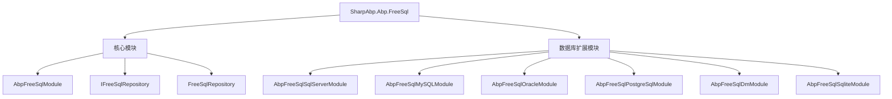
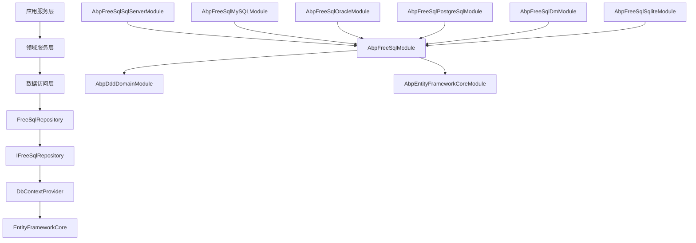
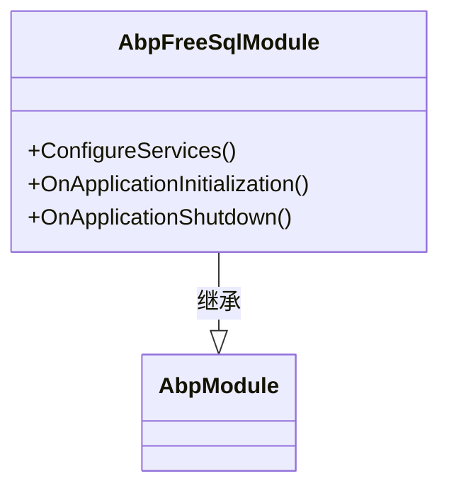
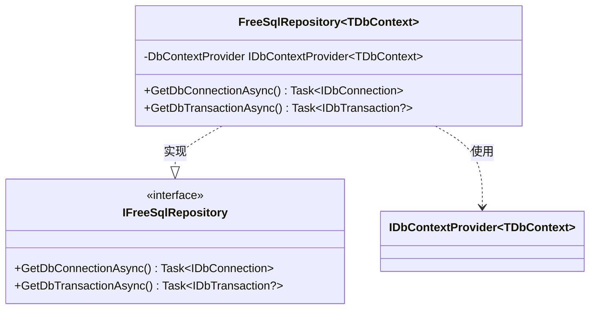
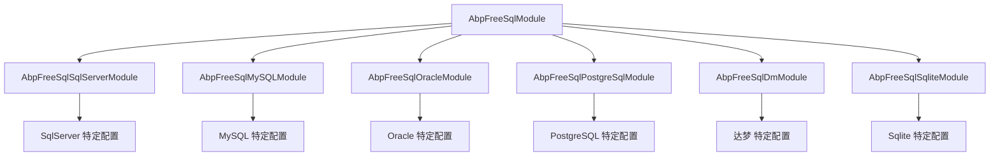
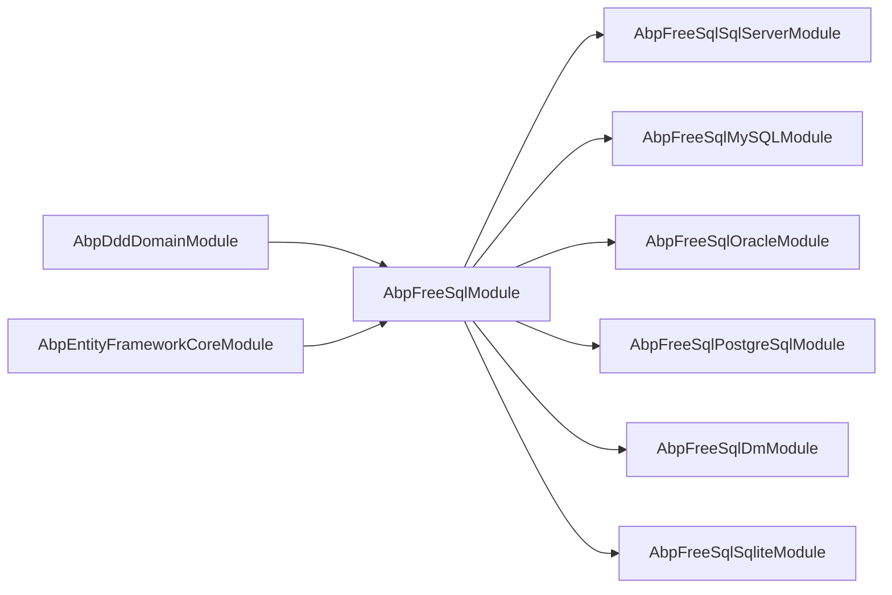

# FreeSql ORM 集成

<cite>
**本文档引用的文件**
- [AbpFreeSqlModule.cs](file://framework/src/SharpAbp.Abp.FreeSql/SharpAbp/Abp/FreeSql/AbpFreeSqlModule.cs)
- [IFreeSqlRepository.cs](file://framework/src/SharpAbp.Abp.FreeSql/SharpAbp/Abp/Domain/Repositories/IFreeSqlRepository.cs)
- [FreeSqlRepository.cs](file://framework/src/SharpAbp.Abp.FreeSql/SharpAbp/Abp/Domain/Repositories/FreeSqlRepository.cs)
- [AbpFreeSqlSqlServerModule.cs](file://framework/src/SharpAbp.Abp.FreeSql.SqlServer/SharpAbp/Abp/FreeSql/SqlServer/AbpFreeSqlSqlServerModule.cs)
- [AbpFreeSqlMySQLModule.cs](file://framework/src/SharpAbp.Abp.FreeSql.MySQL/SharpAbp/Abp/FreeSql/MySQL/AbpFreeSqlMySQLModule.cs)
- [AbpFreeSqlOracleModule.cs](file://framework/src/SharpAbp.Abp.FreeSql.Oracle/SharpAbp/Abp/FreeSql/Oracle/AbpFreeSqlOracleModule.cs)
- [AbpFreeSqlPostgreSqlModule.cs](file://framework/src/SharpAbp.Abp.FreeSql.PostgreSql/SharpAbp/Abp/FreeSql/PostgreSql/AbpFreeSqlPostgreSqlModule.cs)
- [AbpFreeSqlDmModule.cs](file://framework/src/SharpAbp.Abp.FreeSql.DM/SharpAbp/Abp/FreeSql/DM/AbpFreeSqlDmModule.cs)
- [AbpFreeSqlSqliteModule.cs](file://framework/src/SharpAbp.Abp.FreeSql.Sqlite/SharpAbp/Abp/FreeSql/Sqlite/AbpFreeSqlSqliteModule.cs)
</cite>

## 目录
1. [简介](#简介)
2. [项目结构](#项目结构)
3. [核心组件](#核心组件)
4. [架构概述](#架构概述)
5. [详细组件分析](#详细组件分析)
6. [依赖关系分析](#依赖关系分析)
7. [性能考虑](#性能考虑)
8. [故障排除指南](#故障排除指南)
9. [结论](#结论)

## 简介
SharpAbp.Abp.FreeSql模块为ABP框架提供了FreeSql ORM集成，通过结合ABP框架的领域驱动设计模式和FreeSql的强大功能，为开发者提供了一套高效、灵活的数据访问解决方案。该模块不仅实现了统一的数据访问契约，还支持多种数据库系统，使应用程序能够轻松适应不同的数据存储需求。

## 项目结构
SharpAbp.Abp.FreeSql模块遵循ABP框架的标准项目结构，主要包含核心模块、数据库特定扩展模块和数据访问层实现。核心模块定义了基本的功能和接口，而各个数据库特定的扩展模块（如SqlServer、MySQL、Oracle等）则提供了针对特定数据库的适配和优化。

**图示来源**
- [AbpFreeSqlModule.cs](file://framework/src/SharpAbp.Abp.FreeSql/SharpAbp/Abp/FreeSql/AbpFreeSqlModule.cs)
- [IFreeSqlRepository.cs](file://framework/src/SharpAbp.Abp.FreeSql/SharpAbp/Abp/Domain/Repositories/IFreeSqlRepository.cs)
- [FreeSqlRepository.cs](file://framework/src/SharpAbp.Abp.FreeSql/SharpAbp/Abp/Domain/Repositories/FreeSqlRepository.cs)
- [AbpFreeSqlSqlServerModule.cs](file://framework/src/SharpAbp.Abp.FreeSql.SqlServer/SharpAbp/Abp/FreeSql/SqlServer/AbpFreeSqlSqlServerModule.cs)
- [AbpFreeSqlMySQLModule.cs](file://framework/src/SharpAbp.Abp.FreeSql.MySQL/SharpAbp/Abp/FreeSql/MySQL/AbpFreeSqlMySQLModule.cs)
- [AbpFreeSqlOracleModule.cs](file://framework/src/SharpAbp.Abp.FreeSql.Oracle/SharpAbp/Abp/FreeSql/Oracle/AbpFreeSqlOracleModule.cs)
- [AbpFreeSqlPostgreSqlModule.cs](file://framework/src/SharpAbp.Abp.FreeSql.PostgreSql/SharpAbp/Abp/FreeSql/PostgreSql/AbpFreeSqlPostgreSqlModule.cs)
- [AbpFreeSqlDmModule.cs](file://framework/src/SharpAbp.Abp.FreeSql.DM/SharpAbp/Abp/FreeSql/DM/AbpFreeSqlDmModule.cs)
- [AbpFreeSqlSqliteModule.cs](file://framework/src/SharpAbp.Abp.FreeSql.Sqlite/SharpAbp/Abp/FreeSql/Sqlite/AbpFreeSqlSqliteModule.cs)

**本节来源**
- [AbpFreeSqlModule.cs](file://framework/src/SharpAbp.Abp.FreeSql/SharpAbp/Abp/FreeSql/AbpFreeSqlModule.cs)
- [README.md](file://README.md)

## 核心组件
SharpAbp.Abp.FreeSql模块的核心组件包括AbpFreeSqlModule初始化模块、IFreeSqlRepository数据访问接口和FreeSqlRepository具体实现。这些组件共同构成了模块的基础架构，为上层应用提供了稳定可靠的数据访问能力。

**本节来源**
- [AbpFreeSqlModule.cs](file://framework/src/SharpAbp.Abp.FreeSql/SharpAbp/Abp/FreeSql/AbpFreeSqlModule.cs)
- [IFreeSqlRepository.cs](file://framework/src/SharpAbp.Abp.FreeSql/SharpAbp/Abp/Domain/Repositories/IFreeSqlRepository.cs)
- [FreeSqlRepository.cs](file://framework/src/SharpAbp.Abp.FreeSql/SharpAbp/Abp/Domain/Repositories/FreeSqlRepository.cs)

## 架构概述
SharpAbp.Abp.FreeSql模块采用分层架构设计，将核心功能与数据库特定实现分离。核心模块依赖于ABP框架的DDD域模块和EntityFrameworkCore模块，通过依赖注入机制提供统一的数据访问服务。各个数据库特定的扩展模块则通过依赖核心模块的方式，添加对特定数据库的支持。

**图示来源**
- [AbpFreeSqlModule.cs](file://framework/src/SharpAbp.Abp.FreeSql/SharpAbp/Abp/FreeSql/AbpFreeSqlModule.cs)
- [IFreeSqlRepository.cs](file://framework/src/SharpAbp.Abp.FreeSql/SharpAbp/Abp/Domain/Repositories/IFreeSqlRepository.cs)
- [FreeSqlRepository.cs](file://framework/src/SharpAbp.Abp.FreeSql/SharpAbp/Abp/Domain/Repositories/FreeSqlRepository.cs)

## 详细组件分析

### AbpFreeSqlModule 初始化分析
AbpFreeSqlModule是整个FreeSql集成模块的入口点，负责注册所有必要的服务和配置。该模块通过DependsOn特性声明了对ABP框架核心模块的依赖，确保在应用程序启动时正确初始化。

**图示来源**
- [AbpFreeSqlModule.cs](file://framework/src/SharpAbp.Abp.FreeSql/SharpAbp/Abp/FreeSql/AbpFreeSqlModule.cs)

**本节来源**
- [AbpFreeSqlModule.cs](file://framework/src/SharpAbp.Abp.FreeSql/SharpAbp/Abp/FreeSql/AbpFreeSqlModule.cs)

### IFreeSqlRepository 和 FreeSqlRepository 分析
IFreeSqlRepository接口定义了FreeSql数据访问的基本契约，而FreeSqlRepository类提供了具体的实现。这种设计模式使得数据访问逻辑与具体实现分离，提高了代码的可测试性和可维护性。

**图示来源**
- [IFreeSqlRepository.cs](file://framework/src/SharpAbp.Abp.FreeSql/SharpAbp/Abp/Domain/Repositories/IFreeSqlRepository.cs)
- [FreeSqlRepository.cs](file://framework/src/SharpAbp.Abp.FreeSql/SharpAbp/Abp/Domain/Repositories/FreeSqlRepository.cs)

**本节来源**
- [IFreeSqlRepository.cs](file://framework/src/SharpAbp.Abp.FreeSql/SharpAbp/Abp/Domain/Repositories/IFreeSqlRepository.cs)
- [FreeSqlRepository.cs](file://framework/src/SharpAbp.Abp.FreeSql/SharpAbp/Abp/Domain/Repositories/FreeSqlRepository.cs)

### 数据库特定模块分析
SharpAbp.Abp.FreeSql提供了多个数据库特定的扩展模块，每个模块都针对特定的数据库系统进行了优化。这些模块通过依赖核心AbpFreeSqlModule的方式，添加了对特定数据库的支持，同时保持了API的一致性。

**图示来源**
- [AbpFreeSqlSqlServerModule.cs](file://framework/src/SharpAbp.Abp.FreeSql.SqlServer/SharpAbp/Abp/FreeSql/SqlServer/AbpFreeSqlSqlServerModule.cs)
- [AbpFreeSqlMySQLModule.cs](file://framework/src/SharpAbp.Abp.FreeSql.MySQL/SharpAbp/Abp/FreeSql/MySQL/AbpFreeSqlMySQLModule.cs)
- [AbpFreeSqlOracleModule.cs](file://framework/src/SharpAbp.Abp.FreeSql.Oracle/SharpAbp/Abp/FreeSql/Oracle/AbpFreeSqlOracleModule.cs)
- [AbpFreeSqlPostgreSqlModule.cs](file://framework/src/SharpAbp.Abp.FreeSql.PostgreSql/SharpAbp/Abp/FreeSql/PostgreSql/AbpFreeSqlPostgreSqlModule.cs)
- [AbpFreeSqlDmModule.cs](file://framework/src/SharpAbp.Abp.FreeSql.DM/SharpAbp/Abp/FreeSql/DM/AbpFreeSqlDmModule.cs)
- [AbpFreeSqlSqliteModule.cs](file://framework/src/SharpAbp.Abp.FreeSql.Sqlite/SharpAbp/Abp/FreeSql/Sqlite/AbpFreeSqlSqliteModule.cs)

**本节来源**
- [AbpFreeSqlSqlServerModule.cs](file://framework/src/SharpAbp.Abp.FreeSql.SqlServer/SharpAbp/Abp/FreeSql/SqlServer/AbpFreeSqlSqlServerModule.cs)
- [AbpFreeSqlMySQLModule.cs](file://framework/src/SharpAbp.Abp.FreeSql.MySQL/SharpAbp/Abp/FreeSql/MySQL/AbpFreeSqlMySQLModule.cs)
- [AbpFreeSqlOracleModule.cs](file://framework/src/SharpAbp.Abp.FreeSql.Oracle/SharpAbp/Abp/FreeSql/Oracle/AbpFreeSqlOracleModule.cs)
- [AbpFreeSqlPostgreSqlModule.cs](file://framework/src/SharpAbp.Abp.FreeSql.PostgreSql/SharpAbp/Abp/FreeSql/PostgreSql/AbpFreeSqlPostgreSqlModule.cs)
- [AbpFreeSqlDmModule.cs](file://framework/src/SharpAbp.Abp.FreeSql.DM/SharpAbp/Abp/FreeSql/DM/AbpFreeSqlDmModule.cs)
- [AbpFreeSqlSqliteModule.cs](file://framework/src/SharpAbp.Abp.FreeSql.Sqlite/SharpAbp/Abp/FreeSql/Sqlite/AbpFreeSqlSqliteModule.cs)

## 依赖关系分析
SharpAbp.Abp.FreeSql模块的依赖关系清晰明确，核心模块依赖于ABP框架的基础模块，而各个数据库特定的扩展模块则依赖于核心模块。这种层次化的依赖结构确保了模块的可维护性和可扩展性。

**图示来源**
- [AbpFreeSqlModule.cs](file://framework/src/SharpAbp.Abp.FreeSql/SharpAbp/Abp/FreeSql/AbpFreeSqlModule.cs)
- [AbpFreeSqlSqlServerModule.cs](file://framework/src/SharpAbp.Abp.FreeSql.SqlServer/SharpAbp/Abp/FreeSql/SqlServer/AbpFreeSqlSqlServerModule.cs)
- [AbpFreeSqlMySQLModule.cs](file://framework/src/SharpAbp.Abp.FreeSql.MySQL/SharpAbp/Abp/FreeSql/MySQL/AbpFreeSqlMySQLModule.cs)
- [AbpFreeSqlOracleModule.cs](file://framework/src/SharpAbp.Abp.FreeSql.Oracle/SharpAbp/Abp/FreeSql/Oracle/AbpFreeSqlOracleModule.cs)
- [AbpFreeSqlPostgreSqlModule.cs](file://framework/src/SharpAbp.Abp.FreeSql.PostgreSql/SharpAbp/Abp/FreeSql/PostgreSql/AbpFreeSqlPostgreSqlModule.cs)
- [AbpFreeSqlDmModule.cs](file://framework/src/SharpAbp.Abp.FreeSql.DM/SharpAbp/Abp/FreeSql/DM/AbpFreeSqlDmModule.cs)
- [AbpFreeSqlSqliteModule.cs](file://framework/src/SharpAbp.Abp.FreeSql.Sqlite/SharpAbp/Abp/FreeSql/Sqlite/AbpFreeSqlSqliteModule.cs)

**本节来源**
- [AbpFreeSqlModule.cs](file://framework/src/SharpAbp.Abp.FreeSql/SharpAbp/Abp/FreeSql/AbpFreeSqlModule.cs)
- [AbpFreeSqlSqlServerModule.cs](file://framework/src/SharpAbp.Abp.FreeSql.SqlServer/SharpAbp/Abp/FreeSql/SqlServer/AbpFreeSqlSqlServerModule.cs)
- [AbpFreeSqlMySQLModule.cs](file://framework/src/SharpAbp.Abp.FreeSql.MySQL/SharpAbp/Abp/FreeSql/MySQL/AbpFreeSqlMySQLModule.cs)
- [AbpFreeSqlOracleModule.cs](file://framework/src/SharpAbp.Abp.FreeSql.Oracle/SharpAbp/Abp/FreeSql/Oracle/AbpFreeSqlOracleModule.cs)
- [AbpFreeSqlPostgreSqlModule.cs](file://framework/src/SharpAbp.Abp.FreeSql.PostgreSql/SharpAbp/Abp/FreeSql/PostgreSql/AbpFreeSqlPostgreSqlModule.cs)
- [AbpFreeSqlDmModule.cs](file://framework/src/SharpAbp.Abp.FreeSql.DM/SharpAbp/Abp/FreeSql/DM/AbpFreeSqlDmModule.cs)
- [AbpFreeSqlSqliteModule.cs](file://framework/src/SharpAbp.Abp.FreeSql.Sqlite/SharpAbp/Abp/FreeSql/Sqlite/AbpFreeSqlSqliteModule.cs)

## 性能考虑
SharpAbp.Abp.FreeSql模块通过利用FreeSql ORM的高性能特性，为应用程序提供了高效的数据库访问能力。模块的设计考虑了连接池管理、事务处理和查询优化等方面，确保在高