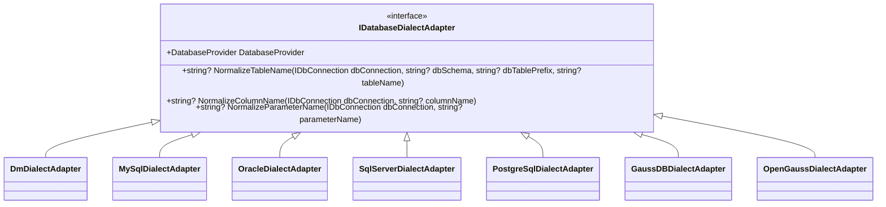
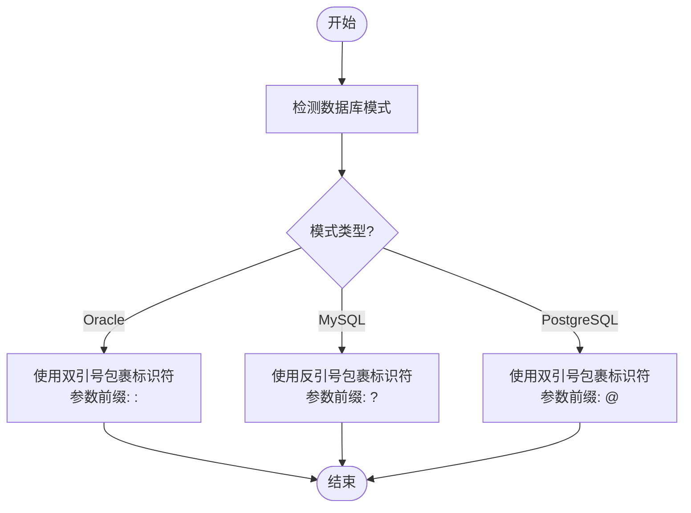
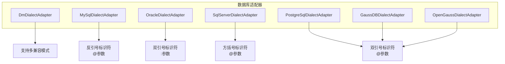

# SQL 构建器

<cite>
**本文档中引用的文件**  
- [IDatabaseDialectAdapter.cs](file://framework/src/SharpAbp.Abp.Data.SqlBuilder/SharpAbp/Abp/Data/SqlBuilder/IDatabaseDialectAdapter.cs)
- [DmDialectAdapter.cs](file://framework/src/SharpAbp.Abp.Data.SqlBuilder/SharpAbp/Abp/Data/SqlBuilder/DmDialectAdapter.cs)
- [MySqlDialectAdapter.cs](file://framework/src/SharpAbp.Abp.Data.SqlBuilder/SharpAbp/Abp/Data/SqlBuilder/MySqlDialectAdapter.cs)
- [OracleDialectAdapter.cs](file://framework/src/SharpAbp.Abp.Data.SqlBuilder/SharpAbp/Abp/Data/SqlBuilder/OracleDialectAdapter.cs)
- [SqlServerDialectAdapter.cs](file://framework/src/SharpAbp.Abp.Data.SqlBuilder/SharpAbp/Abp/Data/SqlBuilder/SqlServerDialectAdapter.cs)
- [PostgreSqlDialectAdapter.cs](file://framework/src/SharpAbp.Abp.Data.SqlBuilder/SharpAbp/Abp/Data/SqlBuilder/PostgreSqlDialectAdapter.cs)
- [GaussDBDialectAdapter.cs](file://framework/src/SharpAbp.Abp.Data.SqlBuilder/SharpAbp/Abp/Data/SqlBuilder/GaussDBDialectAdapter.cs)
- [OpenGaussDialectAdapter.cs](file://framework/src/SharpAbp.Abp.Data.SqlBuilder/SharpAbp/Abp/Data/SqlBuilder/OpenGaussDialectAdapter.cs)
- [ISqlParamConversionService.cs](file://framework/src/SharpAbp.Abp.Data.SqlBuilder/SharpAbp/Abp/Data/SqlBuilder/ISqlParamConversionService.cs)
- [ISqlParamConversionContributor.cs](file://framework/src/SharpAbp.Abp.Data.SqlBuilder/SharpAbp/Abp/Data/SqlBuilder/ISqlParamConversionContributor.cs)
- [DefaultSqlParamConversionService.cs](file://framework/src/SharpAbp.Abp.Data.SqlBuilder/SharpAbp/Abp/Data/SqlBuilder/DefaultSqlParamConversionService.cs)
- [DataSqlBuilderOptions.cs](file://framework/src/SharpAbp.Abp.Data.SqlBuilder/SharpAbp/Abp/Data/SqlBuilder/DataSqlBuilderOptions.cs)
- [ParameterBindingContext.cs](file://framework/src/SharpAbp.Abp.Data.SqlBuilder/SharpAbp/Abp/Data/SqlBuilder/ParameterBindingContext.cs)
</cite>

## 目录
1. [简介](#简介)
2. [核心组件分析](#核心组件分析)
3. [数据库方言适配器设计](#数据库方言适配器设计)
4. [参数转换服务架构](#参数转换服务架构)
5. [实际应用示例](#实际应用示例)
6. [动态SQL生成与迁移场景](#动态sql生成与迁移场景)
7. [结论](#结论)

## 简介
SharpAbp.Abp.Data.SqlBuilder模块为跨数据库应用程序提供了一套完整的SQL构建解决方案。该模块通过抽象不同数据库系统的方言差异，实现了统一的SQL语句生成机制。其核心功能包括数据库特定语法适配、参数化查询处理以及灵活的参数类型转换，特别适用于需要支持多种数据库后端（如DM、GaussDB、MySQL、Oracle等）的企业级应用。

本模块解决了在异构数据库环境中常见的兼容性问题，使开发者能够编写一次性的数据访问逻辑，而无需针对每个目标数据库进行特殊处理。这种设计不仅提高了开发效率，还显著降低了维护成本和出错风险。

## 核心组件分析

### 数据库方言适配接口
`IDatabaseDialectAdapter` 接口定义了所有数据库方言适配器必须实现的核心契约。该接口提供了三个关键方法：`NormalizeTableName`、`NormalizeColumnName` 和 `NormalizeParameterName`，分别用于处理表名、列名和参数名的标准化。

**图源**
- [IDatabaseDialectAdapter.cs](file://framework/src/SharpAbp.Abp.Data.SqlBuilder/SharpAbp/Abp/Data/SqlBuilder/IDatabaseDialectAdapter.cs)
- [DmDialectAdapter.cs](file://framework/src/SharpAbp.Abp.Data.SqlBuilder/SharpAbp/Abp/Data/SqlBuilder/DmDialectAdapter.cs)
- [MySqlDialectAdapter.cs](file://framework/src/SharpAbp.Abp.Data.SqlBuilder/SharpAbp/Abp/Data/SqlBuilder/MySqlDialectAdapter.cs)
- [OracleDialectAdapter.cs](file://framework/src/SharpAbp.Abp.Data.SqlBuilder/SharpAbp/Abp/Data/SqlBuilder/OracleDialectAdapter.cs)
- [SqlServerDialectAdapter.cs](file://framework/src/SharpAbp.Abp.Data.SqlBuilder/SharpAbp/Abp/Data/SqlBuilder/SqlServerDialectAdapter.cs)
- [PostgreSqlDialectAdapter.cs](file://framework/src/SharpAbp.Abp.Data.SqlBuilder/SharpAbp/Abp/Data/SqlBuilder/PostgreSqlDialectAdapter.cs)
- [GaussDBDialectAdapter.cs](file://framework/src/SharpAbp.Abp.Data.SqlBuilder/SharpAbp/Abp/Data/SqlBuilder/GaussDBDialectAdapter.cs)
- [OpenGaussDialectAdapter.cs](file://framework/src/SharpAbp.Abp.Data.SqlBuilder/SharpAbp/Abp/Data/SqlBuilder/OpenGaussDialectAdapter.cs)

**节源**
- [IDatabaseDialectAdapter.cs](file://framework/src/SharpAbp.Abp.Data.SqlBuilder/SharpAbp/Abp/Data/SqlBuilder/IDatabaseDialectAdapter.cs)

## 数据库方言适配器设计

### DM数据库适配器
`DmDialectAdapter` 类专门处理达梦(DM)数据库的方言特性。由于DM数据库支持Oracle、PostgreSQL和MySQL三种兼容模式，该适配器能够根据当前连接的实际模式动态调整其行为。

当处于Oracle兼容模式时，标识符使用双引号包裹；在MySQL模式下则使用反引号；而在PostgreSQL模式下同样采用双引号但遵循不同的命名规则。此外，参数前缀也随模式变化：Oracle模式用冒号(:)，MySQL模式用问号(?)，PostgreSQL模式用at符号(@)。

**图源**
- [DmDialectAdapter.cs](file://framework/src/SharpAbp.Abp.Data.SqlBuilder/SharpAbp/Abp/Data/SqlBuilder/DmDialectAdapter.cs)

**节源**
- [DmDialectAdapter.cs](file://framework/src/SharpAbp.Abp.Data.SqlBuilder/SharpAbp/Abp/Data/SqlBuilder/DmDialectAdapter.cs)

### 其他数据库适配器
对于其他主流数据库系统，模块提供了相应的专用适配器：

- **MySQL适配器**：使用反引号(`)包裹标识符，参数以@符号开头
- **Oracle适配器**：使用双引号(")包裹标识符，参数以:符号开头
- **SQL Server适配器**：使用方括号([])包裹标识符，参数以@符号开头
- **PostgreSQL系列适配器**：包括原生PostgreSQL、GaussDB和openGauss，均使用双引号(")包裹标识符，参数以@符号开头

这些适配器共同构成了一个可扩展的体系结构，允许轻松添加对新数据库的支持。

**图源**
- [MySqlDialectAdapter.cs](file://framework/src/SharpAbp.Abp.Data.SqlBuilder/SharpAbp/Abp/Data/SqlBuilder/MySqlDialectAdapter.cs)
- [OracleDialectAdapter.cs](file://framework/src/SharpAbp.Abp.Data.SqlBuilder/SharpAbp/Abp/Data/SqlBuilder/OracleDialectAdapter.cs)
- [SqlServerDialectAdapter.cs](file://framework/src/SharpAbp.Abp.Data.SqlBuilder/SharpAbp/Abp/Data/SqlBuilder