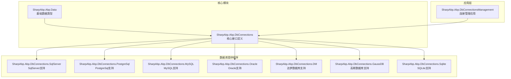
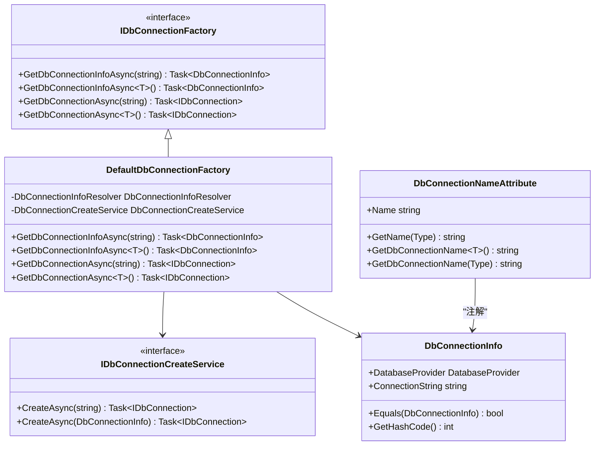
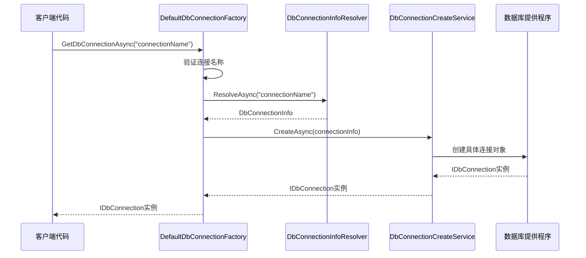
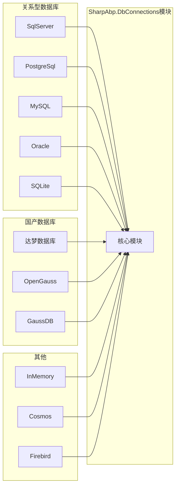

# 数据库连接管理模块

<cite>
**本文档中引用的文件**
- [IDbConnectionCreateService.cs](file://framework/src/SharpAbp.Abp.DbConnections/SharpAbp/Abp/DbConnections/IDbConnectionCreateService.cs)
- [IDbConnectionFactory.cs](file://framework/src/SharpAbp.Abp.DbConnections/SharpAbp/Abp/DbConnections/IDbConnectionFactory.cs)
- [DbConnectionInfo.cs](file://framework/src/SharpAbp.Abp.DbConnections/SharpAbp/Abp/DbConnections/DbConnectionInfo.cs)
- [DefaultDbConnectionFactory.cs](file://framework/src/SharpAbp.Abp.DbConnections/SharpAbp/Abp/DbConnections/DefaultDbConnectionFactory.cs)
- [DbConnectionNameAttribute.cs](file://framework/src/SharpAbp.Abp.DbConnections/SharpAbp/Abp/DbConnections/DbConnectionNameAttribute.cs)
- [DatabaseProvider.cs](file://framework/src/SharpAbp.Abp.Data/SharpAbp/Abp/Data/DatabaseProvider.cs)
- [AbpDbConnectionsModule.cs](file://framework/src/SharpAbp.Abp.DbConnections/SharpAbp/Abp/DbConnections/AbpDbConnectionsModule.cs)
- [appsettings.json](file://framework/test/SharpAbp.Abp.DbConnections.Tests/appsettings.json)
</cite>

## 目录
1. [简介](#简介)
2. [项目结构](#项目结构)
3. [核心组件](#核心组件)
4. [架构概览](#架构概览)
5. [详细组件分析](#详细组件分析)
6. [数据库提供程序支持](#数据库提供程序支持)
7. [配置示例](#配置示例)
8. [使用指南](#使用指南)
9. [性能考虑](#性能考虑)
10. [故障排除指南](#故障排除指南)
11. [结论](#结论)

## 简介

SharpAbp.Abp.DbConnections模块是一个强大的数据库连接管理框架，提供了统一的接口来抽象化不同数据库提供程序的连接创建过程。该模块通过IDbConnectionCreateService和IDbConnectionFactory接口实现了数据库连接的动态创建和管理，支持多种主流数据库系统，包括SqlServer、PostgreSql、MySQL、Oracle、DM、GaussDB等。

该模块的核心设计理念是提供一个灵活且可扩展的数据库连接管理解决方案，允许开发者在运行时根据业务需求动态选择和切换不同的数据库连接，同时保持代码的简洁性和可维护性。

## 项目结构

SharpAbp.Abp.DbConnections模块采用分层架构设计，主要包含以下核心组件：



**图表来源**
- [AbpDbConnectionsModule.cs](file://framework/src/SharpAbp.Abp.DbConnections/SharpAbp/Abp/DbConnections/AbpDbConnectionsModule.cs#L1-L14)
- [DatabaseProvider.cs](file://framework/src/SharpAbp.Abp.Data/SharpAbp/Abp/Data/DatabaseProvider.cs#L1-L21)

**章节来源**
- [AbpDbConnectionsModule.cs](file://framework/src/SharpAbp.Abp.DbConnections/SharpAbp/Abp/DbConnections/AbpDbConnectionsModule.cs#L1-L14)

## 核心组件

### IDbConnectionCreateService 接口

IDbConnectionCreateService是数据库连接创建的核心接口，定义了两种创建数据库连接的方法：

```csharp
public interface IDbConnectionCreateService
{
    Task<IDbConnection?> CreateAsync(string dbConnectionName);
    Task<IDbConnection?> CreateAsync(DbConnectionInfo dbConnectionInfo);
}
```

该接口的主要职责：
- 提供基于连接名称的异步连接创建方法
- 支持直接传入DbConnectionInfo对象进行连接创建
- 统一处理各种数据库提供程序的连接创建异常

### IDbConnectionFactory 接口

IDbConnectionFactory接口负责数据库连接信息的获取和管理：

```csharp
public interface IDbConnectionFactory
{
    Task<DbConnectionInfo?> GetDbConnectionInfoAsync(string dbConnectionName);
    Task<DbConnectionInfo?> GetDbConnectionInfoAsync<T>();
    Task<IDbConnection?> GetDbConnectionAsync(string dbConnectionName);
    Task<IDbConnection?> GetDbConnectionAsync<T>();
}
```

该接口的功能包括：
- 获取指定名称的数据库连接信息
- 支持基于泛型类型的连接信息获取
- 提供完整的数据库连接生命周期管理

### DbConnectionInfo 类

DbConnectionInfo类封装了数据库连接的基本信息：

```csharp
public class DbConnectionInfo : IEquatable<DbConnectionInfo>
{
    public DatabaseProvider DatabaseProvider { get; }
    public string? ConnectionString { get; set; }
}
```

该类的关键特性：
- 包含数据库提供程序类型和连接字符串
- 实现了IEquatable接口用于比较相等性
- 提供默认构造函数和参数化构造函数

**章节来源**
- [IDbConnectionCreateService.cs](file://framework/src/SharpAbp.Abp.DbConnections/SharpAbp/Abp/DbConnections/IDbConnectionCreateService.cs#L1-L28)
- [IDbConnectionFactory.cs](file://framework/src/SharpAbp.Abp.DbConnections/SharpAbp/Abp/DbConnections/IDbConnectionFactory.cs#L1-L42)
- [DbConnectionInfo.cs](file://framework/src/SharpAbp.Abp.DbConnections/SharpAbp/Abp/DbConnections/DbConnectionInfo.cs#L1-L79)

## 架构概览

SharpAbp.Abp.DbConnections模块采用了依赖注入和策略模式的设计，通过DefaultDbConnectionFactory作为主要的工厂实现：



**图表来源**
- [IDbConnectionFactory.cs](file://framework/src/SharpAbp.Abp.DbConnections/SharpAbp/Abp/DbConnections/IDbConnectionFactory.cs#L1-L42)
- [DefaultDbConnectionFactory.cs](file://framework/src/SharpAbp.Abp.DbConnections/SharpAbp/Abp/DbConnections/DefaultDbConnectionFactory.cs#L1-L83)
- [DbConnectionNameAttribute.cs](file://framework/src/SharpAbp.Abp.DbConnections/SharpAbp/Abp/DbConnections/DbConnectionNameAttribute.cs#L1-L64)

**章节来源**
- [DefaultDbConnectionFactory.cs](file://framework/src/SharpAbp.Abp.DbConnections/SharpAbp/Abp/DbConnections/DefaultDbConnectionFactory.cs#L1-L83)

## 详细组件分析

### DefaultDbConnectionFactory 实现

DefaultDbConnectionFactory是IDbConnectionFactory接口的主要实现，它结合了DbConnectionInfoResolver和DbConnectionCreateService来完成数据库连接的完整生命周期管理：



**图表来源**
- [DefaultDbConnectionFactory.cs](file://framework/src/SharpAbp.Abp.DbConnections/SharpAbp/DbConnections/DefaultDbConnectionFactory.cs#L40-L82)

### DbConnectionNameAttribute 属性

DbConnectionNameAttribute提供了基于特性的数据库连接名称管理机制：

```csharp
[DbConnectionName("MainDatabase")]
public class UserRepository { }
```

该属性的主要功能：
- 允许通过特性为类指定数据库连接名称
- 支持泛型类型的自动连接名称解析
- 提供默认的全名回退机制

**章节来源**
- [DefaultDbConnectionFactory.cs](file://framework/src/SharpAbp.Abp.DbConnections/SharpAbp/Abp/DbConnections/DefaultDbConnectionFactory.cs#L1-L83)
- [DbConnectionNameAttribute.cs](file://framework/src/SharpAbp.Abp.DbConnections/SharpAbp/Abp/DbConnections/DbConnectionNameAttribute.cs#L1-L64)

## 数据库提供程序支持

SharpAbp.Abp.DbConnections模块支持多种主流数据库提供程序，每种提供程序都有专门的实现模块：

### 支持的数据库提供程序



**图表来源**
- [DatabaseProvider.cs](file://framework/src/SharpAbp.Abp.Data/SharpAbp/Abp/Data/DatabaseProvider.cs#L1-L21)

### 数据库提供程序枚举

DatabaseProvider枚举定义了所有支持的数据库类型：

```csharp
public enum DatabaseProvider
{
    SqlServer,
    MySql,
    Oracle,
    PostgreSql,
    Sqlite,
    InMemory,
    Cosmos,
    Firebird,
    Dm,
    OpenGauss,
    GaussDB
}
```

每个数据库提供程序都有对应的实现模块，例如：
- SharpAbp.Abp.DbConnections.SqlServer：SqlServer连接创建器
- SharpAbp.Abp.DbConnections.PostgreSql：PostgreSql连接创建器  
- SharpAbp.Abp.DbConnections.MySQL：MySQL连接创建器
- SharpAbp.Abp.DbConnections.Oracle：Oracle连接创建器
- SharpAbp.Abp.DbConnections.DM：达梦数据库连接创建器
- SharpAbp.Abp.DbConnections.GaussDB：高斯数据库连接创建器

**章节来源**
- [DatabaseProvider.cs](file://framework/src/SharpAbp.Abp.Data/SharpAbp/Abp/Data/DatabaseProvider.cs#L1-L21)

## 配置示例

### 基本配置

以下是配置多个数据库连接的完整示例：

```json
{
    "DbConnectionsOptions": {
        "DbConnections": {
            "main": {
                "DatabaseProvider": "SqlServer",
                "ConnectionString": "Server=localhost;Database=MainDB;Integrated Security=true"
            },
            "audit": {
                "DatabaseProvider": "PostgreSql",
                "ConnectionString": "Server=localhost;Port=5432;Database=AuditDB;Username=postgres;Password=secret"
            },
            "tenant1": {
                "DatabaseProvider": "MySql",
                "ConnectionString": "Server=localhost;Port=3306;Database=Tenant1DB;User=root;Password=pass"
            },
            "tenant2": {
                "DatabaseProvider": "Oracle",
                "ConnectionString": "User Id=hr;Password=hr;Data Source=localhost/XE"
            }
        },
        "DatabaseProviders": [
            "SqlServer",
            "PostgreSql",
            "MySql",
            "Oracle"
        ]
    }
}
```

### 多租户配置示例

```json
{
    "DbConnectionsOptions": {
        "DbConnections": {
            "default": {
                "DatabaseProvider": "SqlServer",
                "ConnectionString": "Server=localhost;Database=MasterDB;Integrated Security=true"
            },
            "tenant1": {
                "DatabaseProvider": "SqlServer",
                "ConnectionString": "Server=localhost;Database=Tenant1DB;Integrated Security=true"
            },
            "tenant2": {
                "DatabaseProvider": "SqlServer",
                "ConnectionString": "Server=localhost;Database=Tenant2DB;Integrated Security=true"
            }
        }
    }
}
```

**章节来源**
- [appsettings.json](file://framework/test/SharpAbp.Abp.DbConnections.Tests/appsettings.json#L1-L27)

## 使用指南

### 基本使用示例

#### 1. 注册服务

首先需要在应用程序启动时注册相关服务：

```csharp
public override void ConfigureServices(ServiceConfigurationContext context)
{
    Configure<AbpDbConnectionsOptions>(context.Services.GetConfiguration().GetSection("DbConnectionsOptions"));
}
```

#### 2. 获取数据库连接

```csharp
public class DatabaseService
{
    private readonly IDbConnectionFactory _dbConnectionFactory;
    
    public DatabaseService(IDbConnectionFactory dbConnectionFactory)
    {
        _dbConnectionFactory = dbConnectionFactory;
    }
    
    public async Task ExecuteQueryAsync()
    {
        // 方法1：基于连接名称获取连接
        using var connection = await _dbConnectionFactory.GetDbConnectionAsync("main");
        
        // 方法2：基于类型获取连接
        using var typedConnection = await _dbConnectionFactory.GetDbConnectionAsync<MyRepository>();
        
        // 方法3：直接获取连接信息
        var connectionInfo = await _dbConnectionFactory.GetDbConnectionInfoAsync("audit");
        Console.WriteLine($"Provider: {connectionInfo.DatabaseProvider}");
        Console.WriteLine($"ConnectionString: {connectionInfo.ConnectionString}");
    }
}
```

#### 3. 动态切换数据库

```csharp
public class DynamicDatabaseService
{
    private readonly IDbConnectionFactory _dbConnectionFactory;
    
    public DynamicDatabaseService(IDbConnectionFactory dbConnectionFactory)
    {
        _dbConnectionFactory = dbConnectionFactory;
    }
    
    public async Task SwitchAndExecuteAsync(string tenantId)
    {
        // 根据租户ID动态选择数据库
        var connectionName = $"tenant_{tenantId}";
        
        using var connection = await _dbConnectionFactory.GetDbConnectionAsync(connectionName);
        
        // 执行特定租户的数据库操作
        await ExecuteTenantSpecificOperationAsync(connection);
    }
    
    private async Task ExecuteTenantSpecificOperationAsync(IDbConnection connection)
    {
        // 在这里执行具体的数据库操作
        await connection.OpenAsync();
        // ... 数据库操作逻辑
    }
}
```

### 高级用法

#### 1. 自定义连接创建器

```csharp
[ExposeKeyedService<IInternalDbConnectionCreator>(DatabaseProvider.Custom)]
public class CustomDbConnectionCreator : IInternalDbConnectionCreator, ITransientDependency
{
    public DatabaseProvider DatabaseProvider => DatabaseProvider.Custom;

    public IDbConnection Create(DbConnectionInfo dbConnectionInfo)
    {
        // 实现自定义连接创建逻辑
        return new CustomDbConnection(dbConnectionInfo.ConnectionString);
    }
}
```

#### 2. 连接池管理

```csharp
public class ConnectionPoolService
{
    private readonly IDbConnectionFactory _factory;
    private readonly ConcurrentDictionary<string, IDbConnection> _connectionPool = new();

    public async Task<IDbConnection> GetPooledConnectionAsync(string connectionName)
    {
        return await _connectionPool.GetOrAddAsync(connectionName, async name =>
        {
            var connection = await _factory.GetDbConnectionAsync(name);
            // 配置连接池参数
            connection.CommandTimeout = 30;
            return connection;
        });
    }
}
```

## 性能考虑

### 连接池优化

虽然DbConnections模块本身不直接管理连接池，但可以通过以下方式优化性能：

1. **连接复用**：避免频繁创建和销毁数据库连接
2. **超时设置**：合理设置CommandTimeout和ConnectionTimeout
3. **批量操作**：对于大量数据操作，使用批量插入/更新
4. **异步操作**：充分利用async/await模式提高并发性能

### 内存管理

```csharp
// 正确的资源管理模式
public async Task SafeDatabaseOperationAsync()
{
    using var connection = await _dbConnectionFactory.GetDbConnectionAsync("main");
    try
    {
        await connection.OpenAsync();
        // 执行数据库操作
    }
    finally
    {
        if (connection.State != ConnectionState.Closed)
        {
            await connection.CloseAsync();
        }
    }
}
```

## 故障排除指南

### 常见问题及解决方案

#### 1. 连接字符串格式错误

**问题**：数据库连接失败，提示连接字符串格式错误

**解决方案**：
```csharp
// 检查连接字符串格式
var connectionInfo = await _dbConnectionFactory.GetDbConnectionInfoAsync("main");
Console.WriteLine($"Connection String: {connectionInfo.ConnectionString}");

// 验证连接字符串语法
try
{
    using var connection = _dbConnectionFactory.Create(connectionInfo);
    await connection.OpenAsync(); // 测试连接
}
catch (Exception ex)
{
    Console.WriteLine($"Connection failed: {ex.Message}");
}
```

#### 2. 数据库提供程序未找到

**问题**：抛出AbpException异常，提示不支持的数据库提供程序

**解决方案**：
```csharp
// 检查已注册的数据库提供程序
Configure<AbpDbConnectionsOptions>(options =>
{
    options.DatabaseProviders.Add(DatabaseProvider.SqlServer);
    options.DatabaseProviders.Add(DatabaseProvider.MySql);
    // 添加其他需要的提供程序
});
```

#### 3. 连接名称不存在

**问题**：找不到指定名称的数据库连接

**解决方案**：
```csharp
// 验证连接名称是否存在
var connectionInfo = await _dbConnectionFactory.GetDbConnectionInfoAsync("nonexistent");
if (connectionInfo == null)
{
    throw new InvalidOperationException("Database connection 'nonexistent' not configured");
}
```

**章节来源**
- [IDbConnectionCreateService.cs](file://framework/src/SharpAbp.Abp.DbConnections/SharpAbp/Abp/DbConnections/IDbConnectionCreateService.cs#L1-L28)
- [IDbConnectionFactory.cs](file://framework/src/SharpAbp.Abp.DbConnections/SharpAbp/Abp/DbConnections/IDbConnectionFactory.cs#L1-L42)

## 结论

SharpAbp.Abp.DbConnections模块提供了一个强大而灵活的数据库连接管理解决方案。通过统一的接口设计和丰富的数据库提供程序支持，它能够满足现代应用程序对多数据库环境的需求。

### 主要优势

1. **统一接口**：通过IDbConnectionCreateService和IDbConnectionFactory提供一致的API
2. **多数据库支持**：支持主流关系型数据库和国产数据库
3. **灵活配置**：支持JSON配置和运行时动态配置
4. **类型安全**：通过泛型和特性提供编译时类型检查
5. **扩展性强**：支持自定义数据库提供程序和连接创建器

### 最佳实践建议

1. **合理命名连接**：使用有意义的连接名称便于管理和维护
2. **配置验证**：在应用程序启动时验证数据库连接配置
3. **异常处理**：实现完善的异常处理和重试机制
4. **监控告警**：建立数据库连接状态监控和告警机制
5. **性能优化**：根据实际需求配置连接池和超时参数

通过遵循这些最佳实践，可以充分发挥SharpAbp.Abp.DbConnections模块的优势，构建稳定高效的多数据库应用程序。