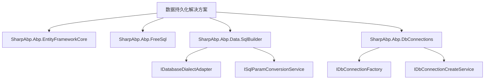
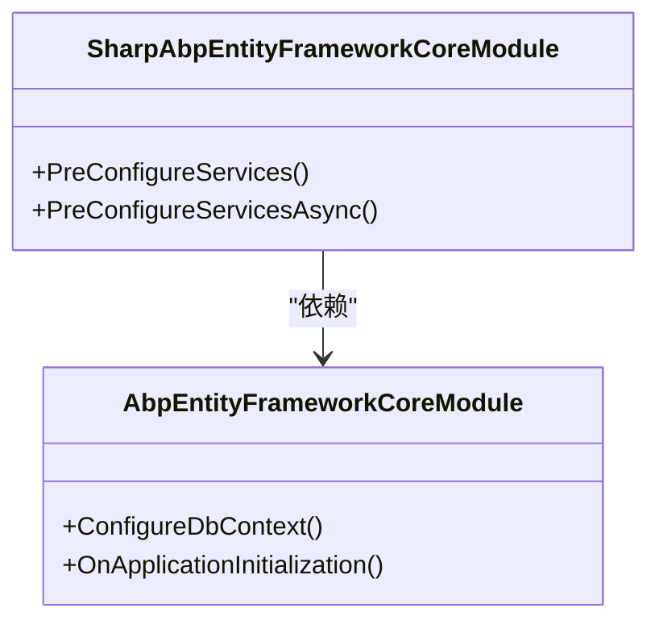
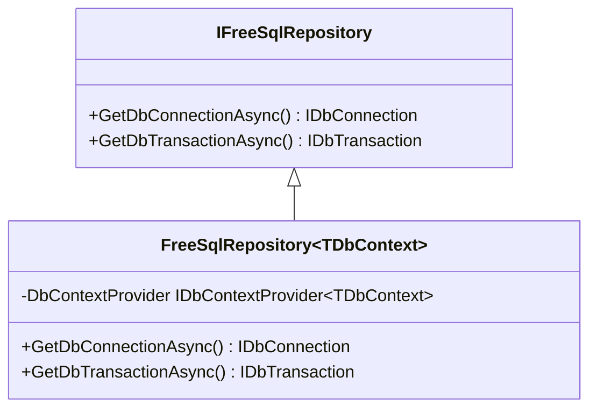
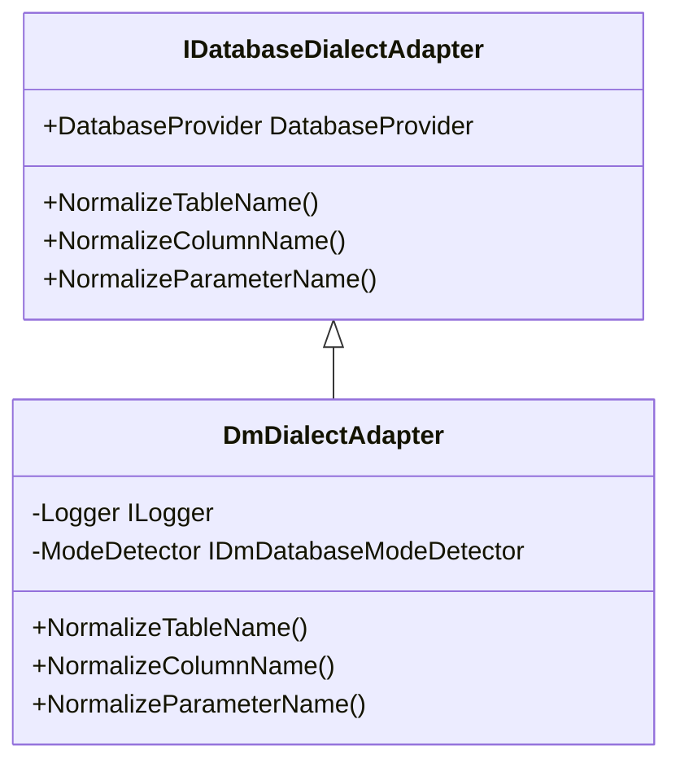
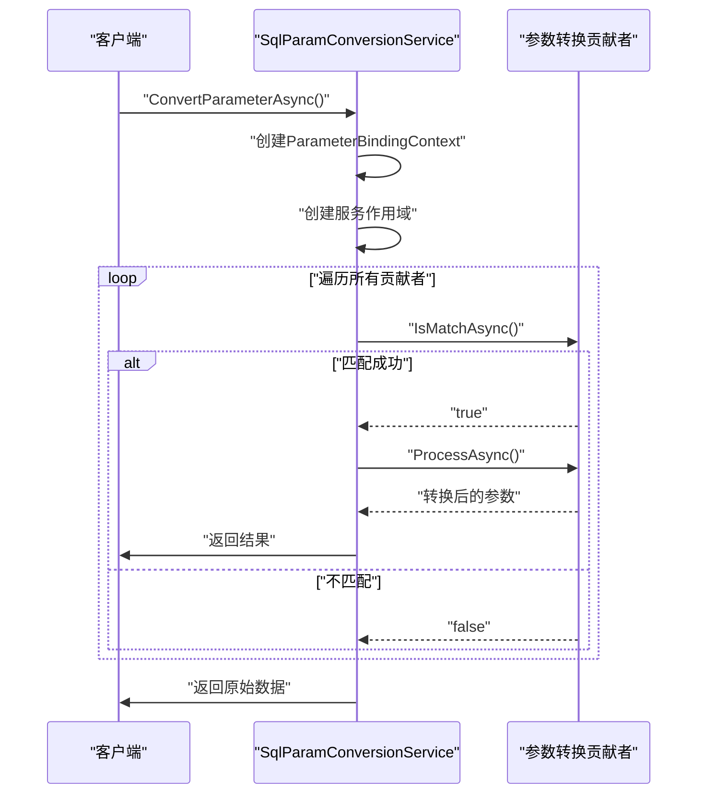

# 数据持久化

<cite>
**本文档中引用的文件**
- [AbpDataSqlBuilderModule.cs](file://framework/src/SharpAbp.Abp.Data.SqlBuilder/SharpAbp/Abp/Data/SqlBuilder/AbpDataSqlBuilderModule.cs)
- [IDatabaseDialectAdapter.cs](file://framework/src/SharpAbp.Abp.Data.SqlBuilder/SharpAbp/Abp/Data/SqlBuilder/IDatabaseDialectAdapter.cs)
- [ISqlParamConversionService.cs](file://framework/src/SharpAbp.Abp.Data.SqlBuilder/SharpAbp/Abp/Data/SqlBuilder/ISqlParamConversionService.cs)
- [DmDialectAdapter.cs](file://framework/src/SharpAbp.Abp.Data.SqlBuilder/SharpAbp/Abp/Data/SqlBuilder/DmDialectAdapter.cs)
- [DefaultSqlParamConversionService.cs](file://framework/src/SharpAbp.Abp.Data.SqlBuilder/SharpAbp/Abp/Data/SqlBuilder/DefaultSqlParamConversionService.cs)
- [IDbConnectionFactory.cs](file://framework/src/SharpAbp.Abp.DbConnections/SharpAbp/Abp/DbConnections/IDbConnectionFactory.cs)
- [IDbConnectionCreateService.cs](file://framework/src/SharpAbp.Abp.DbConnections/SharpAbp/Abp/DbConnections/IDbConnectionCreateService.cs)
- [SharpAbpEntityFrameworkCoreModule.cs](file://framework/src/SharpAbp.Abp.EntityFrameworkCore/SharpAbp/Abp/EntityFrameworkCore/SharpAbpEntityFrameworkCoreModule.cs)
- [IFreeSqlRepository.cs](file://framework/src/SharpAbp.Abp.FreeSql/SharpAbp/Abp/Domain/Repositories/IFreeSqlRepository.cs)
- [FreeSqlRepository.cs](file://framework/src/SharpAbp.Abp.FreeSql/SharpAbp/Abp/Domain/Repositories/FreeSqlRepository.cs)
</cite>

## 目录
1. [简介](#简介)
2. [核心模块架构](#核心模块架构)
3. [ORM解决方案对比](#orm解决方案对比)
4. [SQL构建器模块](#sql构建器模块)
5. [数据库连接管理](#数据库连接管理)
6. [多数据库配置示例](#多数据库配置示例)

## 简介
Sharp-ABP框架提供了一套完整的数据持久化解决方案，支持多种ORM框架和数据库系统。该解决方案旨在为开发者提供灵活、可扩展的数据访问能力，同时保持与ABP框架核心特性的无缝集成。

## 核心模块架构

**图源**
- [AbpDataSqlBuilderModule.cs](file://framework/src/SharpAbp.Abp.Data.SqlBuilder/SharpAbp/Abp/Data/SqlBuilder/AbpDataSqlBuilderModule.cs)
- [IDbConnectionFactory.cs](file://framework/src/SharpAbp.Abp.DbConnections/SharpAbp/Abp/DbConnections/IDbConnectionFactory.cs)

## ORM解决方案对比

### SharpAbp.Abp.EntityFrameworkCore
此模块基于Entity Framework Core构建，提供了与EF Core的深度集成。它通过依赖`AbpEntityFrameworkCoreModule`来扩展ABP框架的核心功能，并引入了针对Sharp-ABP特定需求的配置选项。

**图源**
- [SharpAbpEntityFrameworkCoreModule.cs](file://framework/src/SharpAbp.Abp.EntityFrameworkCore/SharpAbp/Abp/EntityFrameworkCore/SharpAbpEntityFrameworkCoreModule.cs)

### SharpAbp.Abp.FreeSql
此模块集成了FreeSql ORM框架，提供了一个轻量级且高性能的数据访问解决方案。它通过`IFreeSqlRepository`接口抽象了数据库连接和事务管理，允许在不同上下文中统一访问数据库资源。

**图源**
- [IFreeSqlRepository.cs](file://framework/src/SharpAbp.Abp.FreeSql/SharpAbp/Abp/Domain/Repositories/IFreeSqlRepository.cs)
- [FreeSqlRepository.cs](file://framework/src/SharpAbp.Abp.FreeSql/SharpAbp/Abp/Domain/Repositories/FreeSqlRepository.cs)

**本节来源**
- [IFreeSqlRepository.cs](file://framework/src/SharpAbp.Abp.FreeSql/SharpAbp/Abp/Domain/Repositories/IFreeSqlRepository.cs#L0-L11)
- [FreeSqlRepository.cs](file://framework/src/SharpAbp.Abp.FreeSql/SharpAbp/Abp/Domain/Repositories/FreeSqlRepository.cs#L0-L24)

## SQL构建器模块

### IDatabaseDialectAdapter接口
该接口定义了数据库方言适配器的核心契约，负责处理不同数据库系统的命名规范和SQL语法差异。每个实现类对应一种特定的数据库类型，如DM、GaussDB、MySQL等。

**图源**
- [IDatabaseDialectAdapter.cs](file://framework/src/SharpAbp.Abp.Data.SqlBuilder/SharpAbp/Abp/Data/SqlBuilder/IDatabaseDialectAdapter.cs#L0-L11)
- [DmDialectAdapter.cs](file://framework/src/SharpAbp.Abp.Data.SqlBuilder/SharpAbp/Abp/Data/SqlBuilder/DmDialectAdapter.cs#L0-L185)

### ISqlParamConversionService服务
该服务负责在不同数据库之间转换SQL参数格式。它采用贡献者模式（Contributor Pattern），允许通过插件方式添加新的参数转换逻辑，从而实现高度可扩展的参数处理机制。

**图源**
- [ISqlParamConversionService.cs](file://framework/src/SharpAbp.Abp.Data.SqlBuilder/SharpAbp/Abp/Data/SqlBuilder/ISqlParamConversionService.cs#L0-L21)
- [DefaultSqlParamConversionService.cs](file://framework/src/SharpAbp.Abp.Data.SqlBuilder/SharpAbp/Abp/Data/SqlBuilder/DefaultSqlParamConversionService.cs#L0-L78)

**本节来源**
- [IDatabaseDialectAdapter.cs](file://framework/src/SharpAbp.Abp.Data.SqlBuilder/SharpAbp/Abp/Data/SqlBuilder/IDatabaseDialectAdapter.cs#L0-L11)
- [ISqlParamConversionService.cs](file://framework/src/SharpAbp.Abp.Data.SqlBuilder/SharpAbp/Abp/Data/SqlBuilder/ISqlParamConversionService.cs#L0-L21)
- [DmDialectAdapter.cs](file://framework/src/SharpAbp.Abp.Data.SqlBuilder/SharpAbp/Abp/Data/SqlBuilder/DmDialectAdapter.cs#L0-L185)
- [DefaultSqlParamConversionService.cs](file://framework/src/SharpAbp.Abp.Data.SqlBuilder/SharpAbp/Abp/Data/SqlBuilder/DefaultSqlParamConversionService.cs#L0-L78)

