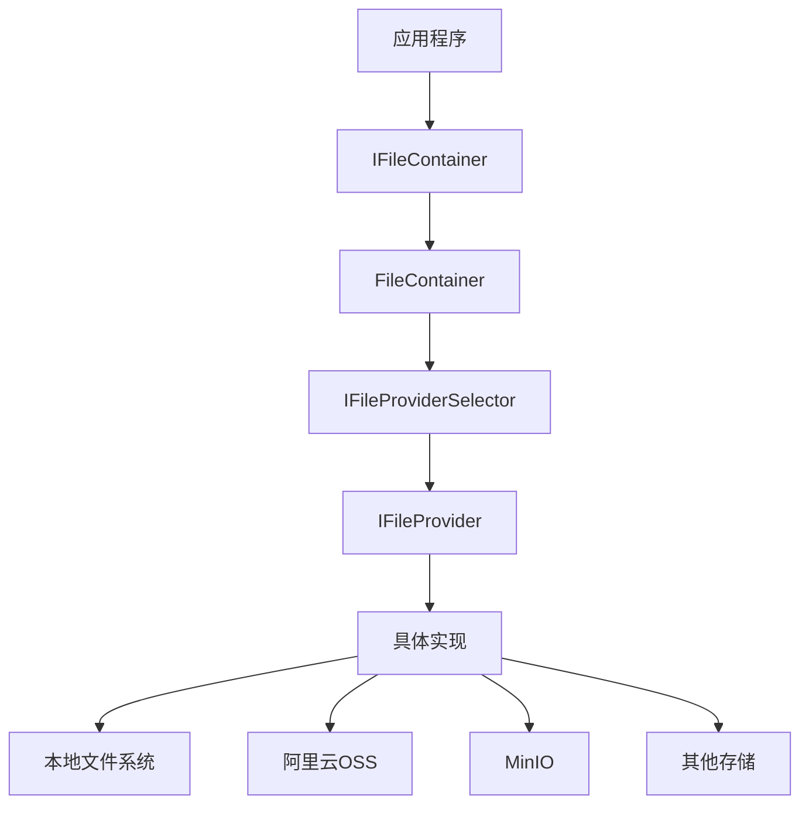
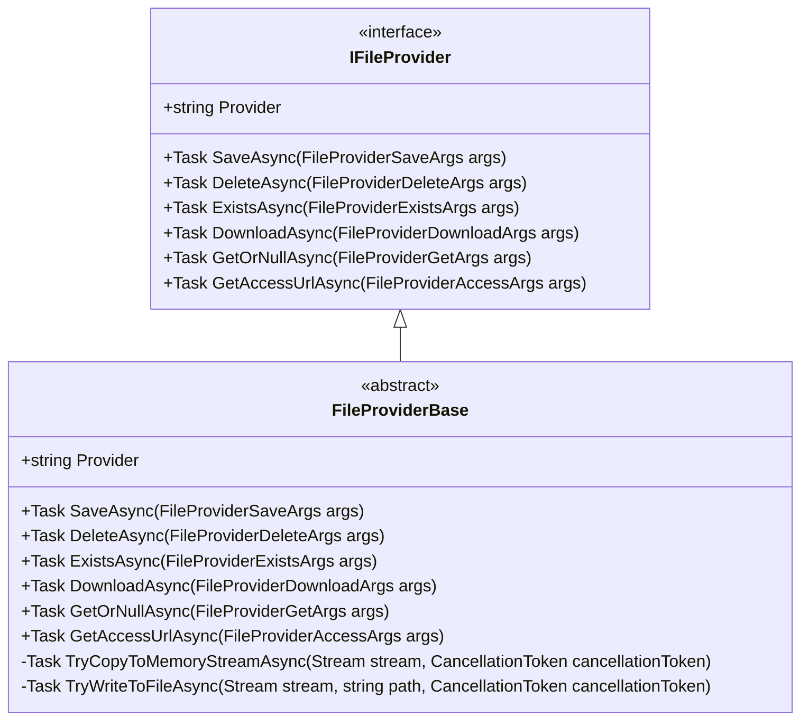
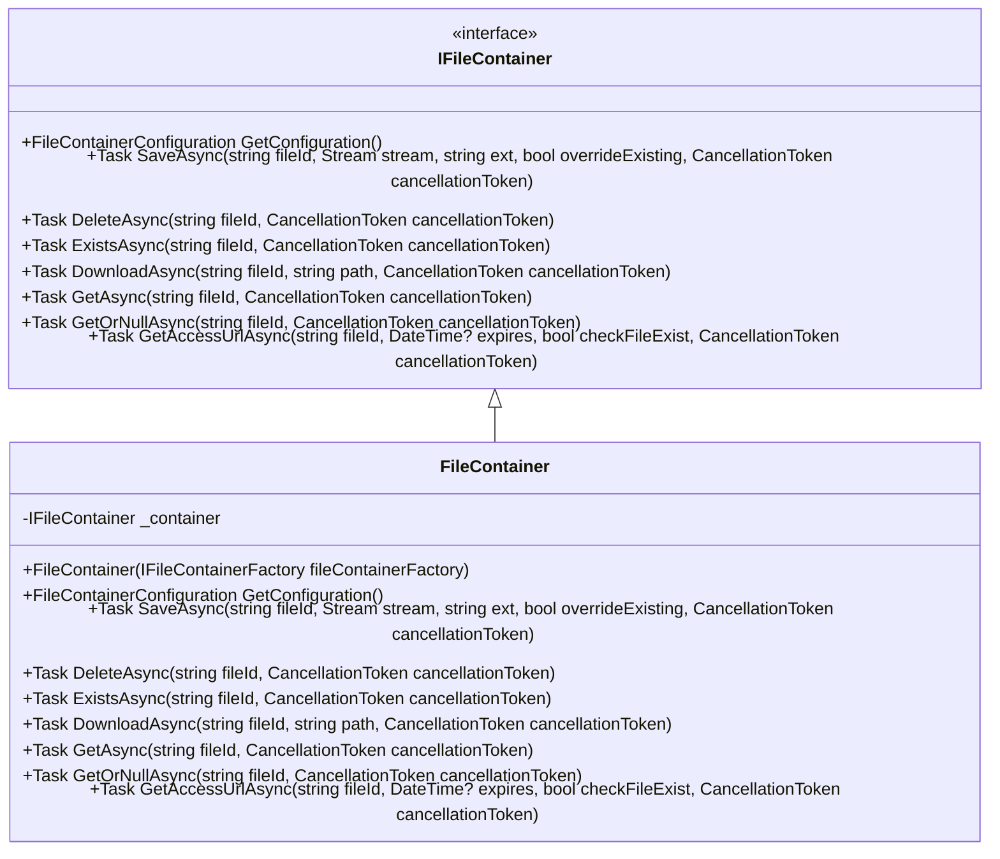

# 文件存储

<cite>
**本文档中引用的文件**
- [IFileProvider.cs](file://framework/src/SharpAbp.Abp.FileStoring/SharpAbp/Abp/FileStoring/IFileProvider.cs)
- [IFileNormalizeNamingService.cs](file://framework/src/SharpAbp.Abp.FileStoring/SharpAbp/Abp/FileStoring/IFileNormalizeNamingService.cs)
- [FileContainer.cs](file://framework/src/SharpAbp.Abp.FileStoring/SharpAbp/Abp/FileStoring/FileContainer.cs)
- [AbpFileStoringModule.cs](file://framework/src/SharpAbp.Abp.FileStoring/SharpAbp/Abp/FileStoring/AbpFileStoringModule.cs)
- [AbpFileStoringOptions.cs](file://framework/src/SharpAbp.Abp.FileStoring/SharpAbp/Abp/FileStoring/AbpFileStoringOptions.cs)
- [FileProviderBase.cs](file://framework/src/SharpAbp.Abp.FileStoring/SharpAbp/Abp/FileStoring/FileProviderBase.cs)
- [AbpFileStoringFileSystemModule.cs](file://framework/src/SharpAbp.Abp.FileStoring.FileSystem/SharpAbp/Abp/FileStoring/FileSystem/AbpFileStoringFileSystemModule.cs)
- [AbpFileStoringMinioModule.cs](file://framework/src/SharpAbp.Abp.FileStoring.Minio/SharpAbp/Abp/FileStoring/Minio/AbpFileStoringMinioModule.cs)
- [AbpFileStoringAliyunModule.cs](file://framework/src/SharpAbp.Abp.FileStoring.Aliyun/SharpAbp/Abp/FileStoring/Aliyun/AbpFileStoringAliyunModule.cs)
</cite>

## 目录
1. [简介](#简介)
2. [核心架构设计](#核心架构设计)
3. [统一文件存储抽象层](#统一文件存储抽象层)
4. [多提供商支持机制](#多提供商支持机制)
5. [文件容器配置与管理](#文件容器配置与管理)
6. [文件命名规范化](#文件命名规范化)
7. [文件操作示例](#文件操作示例)
8. [配置示例](#配置示例)

## 简介
SharpAbp.Abp.FileStoring 模块提供了一个统一的文件存储抽象层，支持多种存储后端，包括本地文件系统、阿里云OSS、MinIO等。该系统通过定义清晰的接口和抽象，实现了文件存储操作的统一性和可扩展性。

## 核心架构设计



**图表来源**
- [IFileContainer.cs](file://framework/src/SharpAbp.Abp.FileStoring.Abstractions/SharpAbp/Abp/FileStoring/IFileContainer.cs)
- [FileContainer.cs](file://framework/src/SharpAbp.Abp.FileStoring/SharpAbp/Abp/FileStoring/FileContainer.cs)
- [IFileProviderSelector.cs](file://framework/src/SharpAbp.Abp.FileStoring/SharpAbp/Abp/FileStoring/IFileProviderSelector.cs)
- [IFileProvider.cs](file://framework/src/SharpAbp.Abp.FileStoring/SharpAbp/Abp/FileStoring/IFileProvider.cs)

**章节来源**
- [AbpFileStoringModule.cs](file://framework/src/SharpAbp.Abp.FileStoring/SharpAbp/Abp/FileStoring/AbpFileStoringModule.cs)

## 统一文件存储抽象层

### IFileProvider 接口
`IFileProvider` 接口定义了文件存储的基本契约，为不同存储后端提供了统一的操作接口。



**图表来源**
- [IFileProvider.cs](file://framework/src/SharpAbp.Abp.FileStoring/SharpAbp/Abp/FileStoring/IFileProvider.cs)
- [FileProviderBase.cs](file://framework/src/SharpAbp.Abp.FileStoring/SharpAbp/Abp/FileStoring/FileProviderBase.cs)

**章节来源**
- [IFileProvider.cs](file://framework/src/SharpAbp.Abp.FileStoring/SharpAbp/Abp/FileStoring/IFileProvider.cs)
- [FileProviderBase.cs](file://framework/src/SharpAbp.Abp.FileStoring/SharpAbp/Abp/FileStoring/FileProviderBase.cs)

### IFileContainer 接口
`IFileContainer` 接口提供了更高层次的文件容器抽象，封装了具体的文件操作。



**图表来源**
- [IFileContainer.cs](file://framework/src/SharpAbp.Abp.FileStoring.Abstractions/SharpAbp/Abp/FileStoring/IFileContainer.cs)
- [FileContainer.cs](file://framework/src/SharpAbp.Abp.FileStoring/SharpAbp/Abp/FileStoring/FileContainer.cs)

**章节来源**
- [FileContainer.cs](file://framework/src/SharpAbp.Abp.FileStoring/SharpAbp/Abp/FileStoring/FileContainer.cs)

## 多提供商支持机制

### 存储提供商注册
系统通过模块化设计支持多种存储提供商，每个提供商在各自的模块中进行注册。

```mermaid
sequenceDiagram
    participant App as 应用程序
    participant Module as 模块
    participant Options as AbpFileStoringAbstractionsOptions
    participant Providers as Providers
    
    App->>Module: 启动应用
    Module->>Options: PreConfigure
    Options->>Providers: Try