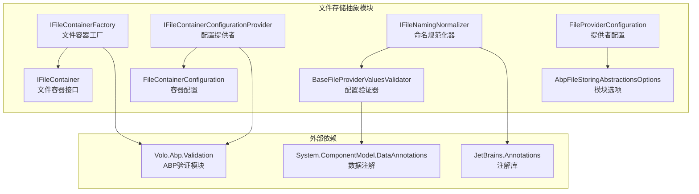
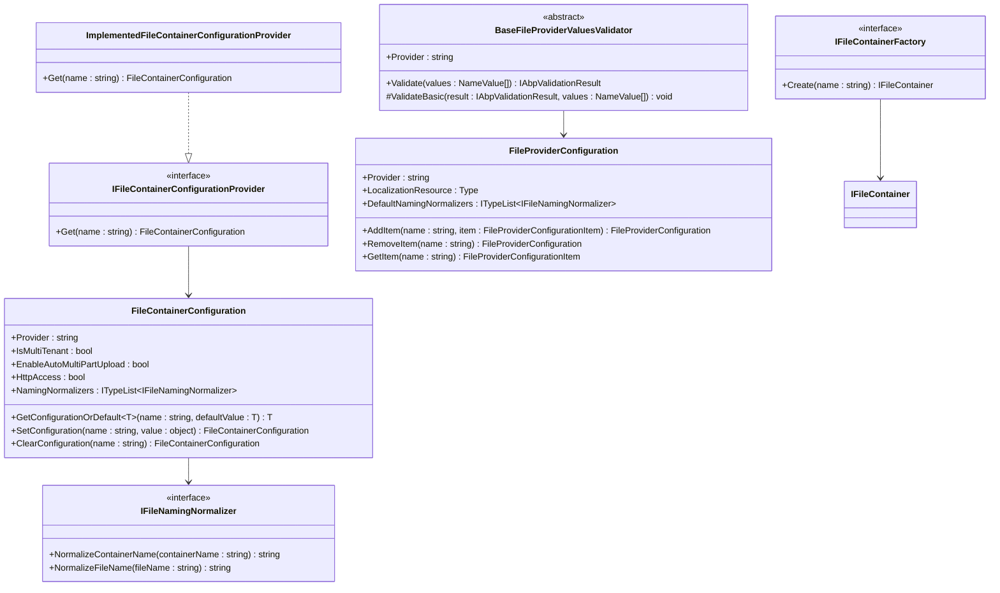
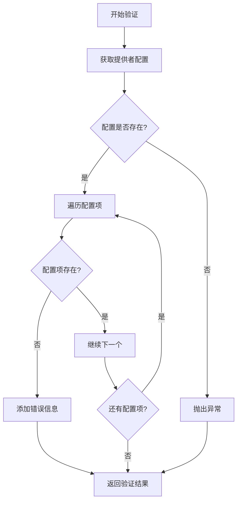
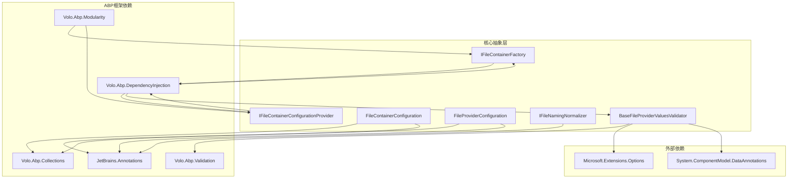

# 文件存储抽象定义

<cite>
**本文档中引用的文件**
- [IFileContainerFactory.cs](file://framework/src/SharpAbp.Abp.FileStoring.Abstractions/SharpAbp/Abp/FileStoring/IFileContainerFactory.cs)
- [IFileContainerConfigurationProvider.cs](file://framework/src/SharpAbp.Abp.FileStoring.Abstractions/SharpAbp/Abp/FileStoring/IFileContainerConfigurationProvider.cs)
- [FileContainerConfiguration.cs](file://framework/src/SharpAbp.Abp.FileStoring.Abstractions/SharpAbp/Abp/FileStoring/FileContainerConfiguration.cs)
- [FileProviderConfiguration.cs](file://framework/src\SharpAbp.Abp.FileStoring.Abstractions\SharpAbp\Abp\FileStoring\FileProviderConfiguration.cs)
- [ImplementedFileContainerConfigurationProvider.cs](file://framework/src\SharpAbp.Abp.FileStoring.Abstractions\SharpAbp\Abp\FileStoring\ImplementedFileContainerConfigurationProvider.cs)
- [IFileNamingNormalizer.cs](file://framework/src\SharpAbp.Abp.FileStoring.Abstractions\SharpAbp\Abp\FileStoring\IFileNamingNormalizer.cs)
- [BaseFileProviderValuesValidator.cs](file://framework/src\SharpAbp.Abp.FileStoring.Abstractions\SharpAbp\Abp\FileStoring\BaseFileProviderValuesValidator.cs)
- [AbpFileStoringAbstractionsModule.cs](file://framework/src\SharpAbp.Abp.FileStoring.Abstractions\SharpAbp\Abp\FileStoring\AbpFileStoringAbstractionsModule.cs)
- [AbpFileStoringAbstractionsOptions.cs](file://framework/src\SharpAbp.Abp.FileStoring.Abstractions\SharpAbp\Abp\FileStoring\AbpFileStoringAbstractionsOptions.cs)
- [IFileContainer.cs](file://framework/src\SharpAbp.Abp.FileStoring.Abstractions\SharpAbp\Abp\FileStoring\IFileContainer.cs)
</cite>

## 目录
1. [简介](#简介)
2. [项目结构](#项目结构)
3. [核心组件](#核心组件)
4. [架构概览](#架构概览)
5. [详细组件分析](#详细组件分析)
6. [依赖关系分析](#依赖关系分析)
7. [性能考虑](#性能考虑)
8. [故障排除指南](#故障排除指南)
9. [结论](#结论)

## 简介

`SharpAbp.Abp.FileStoring.Abstractions` 是 SharpAbp 文件存储模块的核心抽象层，为整个文件存储系统提供了统一的契约和抽象。该模块采用工厂模式、配置提供者模式等设计模式，实现了高度可扩展和可配置的文件存储解决方案。

该模块的主要目标是：
- 提供统一的文件容器接口
- 支持多种文件存储提供商
- 实现灵活的配置管理
- 确保文件名规范化
- 提供配置验证机制

## 项目结构



**图表来源**
- [IFileContainerFactory.cs](file://framework/src/SharpAbp.Abp.FileStoring.Abstractions/SharpAbp/Abp/FileStoring/IFileContainerFactory.cs#L1-L14)
- [IFileContainerConfigurationProvider.cs](file://framework/src/SharpAbp.Abp.FileStoring.Abstractions/SharpAbp/Abp/FileStoring/IFileContainerConfigurationProvider.cs#L1-L14)
- [AbpFileStoringAbstractionsModule.cs](file://framework/src/SharpAbp.Abp.FileStoring.Abstractions/SharpAbp/Abp/FileStoring/AbpFileStoringAbstractionsModule.cs#L1-L32)

**章节来源**
- [AbpFileStoringAbstractionsModule.cs](file://framework/src\SharpAbp.Abp.FileStoring.Abstractions\SharpAbp\Abp\FileStoring\AbpFileStoringAbstractionsModule.cs#L1-L32)
- [AbpFileStoringAbstractionsOptions.cs](file://framework/src\SharpAbp.Abp.FileStoring.Abstractions\SharpAbp\Abp\FileStoring\AbpFileStoringAbstractionsOptions.cs#L1-L15)

## 核心组件

### 工厂模式：IFileContainerFactory

`IFileContainerFactory` 接口实现了工厂模式，负责创建和管理文件容器实例：

```csharp
public interface IFileContainerFactory
{
    /// <summary>
    /// Gets a named container.
    /// </summary>
    /// <param name="name">The name of the container</param>
    /// <returns>
    /// The container object.
    /// </returns>
    IFileContainer Create(string name);
}
```

该接口的设计特点：
- **简单明了**：只提供一个方法用于创建容器
- **类型安全**：支持泛型约束确保类型一致性
- **延迟初始化**：容器在需要时才创建

### 配置提供者模式：IFileContainerConfigurationProvider

`IFileContainerConfigurationProvider` 接口实现了配置提供者模式，负责为特定容器提供配置信息：

```csharp
public interface IFileContainerConfigurationProvider
{
    /// <summary>
    /// Gets a <see cref="FileContainerConfiguration"/> for the given container <paramref name="name"/>.
    /// </summary>
    /// <param name="name">The name of the container</param>
    /// <returns>The configuration that should be used for the container</returns>
    FileContainerConfiguration Get([NotNull] string name);
}
```

该接口的核心功能：
- **按需配置**：根据容器名称动态获取配置
- **配置隔离**：每个容器可以有独立的配置设置
- **配置继承**：支持配置回退机制

**章节来源**
- [IFileContainerFactory.cs](file://framework/src\SharpAbp.Abp.FileStoring.Abstractions\SharpAbp\Abp\FileStoring\IFileContainerFactory.cs#L1-L14)
- [IFileContainerConfigurationProvider.cs](file://framework/src\SharpAbp.Abp.FileStoring.Abstractions\SharpAbp\Abp\FileStoring\IFileContainerConfigurationProvider.cs#L1-L14)

## 架构概览



**图表来源**
- [IFileContainerFactory.cs](file://framework/src\SharpAbp.Abp.FileStoring.Abstractions\SharpAbp\Abp\FileStoring\IFileContainerFactory.cs#L1-L14)
- [IFileContainerConfigurationProvider.cs](file://framework/src\SharpAbp.Abp.FileStoring.Abstractions\SharpAbp\Abp\FileStoring\IFileContainerConfigurationProvider.cs#L1-L14)
- [FileContainerConfiguration.cs](file://framework/src\SharpAbp.Abp.FileStoring.Abstractions\SharpAbp\Abp\FileStoring\FileContainerConfiguration.cs#L1-L100)
- [FileProviderConfiguration.cs](file://framework/src\SharpAbp.Abp.FileStoring.Abstractions\SharpAbp\Abp\FileStoring\FileProviderConfiguration.cs#L1-L124)
- [IFileNamingNormalizer.cs](file://framework/src\SharpAbp.Abp.FileStoring.Abstractions\SharpAbp\Abp\FileStoring\IFileNamingNormalizer.cs#L1-L24)
- [BaseFileProviderValuesValidator.cs](file://framework/src\SharpAbp.Abp.FileStoring.Abstractions\SharpAbp\Abp\FileStoring\BaseFileProviderValuesValidator.cs#L1-L63)

## 详细组件分析

### FileContainerConfiguration 核心配置模型

`FileContainerConfiguration` 类是文件容器的核心配置模型，提供了丰富的配置选项：

```csharp
public class FileContainerConfiguration
{
    public string? Provider { get; set; }
    public bool IsMultiTenant { get; set; } = true;
    public bool EnableAutoMultiPartUpload { get; set; } = false;
    public int MultiPartUploadMinFileSize { get; set; } = 1024 * 1024 * 100;
    public int MultiPartUploadShardingSize { get; set; } = 1024 * 1024 * 5;
    public bool HttpAccess { get; set; } = true;
    public ITypeList<IFileNamingNormalizer> NamingNormalizers { get; }
}
```

#### 主要特性：

1. **多租户支持**：`IsMultiTenant` 属性控制容器是否支持多租户
2. **分片上传**：支持大文件的自动分片上传
3. **HTTP访问**：控制是否可以通过HTTP URL访问对象
4. **命名规范化**：通过 `IFileNamingNormalizer` 接口支持文件名规范化
5. **配置继承**：支持配置回退机制

#### 配置管理方法：

```csharp
// 获取配置（带默认值）
T? GetConfigurationOrDefault<T>(string name, T? defaultValue = default)

// 设置配置
FileContainerConfiguration SetConfiguration(string name, object? value)

// 清除配置
FileContainerConfiguration ClearConfiguration(string name)
```

### FileProviderConfiguration 提供者配置

`FileProviderConfiguration` 类专门用于配置文件存储提供者：

```csharp
public class FileProviderConfiguration
{
    public string? Provider { get; }
    public Type? LocalizationResource { get; }
    public ITypeList<IFileNamingNormalizer> DefaultNamingNormalizers { get; }
    
    // 添加配置项
    public FileProviderConfiguration AddItem(string name, FileProviderConfigurationItem item)
    
    // 移除配置项
    public FileProviderConfiguration RemoveItem(string name)
    
    // 获取所有配置项
    public Dictionary<string, FileProviderConfigurationItem> GetItems()
}
```

该类的特点：
- **提供者特定**：每个文件存储提供者都有独立的配置
- **本地化支持**：支持配置项的本地化资源
- **默认规范化器**：为提供者设置默认的命名规范化器

### ImplementedFileContainerConfigurationProvider 实现

`ImplementedFileContainerConfigurationProvider` 是 `IFileContainerConfigurationProvider` 接口的占位实现：

```csharp
public class ImplementedFileContainerConfigurationProvider : IFileContainerConfigurationProvider, ITransientDependency
{
    public FileContainerConfiguration Get([NotNull] string name)
    {
        throw new NotImplementedException();
    }
}
```

虽然当前实现抛出异常，但它展示了正确的依赖注入模式：
- 实现 `ITransientDependency` 接口
- 支持依赖注入生命周期管理

**章节来源**
- [FileContainerConfiguration.cs](file://framework/src\SharpAbp.Abp.FileStoring.Abstractions\SharpAbp\Abp\FileStoring\FileContainerConfiguration.cs#L1-L100)
- [FileProviderConfiguration.cs](file://framework/src\SharpAbp.Abp.FileStoring.Abstractions\SharpAbp\Abp\FileStoring\FileProviderConfiguration.cs#L1-L124)
- [ImplementedFileContainerConfigurationProvider.cs](file://framework/src\SharpAbp.Abp.FileStoring.Abstractions\SharpAbp\Abp\FileStoring\ImplementedFileContainerConfigurationProvider.cs#L1-L15)

### IFileNamingNormalizer 文件名规范化

`IFileNamingNormalizer` 接口负责文件和容器名称的规范化处理：

```csharp
public interface IFileNamingNormalizer
{
    string NormalizeContainerName(string containerName);
    string NormalizeFileName(string fileName);
}
```

#### 规范化的作用：
- **安全性**：防止特殊字符和恶意文件名
- **一致性**：确保文件名符合存储系统的命名规则
- **兼容性**：适配不同存储提供商的命名限制

### BaseFileProviderValuesValidator 配置验证

`BaseFileProviderValuesValidator` 抽象类提供了配置值验证的基础功能：

```csharp
public abstract class BaseFileProviderValuesValidator : IFileProviderValuesValidator
{
    protected AbpFileStoringAbstractionsOptions Options { get; }
    
    public abstract string Provider { get; }
    public abstract IAbpValidationResult Validate(List<NameValue> values);
    
    protected virtual void ValidateBasic(IAbpValidationResult result, List<NameValue> values)
    {
        // 基本验证逻辑
    }
}
```

#### 验证流程：



**图表来源**
- [BaseFileProviderValuesValidator.cs](file://framework/src\SharpAbp.Abp.FileStoring.Abstractions\SharpAbp\Abp\FileStoring\BaseFileProviderValuesValidator.cs#L1-L63)

**章节来源**
- [IFileNamingNormalizer.cs](file://framework/src\SharpAbp.Abp.FileStoring.Abstractions\SharpAbp\Abp\FileStoring\IFileNamingNormalizer.cs#L1-L24)
- [BaseFileProviderValuesValidator.cs](file://framework/src\SharpAbp.Abp.FileStoring.Abstractions\SharpAbp\Abp\FileStoring\BaseFileProviderValuesValidator.cs#L1-L63)

## 依赖关系分析



**图表来源**
- [AbpFileStoringAbstractionsModule.cs](file://framework/src\SharpAbp.Abp.FileStoring.Abstractions\SharpAbp\Abp\FileStoring\AbpFileStoringAbstractionsModule.cs#L1-L32)
- [BaseFileProviderValuesValidator.cs](file://framework/src\SharpAbp.Abp.FileStoring.Abstractions\SharpAbp\Abp\FileStoring\BaseFileProviderValuesValidator.cs#L1-L63)

### 关键依赖说明：

1. **Volo.Abp.Validation**：提供验证框架支持
2. **Volo.Abp.DependencyInjection**：支持依赖注入
3. **JetBrains.Annotations**：提供代码注解支持
4. **System.ComponentModel.DataAnnotations**：数据注解验证

**章节来源**
- [AbpFileStoringAbstractionsModule.cs](file://framework/src\SharpAbp.Abp.FileStoring.Abstractions\SharpAbp\Abp\FileStoring\AbpFileStoringAbstractionsModule.cs#L1-L32)
- [BaseFileProviderValuesValidator.cs](file://framework/src\SharpAbp.Abp.FileStoring.Abstractions\SharpAbp\Abp\FileStoring\BaseFileProviderValuesValidator.cs#L1-L63)

## 性能考虑

### 容器工厂性能优化

1. **延迟初始化**：容器只在需要时创建
2. **缓存机制**：配置信息可以被缓存以提高性能
3. **并发安全**：支持多线程环境下的安全访问

### 配置管理性能

1. **配置继承**：避免重复配置，减少内存占用
2. **快速查找**：使用字典结构进行快速配置检索
3. **最小化验证开销**：只在必要时执行完整验证

### 文件名规范化性能

1. **缓存结果**：规范化结果可以被缓存
2. **批量处理**：支持批量文件名规范化
3. **异步处理**：支持异步规范化操作

## 故障排除指南

### 常见问题及解决方案

#### 1. 配置提供者未实现异常

**问题**：`ImplementedFileContainerConfigurationProvider` 被使用导致 `NotImplementedException`

**解决方案**：
- 实现自定义的配置提供者
- 注册到依赖注入容器中
- 确保正确配置文件存储提供者

#### 2. 配置验证失败

**问题**：`BaseFileProviderValuesValidator` 验证失败

**解决方案**：
- 检查配置项是否完整
- 确认配置值类型正确
- 查看具体的验证错误信息

#### 3. 文件名规范化问题

**问题**：文件名不符合存储要求

**解决方案**：
- 实现自定义的 `IFileNamingNormalizer`
- 在配置中注册规范化器
- 测试规范化逻辑

**章节来源**
- [ImplementedFileContainerConfigurationProvider.cs](file://framework/src\SharpAbp.Abp.FileStoring.Abstractions\SharpAbp\Abp\FileStoring\ImplementedFileContainerConfigurationProvider.cs#L1-L15)
- [BaseFileProviderValuesValidator.cs](file://framework/src\SharpAbp.Abp.FileStoring.Abstractions\SharpAbp\Abp\FileStoring\BaseFileProviderValuesValidator.cs#L1-L63)

## 结论

`SharpAbp.Abp.FileStoring.Abstractions` 模块通过精心设计的抽象层，为文件存储系统提供了强大而灵活的基础架构。其主要优势包括：

### 设计优势

1. **高度抽象**：通过接口和抽象类实现松耦合设计
2. **可扩展性**：支持多种文件存储提供商和自定义配置
3. **配置灵活性**：提供丰富的配置选项和验证机制
4. **命名规范**：确保文件名的安全性和一致性

### 最佳实践建议

1. **合理使用工厂模式**：根据实际需求选择合适的容器创建策略
2. **配置继承利用**：充分利用配置回退机制减少重复配置
3. **自定义验证器**：为特定提供者实现专门的配置验证逻辑
4. **命名规范化**：根据存储要求实现适当的文件名规范化

### 发展方向

该模块为文件存储系统奠定了坚实的基础，未来可以考虑：
- 增强配置热更新能力
- 扩展更多文件存储提供商支持
- 优化性能监控和指标收集
- 改进错误处理和日志记录

通过深入理解和正确使用这些抽象接口，开发者可以构建出既稳定又高效的文件存储解决方案。