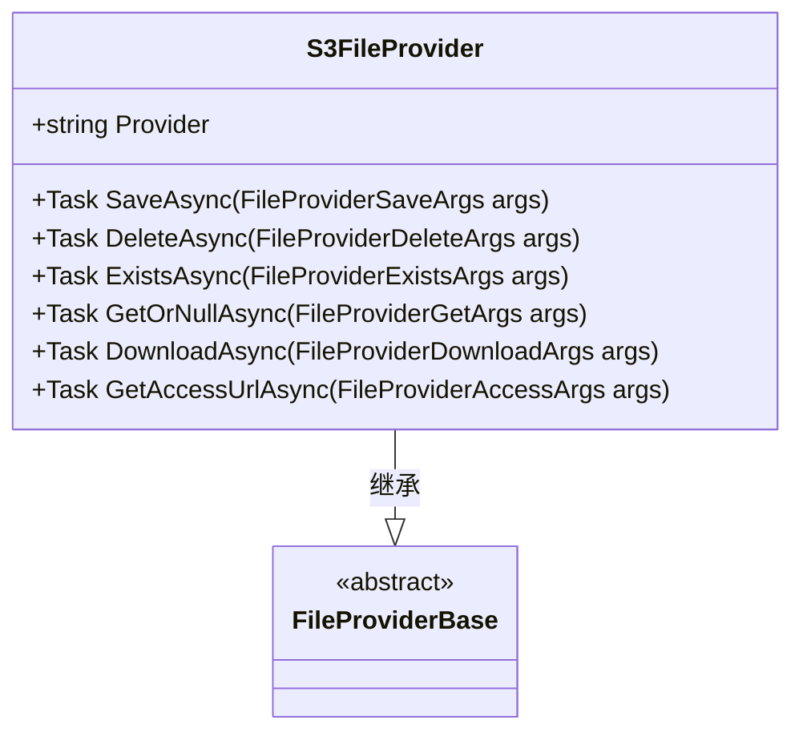
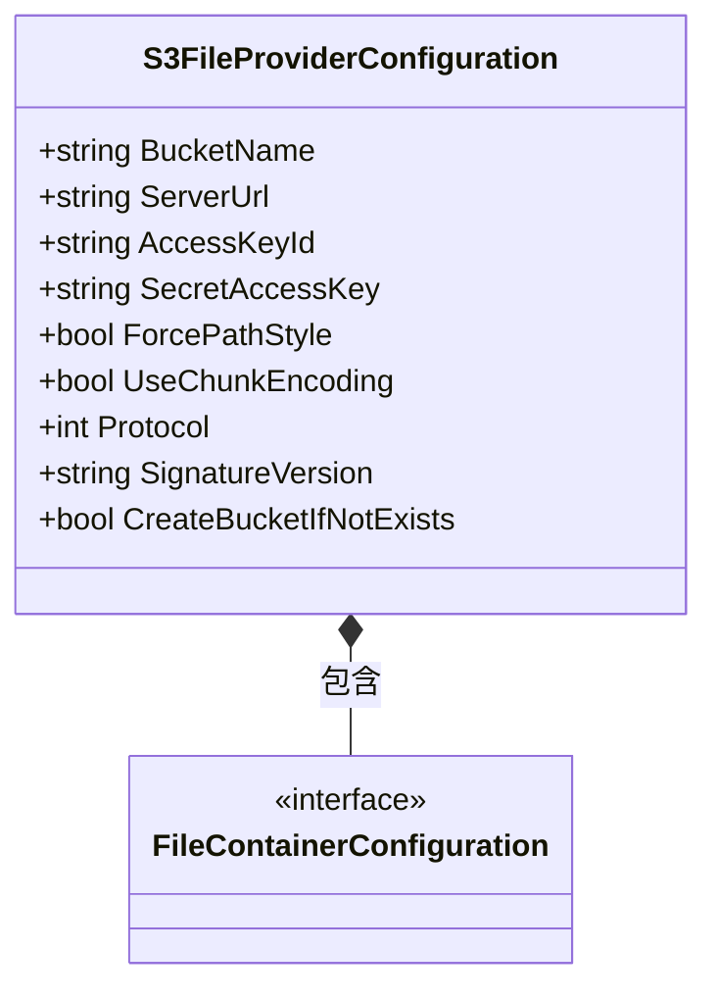
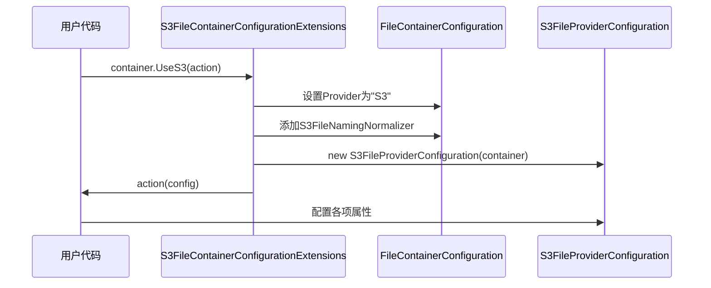
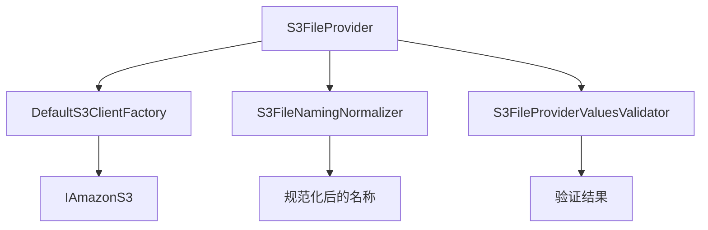

# AWS S3存储

<cite>
**本文档中引用的文件**  
- [AwsFileProvider.cs](file://framework/src/SharpAbp.Abp.FileStoring.Aws/SharpAbp/Abp/FileStoring/Aws/AwsFileProvider.cs)
- [AwsFileProviderConfiguration.cs](file://framework/src/SharpAbp.Abp.FileStoring.Aws/SharpAbp/Abp/FileStoring/Aws/AwsFileProviderConfiguration.cs)
- [AwsFileContainerConfigurationExtensions.cs](file://framework/src/SharpAbp.Abp.FileStoring.Aws/SharpAbp/Abp/FileStoring/Aws/AwsFileContainerConfigurationExtensions.cs)
- [S3FileProvider.cs](file://framework/src/SharpAbp.Abp.FileStoring.S3/SharpAbp/Abp/FileStoring/S3/S3FileProvider.cs)
- [S3FileProviderConfiguration.cs](file://framework/src/SharpAbp.Abp.FileStoring.S3/SharpAbp/Abp/FileStoring/S3/S3FileProviderConfiguration.cs)
- [S3FileContainerConfigurationExtensions.cs](file://framework/src/SharpAbp.Abp.FileStoring.S3/SharpAbp/Abp/FileStoring/S3/S3FileContainerConfigurationExtensions.cs)
- [DefaultS3ClientFactory.cs](file://framework/src/SharpAbp.Abp.FileStoring.S3/SharpAbp/Abp/FileStoring/S3/DefaultS3ClientFactory.cs)
- [S3FileNamingNormalizer.cs](file://framework/src/SharpAbp.Abp.FileStoring.S3/SharpAbp/Abp/FileStoring/S3/S3FileNamingNormalizer.cs)
- [S3FileProviderValuesValidator.cs](file://framework/src/SharpAbp.Abp.FileStoring.S3/SharpAbp/Abp/FileStoring/S3/S3FileProviderValuesValidator.cs)
- [AbpFileStoringS3Module.cs](file://framework/src/SharpAbp.Abp.FileStoring.S3/SharpAbp/Abp/FileStoring/S3/AbpFileStoringS3Module.cs)
</cite>

## 目录
1. [简介](#简介)
2. [核心组件分析](#核心组件分析)
3. [S3文件提供者配置详解](#s3文件提供者配置详解)
4. [容器配置扩展与UseS3方法](#容器配置扩展与uses3方法)
5. [S3特定功能处理指导](#s3特定功能处理指导)
6. [依赖关系与验证机制](#依赖关系与验证机制)

## 简介
AWS S3存储模块是SharpAbp框架中的一个重要组成部分，它通过集成AWS SDK for .NET实现了与Amazon S3服务的交互。该模块支持对象上传、下载、删除和元数据管理等基本操作，并提供了丰富的配置选项来满足不同的使用场景需求。此外，还包含了对S3特定功能如版本控制、生命周期策略和跨区域复制的支持。

## 核心组件分析

### S3文件提供者实现
`S3FileProvider`类是AWS S3存储功能的主要入口点，负责执行所有与S3相关的文件操作。此类继承自`FileProviderBase`并实现了`ITransientDependency`接口以确保每次请求都能获得一个新的实例。

#### 主要功能
- **保存文件**: 通过`SaveAsync`方法将文件流保存到指定的S3桶中。
- **删除文件**: 使用`DeleteAsync`方法从S3桶中移除指定文件。
- **检查文件存在性**: `ExistsAsync`方法用于判断某个文件是否存在于S3桶内。
- **获取或下载文件**: 提供了`GetOrNullAsync`和`DownloadAsync`两个方法分别用于在内存中读取文件内容或将文件直接写入本地磁盘。
- **生成访问URL**: 利用`GetAccessUrlAsync`方法可以创建一个预签名的URL，允许临时访问私有资源。

这些操作都基于AWS SDK提供的`IAmazonS3`客户端进行，同时利用对象池技术（Object Pool）优化性能，减少频繁创建和销毁连接带来的开销。



**图源**
- [S3FileProvider.cs](file://framework/src/SharpAbp.Abp.FileStoring.S3/SharpAbp/Abp/FileStoring/S3/S3FileProvider.cs#L1-L400)

**节源**
- [S3FileProvider.cs](file://framework/src/SharpAbp.Abp.FileStoring.S3/SharpAbp/Abp/FileStoring/S3/S3FileProvider.cs#L1-L400)

## S3文件提供者配置详解

### 配置项说明
`S3FileProviderConfiguration`类定义了一系列可用于定制S3行为的属性。每个属性都有明确的用途和默认值，开发者可以根据实际需要调整这些设置。

| 属性名 | 类型 | 描述 |
| --- | --- | --- |
| BucketName | string | 指定要使用的S3桶名称。必须是非空字符串且符合命名规则。 |
| ServerUrl | string | S3服务端点地址，例如http://s3.amazonaws.com。 |
| AccessKeyId | string | AWS账户访问密钥ID，用于身份验证。 |
| SecretAccessKey | string | AWS账户秘密访问密钥，配合AccessKeyId完成认证过程。 |
| ForcePathStyle | bool | 是否强制使用路径样式URL而非虚拟主机样式，默认为false。 |
| UseChunkEncoding | bool | 启用分块传输编码，适用于大文件上传，默认为false。 |
| Protocol | int | 通信协议选择：0表示HTTPS，1表示HTTP。 |
| SignatureVersion | string | 请求签名版本号，可选"2"或"4"。 |
| CreateBucketIfNotExists | bool | 如果目标桶不存在，则自动创建，默认为false。 |

以上配置项均通过内部持有的`FileContainerConfiguration`对象进行管理，保证了配置的一致性和安全性。



**图源**
- [S3FileProviderConfiguration.cs](file://framework/src/SharpAbp.Abp.FileStoring.S3/SharpAbp/Abp/FileStoring/S3/S3FileProviderConfiguration.cs#L1-L100)

**节源**
- [S3FileProviderConfiguration.cs](file://framework/src/SharpAbp.Abp.FileStoring.S3/SharpAbp/Abp/FileStoring/S3/S3FileProviderConfiguration.cs#L1-L100)

## 容器配置扩展与UseS3方法

### 扩展方法设计
为了简化S3存储的配置流程，框架提供了一个名为`S3FileContainerConfigurationExtensions`的静态类，其中包含两个关键的扩展方法：

- `GetS3Configuration`: 从给定的`FileContainerConfiguration`实例中提取出对应的`S3FileProviderConfiguration`对象。
- `UseS3`: 允许用户通过lambda表达式快速配置S3相关参数，并注册必要的命名规范化器。

这种设计模式不仅提高了代码的可读性和易用性，也使得整个配置过程更加灵活可控。

#### 示例代码
```csharp
services.Configure<AbpFileStoringOptions>(options =>
{
    options.Containers.Configure("my-container", container =>
    {
        container.UseS3(s3 =>
        {
            s3.AccessKeyId = "your-access-key-id";
            s3.SecretAccessKey = "your-secret-access-key";
            s3.ServerUrl = "https://s3.amazonaws.com";
            s3.BucketName = "my-bucket";
            s3.CreateBucketIfNotExists = true;
        });
    });
});
```

此示例展示了如何在一个名为"my-container"的容器上启用S3存储，并设置了必要的认证信息和其他选项。



**图源**
- [S3FileContainerConfigurationExtensions.cs](file://framework/src/SharpAbp.Abp.FileStoring.S3/SharpAbp/Abp/FileStoring/S3/S3FileContainerConfigurationExtensions.cs#L1-L26)

**节源**
- [S3FileContainerConfigurationExtensions.cs](file://framework/src/SharpAbp.Abp.FileStoring.S3/SharpAbp/Abp/FileStoring/S3/S3FileContainerConfigurationExtensions.cs#L1-L26)

## S3特定功能处理指导

### 版本控制
虽然当前实现未直接暴露版本控制API，但可以通过底层`IAmazonS3`客户端调用相应的方法来启用或管理对象版本。建议在高级应用场景下手动处理此类需求。

### 生命周期策略
生命周期管理同样依赖于AWS SDK原生支持。开发者可以在S3控制台或者通过编程方式定义规则，比如定期归档旧文件至Glacier存储类别。

### 跨区域复制
跨区域复制(CRR)是一项复杂的功能，通常涉及多个步骤包括权限设置、复制角色配置等。推荐参考官方文档完成详细部署工作。

## 依赖关系与验证机制

### 客户端工厂
`DefaultS3ClientFactory`负责根据当前配置动态生成`IAmazonS3`实例。它会检查必要字段的有效性，并据此构建合适的`AmazonS3Config`对象。

### 命名规范化
`S3FileNamingNormalizer`确保所有容器名称遵循AWS规定的格式要求，即只能包含小写字母、数字和连字符，长度介于3到63之间。

### 配置值验证
`S3FileProviderValuesValidator`执行严格的输入校验，防止非法数据导致运行时错误。具体包括非空检查、布尔类型转换以及整数范围确认等。



**图源**
- [DefaultS3ClientFactory.cs](file://framework/src/SharpAbp.Abp.FileStoring.S3/SharpAbp/Abp/FileStoring/S3/DefaultS3ClientFactory.cs#L1-L25)
- [S3FileNamingNormalizer.cs](file://framework/src/SharpAbp.Abp.FileStoring.S3/SharpAbp/Abp/FileStoring/S3/S3FileNamingNormalizer.cs#L1-L53)
- [S3FileProviderValuesValidator.cs](file://framework/src/SharpAbp.Abp.FileStoring.S3/SharpAbp/Abp/FileStoring/S3/S3FileProviderValuesValidator.cs#L1-L61)

**节源**
- [DefaultS3ClientFactory.cs](file://framework/src/SharpAbp.Abp.FileStoring.S3/SharpAbp/Abp/FileStoring/S3/DefaultS3ClientFactory.cs#L1-L25)
- [S3FileNamingNormalizer.cs](file://framework/src/SharpAbp.Abp.FileStoring.S3/SharpAbp/Abp/FileStoring/S3/S3FileNamingNormalizer.cs#L1-L53)
- [S3FileProviderValuesValidator.cs](file://framework/src/SharpAbp.Abp.FileStoring.S3/SharpAbp/Abp/FileStoring/S3/S3FileProviderValuesValidator.cs#L1-L61)