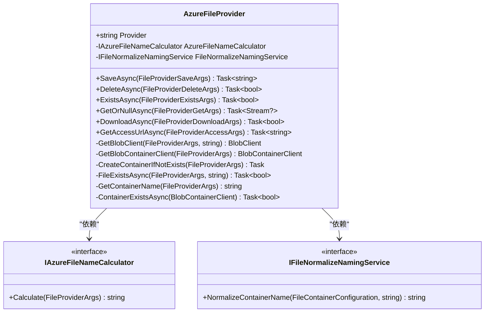
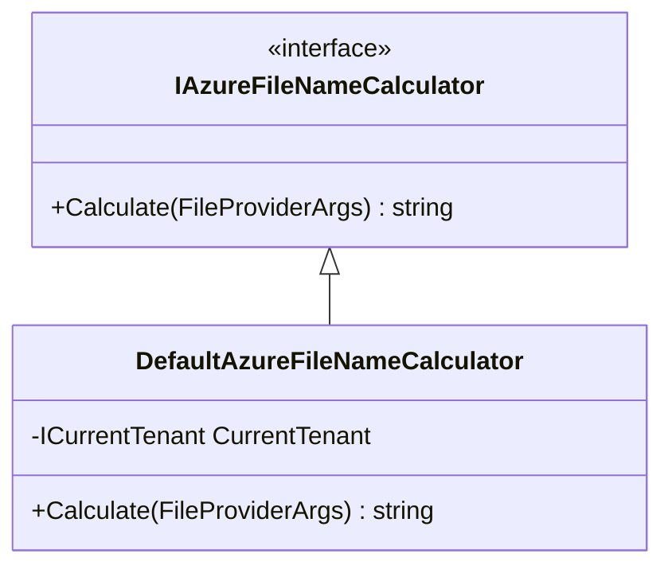
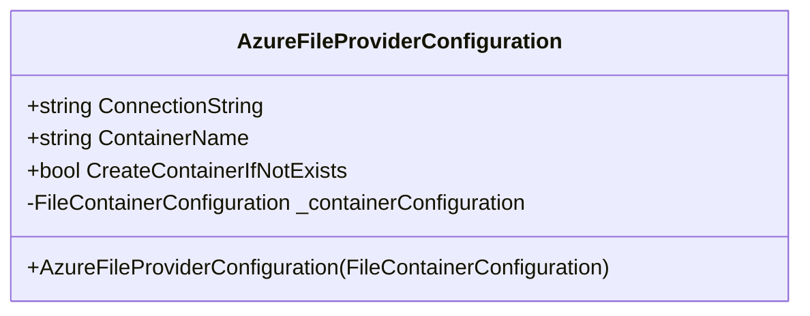
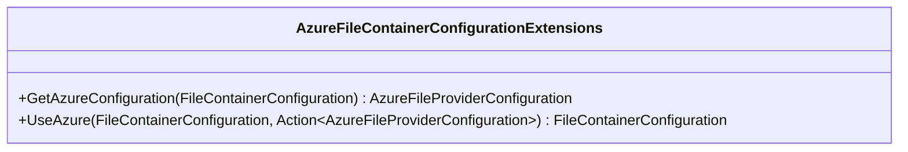
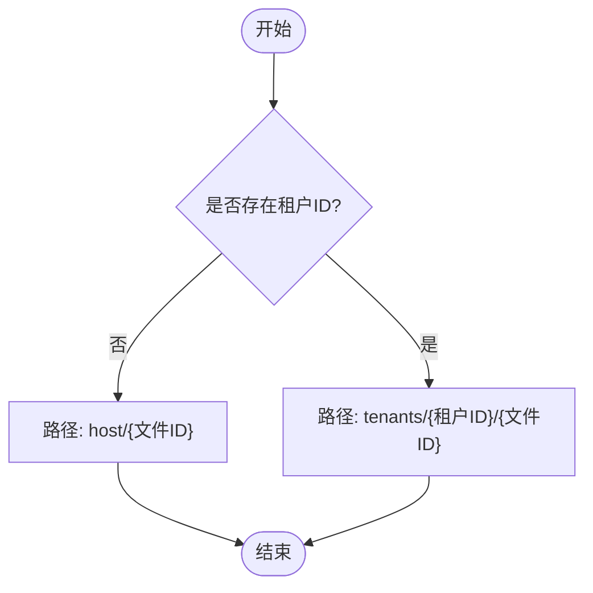
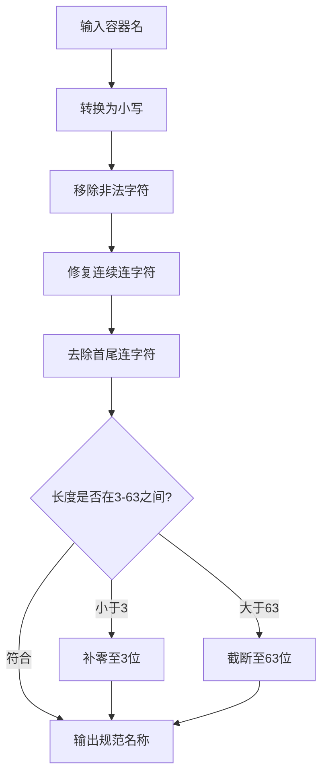

# Azure Blob存储

<cite>
**本文档中引用的文件**
- [AzureFileProvider.cs](file://framework/src/SharpAbp.Abp.FileStoring.Azure/SharpAbp/Abp/FileStoring/Azure/AzureFileProvider.cs)
- [AzureFileProviderConfiguration.cs](file://framework/src/SharpAbp.Abp.FileStoring.Azure/SharpAbp/Abp/FileStoring/Azure/AzureFileProviderConfiguration.cs)
- [AzureFileContainerConfigurationExtensions.cs](file://framework/src/SharpAbp.Abp.FileStoring.Azure/SharpAbp/Abp/FileStoring/Azure/AzureFileContainerConfigurationExtensions.cs)
- [AzureFileProviderConfigurationNames.cs](file://framework/src/SharpAbp.Abp.FileStoring.Azure/SharpAbp/Abp/FileStoring/Azure/AzureFileProviderConfigurationNames.cs)
- [AzureFileNamingNormalizer.cs](file://framework/src/SharpAbp.Abp.FileStoring.Azure/SharpAbp/Abp/FileStoring/Azure/AzureFileNamingNormalizer.cs)
- [DefaultAzureFileNameCalculator.cs](file://framework/src/SharpAbp.Abp.FileStoring.Azure/SharpAbp/Abp/FileStoring/Azure/DefaultAzureFileNameCalculator.cs)
- [IAzureFileNameCalculator.cs](file://framework/src/SharpAbp.Abp.FileStoring.Azure/SharpAbp/Abp/FileStoring/Azure/IAzureFileNameCalculator.cs)
- [FileContainerConfiguration.cs](file://framework/src/SharpAbp.Abp.FileStoring.Abstractions/SharpAbp/Abp/FileStoring/FileContainerConfiguration.cs)
</cite>

## 目录
1. [简介](#简介)
2. [核心组件分析](#核心组件分析)
3. [配置参数详解](#配置参数详解)
4. [扩展方法使用示例](#扩展方法使用示例)
5. [高级特性配置](#高级特性配置)

## 简介
本文档详细阐述了`SharpAbp.Abp.FileStoring.Azure`模块如何实现Azure Blob存储功能。该模块提供了一套完整的文件存储解决方案，通过`AzureFileProvider`类与Azure Storage SDK进行交互，并利用`IAzureFileNameCalculator`接口实现灵活的Blob名称计算策略。文档将深入解析其架构设计、核心组件、配置参数以及实际应用中的最佳实践。

## 核心组件分析

### AzureFileProvider 类分析
`AzureFileProvider`是Azure Blob存储的核心提供程序，负责执行所有文件操作。它继承自`FileProviderBase`并实现了`ITransientDependency`接口，确保每次请求都能获得一个新的实例。



**图表来源**
- [AzureFileProvider.cs](file://framework/src/SharpAbp.Abp.FileStoring.Azure/SharpAbp/Abp/FileStoring/Azure/AzureFileProvider.cs#L0-L138)

**章节来源**
- [AzureFileProvider.cs](file://framework/src/SharpAbp.Abp.FileStoring.Azure/SharpAbp/Abp/FileStoring/Azure/AzureFileProvider.cs#L0-L138)

#### 文件名计算机制
`AzureFileProvider`通过依赖注入获取`IAzureFileNameCalculator`服务来确定Blob的名称。在每个文件操作（如保存、删除、检查存在性）中，都会调用`AzureFileNameCalculator.Calculate(args)`方法，根据传入的`FileProviderArgs`参数计算出最终的文件名。

默认实现`DefaultAzureFileNameCalculator`会根据当前租户ID生成分层的文件路径：
- 如果没有租户ID，则路径为 `host/{文件ID}`
- 如果有租户ID，则路径为 `tenants/{租户ID}/{文件ID}`

这种设计实现了多租户环境下的数据隔离。

#### Azure Storage SDK 集成
`AzureFileProvider`通过`Azure.Storage.Blobs`命名空间下的SDK与Azure Blob服务进行通信。关键集成点包括：

1. **Blob客户端创建**：`GetBlobClient`方法通过`BlobContainerClient.GetBlobClient(fileName)`获取特定Blob的客户端。
2. **容器客户端创建**：`GetBlobContainerClient`方法使用连接字符串创建`BlobServiceClient`，然后通过`GetBlobContainerClient(GetContainerName(args))`获取容器客户端。
3. **文件上传**：`SaveAsync`方法调用`blobClient.UploadAsync(args.FileStream, true)`将文件流上传到Blob。
4. **文件下载**：`GetOrNullAsync`和`DownloadAsync`方法使用`blobClient.DownloadAsync`和`DownloadToAsync`从Blob下载内容。

### IAzureFileNameCalculator 接口分析
`IAzureFileNameCalculator`接口定义了文件名计算的契约，只有一个`Calculate`方法，接收`FileProviderArgs`参数并返回计算后的文件名字符串。



**图表来源**
- [IAzureFileNameCalculator.cs](file://framework/src/SharpAbp.Abp.FileStoring.Azure/SharpAbp/Abp/FileStoring/Azure/IAzureFileNameCalculator.cs#L0-L7)
- [DefaultAzureFileNameCalculator.cs](file://framework/src/SharpAbp.Abp.FileStoring.Azure/SharpAbp/Abp/FileStoring/Azure/DefaultAzureFileNameCalculator.cs#L0-L22)

**章节来源**
- [IAzureFileNameCalculator.cs](file://framework/src/SharpAbp.Abp.FileStoring.Azure/SharpAbp/Abp/FileStoring/Azure/IAzureFileNameCalculator.cs#L0-L7)
- [DefaultAzureFileNameCalculator.cs](file://framework/src/SharpAbp.Abp.FileStoring.Azure/SharpAbp/Abp/FileStoring/Azure/DefaultAzureFileNameCalculator.cs#L0-L22)

## 配置参数详解

### AzureFileProviderConfiguration 类
`AzureFileProviderConfiguration`类封装了Azure Blob存储的所有配置参数，通过`FileContainerConfiguration`的属性字典进行存储和管理。



**图表来源**
- [AzureFileProviderConfiguration.cs](file://framework/src/SharpAbp.Abp.FileStoring.Azure/SharpAbp/Abp/FileStoring/Azure/AzureFileProviderConfiguration.cs#L0-L41)

**章节来源**
- [AzureFileProviderConfiguration.cs](file://framework/src/SharpAbp.Abp.FileStoring.Azure/SharpAbp/Abp/FileStoring/Azure/AzureFileProviderConfiguration.cs#L0-L41)

#### 关键配置参数

| 配置参数 | 常量名称 | 描述 |
|---------|--------|------|
| 连接字符串 | `AzureFileProviderConfigurationNames.ConnectionString` | 用于连接Azure存储账户的连接字符串，包含账户名和密钥信息 |
| 容器名称 | `AzureFileProviderConfigurationNames.ContainerName` | 指定要使用的Blob容器名称。如果未指定，则使用`FileProviderArgs`中的容器名。名称必须符合Azure命名规则（3-63个字符，仅小写字母、数字和连字符） |
| 自动创建容器 | `AzureFileProviderConfigurationNames.CreateContainerIfNotExists` | 布尔值，默认为false。如果设置为true，当指定的容器不存在时，系统将自动创建该容器 |

这些配置参数通过`AzureFileProviderConfigurationNames`类中的常量进行统一管理，确保在整个系统中的一致性和可维护性。

## 扩展方法使用示例

### AzureFileContainerConfigurationExtensions 类
`AzureFileContainerConfigurationExtensions`类提供了两个重要的扩展方法，用于简化Azure Blob存储的配置过程。



**图表来源**
- [AzureFileContainerConfigurationExtensions.cs](file://framework/src/SharpAbp.Abp.FileStoring.Azure/SharpAbp/Abp/FileStoring/Azure/AzureFileContainerConfigurationExtensions.cs#L0-L25)

**章节来源**
- [AzureFileContainerConfigurationExtensions.cs](file://framework/src/SharpAbp.Abp.FileStoring.Azure/SharpAbp/Abp/FileStoring/Azure/AzureFileContainerConfigurationExtensions.cs#L0-L25)

#### UseAzure 扩展方法示例
`UseAzure`方法是配置Azure Blob存储的主要入口，它接受一个`Action<AzureFileProviderConfiguration>`类型的委托，允许以流畅的方式配置各项参数。

```csharp
// 示例：配置Azure Blob存储容器
configuration.Containers.Configure("my-container", container =>
{
    container.UseAzure(azure =>
    {
        azure.ConnectionString = "DefaultEndpointsProtocol=https;AccountName=myaccount;AccountKey=mykey;EndpointSuffix=core.windows.net";
        azure.ContainerName = "my-blob-container";
        azure.CreateContainerIfNotExists = true;
    });
});
```

此代码片段展示了如何：
1. 获取名为"my-container"的容器配置
2. 调用`UseAzure`方法切换到Azure提供程序
3. 在lambda表达式中配置具体的Azure参数
4. 设置连接字符串、容器名称和自动创建容器选项

#### GetAzureConfiguration 方法
`GetAzureConfiguration`扩展方法允许从现有的`FileContainerConfiguration`中获取`AzureFileProviderConfiguration`实例，便于在运行时读取或修改Azure特定的配置。

```csharp
var azureConfig = containerConfiguration.GetAzureConfiguration();
var connectionString = azureConfig.ConnectionString;
```

## 高级特性配置

### 层级命名空间配置
Azure Blob存储的层级命名空间通过`IAzureFileNameCalculator`的实现来配置。默认的`DefaultAzureFileNameCalculator`已经实现了基于租户ID的层级结构。



**图表来源**
- [DefaultAzureFileNameCalculator.cs](file://framework/src/SharpAbp.Abp.FileStoring.Azure/SharpAbp/Abp/FileStoring/Azure/DefaultAzureFileNameCalculator.cs#L0-L22)

**章节来源**
- [DefaultAzureFileNameCalculator.cs](file://framework/src/SharpAbp.Abp.FileStoring.Azure/SharpAbp/Abp/FileStoring/Azure/DefaultAzureFileNameCalculator.cs#L0-L22)

开发者可以通过实现自定义的`IAzureFileNameCalculator`来创建更复杂的层级结构，例如按日期归档（`year/month/day/fileid`）或按业务领域划分。

### 访问层配置
虽然当前代码库中没有直接暴露访问层（热/冷/归档）的配置选项，但可以通过以下方式实现：

1. **在容器级别设置**：在Azure门户或通过Azure CLI为整个容器设置默认访问层。
2. **在Blob级别设置**：通过Azure SDK在上传文件后修改其访问层属性。

```csharp
// 示例：设置Blob访问层（需直接使用Azure SDK）
var blobClient = GetBlobClient(args, fileName);
await blobClient.SetAccessTierAsync(AccessTier.Cool);
```

### 安全特性配置
Azure Blob存储的安全特性主要通过连接字符串来配置，其中包含了账户认证所需的所有信息。

#### 连接字符串安全
连接字符串应被视为敏感信息，建议通过以下方式安全管理：
- 使用Azure Key Vault存储连接字符串
- 在配置文件中使用环境变量引用
- 避免在源代码中硬编码连接字符串

#### 容器名称规范化
`AzureFileNamingNormalizer`类实现了容器名称的规范化，确保名称符合Azure的命名规则：



**图表来源**
- [AzureFileNamingNormalizer.cs](file://framework/src/SharpAbp.Abp.FileStoring.Azure/SharpAbp/Abp/FileStoring/Azure/AzureFileNamingNormalizer.cs#L0-L58)

**章节来源**
- [AzureFileNamingNormalizer.cs](file://framework/src/SharpAbp.Abp.FileStoring.Azure/SharpAbp/Abp/FileStoring/Azure/AzureFileNamingNormalizer.cs#L0-L58)

该规范化器确保了生成的容器名称始终符合Azure的要求，避免因命名不规范导致的操作失败。