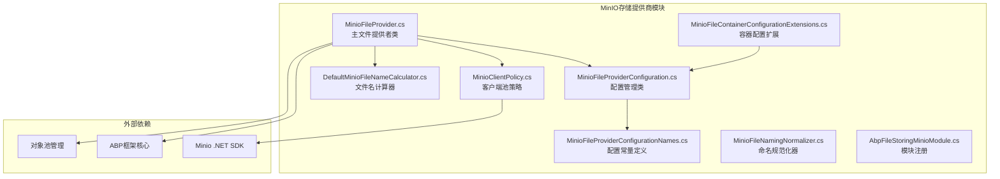
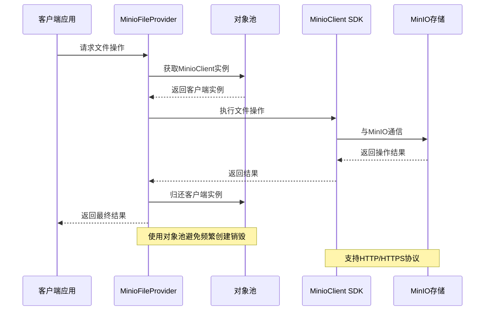
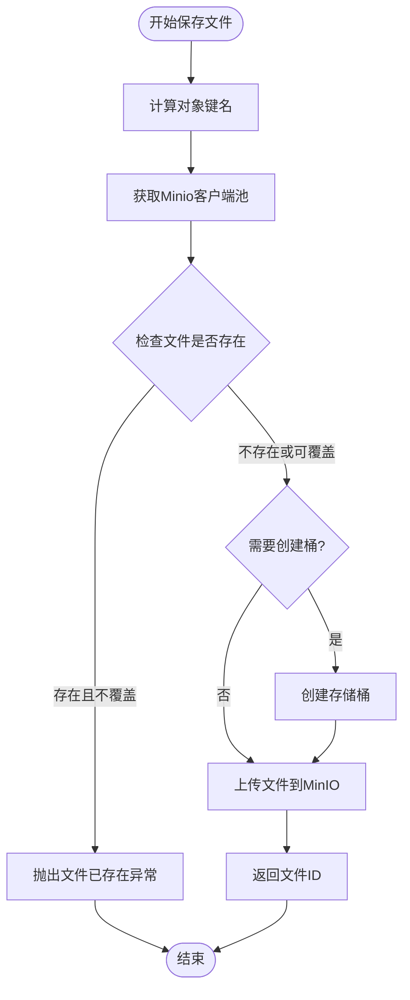
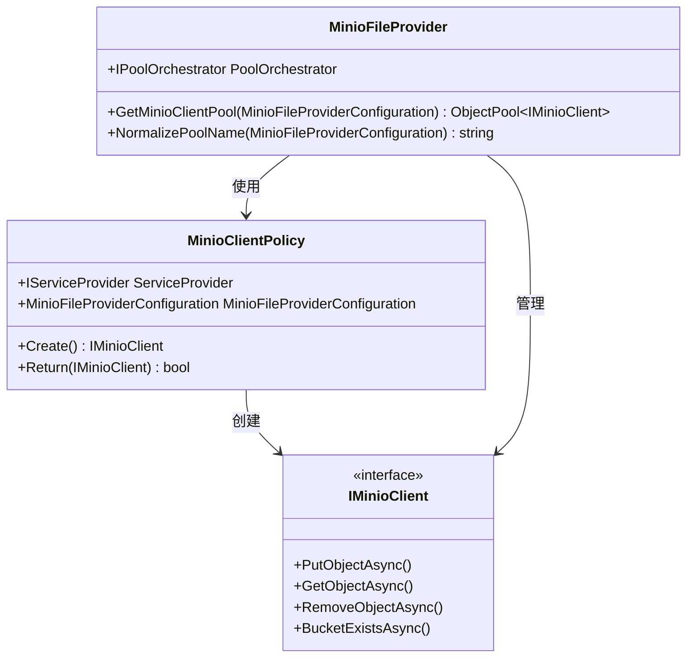
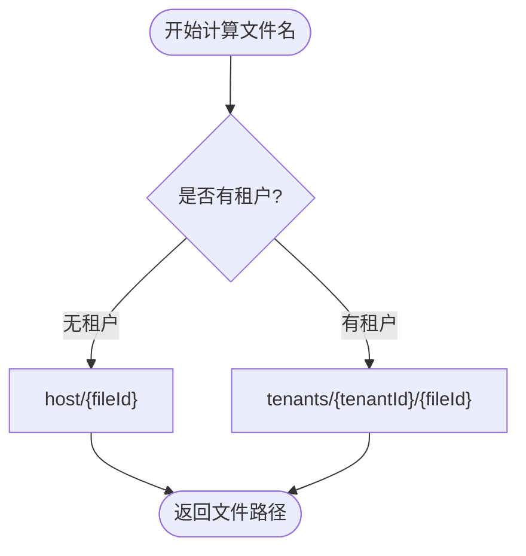
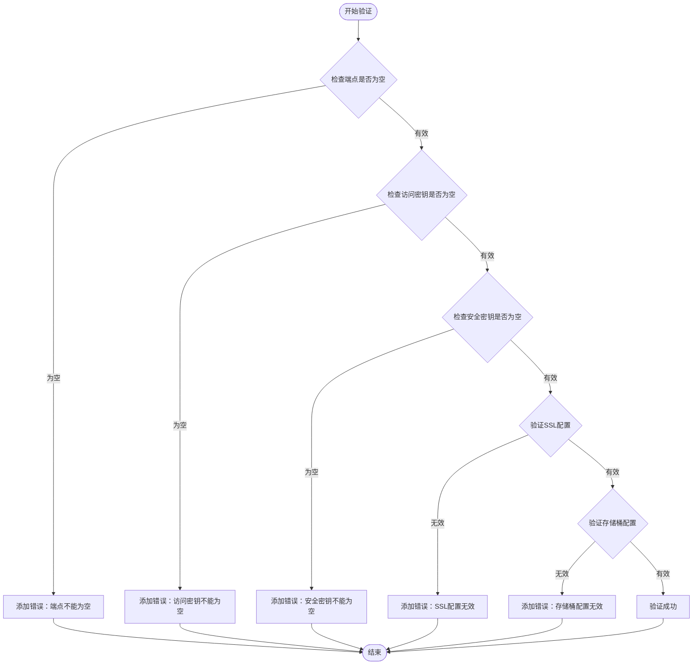

# MinIO存储提供商

<cite>
**本文档中引用的文件**
- [MinioFileProvider.cs](file://framework/src/SharpAbp.Abp.FileStoring.Minio/SharpAbp/Abp/FileStoring/Minio/MinioFileProvider.cs)
- [MinioFileProviderConfiguration.cs](file://framework/src/SharpAbp.Abp.FileStoring.Minio/SharpAbp/Abp/FileStoring/Minio/MinioFileProviderConfiguration.cs)
- [MinioFileContainerConfigurationExtensions.cs](file://framework/src/SharpAbp.Abp.FileStoring.Minio/SharpAbp/Abp/FileStoring/Minio/MinioFileContainerConfigurationExtensions.cs)
- [MinioFileProviderConfigurationNames.cs](file://framework/src/SharpAbp.Abp.FileStoring.Minio/SharpAbp/Abp/FileStoring/Minio/MinioFileProviderConfigurationNames.cs)
- [MinioClientPolicy.cs](file://framework/src/SharpAbp.Abp.FileStoring.Minio/SharpAbp/Abp/FileStoring/Minio/MinioClientPolicy.cs)
- [DefaultMinioFileNameCalculator.cs](file://framework/src/SharpAbp.Abp.FileStoring.Minio/SharpAbp/Abp/FileStoring/Minio/DefaultMinioFileNameCalculator.cs)
- [MinioFileNamingNormalizer.cs](file://framework/src/SharpAbp.Abp.FileStoring.Minio/SharpAbp/Abp/FileStoring/Minio/MinioFileNamingNormalizer.cs)
- [AbpFileStoringMinioModule.cs](file://framework/src/SharpAbp.Abp.FileStoring.Minio/SharpAbp/Abp/FileStoring/Minio/AbpFileStoringMinioModule.cs)
- [appsettings.json](file://framework/test/SharpAbp.Abp.FileStoring.AllTests/appsettings.json)
</cite>

## 目录
1. [简介](#简介)
2. [项目结构](#项目结构)
3. [核心组件](#核心组件)
4. [架构概览](#架构概览)
5. [详细组件分析](#详细组件分析)
6. [配置详解](#配置详解)
7. [使用指南](#使用指南)
8. [最佳实践](#最佳实践)
9. [故障排除](#故障排除)
10. [总结](#总结)

## 简介

MinIO存储提供商是SharpAbp框架中用于集成MinIO对象存储服务的核心模块。MinIO是一个高性能的对象存储服务，完全兼容Amazon S3 API，为应用程序提供了可靠的文件存储解决方案。该模块通过与MinIO .NET SDK的深度集成，提供了完整的文件存储、检索、删除和访问控制功能。

MinIO作为本地部署和开发测试的理想选择，具有以下优势：
- **高性能**：专为高并发场景设计
- **兼容性**：完全兼容S3 API
- **易部署**：单个二进制文件即可运行
- **成本效益**：无需支付云存储费用
- **数据安全**：支持加密传输和存储

## 项目结构

MinIO存储提供商模块采用清晰的分层架构，主要包含以下核心文件：



**图表来源**
- [MinioFileProvider.cs](file://framework/src/SharpAbp.Abp.FileStoring.Minio/SharpAbp/Abp/FileStoring/Minio/MinioFileProvider.cs#L1-L335)
- [MinioFileProviderConfiguration.cs](file://framework/src/SharpAbp.Abp.FileStoring.Minio/SharpAbp/Abp/FileStoring/Minio/MinioFileProviderConfiguration.cs#L1-L66)

## 核心组件

### MinioFileProvider - 主要文件提供者

`MinioFileProvider`是整个MinIO存储提供商的核心类，继承自`FileProviderBase`并实现了所有必要的文件操作接口。它负责处理文件的保存、删除、存在性检查、下载和访问URL生成等操作。

### MinioFileProviderConfiguration - 配置管理

配置类封装了所有与MinIO连接相关的参数，包括端点地址、访问密钥、安全密钥、桶名称和SSL设置等关键配置项。

### MinioFileContainerConfigurationExtensions - 扩展方法

提供了一组静态扩展方法，简化了MinIO容器的配置过程，使开发者能够以声明式的方式配置存储容器。

**章节来源**
- [MinioFileProvider.cs](file://framework/src/SharpAbp.Abp.FileStoring.Minio/SharpAbp/Abp/FileStoring/Minio/MinioFileProvider.cs#L22-L335)
- [MinioFileProviderConfiguration.cs](file://framework/src/SharpAbp.Abp.FileStoring.Minio/SharpAbp/Abp/FileStoring/Minio/MinioFileProviderConfiguration.cs#L1-L66)
- [MinioFileContainerConfigurationExtensions.cs](file://framework/src/SharpAbp.Abp.FileStoring.Minio/SharpAbp/Abp/FileStoring/Minio/MinioFileContainerConfigurationExtensions.cs#L1-L26)

## 架构概览

MinIO存储提供商采用了基于依赖注入和对象池的设计模式，确保了高性能和资源的有效利用：



**图表来源**
- [MinioFileProvider.cs](file://framework/src/SharpAbp.Abp.FileStoring.Minio/SharpAbp/Abp/FileStoring/Minio/MinioFileProvider.cs#L45-L55)
- [MinioClientPolicy.cs](file://framework/src/SharpAbp.Abp.FileStoring.Minio/SharpAbp/Abp/FileStoring/Minio/MinioClientPolicy.cs#L1-L40)

## 详细组件分析

### MinioFileProvider 实现机制

`MinioFileProvider`类是整个模块的核心，实现了以下关键功能：

#### 文件保存操作



**图表来源**
- [MinioFileProvider.cs](file://framework/src/SharpAbp.Abp.FileStoring.Minio/SharpAbp/Abp/FileStoring/Minio/MinioFileProvider.cs#L62-L100)

#### 客户端池管理

系统使用对象池模式来管理Minio客户端实例，通过`MinioClientPolicy`类实现：



**图表来源**
- [MinioClientPolicy.cs](file://framework/src/SharpAbp.Abp.FileStoring.Minio/SharpAbp/Abp/FileStoring/Minio/MinioClientPolicy.cs#L1-L40)
- [MinioFileProvider.cs](file://framework/src/SharpAbp.Abp.FileStoring.Minio/SharpAbp/Abp/FileStoring/Minio/MinioFileProvider.cs#L45-L55)

**章节来源**
- [MinioFileProvider.cs](file://framework/src/SharpAbp.Abp.FileStoring.Minio/SharpAbp/Abp/FileStoring/Minio/MinioFileProvider.cs#L62-L100)
- [MinioClientPolicy.cs](file://framework/src/SharpAbp.Abp.FileStoring.Minio/SharpAbp/Abp/FileStoring/Minio/MinioClientPolicy.cs#L1-L40)

### 文件名计算策略

默认的文件名计算器`DefaultMinioFileNameCalculator`根据租户上下文智能生成文件路径：



**图表来源**
- [DefaultMinioFileNameCalculator.cs](file://framework/src/SharpAbp.Abp.FileStoring.Minio/SharpAbp/Abp/FileStoring/Minio/DefaultMinioFileNameCalculator.cs#L1-L23)

**章节来源**
- [DefaultMinioFileNameCalculator.cs](file://framework/src/SharpAbp.Abp.FileStoring.Minio/SharpAbp/Abp/FileStoring/Minio/DefaultMinioFileNameCalculator.cs#L1-L23)

## 配置详解

### MinioFileProviderConfiguration 配置项

`MinioFileProviderConfiguration`类提供了完整的配置选项：

| 配置项 | 类型 | 默认值 | 描述 |
|--------|------|--------|------|
| BucketName | string | bucket1 | 存储桶名称 |
| EndPoint | string | 192.168.0.100:9005 | MinIO服务器端点 |
| AccessKey | string | minioadmin | 访问密钥 |
| SecretKey | string | minioadmin | 安全密钥 |
| WithSSL | bool | false | 是否使用SSL |
| CreateBucketIfNotExists | bool | false | 自动创建存储桶 |

### 配置验证机制

系统内置了配置验证器`MinioFileProviderValuesValidator`，确保所有必需的配置项都正确设置：



**图表来源**
- [MinioFileProviderValuesValidator.cs](file://framework/src/SharpAbp.Abp.FileStoring.Minio/SharpAbp/Abp/FileStoring/Minio/MinioFileProviderValuesValidator.cs#L31-L50)

**章节来源**
- [MinioFileProviderConfiguration.cs](file://framework/src/SharpAbp.Abp.FileStoring.Minio/SharpAbp/Abp/FileStoring/Minio/MinioFileProviderConfiguration.cs#L1-L66)
- [MinioFileProviderValuesValidator.cs](file://framework/src/SharpAbp.Abp.FileStoring.Minio/SharpAbp/Abp/FileStoring/Minio/MinioFileProviderValuesValidator.cs#L1-L50)

## 使用指南

### 基本使用示例

#### 1. 在代码中配置MinIO容器

```csharp
// 使用扩展方法配置MinIO容器
var container = new FileContainerConfiguration("minio-container")
    .UseMinio(config =>
    {
        config.BucketName = "my-bucket";
        config.EndPoint = "localhost:9000";
        config.AccessKey = "minioadmin";
        config.SecretKey = "minioadmin";
        config.WithSSL = false;
        config.CreateBucketIfNotExists = true;
    });
```

#### 2. 在配置文件中设置

```json
{
  "FileContainers": {
    "minio-container": {
      "Provider": "Minio",
      "IsMultiTenant": true,
      "EnableAutoMultiPartUpload": true,
      "MultiPartUploadMinFileSize": 5242880,
      "MultiPartUploadShardingSize": 1048570,
      "HttpAccess": true,
      "Properties": {
        "Minio.BucketName": "minio-bucket",
        "Minio.EndPoint": "localhost:9000",
        "Minio.AccessKey": "minioadmin",
        "Minio.SecretKey": "minioadmin",
        "Minio.WithSSL": false,
        "Minio.CreateBucketIfNotExists": true
      }
    }
  }
}
```

#### 3. 使用自定义客户端配置

```csharp
// 高级配置示例
var container = new FileContainerConfiguration("advanced-minio")
    .UseMinio(config =>
    {
        config.BucketName = "production-bucket";
        config.EndPoint = "minio.example.com:9000";
        config.AccessKey = "your-access-key";
        config.SecretKey = "your-secret-key";
        config.WithSSL = true; // 启用HTTPS
        config.CreateBucketIfNotExists = false; // 不自动创建桶
        
        // 可以添加其他自定义配置
    });
```

### 文件操作示例

#### 保存文件

```csharp
// 保存文件到MinIO
var fileStream = new FileStream("sample.txt", FileMode.Open);
var fileId = Guid.NewGuid().ToString();
var result = await fileProvider.SaveAsync(new FileProviderSaveArgs
{
    ContainerName = "minio-container",
    FileId = fileId,
    FileStream = fileStream,
    OverrideExisting = false
});
```

#### 获取文件访问URL

```csharp
// 获取预签名的访问URL
var accessUrl = await fileProvider.GetAccessUrlAsync(new FileProviderAccessArgs
{
    ContainerName = "minio-container",
    FileId = fileId,
    Expires = DateTime.UtcNow.AddHours(1),
    CheckFileExist = true
});
```

#### 删除文件

```csharp
// 删除文件
var deleted = await fileProvider.DeleteAsync(new FileProviderDeleteArgs
{
    ContainerName = "minio-container",
    FileId = fileId
});
```

**章节来源**
- [MinioFileContainerConfigurationExtensions.cs](file://framework/src/SharpAbp.Abp.FileStoring.Minio/SharpAbp/Abp/FileStoring/Minio/MinioFileContainerConfigurationExtensions.cs#L1-L26)
- [appsettings.json](file://framework/test/SharpAbp.Abp.FileStoring.AllTests/appsettings.json#L105-L145)

## 最佳实践

### 本地部署和开发测试优势

MinIO作为本地部署的存储解决方案，在开发和测试环境中具有显著优势：

#### 1. 快速启动和配置

```bash
# 下载MinIO服务器
wget https://dl.min.io/server/minio/release/linux-amd64/minio

# 设置访问密钥和安全密钥
export MINIO_ROOT_USER=minioadmin
export MINIO_ROOT_PASSWORD=minioadmin

# 启动MinIO服务器
./minio server /data
```

#### 2. 开发环境配置

```csharp
// 开发环境配置
services.Configure<FileContainerConfiguration>(config =>
{
    config.Provider = "Minio";
    config.Properties["Minio.BucketName"] = "dev-bucket";
    config.Properties["Minio.EndPoint"] = "localhost:9000";
    config.Properties["Minio.AccessKey"] = "minioadmin";
    config.Properties["Minio.SecretKey"] = "minioadmin";
    config.Properties["Minio.WithSSL"] = "false";
    config.Properties["Minio.CreateBucketIfNotExists"] = "true";
});
```

#### 3. 生产环境配置建议

```csharp
// 生产环境配置
services.Configure<FileContainerConfiguration>(config =>
{
    config.Provider = "Minio";
    config.Properties["Minio.BucketName"] = "production-bucket";
    config.Properties["Minio.EndPoint"] = "minio.company.com:9000";
    config.Properties["Minio.AccessKey"] = Environment.GetEnvironmentVariable("MINIO_ACCESS_KEY");
    config.Properties["Minio.SecretKey"] = Environment.GetEnvironmentVariable("MINIO_SECRET_KEY");
    config.Properties["Minio.WithSSL"] = "true";
    config.Properties["Minio.CreateBucketIfNotExists"] = "false";
});
```

### 性能优化建议

#### 1. 对象池配置

```csharp
// 调整对象池大小以适应高并发场景
services.Configure<AbpFileStoringAbstractionsOptions>(options =>
{
    options.DefaultClientMaximumRetained = 50; // 增加最大保留数
});
```

#### 2. 分片上传配置

```csharp
// 大文件分片上传配置
services.Configure<FileContainerConfiguration>(config =>
{
    config.EnableAutoMultiPartUpload = true;
    config.MultiPartUploadMinFileSize = 5 * 1024 * 1024; // 5MB
    config.MultiPartUploadShardingSize = 10 * 1024 * 1024; // 10MB分片
});
```

#### 3. 连接超时配置

```csharp
// 配置连接超时时间
services.Configure<MinioClientOptions>(options =>
{
    options.ConnectionTimeout = TimeSpan.FromSeconds(30);
    options.RequestTimeout = TimeSpan.FromSeconds(60);
});
```

### 安全最佳实践

#### 1. 密钥管理

```csharp
// 使用环境变量或密钥管理服务
var accessKey = Environment.GetEnvironmentVariable("MINIO_ACCESS_KEY") ?? 
                Configuration.GetValue<string>("Minio:AccessKey");
var secretKey = Environment.GetEnvironmentVariable("MINIO_SECRET_KEY") ??
                Configuration.GetValue<string>("Minio:SecretKey");
```

#### 2. SSL/TLS配置

```csharp
// 生产环境必须启用SSL
config.WithSSL = true;
```

#### 3. 网络安全

```csharp
// 限制MinIO访问范围
// 在防火墙中只开放必要的端口
// 使用VPN或专用网络访问MinIO服务器
```

## 故障排除

### 常见问题及解决方案

#### 1. 连接失败问题

**问题症状**：无法连接到MinIO服务器

**可能原因**：
- 网络连接问题
- 端点配置错误
- 防火墙阻止连接

**解决方案**：
```csharp
// 检查网络连通性
try
{
    var client = new MinioClient()
        .WithEndpoint("localhost:9000")
        .WithCredentials("minioadmin", "minioadmin")
        .Build();
    
    var buckets = await client.ListBucketsAsync();
    Console.WriteLine($"Connected to MinIO. Found {buckets.Count()} buckets.");
}
catch (Exception ex)
{
    Console.WriteLine($"Connection failed: {ex.Message}");
}
```

#### 2. 权限问题

**问题症状**：文件操作返回权限被拒绝

**解决方案**：
```csharp
// 检查存储桶权限
var bucketExists = await client.BucketExistsAsync(
    new BucketExistsArgs()
        .WithBucket("my-bucket"));

if (!bucketExists)
{
    await client.MakeBucketAsync(
        new MakeBucketArgs()
            .WithBucket("my-bucket"));
}
```

#### 3. 文件名格式问题

**问题症状**：文件名不符合MinIO要求

**解决方案**：
```csharp
// 使用命名规范化器
var normalizer = new MinioFileNamingNormalizer();
var normalizedBucketName = normalizer.NormalizeContainerName("My-Bucket_Name");
Console.WriteLine($"Normalized bucket name: {normalizedBucketName}");
```

#### 4. 性能问题

**问题症状**：文件操作响应缓慢

**诊断步骤**：
```csharp
// 监控客户端池使用情况
var pool = GetMinioClientPool(configuration);
Console.WriteLine($"Pool size: {pool.Count}, Available: {pool.Available}");
```

**解决方案**：
```csharp
// 调整对象池配置
services.Configure<AbpFileStoringAbstractionsOptions>(options =>
{
    options.DefaultClientMaximumRetained = 100; // 增加池大小
});
```

### 调试技巧

#### 1. 启用详细日志

```csharp
// 在appsettings.json中启用MinIO日志
{
  "Logging": {
    "LogLevel": {
      "Default": "Information",
      "SharpAbp.Abp.FileStoring.Minio": "Debug",
      "Minio": "Debug"
    }
  }
}
```

#### 2. 监控连接状态

```csharp
// 添加连接监控中间件
public class MinioConnectionMiddleware
{
    public async Task InvokeAsync(HttpContext context, RequestDelegate next)
    {
        try
        {
            await next(context);
        }
        catch (Exception ex) when (ex is IOException || ex is SocketException)
        {
            // 记录连接错误
            Logger.LogError(ex, "MinIO connection error occurred");
            throw;
        }
    }
}
```

**章节来源**
- [MinioFileProvider.cs](file://framework/src/SharpAbp.Abp.FileStoring.Minio/SharpAbp/Abp/FileStoring/Minio/MinioFileProvider.cs#L264-L335)
- [MinioFileNamingNormalizer.cs](file://framework/src/SharpAbp.Abp.FileStoring.Minio/SharpAbp/Abp/FileStoring/Minio/MinioFileNamingNormalizer.cs#L1-L58)

## 总结

MinIO存储提供商为SharpAbp框架提供了强大而灵活的对象存储解决方案。通过与MinIO .NET SDK的深度集成，它不仅支持标准的文件操作，还提供了预签名URL生成功能，使得文件访问更加便捷。

### 主要特性总结

1. **完整的S3兼容性**：完全兼容Amazon S3 API，确保无缝迁移
2. **高性能设计**：基于对象池和异步操作，支持高并发场景
3. **灵活的配置**：支持多种配置方式，从简单的代码配置到复杂的JSON配置
4. **智能文件命名**：支持多租户环境下的文件组织
5. **安全可靠**：支持SSL/TLS加密，完善的权限控制
6. **易于部署**：单个二进制文件即可运行，适合本地开发和测试

### 适用场景

- **本地开发和测试**：快速搭建开发环境，无需云存储费用
- **私有云部署**：企业内部文件存储解决方案
- **边缘计算**：分布式系统中的文件存储
- **大数据处理**：海量文件存储和处理场景

### 发展方向

随着云原生技术的发展，MinIO存储提供商将继续演进，支持更多的云原生特性，如：
- Kubernetes原生部署
- 自动扩缩容
- 更多的监控指标
- 集成更多的云服务

通过本文档的详细介绍，开发者可以充分利用MinIO存储提供商的强大功能，构建高效、可靠的文件存储解决方案。