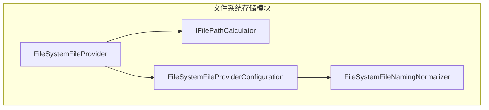
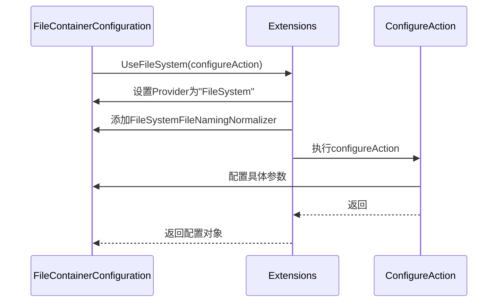

# 文件系统存储

<cite>
**本文档中引用的文件**
- [FileSystemFileProvider.cs](file://framework/src/SharpAbp.Abp.FileStoring.FileSystem/SharpAbp/Abp/FileStoring/FileSystem/FileSystemFileProvider.cs)
- [FileSystemFileProviderConfiguration.cs](file://framework/src/SharpAbp.Abp.FileStoring.FileSystem/SharpAbp/Abp/FileStoring/FileSystem/FileSystemFileProviderConfiguration.cs)
- [FileSystemFileContainerConfigurationExtensions.cs](file://framework/src/SharpAbp.Abp.FileStoring.FileSystem/SharpAbp/Abp/FileStoring/FileSystem/FileSystemFileContainerConfigurationExtensions.cs)
- [IFilePathCalculator.cs](file://framework/src/SharpAbp.Abp.FileStoring.FileSystem/SharpAbp/Abp/FileStoring/FileSystem/IFilePathCalculator.cs)
- [DefaultFilePathCalculator.cs](file://framework/src/SharpAbp.Abp.FileStoring.FileSystem/SharpAbp/Abp/FileStoring/FileSystem/DefaultFilePathCalculator.cs)
- [AbpFileStoringFileSystemModule.cs](file://framework/src/SharpAbp.Abp.FileStoring.FileSystem/SharpAbp/Abp/FileStoring/FileSystem/AbpFileStoringFileSystemModule.cs)
- [FileSystemFileProviderValuesValidator.cs](file://framework/src/SharpAbp.Abp.FileStoring.FileSystem/SharpAbp/Abp/FileStoring/FileSystem/FileSystemFileProviderValuesValidator.cs)
</cite>

## 目录
1. [简介](#简介)
2. [核心组件](#核心组件)
3. [架构概述](#架构概述)
4. [详细组件分析](#详细组件分析)
5. [依赖关系分析](#依赖关系分析)
6. [性能考虑](#性能考虑)
7. [故障排除指南](#故障排除指南)
8. [结论](#结论)

## 简介
本文件详细介绍了`SharpAbp.Abp.FileStoring.FileSystem`模块的实现，重点阐述了基于文件系统的文件存储提供程序。该模块为ABP框架提供了本地文件系统存储能力，支持文件的保存、读取、删除和访问URL生成等操作。通过配置化的方式，开发者可以灵活地设置存储路径、访问服务器等参数，适用于开发和测试环境中的文件存储需求。

## 核心组件
文件系统存储模块的核心组件包括`FileSystemFileProvider`类，它实现了文件的持久化操作；`FileSystemFileProviderConfiguration`类，用于管理文件提供程序的配置项；以及`IFilePathCalculator`接口和其实现`DefaultFilePathCalculator`，负责计算文件在文件系统中的实际路径。这些组件协同工作，提供了完整的文件存储解决方案。

**核心组件**
- [FileSystemFileProvider.cs](file://framework/src/SharpAbp.Abp.FileStoring.FileSystem/SharpAbp/Abp/FileStoring/FileSystem/FileSystemFileProvider.cs#L1-L217)
- [FileSystemFileProviderConfiguration.cs](file://framework/src/SharpAbp.Abp.FileStoring.FileSystem/SharpAbp/Abp/FileStoring/FileSystem/FileSystemFileProviderConfiguration.cs#L1-L40)
- [IFilePathCalculator.cs](file://framework/src/SharpAbp.Abp.FileStoring.FileSystem/SharpAbp/Abp/FileStoring/FileSystem/IFilePathCalculator.cs#L1-L8)

## 架构概述
文件系统存储模块采用分层架构设计，将文件操作、路径计算和配置管理分离。`FileSystemFileProvider`作为主要的服务类，依赖于`IFilePathCalculator`进行路径计算，并通过`FileSystemFileProviderConfiguration`获取配置信息。这种设计实现了关注点分离，提高了代码的可维护性和可测试性。



**图示来源**
- [FileSystemFileProvider.cs](file://framework/src/SharpAbp.Abp.FileStoring.FileSystem/SharpAbp/Abp/FileStoring/FileSystem/FileSystemFileProvider.cs#L1-L217)
- [IFilePathCalculator.cs](file://framework/src/SharpAbp.Abp.FileStoring.FileSystem/SharpAbp/Abp/FileStoring/FileSystem/IFilePathCalculator.cs#L1-L8)
- [FileSystemFileProviderConfiguration.cs](file://framework/src/SharpAbp.Abp.FileStoring.FileSystem/SharpAbp/Abp/FileStoring/FileSystem/FileSystemFileProviderConfiguration.cs#L1-L40)

## 详细组件分析

### FileSystemFileProvider 分析
`FileSystemFileProvider`是文件系统存储的主要实现类，继承自`FileProviderBase`并实现了`IFileProvider`接口。该类使用依赖注入获取日志记录器、当前租户信息和路径计算器服务。其核心功能包括文件的保存、删除、存在性检查、下载和读取。

#### 文件操作流程


**图示来源**
- [FileSystemFileProvider.cs](file://framework/src/SharpAbp.Abp.FileStoring.FileSystem/SharpAbp/Abp/FileStoring/FileSystem/FileSystemFileProvider.cs#L1-L217)

**核心组件**
- [FileSystemFileProvider.cs](file://framework/src/SharpAbp.Abp.FileStoring.FileSystem/SharpAbp/Abp/FileStoring/FileSystem/FileSystemFileProvider.cs#L1-L217)

### FileSystemFileProviderConfiguration 分析
`FileSystemFileProviderConfiguration`类封装了文件系统提供程序的配置选项，通过包装`FileContainerConfiguration`对象来存储和检索配置值。该类提供了类型安全的属性访问器，确保配置值的正确性和有效性。

#### 配置属性说明
| 属性名称 | 类型 | 默认值 | 描述 |
|---------|------|--------|------|
| BasePath | string | 无 | 文件存储的根目录路径，必须为非空字符串 |
| AppendContainerNameToBasePath | bool | true | 是否在基础路径后附加容器名称 |
| HttpServer | string | 无 | 文件访问服务器的URL，用于生成文件的访问链接 |

**图示来源**
- [FileSystemFileProviderConfiguration.cs](file://framework/src/SharpAbp.Abp.FileStoring.FileSystem/SharpAbp/Abp/FileStoring/FileSystem/FileSystemFileProviderConfiguration.cs#L1-L40)

**核心组件**
- [FileSystemFileProviderConfiguration.cs](file://framework/src/SharpAbp.Abp.FileStoring.FileSystem/SharpAbp/Abp/FileStoring/FileSystem/FileSystemFileProviderConfiguration.cs#L1-L40)

### IFilePathCalculator 接口与 DefaultFilePathCalculator 实现
`IFilePathCalculator`接口定义了文件路径计算的契约，而`DefaultFilePathCalculator`提供了默认实现。路径计算考虑了多租户环境，根据当前租户ID将文件存储在不同的目录下。

#### 路径计算逻辑
```mermaid
classDiagram
class IFilePathCalculator {
<<interface>>
+Calculate(FileProviderArgs args) string
}
class DefaultFilePathCalculator {
-ICurrentTenant CurrentTenant
+Calculate(FileProviderArgs args) string
}
DefaultFilePathCalculator ..|> IFilePathCalculator : 实现
note right of DefaultFilePathCalculator
路径计算规则：
1. 基础路径来自配置
2. 主机租户使用"host"目录
3. 普通租户使用"tenants/{tenantId}"目录
4. 可选添加容器名称
5. 最后添加文件ID
end note
```

**图示来源**
- [IFilePathCalculator.cs](file://framework/src/SharpAbp.Abp.FileStoring.FileSystem/SharpAbp/Abp/FileStoring/FileSystem/IFilePathCalculator.cs#L1-L8)
- [DefaultFilePathCalculator.cs](file://framework/src/SharpAbp.Abp.FileStoring.FileSystem/SharpAbp/Abp/FileStoring/FileSystem/DefaultFilePathCalculator.cs#L1-L40)

**核心组件**
- [IFilePathCalculator.cs](file://framework/src/SharpAbp.Abp.FileStoring.FileSystem/SharpAbp/Abp/FileStoring/FileSystem/IFilePathCalculator.cs#L1-L8)
- [DefaultFilePathCalculator.cs](file://framework/src/SharpAbp.Abp.FileStoring.FileSystem/SharpAbp/Abp/FileStoring/FileSystem/DefaultFilePathCalculator.cs#L1-L40)

### FileSystemFileContainerConfigurationExtensions 分析
`FileSystemFileContainerConfigurationExtensions`类提供了扩展方法，简化了文件系统存储的配置过程。通过`UseFileSystem`方法，开发者可以流畅地配置文件系统提供程序。

#### 扩展方法使用示例


**图示来源**
- [FileSystemFileContainerConfigurationExtensions.cs](file://framework/src/SharpAbp.Abp.FileStoring.FileSystem/SharpAbp/Abp/FileStoring/FileSystem/FileSystemFileContainerConfigurationExtensions.cs#L1-L25)

**核心组件**
- [FileSystemFileContainerConfigurationExtensions.cs](file://framework/src/SharpAbp.Abp.FileStoring.FileSystem/SharpAbp/Abp/FileStoring/FileSystem/FileSystemFileContainerConfigurationExtensions.cs#L1-L25)

## 依赖关系分析
文件系统存储模块与其他ABP模块存在明确的依赖关系。它依赖于`AbpFileStoringModule