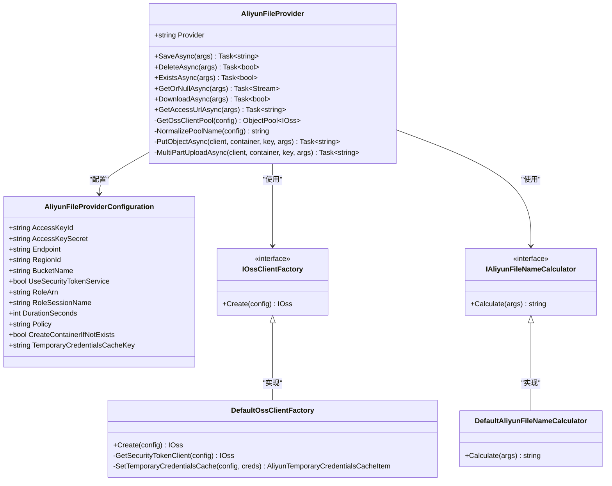
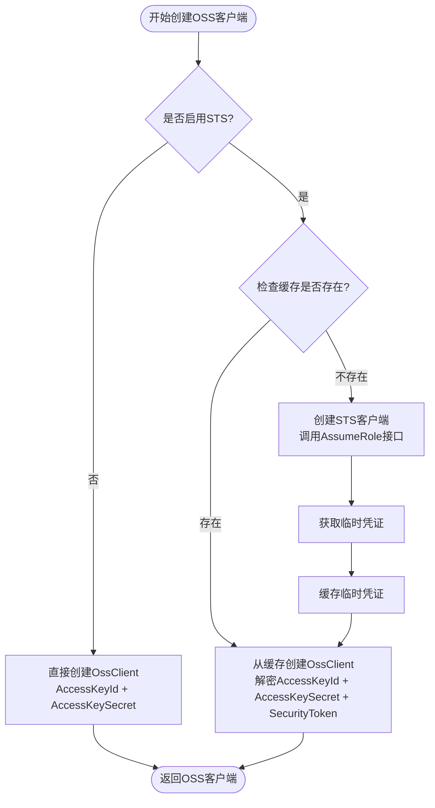
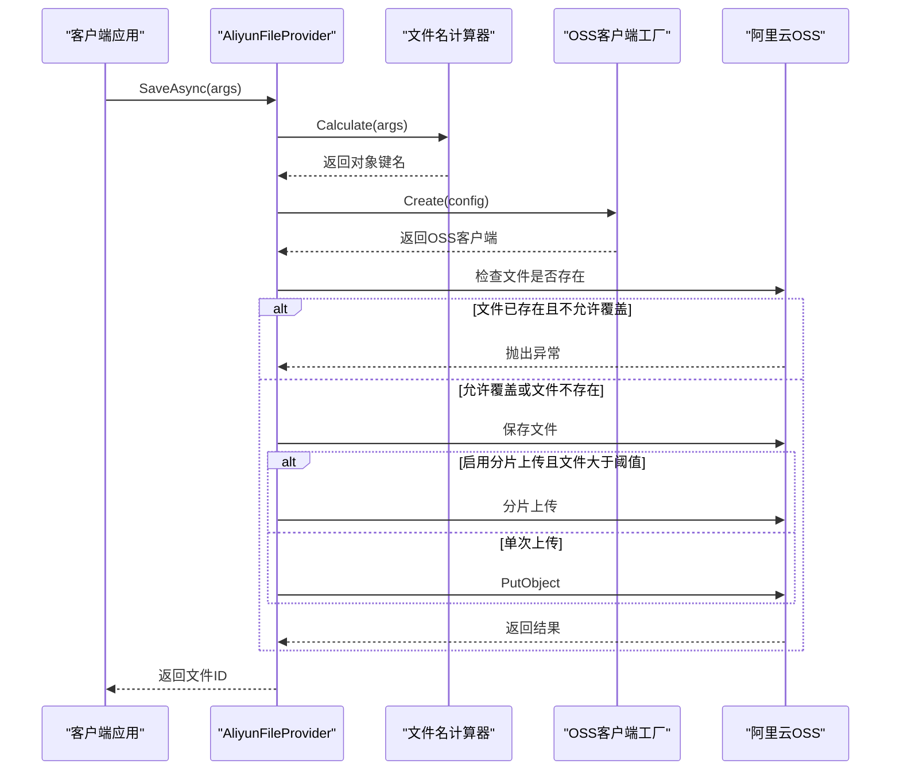

# 阿里云OSS存储提供商文档

<cite>
**本文档引用的文件**
- [AliyunFileProvider.cs](file://framework/src/SharpAbp.Abp.FileStoring.Aliyun/SharpAbp/Abp/FileStoring/Aliyun/AliyunFileProvider.cs)
- [AliyunFileProviderConfiguration.cs](file://framework/src/SharpAbp.Abp.FileStoring.Aliyun/SharpAbp/Abp/FileStoring/Aliyun/AliyunFileProviderConfiguration.cs)
- [AliyunFileContainerConfigurationExtensions.cs](file://framework/src\SharpAbp.Abp.FileStoring.Aliyun\SharpAbp\Abp\FileStoring\Aliyun\AliyunFileContainerConfigurationExtensions.cs)
- [DefaultOssClientFactory.cs](file://framework/src\SharpAbp.Abp.FileStoring.Aliyun\SharpAbp\Abp\FileStoring\Aliyun\DefaultOssClientFactory.cs)
- [DefaultAliyunFileNameCalculator.cs](file://framework/src\SharpAbp.Abp.FileStoring.Aliyun\SharpAbp\Abp\FileStoring\Aliyun\DefaultAliyunFileNameCalculator.cs)
- [AliyunFileProviderConfigurationNames.cs](file://framework/src\SharpAbp.Abp.FileStoring.Aliyun\SharpAbp\Abp\FileStoring\Aliyun\AliyunFileProviderConfigurationNames.cs)
- [AbpFileStoringAliyunModule.cs](file://framework/src\SharpAbp.Abp.FileStoring.Aliyun\SharpAbp\Abp\FileStoring\Aliyun\AbpFileStoringAliyunModule.cs)
- [AliyunFileProviderValuesValidator.cs](file://framework/src\SharpAbp.Abp.FileStoring.Aliyun\SharpAbp\Abp\FileStoring\Aliyun\AliyunFileProviderValuesValidator.cs)
- [AliyunOssClientPolicy.cs](file://framework/src\SharpAbp.Abp.FileStoring.Aliyun\SharpAbp\Abp\FileStoring\Aliyun\AliyunOssClientPolicy.cs)
- [AliyunTemporaryCredentialsCacheItem.cs](file://framework/src\SharpAbp.Abp.FileStoring.Aliyun\SharpAbp\Abp\FileStoring\Aliyun\AliyunTemporaryCredentialsCacheItem.cs)
- [IOssClientFactory.cs](file://framework/src\SharpAbp.Abp.FileStoring.Aliyun\SharpAbp\Abp\FileStoring\Aliyun\IOssClientFactory.cs)
- [IAliyunFileNameCalculator.cs](file://framework/src\SharpAbp.Abp.FileStoring.Aliyun\SharpAbp\Abp\FileStoring\Aliyun\IAliyunFileNameCalculator.cs)
</cite>

## 目录
1. [简介](#简介)
2. [核心组件架构](#核心组件架构)
3. [配置系统详解](#配置系统详解)
4. [文件名计算机制](#文件名计算机制)
5. [OSS客户端工厂](#oss客户端工厂)
6. [文件提供者实现](#文件提供者实现)
7. [使用示例](#使用示例)
8. [高级功能](#高级功能)
9. [性能优化](#性能优化)
10. [故障排除](#故障排除)

## 简介

阿里云OSS（Object Storage Service）存储提供商是SharpAbp框架中用于集成阿里云对象存储服务的核心模块。该模块提供了完整的文件存储解决方案，支持多种认证方式、自动分片上传、临时凭证管理等功能。

主要特性：
- 支持子账户访问和STS临时授权
- 自动分片上传大文件
- 客户端连接池管理
- 多租户文件命名空间
- 预签名URL生成功能
- 缓存机制优化性能

## 核心组件架构



**图表来源**
- [AliyunFileProvider.cs](file://framework/src/SharpAbp.Abp.FileStoring.Aliyun/SharpAbp/Abp/FileStoring/Aliyun/AliyunFileProvider.cs#L20-L323)
- [AliyunFileProviderConfiguration.cs](file://framework/src/SharpAbp.Abp.FileStoring.Aliyun/SharpAbp/Abp/FileStoring/Aliyun/AliyunFileProviderConfiguration.cs#L8-L114)
- [DefaultOssClientFactory.cs](file://framework/src/SharpAbp.Abp.FileStoring.Aliyun/SharpAbp/Abp/FileStoring/Aliyun/DefaultOssClientFactory.cs#L17-L101)
- [DefaultAliyunFileNameCalculator.cs](file://framework/src/SharpAbp.Abp.FileStoring.Aliyun/SharpAbp/Abp/FileStoring/Aliyun/DefaultAliyunFileNameCalculator.cs#L6-L23)

## 配置系统详解

### 配置类结构

`AliyunFileProviderConfiguration`类封装了所有阿里云OSS存储的配置参数：

```csharp
public class AliyunFileProviderConfiguration
{
    // 访问密钥配置
    public string AccessKeyId { get; set; }
    public string AccessKeySecret { get; set; }
    
    // 基础连接配置
    public string Endpoint { get; set; }
    public string RegionId { get; set; }
    public string BucketName { get; set; }
    
    // 安全令牌服务配置
    public bool UseSecurityTokenService { get; set; }
    public string RoleArn { get; set; }
    public string RoleSessionName { get; set; }
    public int DurationSeconds { get; set; }
    public string Policy { get; set; }
    
    // 行为配置
    public bool CreateContainerIfNotExists { get; set; }
    public string TemporaryCredentialsCacheKey { get; set; }
}
```

### 配置参数说明

| 参数名称 | 类型 | 默认值 | 描述 |
|---------|------|--------|------|
| `AccessKeyId` | string | 必填 | 阿里云访问密钥ID |
| `AccessKeySecret` | string | 必填 | 阿里云访问密钥Secret |
| `Endpoint` | string | 必填 | OSS服务端点地址 |
| `RegionId` | string | "oss-cn-hangzhou" | 区域ID |
| `BucketName` | string | "bucket1" | 存储桶名称 |
| `UseSecurityTokenService` | bool | false | 是否使用STS临时授权 |
| `RoleArn` | string | "" | 角色ARN标识符 |
| `RoleSessionName` | string | "" | 会话名称 |
| `DurationSeconds` | int | 3600 | 临时凭证有效期（秒） |
| `Policy` | string | "" | 权限策略JSON |
| `CreateContainerIfNotExists` | bool | false | 自动创建存储桶 |
| `TemporaryCredentialsCacheKey` | string | 随机GUID | 临时凭证缓存键 |

**章节来源**
- [AliyunFileProviderConfiguration.cs](file://framework/src/SharpAbp.Abp.FileStoring.Aliyun/SharpAbp/Abp/FileStoring/Aliyun/AliyunFileProviderConfiguration.cs#L8-L114)
- [AliyunFileProviderConfigurationNames.cs](file://framework/src/SharpAbp.Abp.FileStoring.Aliyun/SharpAbp/Abp/FileStoring/Aliyun/AliyunFileProviderConfigurationNames.cs#L4-L22)

## 文件名计算机制

### 名称计算器接口

`IAliyunFileNameCalculator`定义了文件名计算的标准接口：

```csharp
public interface IAliyunFileNameCalculator
{
    string Calculate(FileProviderArgs args);
}
```

### 默认实现

`DefaultAliyunFileNameCalculator`根据多租户状态生成文件路径：

```csharp
public class DefaultAliyunFileNameCalculator : IAliyunFileNameCalculator
{
    public virtual string Calculate(FileProviderArgs args)
    {
        return CurrentTenant.Id == null
            ? $"host/{args.FileId}"
            : $"tenants/{CurrentTenant.Id.Value:D}/{args.FileId}";
    }
}
```

### 路径结构

- **单租户环境**: `host/{fileId}`
- **多租户环境**: `tenants/{tenantId}/{fileId}`

这种设计确保了不同租户之间的文件隔离，同时保持了清晰的目录结构。

**章节来源**
- [DefaultAliyunFileNameCalculator.cs](file://framework/src/SharpAbp.Abp.FileStoring.Aliyun/SharpAbp/Abp/FileStoring/Aliyun/DefaultAliyunFileNameCalculator.cs#L6-L23)
- [IAliyunFileNameCalculator.cs](file://framework/src/SharpAbp.Abp.FileStoring.Aliyun/SharpAbp/Abp/FileStoring/Aliyun/IAliyunFileNameCalculator.cs)

## OSS客户端工厂

### 工厂接口

`IOssClientFactory`定义了OSS客户端创建的标准接口：

```csharp
public interface IOssClientFactory
{
    IOss Create(AliyunFileProviderConfiguration configuration);
}
```

### 默认工厂实现

`DefaultOssClientFactory`提供了两种客户端创建方式：

1. **子账户访问模式**：直接使用AccessKey创建OssClient
2. **STS临时授权模式**：通过角色ARN获取临时凭证



**图表来源**
- [DefaultOssClientFactory.cs](file://framework/src/SharpAbp.Abp.FileStoring.Aliyun/SharpAbp/Abp/FileStoring/Aliyun/DefaultOssClientFactory.cs#L34-L85)

### 临时凭证管理

当启用STS时，系统会：
1. 检查分布式缓存中是否存在有效的临时凭证
2. 如果不存在，则调用阿里云STS服务获取新凭证
3. 将凭证加密后存储到分布式缓存中
4. 设置缓存过期时间为凭证有效期减去10秒

**章节来源**
- [DefaultOssClientFactory.cs](file://framework/src/SharpAbp.Abp.FileStoring.Aliyun/SharpAbp/Abp/FileStoring/Aliyun/DefaultOssClientFactory.cs#L17-L101)
- [IOssClientFactory.cs](file://framework/src/SharpAbp.Abp.FileStoring.Aliyun/SharpAbp/Abp/FileStoring/Aliyun/IOssClientFactory.cs)

## 文件提供者实现

### 核心功能流程

`AliyunFileProvider`实现了文件存储的核心功能，支持以下操作：



**图表来源**
- [AliyunFileProvider.cs](file://framework/src/SharpAbp.Abp.FileStoring.Aliyun/SharpAbp/Abp/FileStoring/Aliyun/AliyunFileProvider.cs#L60-L120)

### 连接池管理

为了提高性能，`AliyunFileProvider`使用连接池来管理OSS客户端：

```csharp
protected virtual ObjectPool<IOss> GetOssClientPool(AliyunFileProviderConfiguration aliyunConfiguration)
{
    var poolName = NormalizePoolName(aliyunConfiguration);
    var aliyunOssClientPolicy = ActivatorUtilities.CreateInstance<AliyunOssClientPolicy>(ServiceProvider, aliyunConfiguration);
    var pool = PoolOrchestrator.GetPool(poolName, aliyunOssClientPolicy, Options.DefaultClientMaximumRetained);
    return pool;
}
```

### 分片上传机制

对于大文件，系统自动启用分片上传：

```csharp
protected virtual async Task<string> MultiPartUploadAsync(
    IOss ossClient,
    string containerName,
    string objectKey,
    FileProviderSaveArgs args)
{
    var initiateMultipartUploadResult = ossClient.InitiateMultipartUpload(
        new InitiateMultipartUploadRequest(containerName, objectKey));
    
    var uploadId = initiateMultipartUploadResult.UploadId;
    var partSize = args.Configuration.MultiPartUploadShardingSize;
    var fileSize = args.FileStream!.Length;
    var partCount = (fileSize + partSize - 1) / partSize;
    
    // 分片上传逻辑...
}
```

**章节来源**
- [AliyunFileProvider.cs](file://framework/src/SharpAbp.Abp.FileStoring.Aliyun/SharpAbp/Abp/FileStoring/Aliyun/AliyunFileProvider.cs#L20-L323)

## 使用示例

### 基本配置示例

```csharp
// 在Startup.cs中配置
public void ConfigureServices(IServiceCollection services)
{
    services.Configure<AbpFileStoringOptions>(options =>
    {
        options.Containers.Configure("MyContainer", container =>
        {
            container.UseAliyun(config =>
            {
                config.AccessKeyId = "your-access-key-id";
                config.AccessKeySecret = "your-access-key-secret";
                config.Endpoint = "https://oss-cn-hangzhou.aliyuncs.com";
                config.BucketName = "my-bucket";
                config.RegionId = "oss-cn-hangzhou";
                
                // 可选配置
                config.CreateContainerIfNotExists = true;
                config.HttpAccess = true;
            });
        });
    });
}
```

### 高级配置示例（STS临时凭证）

```csharp
services.Configure<AbpFileStoringOptions>(options =>
{
    options.Containers.Configure("SecureContainer", container =>
    {
        container.UseAliyun(config =>
        {
            // 使用STS临时凭证
            config.UseSecurityTokenService = true;
            config.RoleArn = "acs:ram::123456789012:role/OSSAccessRole";
            config.RoleSessionName = "oss-session";
            config.DurationSeconds = 3600; // 1小时
            config.Policy = @"{
                ""Version"": ""1"",
                ""Statement"": [{
                    ""Effect"": ""Allow"",
                    ""Action"": [
                        ""oss:GetObject"",
                        ""oss:PutObject""
                    ],
                    ""Resource"": [
                        ""acs:oss:*:*:my-bucket/*""
                    ]
                }]
            }";
            
            // 配置缓存键
            config.TemporaryCredentialsCacheKey = "secure-oss-cache";
        });
    });
});
```

### 实战代码示例

#### 上传文件

```csharp
public class FileService
{
    private readonly IFileContainer _fileContainer;
    
    public FileService(IFileContainerFactory fileContainerFactory)
    {
        _fileContainer = fileContainerFactory.Create("MyContainer");
    }
    
    public async Task<string> UploadFileAsync(Stream fileStream, string fileName)
    {
        var fileId = Guid.NewGuid().ToString("N");
        var args = new FileProviderSaveArgs
        {
            ContainerName = "MyContainer",
            FileId = fileId,
            FileName = fileName,
            FileStream = fileStream,
            OverrideExisting = false
        };
        
        return await _fileContainer.SaveAsync(args);
    }
}
```

#### 下载文件

```csharp
public async Task<Stream> DownloadFileAsync(string fileId)
{
    var args = new FileProviderGetArgs
    {
        ContainerName = "MyContainer",
        FileId = fileId,
        CancellationToken = CancellationToken.None
    };
    
    return await _fileContainer.GetOrNullAsync(args);
}
```

#### 生成预签名URL

```csharp
public async Task<string> GetDownloadUrlAsync(string fileId, TimeSpan? expiration = null)
{
    var args = new FileProviderAccessArgs
    {
        ContainerName = "MyContainer",
        FileId = fileId,
        Expires = DateTime.UtcNow.Add(expiration ?? TimeSpan.FromMinutes(30)),
        CheckFileExist = true
    };
    
    return await _fileContainer.GetAccessUrlAsync(args);
}
```

**章节来源**
- [AliyunFileContainerConfigurationExtensions.cs](file://framework/src/SharpAbp.Abp.FileStoring.Aliyun/SharpAbp/Abp/FileStoring/Aliyun/AliyunFileContainerConfigurationExtensions.cs#L12-L25)

## 高级功能

### 多租户支持

系统完全支持多租户架构，文件名计算会根据当前租户ID自动添加命名空间：

```csharp
// 单租户：host/fileId
// 多租户：tenants/tenantId/fileId
```

### 自动分片上传

对于大于指定大小的文件，系统自动启用分片上传：

```csharp
// 配置分片上传参数
config.EnableAutoMultiPartUpload = true;
config.MultiPartUploadMinFileSize = 5 * 1024 * 1024; // 5MB
config.MultiPartUploadShardingSize = 1024 * 1024; // 1MB
```

### 客户端策略配置

```csharp
public class AliyunOssClientPolicy : IPooledObjectPolicy<IOss>
{
    public IOss Create() => new OssClient(_configuration.Endpoint, _accessKeyId, _accessKeySecret);
    
    public bool Return(IOss obj)
    {
        // 清理资源
        obj.Dispose();
        return true;
    }
}
```

**章节来源**
- [AliyunFileProvider.cs](file://framework/src/SharpAbp.Abp.FileStoring.Aliyun/SharpAbp/Abp/FileStoring/Aliyun/AliyunFileProvider.cs#L120-L180)
- [AliyunOssClientPolicy.cs](file://framework/src/SharpAbp.Abp.FileStoring.Aliyun/SharpAbp/Abp/FileStoring/Aliyun/AliyunOssClientPolicy.cs)

## 性能优化

### 连接池优化

系统使用连接池来减少客户端创建开销：

1. **池名称规范化**：基于配置参数生成唯一池名称
2. **SHA1哈希**：确保池名称长度适中
3. **最大保留数**：可配置的池大小限制

### 缓存策略

- **临时凭证缓存**：分布式缓存存储STS临时凭证
- **缓存过期时间**：比凭证有效期少10秒
- **加密存储**：敏感信息加密后存储

### 异步操作

所有文件操作都采用异步模式，避免阻塞线程：

```csharp
public override async Task<string> SaveAsync(FileProviderSaveArgs args)
{
    // 异步操作实现
}
```

## 故障排除

### 常见问题及解决方案

#### 1. 认证失败

**问题**：`InvalidAccessKeyId` 或 `SignatureDoesNotMatch` 错误

**解决方案**：
- 检查AccessKeyId和AccessKeySecret是否正确
- 确认Endpoint格式是否正确
- 验证网络连接是否正常

#### 2. STS临时凭证过期

**问题**：`ExpiredToken` 错误

**解决方案**：
- 检查DurationSeconds配置
- 验证RoleArn是否正确
- 查看缓存配置是否正常

#### 3. 文件上传失败

**问题**：分片上传过程中断

**解决方案**：
- 检查文件大小是否超过限制
- 验证网络稳定性
- 调整分片大小配置

#### 4. 性能问题

**问题**：文件操作响应缓慢

**解决方案**：
- 启用连接池
- 调整分片大小
- 优化网络配置

### 调试技巧

1. **启用日志记录**：
```csharp
services.AddLogging(builder => builder.AddConsole());
```

2. **监控指标**：
- OSS客户端创建次数
- 分片上传成功率
- 缓存命中率

3. **性能分析**：
- 使用Application Insights
- 监控网络延迟
- 分析内存使用情况

**章节来源**
- [AliyunFileProviderValuesValidator.cs](file://framework/src/SharpAbp.Abp.FileStoring.Aliyun/SharpAbp/Abp/FileStoring/Aliyun/AliyunFileProviderValuesValidator.cs#L33-L52)