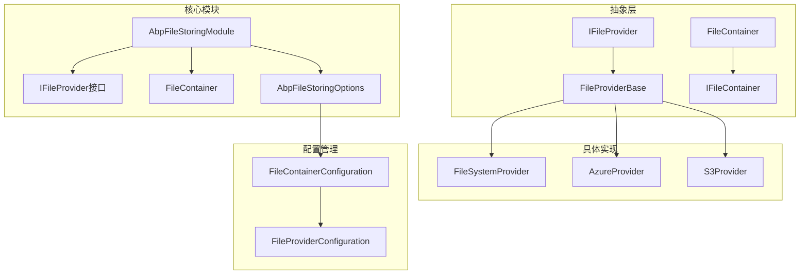
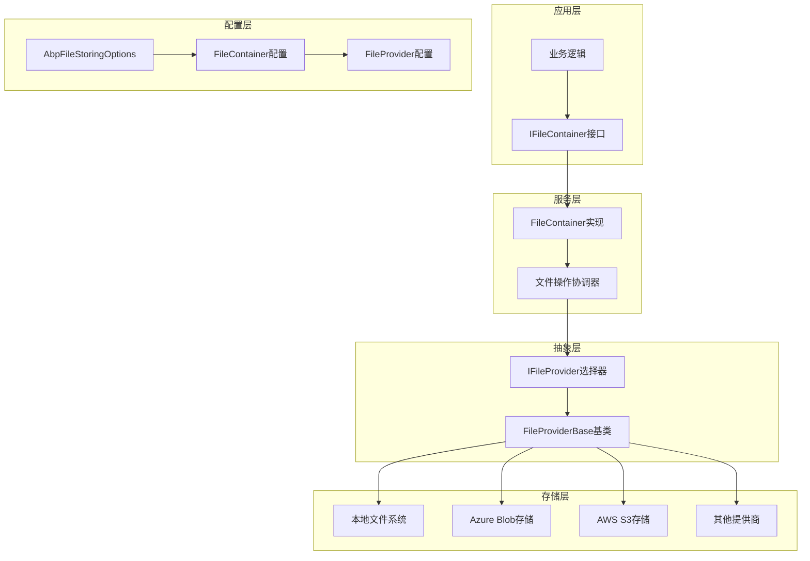
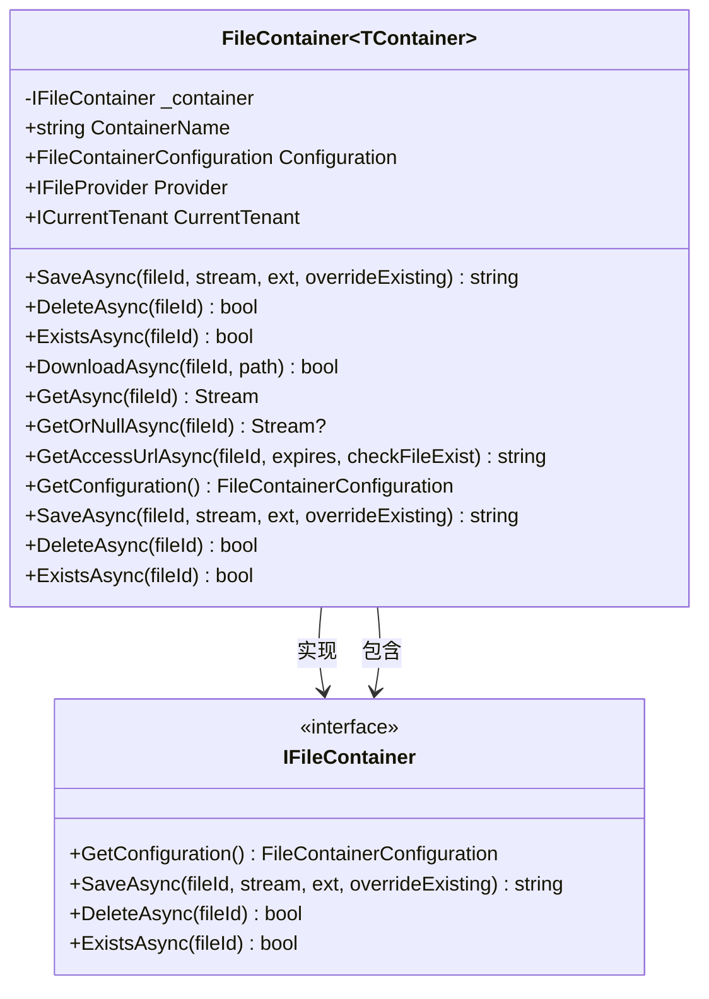
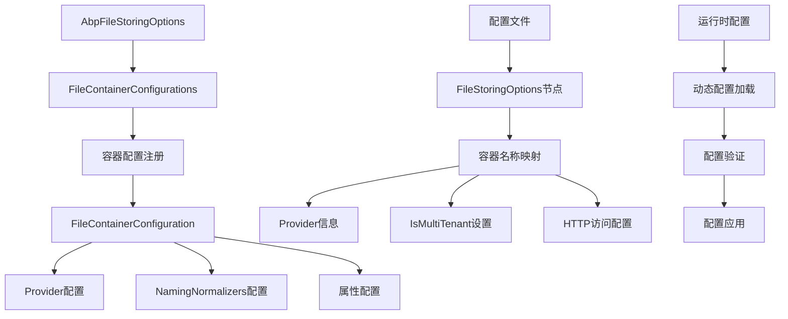
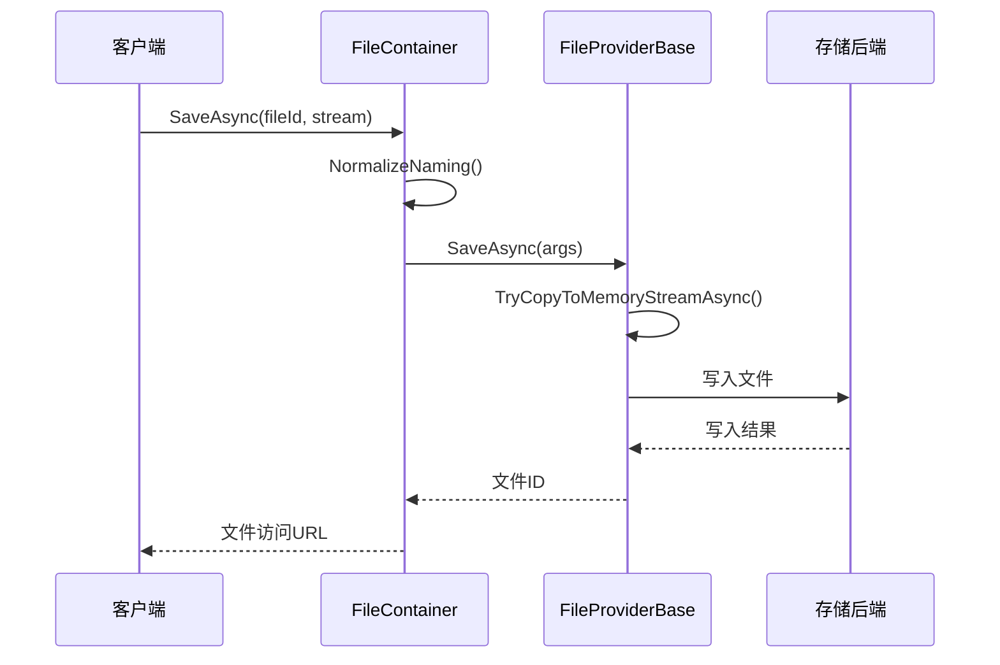
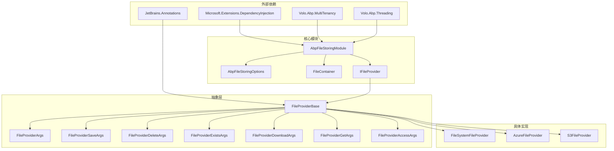

# 文件存储核心模块

<cite>
**本文档中引用的文件**
- [AbpFileStoringModule.cs](file://framework/src/SharpAbp.Abp.FileStoring/SharpAbp/Abp/FileStoring/AbpFileStoringModule.cs)
- [IFileProvider.cs](file://framework/src/SharpAbp.Abp.FileStoring/SharpAbp/Abp/FileStoring/IFileProvider.cs)
- [FileContainer.cs](file://framework/src/SharpAbp.Abp.FileStoring/SharpAbp/Abp/FileStoring/FileContainer.cs)
- [AbpFileStoringOptions.cs](file://framework/src/SharpAbp.Abp.FileStoring/SharpAbp/Abp/FileStoring/AbpFileStoringOptions.cs)
- [FileProviderArgs.cs](file://framework/src/SharpAbp.Abp.FileStoring/SharpAbp/Abp/FileStoring/FileProviderArgs.cs)
- [FileProviderSaveArgs.cs](file://framework/src/SharpAbp.Abp.FileStoring/SharpAbp/FileStoring/FileProviderSaveArgs.cs)
- [FileProviderBase.cs](file://framework/src/SharpAbp.Abp.FileStoring/SharpAbp/Abp/FileStoring/FileProviderBase.cs)
- [AbpFileStoringTestModule.cs](file://framework/test/SharpAbp.Abp.FileStoring.Tests/SharpAbp/Abp/FileStoring/AbpFileStoringTestModule.cs)
- [FileSystemFileProvider.cs](file://framework/src/SharpAbp.Abp.FileStoring.FileSystem/SharpAbp/Abp/FileStoring/FileSystem/FileSystemFileProvider.cs)
- [FileSystemFileProviderConfiguration.cs](file://framework/src/SharpAbp.Abp.FileStoring.FileSystem/SharpAbp/Abp/FileStoring/FileSystem/FileSystemFileProviderConfiguration.cs)
</cite>

## 目录
1. [简介](#简介)
2. [项目结构](#项目结构)
3. [核心组件](#核心组件)
4. [架构概览](#架构概览)
5. [详细组件分析](#详细组件分析)
6. [依赖关系分析](#依赖关系分析)
7. [性能考虑](#性能考虑)
8. [故障排除指南](#故障排除指南)
9. [结论](#结论)

## 简介

SharpAbp.Abp.FileStoring 是一个功能强大的文件存储抽象层框架，为应用程序提供了统一的文件存储接口。该模块设计了灵活的架构，支持多种文件存储提供商（如本地文件系统、Azure Blob Storage、AWS S3等），并通过逻辑隔离单元（FileContainer）实现了多租户和容器化的文件管理。

核心特性包括：
- 统一的文件存储接口设计
- 多租户支持
- 容器化文件管理
- 可扩展的存储提供商架构
- 配置驱动的容器管理
- 异步文件操作支持

## 项目结构

文件存储模块采用分层架构设计，主要包含以下核心组件：



**图表来源**
- [AbpFileStoringModule.cs](file://framework/src/SharpAbp.Abp.FileStoring/SharpAbp/Abp/FileStoring/AbpFileStoringModule.cs#L1-L38)
- [IFileProvider.cs](file://framework/src/SharpAbp.Abp.FileStoring/SharpAbp/Abp/FileStoring/IFileProvider.cs#L1-L60)

**章节来源**
- [AbpFileStoringModule.cs](file://framework/src/SharpAbp.Abp.FileStoring/SharpAbp/Abp/FileStoring/AbpFileStoringModule.cs#L1-L38)

## 核心组件

### AbpFileStoringModule 模块初始化

`AbpFileStoringModule` 是整个文件存储模块的核心入口点，负责模块的初始化和服务注册：

```csharp
[DependsOn(
    typeof(AbpMultiTenancyModule),
    typeof(AbpThreadingModule),
    typeof(AbpFileStoringAbstractionsModule)
)]
public class AbpFileStoringModule : AbpModule
{
    public override Task ConfigureServicesAsync(ServiceConfigurationContext context)
    {
        context.Services.AddTransient(
            typeof(IFileContainer<>),
            typeof(FileContainer<>)
        );

        context.Services.AddTransient(
            typeof(IFileContainer),
            serviceProvider => serviceProvider
                .GetRequiredService<IFileContainer<DefaultContainer>>()
        );

        return Task.CompletedTask;
    }
}
```

该模块的主要职责：
- 注册泛型 `IFileContainer<>` 和非泛型 `IFileContainer` 服务
- 依赖于多租户模块以支持多租户文件存储
- 依赖于线程模块以确保异步操作的安全性
- 依赖于抽象层模块以提供基础接口定义

### IFileProvider 接口契约

`IFileProvider` 接口定义了所有文件存储提供商必须实现的标准契约：

```csharp
public interface IFileProvider
{
    string Provider { get; }
    
    Task<string> SaveAsync(FileProviderSaveArgs args);
    Task<bool> DeleteAsync(FileProviderDeleteArgs args);
    Task<bool> ExistsAsync(FileProviderExistsArgs args);
    Task<bool> DownloadAsync(FileProviderDownloadArgs args);
    Task<Stream?> GetOrNullAsync(FileProviderGetArgs args);
    Task<string> GetAccessUrlAsync(FileProviderAccessArgs args);
}
```

该接口提供了完整的文件生命周期管理功能：
- **保存文件**：支持流式上传和文件覆盖选项
- **删除文件**：安全的文件删除机制
- **文件检查**：高效的文件存在性验证
- **下载文件**：支持本地路径下载
- **获取文件**：返回文件流用于直接访问
- **访问URL**：生成可直接访问的文件URL

**章节来源**
- [AbpFileStoringModule.cs](file://framework/src/SharpAbp.Abp.FileStoring/SharpAbp/Abp/FileStoring/AbpFileStoringModule.cs#L10-L38)
- [IFileProvider.cs](file://framework/src/SharpAbp.Abp.FileStoring/SharpAbp/Abp/FileStoring/IFileProvider.cs#L10-L60)

## 架构概览

文件存储模块采用分层架构设计，实现了高度的可扩展性和灵活性：



**图表来源**
- [FileContainer.cs](file://framework/src/SharpAbp.Abp.FileStoring/SharpAbp/Abp/FileStoring/FileContainer.cs#L1-L50)
- [AbpFileStoringOptions.cs](file://framework/src/SharpAbp.Abp.FileStoring/SharpAbp/Abp/FileStoring/AbpFileStoringOptions.cs#L1-L70)

## 详细组件分析

### FileContainer 逻辑隔离单元

`FileContainer` 是文件存储的核心逻辑单元，实现了文件容器的概念，提供了统一的文件操作接口：



**图表来源**
- [FileContainer.cs](file://framework/src/SharpAbp.Abp.FileStoring/SharpAbp/Abp/FileStoring/FileContainer.cs#L15-L100)

`FileContainer` 的设计特点：
- **泛型支持**：通过泛型参数支持不同类型的容器标识
- **租户隔离**：自动处理多租户上下文切换
- **命名规范化**：集成文件命名规范化服务
- **配置管理**：集中管理容器配置和提供商设置

### AbpFileStoringOptions 配置体系

`AbpFileStoringOptions` 提供了完整的配置管理机制：



**图表来源**
- [AbpFileStoringOptions.cs](file://framework/src/SharpAbp.Abp.FileStoring/SharpAbp/Abp/FileStoring/AbpFileStoringOptions.cs#L10-L70)

配置体系的关键特性：
- **声明式配置**：通过配置文件定义容器和提供商关系
- **类型安全**：强类型的配置模型
- **动态加载**：运行时动态加载和应用配置
- **验证机制**：配置完整性验证和错误处理

### FileProviderArgs 参数对象体系

文件操作通过一系列专门的参数对象来传递信息：

```mermaid
classDiagram
class FileProviderArgs {
<<abstract>>
+string ContainerName
+FileContainerConfiguration Configuration
+string FileId
+CancellationToken CancellationToken
+FileProviderArgs(containerName, configuration, fileId, cancellationToken)
}
class FileProviderSaveArgs {
+Stream FileStream
+string FileExt
+bool OverrideExisting
+FileProviderSaveArgs(containerName, configuration, fileId, overrideExisting, cancellationToken)
+FileProviderSaveArgs(containerName, configuration, fileId, fileStream, fileExt, overrideExisting, cancellationToken)
}
class FileProviderDeleteArgs {
+FileProviderDeleteArgs(containerName, configuration, fileId, cancellationToken)
}
class FileProviderExistsArgs {
+FileProviderExistsArgs(containerName, configuration, fileId, cancellationToken)
}
class FileProviderDownloadArgs {
+string LocalPath
+FileProviderDownloadArgs(containerName, configuration, fileId, localPath, cancellationToken)
}
class FileProviderGetArgs {
+FileProviderGetArgs(containerName, configuration, fileId, cancellationToken)
}
class FileProviderAccessArgs {
+DateTime? Expires
+bool CheckFileExist
+FileProviderAccessArgs(containerName, configuration, fileId, expires, checkFileExist, cancellationToken)
}
FileProviderArgs <|-- FileProviderSaveArgs
FileProviderArgs <|-- FileProviderDeleteArgs
FileProviderArgs <|-- FileProviderExistsArgs
FileProviderArgs <|-- FileProviderDownloadArgs
FileProviderArgs <|-- FileProviderGetArgs
FileProviderArgs <|-- FileProviderAccessArgs
```



**图表来源**
- [FileProviderArgs.cs](file://framework/src/SharpAbp.Abp.FileStoring/SharpAbp/Abp/FileStoring/FileProviderArgs.cs#L1-L55)
- [FileProviderSaveArgs.cs](file://framework/src/SharpAbp.Abp.FileStoring/SharpAbp/Abp/FileStoring/FileProviderSaveArgs.cs#L1-L78)

参数对象的设计原则：
- **单一职责**：每个参数类只负责特定的操作需求
- **类型安全**：编译时类型检查减少运行时错误
- **扩展性**：易于添加新的参数类型支持新功能
- **一致性**：所有参数类共享基础属性和构造函数

### FileProviderBase 基础实现

`FileProviderBase` 为所有文件提供商实现提供了通用的基础功能：



**图表来源**
- [FileProviderBase.cs](file://framework/src/SharpAbp.Abp.FileStoring/SharpAbp/Abp/FileStoring/FileProviderBase.cs#L1-L100)

基础实现的功能特性：
- **抽象方法**：定义所有必需的文件操作抽象方法
- **辅助方法**：提供常用的流处理和文件操作辅助方法
- **异常处理**：统一的异常处理和日志记录
- **资源管理**：自动的资源清理和内存管理

**章节来源**
- [FileContainer.cs](file://framework/src/SharpAbp.Abp.FileStoring/SharpAbp/Abp/FileStoring/FileContainer.cs#L1-L298)
- [AbpFileStoringOptions.cs](file://framework/src/SharpAbp.Abp.FileStoring/SharpAbp/Abp/FileStoring/AbpFileStoringOptions.cs#L1-L70)
- [FileProviderArgs.cs](file://framework/src/SharpAbp.Abp.FileStoring/SharpAbp/Abp/FileStoring/FileProviderArgs.cs#L1-L55)
- [FileProviderSaveArgs.cs](file://framework/src/SharpAbp.Abp.FileStoring/SharpAbp/Abp/FileStoring/FileProviderSaveArgs.cs#L1-L78)
- [FileProviderBase.cs](file://framework/src/SharpAbp.Abp.FileStoring/SharpAbp/Abp/FileStoring/FileProviderBase.cs#L1-L100)

## 依赖关系分析

文件存储模块的依赖关系体现了清晰的分层架构：



**图表来源**
- [AbpFileStoringModule.cs](file://framework/src/SharpAbp.Abp.FileStoring/SharpAbp/Abp/FileStoring/AbpFileStoringModule.cs#L1-L10)

依赖关系的设计原则：
- **松耦合**：通过接口实现组件间的解耦
- **依赖注入**：利用DI容器管理组件生命周期
- **可测试性**：便于单元测试和模拟
- **可扩展性**：支持新的提供商实现而不影响现有代码

**章节来源**
- [AbpFileStoringModule.cs](file://framework/src/SharpAbp.Abp.FileStoring/SharpAbp/Abp/FileStoring/AbpFileStoringModule.cs#L1-L38)

## 性能考虑

文件存储模块在设计时充分考虑了性能优化：

### 异步操作支持
所有文件操作都采用异步模式，避免阻塞主线程，提高并发性能。

### 流式处理
支持流式文件操作，避免将大文件完全加载到内存中。

### 缓存策略
通过配置化的缓存策略减少重复的文件检查和元数据查询。

### 连接池管理
对于云存储提供商，合理配置连接池以提高并发访问效率。

### 错误重试机制
内置指数退避重试机制，提高网络不稳定环境下的可靠性。

## 故障排除指南

### 常见问题及解决方案

1. **文件保存失败**
   - 检查存储空间是否充足
   - 验证文件权限设置
   - 确认网络连接状态

2. **文件访问URL为空**
   - 检查HTTP访问配置
   - 验证文件是否存在
   - 确认提供商支持URL生成功能

3. **多租户文件隔离问题**
   - 验证当前租户上下文
   - 检查租户相关配置
   - 确认命名规范化设置

4. **配置加载失败**
   - 验证配置文件格式
   - 检查配置项名称拼写
   - 确认提供商配置存在

**章节来源**
- [AbpFileStoringTestModule.cs](file://framework/test/SharpAbp.Abp.FileStoring.Tests/SharpAbp/Abp/FileStoring/AbpFileStoringTestModule.cs#L1-L49)

## 结论

SharpAbp.Abp.FileStoring 核心模块提供了一个强大而灵活的文件存储抽象层。通过精心设计的架构，它成功地解决了以下关键问题：

### 设计优势
- **统一接口**：通过 `IFileProvider` 接口统一了不同存储提供商的操作方式
- **逻辑隔离**：通过 `FileContainer` 实现了文件的逻辑隔离和多租户支持
- **配置驱动**：通过 `AbpFileStoringOptions` 实现了灵活的配置管理
- **扩展性强**：通过 `FileProviderBase` 基类简化了新提供商的开发

### 技术特色
- **异步优先**：全面采用异步编程模型提高性能
- **类型安全**：通过强类型参数对象避免运行时错误
- **资源管理**：自动化的资源管理和异常处理
- **多租户支持**：内置的多租户文件隔离机制

### 应用场景
该模块适用于需要灵活文件存储解决方案的各种应用场景，包括：
- 多租户SaaS应用的文件存储
- 分布式系统的文件管理
- 云原生应用的存储抽象
- 需要支持多种存储提供商的混合存储方案

通过深入理解这些核心概念和实现细节，开发者可以更好地利用这个模块构建健壮、可扩展的文件存储解决方案。