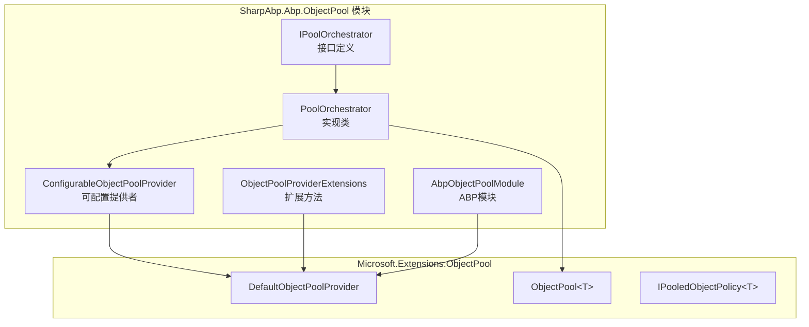
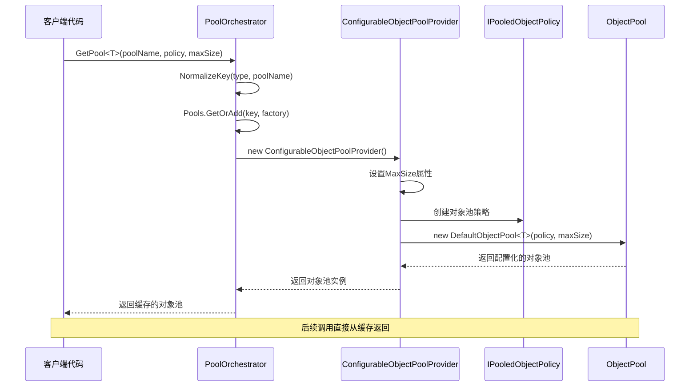
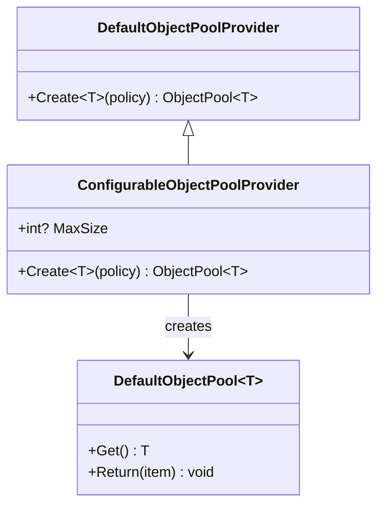
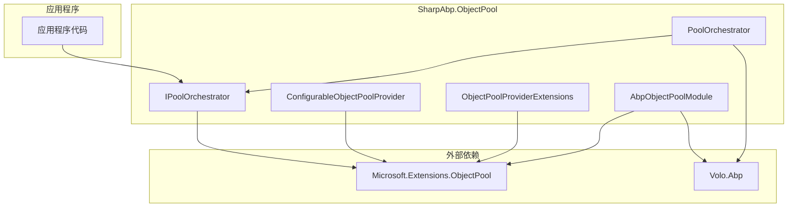

# 对象池管理

<cite>
**本文档中引用的文件**
- [IPoolOrchestrator.cs](file://framework/src/SharpAbp.Abp.ObjectPool/SharpAbp/Abp/ObjectPool/IPoolOrchestrator.cs)
- [PoolOrchestrator.cs](file://framework/src/SharpAbp.Abp.ObjectPool/SharpAbp/Abp/ObjectPool/PoolOrchestrator.cs)
- [ConfigurableObjectPoolProvider.cs](file://framework/src/SharpAbp.Abp.ObjectPool/SharpAbp/Abp/ObjectPool/ConfigurableObjectPoolProvider.cs)
- [ObjectPoolProviderExtensions.cs](file://framework/src/SharpAbp.Abp.ObjectPool/SharpAbp/Abp/ObjectPool/ObjectPoolProviderExtensions.cs)
- [AbpObjectPoolModule.cs](file://framework/src/SharpAbp.Abp.ObjectPool/SharpAbp/Abp/ObjectPool/AbpObjectPoolModule.cs)
</cite>

## 目录
1. [简介](#简介)
2. [项目结构](#项目结构)
3. [核心组件](#核心组件)
4. [架构概览](#架构概览)
5. [详细组件分析](#详细组件分析)
6. [依赖关系分析](#依赖关系分析)
7. [性能考虑](#性能考虑)
8. [故障排除指南](#故障排除指南)
9. [结论](#结论)

## 简介

SharpAbp对象池管理模块是一个高性能的对象生命周期管理解决方案，专门设计用于优化高并发场景下的资源使用效率。该模块提供了完整的对象池协调器机制，支持动态配置、类型安全的对象获取和归还操作，以及针对不同业务场景的定制化策略。

对象池技术通过重用昂贵创建的对象来减少垃圾回收压力，显著提升应用程序性能。在sharp-abp框架中，对象池管理模块不仅提供了基础的对象池功能，还集成了ABP框架的依赖注入系统，使得对象池的配置和使用变得简单而高效。

## 项目结构

SharpAbp对象池模块采用清晰的分层架构设计，主要包含以下核心文件：



**图表来源**
- [IPoolOrchestrator.cs](file://framework/src/SharpAbp.Abp.ObjectPool/SharpAbp/Abp/ObjectPool/IPoolOrchestrator.cs#L1-L11)
- [PoolOrchestrator.cs](file://framework/src/SharpAbp.Abp.ObjectPool/SharpAbp/Abp/ObjectPool/PoolOrchestrator.cs#L1-L69)
- [ConfigurableObjectPoolProvider.cs](file://framework/src/SharpAbp.Abp.ObjectPool/SharpAbp/Abp/ObjectPool/ConfigurableObjectPoolProvider.cs#L1-L15)

**章节来源**
- [IPoolOrchestrator.cs](file://framework/src/SharpAbp.Abp.ObjectPool/SharpAbp/Abp/ObjectPool/IPoolOrchestrator.cs#L1-L11)
- [PoolOrchestrator.cs](file://framework/src/SharpAbp.Abp.ObjectPool/SharpAbp/Abp/ObjectPool/PoolOrchestrator.cs#L1-L69)
- [ConfigurableObjectPoolProvider.cs](file://framework/src/SharpAbp.Abp.ObjectPool/SharpAbp/Abp/ObjectPool/ConfigurableObjectPoolProvider.cs#L1-L15)
- [ObjectPoolProviderExtensions.cs](file://framework/src/SharpAbp.Abp.ObjectPool/SharpAbp/Abp/ObjectPool/ObjectPoolProviderExtensions.cs#L1-L14)
- [AbpObjectPoolModule.cs](file://framework/src/SharpAbp.Abp.ObjectPool/SharpAbp/Abp/ObjectPool/AbpObjectPoolModule.cs#L1-L23)

## 核心组件

### IPoolOrchestrator 接口

IPoolOrchestrator是对象池协调器的核心接口，定义了获取对象池的标准契约：

```csharp
public interface IPoolOrchestrator
{
    ObjectPool<T> GetPool<T>(
        [NotNull] string poolName, 
        IPooledObjectPolicy<T> policy, 
        int? maxSize = null
    ) where T : class;
}
```

该接口提供了三个关键参数：
- **poolName**: 对象池的唯一标识名称
- **policy**: 对象创建和重置策略
- **maxSize**: 可选的最大池容量限制

### PoolOrchestrator 实现类

PoolOrchestrator是IPoolOrchestrator接口的主要实现，负责协调和管理所有对象池实例：

```csharp
public class PoolOrchestrator : IPoolOrchestrator, ISingletonDependency
{
    protected ObjectPoolProvider Provider { get; }
    protected ConcurrentDictionary<string, object> Pools { get; }
    
    public virtual ObjectPool<T> GetPool<T>(
        [NotNull] string poolName, 
        IPooledObjectPolicy<T> policy, 
        int? maxSize = null
    ) where T : class
    {
        // 实现逻辑...
    }
}
```

**章节来源**
- [IPoolOrchestrator.cs](file://framework/src/SharpAbp.Abp.ObjectPool/SharpAbp/Abp/ObjectPool/IPoolOrchestrator.cs#L1-L11)
- [PoolOrchestrator.cs](file://framework/src/SharpAbp.Abp.ObjectPool/SharpAbp/Abp/ObjectPool/PoolOrchestrator.cs#L1-L69)

## 架构概览

对象池管理系统采用分层架构设计，确保了高度的可扩展性和可维护性：



**图表来源**
- [PoolOrchestrator.cs](file://framework/src/SharpAbp.Abp.ObjectPool/SharpAbp/Abp/ObjectPool/PoolOrchestrator.cs#L37-L68)
- [ConfigurableObjectPoolProvider.cs](file://framework/src/SharpAbp.Abp.ObjectPool/SharpAbp/Abp/ObjectPool/ConfigurableObjectPoolProvider.cs#L1-L15)

## 详细组件分析

### ConfigurableObjectPoolProvider 分析

ConfigurableObjectPoolProvider是对Microsoft.Extensions.ObjectPool.DefaultObjectPoolProvider的增强实现，提供了可配置的最大池大小功能：



**图表来源**
- [ConfigurableObjectPoolProvider.cs](file://framework/src/SharpAbp.Abp.ObjectPool/SharpAbp/Abp/ObjectPool/ConfigurableObjectPoolProvider.cs#L1-L15)

ConfigurableObjectPoolProvider的核心特性：

1. **可配置最大尺寸**: 通过MaxSize属性控制池的容量
2. **条件创建**: 当MaxSize有值时创建指定大小的池，否则使用默认行为
3. **向后兼容**: 继承自DefaultObjectPoolProvider，保持API一致性

### ObjectPoolProviderExtensions 扩展

扩展方法提供了便捷的默认池大小计算：

```csharp
public static class ObjectPoolProviderExtensions
{
    public static int GetDefaultSize(this ObjectPoolProvider provider)
    {
        return Environment.ProcessorCount * 2;
    }
}
```

这个扩展方法基于处理器核心数计算默认池大小，通常设置为处理器数量的两倍，这是.NET对象池的最佳实践。

### AbpObjectPoolModule 配置

AbpObjectPoolModule负责将对象池服务注册到ABP依赖注入容器：

```csharp
public class AbpObjectPoolModule : AbpModule
{
    public override Task ConfigureServicesAsync(ServiceConfigurationContext context)
    {
        context.Services.AddSingleton<ObjectPoolProvider, DefaultObjectPoolProvider>();
        return Task.CompletedTask;
    }
}
```

该模块确保DefaultObjectPoolProvider作为单例服务可用，为整个应用程序提供统一的对象池基础设施。

**章节来源**
- [ConfigurableObjectPoolProvider.cs](file://framework/src\SharpAbp.Abp.ObjectPool\SharpAbp\Abp\ObjectPool\ConfigurableObjectPoolProvider.cs#L1-L15)
- [ObjectPoolProviderExtensions.cs](file://framework\SharpAbp.Abp.ObjectPool\SharpAbp\Abp\ObjectPool\ObjectPoolProviderExtensions.cs#L1-L14)
- [AbpObjectPoolModule.cs](file://framework\SharpAbp.Abp.ObjectPool\SharpAbp\Abp\ObjectPool\AbpObjectPoolModule.cs#L1-L23)

## 依赖关系分析

对象池模块的依赖关系展现了清晰的分层架构：



**图表来源**
- [IPoolOrchestrator.cs](file://framework\SharpAbp.Abp.ObjectPool\SharpAbp\Abp\ObjectPool\IPoolOrchestrator.cs#L1-L11)
- [PoolOrchestrator.cs](file://framework\SharpAbp.Abp.ObjectPool\SharpAbp\Abp\ObjectPool\PoolOrchestrator.cs#L1-L69)
- [AbpObjectPoolModule.cs](file://framework\SharpAbp.Abp.ObjectPool\SharpAbp\Abp\ObjectPool\AbpObjectPoolModule.cs#L1-L23)

**章节来源**
- [IPoolOrchestrator.cs](file://framework\SharpAbp.Abp.ObjectPool\SharpAbp\Abp\ObjectPool\IPoolOrchestrator.cs#L1-L11)
- [PoolOrchestrator.cs](file://framework\SharpAbp.Abp.ObjectPool\SharpAbp\Abp\ObjectPool\PoolOrchestrator.cs#L1-L69)
- [AbpObjectPoolModule.cs](file://framework\SharpAbp.Abp.ObjectPool\SharpAbp\Abp\ObjectPool\AbpObjectPoolModule.cs#L1-L23)

## 性能考虑

### 高并发优化

对象池管理模块在高并发场景下表现出色，主要体现在以下几个方面：

1. **线程安全**: 使用ConcurrentDictionary存储池实例，确保多线程环境下的安全性
2. **延迟初始化**: 采用GetOrAdd模式，只有在首次访问时才创建池实例
3. **键规范化**: 通过NormalizeKey方法生成唯一的池标识符，避免重复创建

### 内存管理优化

1. **对象复用**: 通过对象池减少频繁的对象分配和垃圾回收
2. **容量控制**: ConfigurableObjectPoolProvider允许精确控制池大小
3. **默认策略**: 基于处理器核心数的智能默认大小计算

### 实际应用场景

#### 网络连接池

```csharp
// 创建网络连接对象池
var connectionPool = poolOrchestrator.GetPool<NetworkConnection>(
    "DatabaseConnection",
    new NetworkConnectionPolicy(),
    maxSize: 50
);

// 获取连接
var connection = connectionPool.Get();
try
{
    // 使用连接
    connection.ExecuteCommand("SELECT * FROM Users");
}
finally
{
    // 归还连接
    connectionPool.Return(connection);
}
```

#### 大对象池

```csharp
// 创建大内存对象池
var bufferPool = poolOrchestrator.GetPool<byte[]>(
    "LargeBuffer",
    new BufferPolicy(1024 * 1024), // 1MB缓冲区
    maxSize: 10
);

// 获取大缓冲区
var buffer = bufferPool.Get();
try
{
    // 使用缓冲区处理大数据
    ProcessLargeData(buffer);
}
finally
{
    // 清理并归还
    Array.Clear(buffer, 0, buffer.Length);
    bufferPool.Return(buffer);
}
```

## 故障排除指南

### 常见问题及解决方案

#### 1. 对象池未正确释放

**问题**: 对象使用完毕后忘记归还到池中，导致资源泄漏。

**解决方案**:
```csharp
// 正确的做法：使用using语句或try-finally
var obj = pool.Get();
try
{
    // 使用对象
}
finally
{
    pool.Return(obj);
}
```

#### 2. 池大小配置不当

**问题**: 池太小导致频繁创建新对象，池太大浪费内存。

**解决方案**:
```csharp
// 根据实际负载调整池大小
var optimalSize = Math.Max(Environment.ProcessorCount * 2, 10);
var pool = poolOrchestrator.GetPool<MyObject>(
    "OptimizedPool",
    new MyObjectPolicy(),
    maxSize: optimalSize
);
```

#### 3. 类型安全问题

**问题**: 不同类型的对象被错误地放入同一个池中。

**解决方案**:
```csharp
// 使用不同的池名称区分不同类型
var stringPool = poolOrchestrator.GetPool<string>("StringPool", new StringPolicy());
var intPool = poolOrchestrator.GetPool<int>("IntPool", new IntPolicy());
```

**章节来源**
- [PoolOrchestrator.cs](file://framework\SharpAbp.Abp.ObjectPool\SharpAbp\Abp\ObjectPool\PoolOrchestrator.cs#L37-L68)

## 结论

SharpAbp对象池管理模块提供了一个强大而灵活的对象生命周期管理解决方案。通过IPoolOrchestrator接口和PoolOrchestrator实现类，开发者可以轻松地创建和管理各种类型的对象池。

该模块的主要优势包括：

1. **高性能**: 通过对象复用显著减少GC压力
2. **易用性**: 简洁的API设计和自动化的池管理
3. **可配置性**: 支持灵活的池大小和策略配置
4. **集成性**: 无缝集成ABP框架的依赖注入系统
5. **线程安全**: 内置的并发安全保障

在实际应用中，对象池特别适用于以下场景：
- 数据库连接池管理
- 大内存对象的重复使用
- 网络通信对象的生命周期管理
- 高频次创建的临时对象

通过合理配置和使用对象池，可以显著提升应用程序的性能和资源利用率，特别是在高并发环境下表现尤为突出。