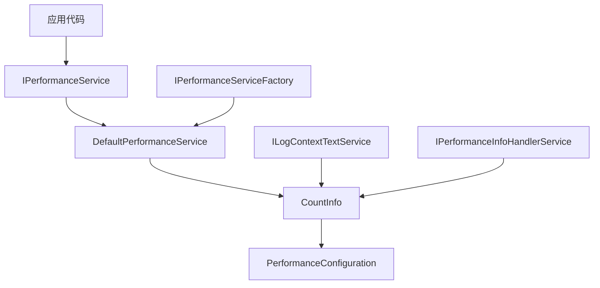
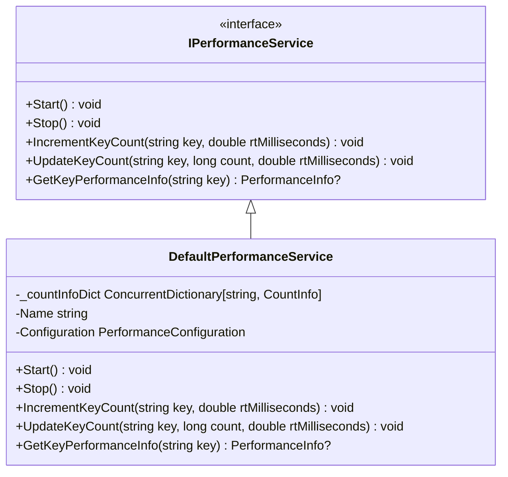
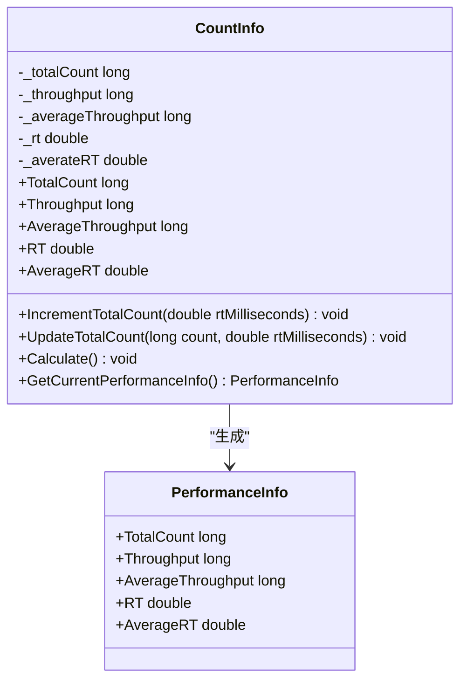
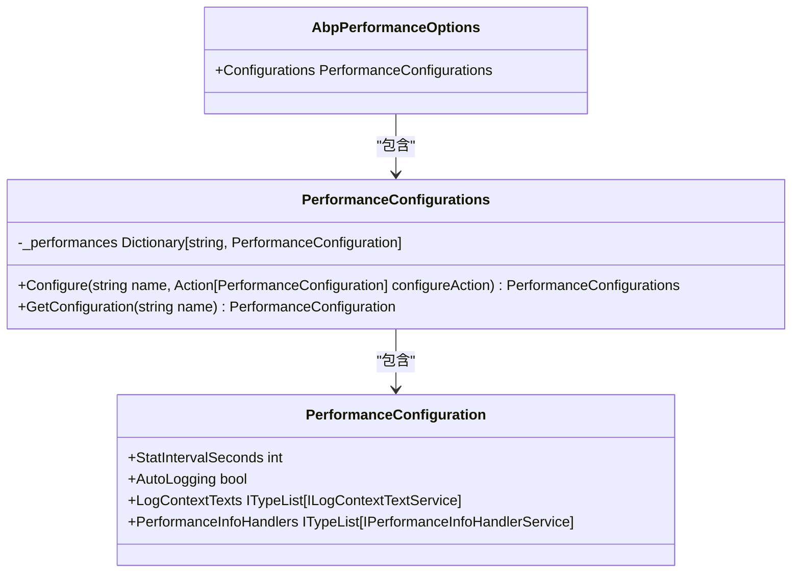
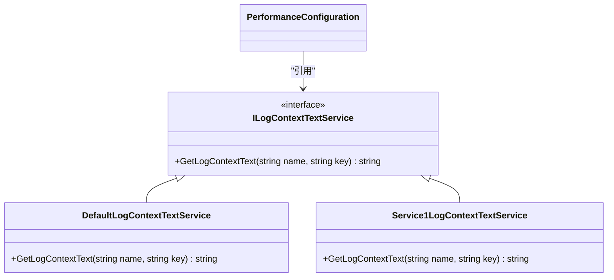
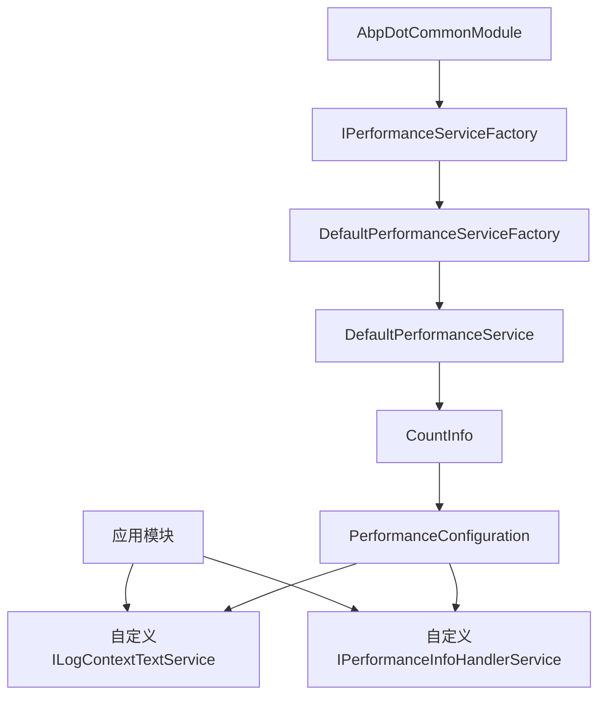

# 性能监控组件

<cite>
**本文档中引用的文件**
- [IPerformanceService.cs](file://framework/src/SharpAbp.Abp.DotCommon/SharpAbp/Abp/DotCommon/Performance/IPerformanceService.cs)
- [DefaultPerformanceService.cs](file://framework/src/SharpAbp.Abp.DotCommon/SharpAbp/Abp/DotCommon/Performance/DefaultPerformanceService.cs)
- [CountInfo.cs](file://framework/src/SharpAbp.Abp.DotCommon/SharpAbp/Abp/DotCommon/Performance/CountInfo.cs)
- [PerformanceConfiguration.cs](file://framework/src/SharpAbp.Abp.DotCommon/SharpAbp/Abp/DotCommon/Performance/PerformanceConfiguration.cs)
- [PerformanceConfigurations.cs](file://framework/src/SharpAbp.Abp.DotCommon/SharpAbp/Abp/DotCommon/Performance/PerformanceConfigurations.cs)
- [ILogContextTextService.cs](file://framework/src/SharpAbp.Abp.DotCommon/SharpAbp/Abp/DotCommon/Performance/ILogContextTextService.cs)
- [DefaultLogContextTextService.cs](file://framework/src/SharpAbp.Abp.DotCommon/SharpAbp/Abp/DotCommon/Performance/DefaultLogContextTextService.cs)
- [AbpPerformanceOptions.cs](file://framework/src/SharpAbp.Abp.DotCommon/SharpAbp/Abp/DotCommon/Performance/AbpPerformanceOptions.cs)
- [PerformanceSampleModule.cs](file://samples/performance-sample/src/PerformanceSample/PerformanceSampleModule.cs)
- [Service1LogContextTextService.cs](file://samples/performance-sample/src/PerformanceSample/Service1LogContextTextService.cs)
</cite>

## 目录
1. [简介](#简介)
2. [核心组件](#核心组件)
3. [架构概述](#架构概述)
4. [详细组件分析](#详细组件分析)
5. [依赖关系分析](#依赖关系分析)
6. [性能考虑](#性能考虑)
7. [故障排除指南](#故障排除指南)
8. [结论](#结论)

## 简介
sharp-abp框架提供了一套完整的性能监控组件，用于跟踪和记录应用程序的性能指标。该组件通过`IPerformanceService`接口和`DefaultPerformanceService`实现来收集性能数据，并使用`CountInfo`对象进行统计计算。系统通过`PerformanceConfiguration`和`PerformanceConfigurations`类管理不同场景下的监控配置，并支持通过`ILogContextTextService`接口扩展日志上下文信息。

## 核心组件
性能监控组件的核心包括`IPerformanceService`接口、`DefaultPerformanceService`实现类以及相关的配置和辅助类。这些组件共同工作，提供了灵活的性能监控能力，允许开发者在不同业务场景下跟踪关键性能指标。

**本节来源**
- [IPerformanceService.cs](file://framework/src/SharpAbp.Abp.DotCommon/SharpAbp/Abp/DotCommon/Performance/IPerformanceService.cs)
- [DefaultPerformanceService.cs](file://framework/src/SharpAbp.Abp.DotCommon/SharpAbp/Abp/DotCommon/Performance/DefaultPerformanceService.cs)
- [PerformanceConfiguration.cs](file://framework/src/SharpAbp.Abp.DotCommon/SharpAbp/Abp/DotCommon/Performance/PerformanceConfiguration.cs)

## 架构概述
性能监控组件采用工厂模式和依赖注入相结合的设计，通过`IPerformanceServiceFactory`创建和管理性能服务实例。每个性能服务实例都关联特定的配置，可以独立地收集和报告性能数据。

**图表来源**
- [IPerformanceService.cs](file://framework/src/SharpAbp.Abp.DotCommon/SharpAbp/Abp/DotCommon/Performance/IPerformanceService.cs)
- [DefaultPerformanceService.cs](file://framework/src/SharpAbp.Abp.DotCommon/SharpAbp/Abp/DotCommon/Performance/DefaultPerformanceService.cs)
- [CountInfo.cs](file://framework/src/SharpAbp.Abp.DotCommon/SharpAbp/Abp/DotCommon/Performance/CountInfo.cs)

## 详细组件分析

### IPerformanceService接口与DefaultPerformanceService实现
`IPerformanceService`接口定义了性能监控服务的基本操作，包括启动、停止、增加计数和获取性能信息等方法。`DefaultPerformanceService`作为其默认实现，通过`ConcurrentDictionary`存储各个监控项的`CountInfo`对象，确保线程安全的并发访问。

**图表来源**
- [IPerformanceService.cs](file://framework/src/SharpAbp.Abp.DotCommon/SharpAbp/Abp/DotCommon/Performance/IPerformanceService.cs)
- [DefaultPerformanceService.cs](file://framework/src/SharpAbp.Abp.DotCommon/SharpAbp/Abp/DotCommon/Performance/DefaultPerformanceService.cs)

### CountInfo对象分析
`CountInfo`是性能监控的核心数据结构，负责跟踪和计算各项性能指标。它维护了总请求数、吞吐量、平均吞吐量、响应时间(RT)和平均响应时间等关键指标，并在指定的时间间隔内进行统计计算。

**图表来源**
- [CountInfo.cs](file://framework/src/SharpAbp.Abp.DotCommon/SharpAbp/Abp/DotCommon/Performance/CountInfo.cs)
- [PerformanceInfo.cs](file://framework/src/SharpAbp.Abp.DotCommon/SharpAbp/Abp/DotCommon/Performance/PerformanceInfo.cs)

### 配置管理机制
性能监控组件通过`PerformanceConfiguration`和`PerformanceConfigurations`类提供灵活的配置管理。`PerformanceConfigurations`作为配置容器，管理多个命名的`PerformanceConfiguration`实例，而`PerformanceConfiguration`则定义了具体的监控参数。

**图表来源**
- [PerformanceConfigurations.cs](file://framework/src/SharpAbp.Abp.DotCommon/SharpAbp/Abp/DotCommon/Performance/PerformanceConfigurations.cs)
- [PerformanceConfiguration.cs](file://framework/src/SharpAbp.Abp.DotCommon/SharpAbp/Abp/DotCommon/Performance/PerformanceConfiguration.cs)
- [AbpPerformanceOptions.cs](file://framework/src/SharpAbp.Abp.DotCommon/SharpAbp/Abp/DotCommon/Performance/AbpPerformanceOptions.cs)

### 日志上下文文本服务
`ILogContextTextService`接口及其`DefaultLogContextTextService`实现为性能监控提供了可扩展的日志上下文构建能力。通过在配置中注册不同的实现，可以在性能日志中添加自定义的上下文信息。

**图表来源**
- [ILogContextTextService.cs](file://framework/src/SharpAbp.Abp.DotCommon/SharpAbp/Abp/DotCommon/Performance/ILogContextTextService.cs)
- [DefaultLogContextTextService.cs](file://framework/src/SharpAbp.Abp.DotCommon/SharpAbp/Abp/DotCommon/Performance/DefaultLogContextTextService.cs)
- [Service1LogContextTextService.cs](file://samples/performance-sample/src/PerformanceSample/Service1LogContextTextService.cs)

## 依赖关系分析
性能监控组件与其他模块之间存在明确的依赖关系。`AbpDotCommonModule`负责注册核心服务，而具体的应用模块可以通过配置扩展功能。这种设计实现了关注点分离，使得性能监控功能既可独立使用，又能方便地集成到更大的应用系统中。

**图表来源**
- [AbpDotCommonModule.cs](file://framework/src/SharpAbp.Abp.DotCommon/SharpAbp/Abp/DotCommon/AbpDotCommonModule.cs)
- [PerformanceSampleModule.cs](file://samples/performance-sample/src/PerformanceSample/PerformanceSampleModule.cs)

## 性能考虑
性能监控组件在设计时充分考虑了性能影响。通过使用`ConcurrentDictionary`确保线程安全，避免了显式锁带来的性能开销。同时，统计计算在后台周期性执行，不会阻塞主业务流程。对于高频率的监控场景，建议合理设置统计间隔，平衡监控精度和性能开销。

## 故障排除指南
当性能监控组件出现问题时，可以从以下几个方面进行排查：
1. 检查配置是否正确注册
2. 确认相关服务已正确注入
3. 验证性能服务是否已启动
4. 检查日志输出以获取错误信息

**本节来源**
- [AbpDotCommonModule.cs](file://framework/src/SharpAbp.Abp.DotCommon/SharpAbp/Abp/DotCommon/AbpDotCommonModule.cs)
- [DefaultPerformanceServiceFactory.cs](file://framework/src/SharpAbp.Abp.DotCommon/SharpAbp/Abp/DotCommon/Performance/DefaultPerformanceServiceFactory.cs)

## 结论
sharp-abp的性能监控组件提供了一套完整且灵活的解决方案，能够有效帮助开发者跟踪和分析应用程序的性能表现。通过合理的配置和使用，可以在不影响系统性能的前提下，获得有价值的性能数据，为系统优化和问题排查提供有力支持。