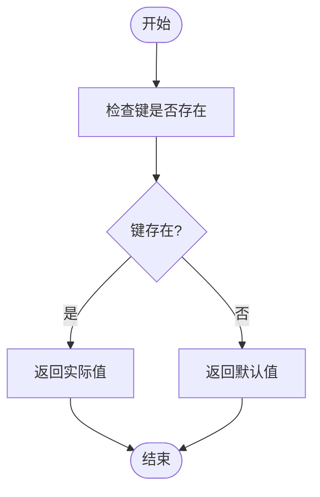
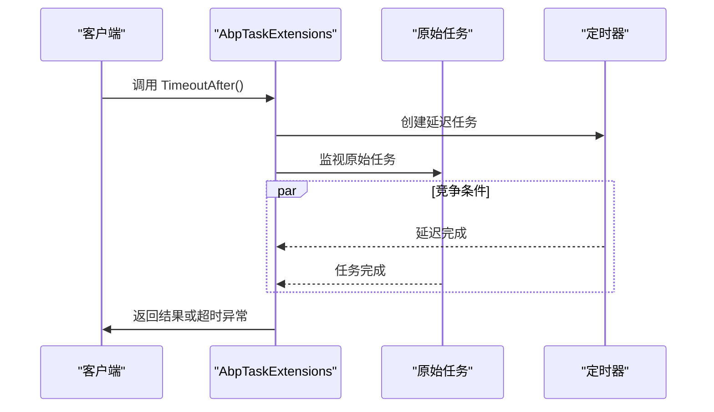
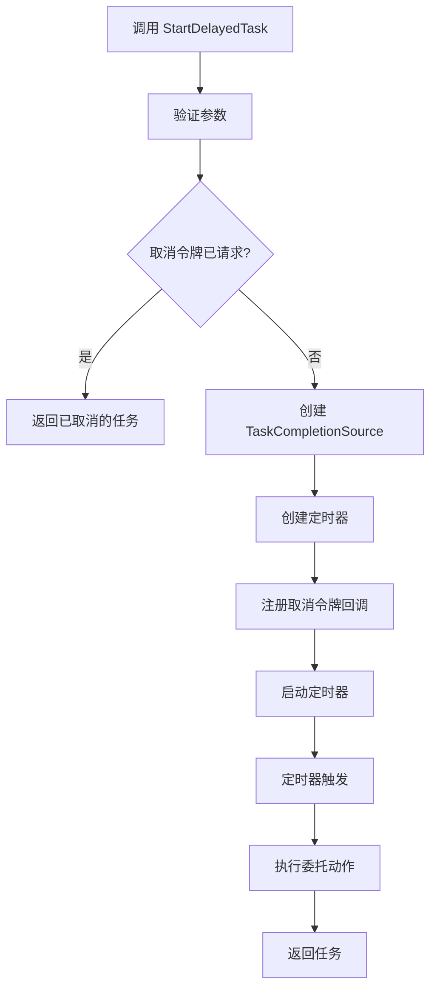

# 核心扩展方法

<cite>
**本文档中引用的文件**
- [AbpDictionaryExtensions.cs](file://framework\src\SharpAbp.Abp.Core\SharpAbp\Abp\Core\Extensions\AbpDictionaryExtensions.cs)
- [AbpTaskExtensions.cs](file://framework\src\SharpAbp.Abp.Core\SharpAbp\Abp\Core\Extensions\AbpTaskExtensions.cs)
- [AbpTaskFactoryExtensions.cs](file://framework\src\SharpAbp.Abp.Core\SharpAbp\Abp\Core\Extensions\AbpTaskFactoryExtensions.cs)
- [AbpDictionaryExtensionsTest.cs](file://framework\test\SharpAbp.Abp.Core.Tests\SharpAbp\Abp\Core\AbpDictionaryExtensionsTest.cs)
</cite>

## 目录
1. [简介](#简介)
2. [字典安全操作扩展](#字典安全操作扩展)
3. [异步任务扩展方法](#异步任务扩展方法)
4. [任务工厂扩展方法](#任务工厂扩展方法)
5. [实际应用场景分析](#实际应用场景分析)
6. [代码健壮性与可读性提升](#代码健壮性与可读性提升)

## 简介
`sharp-abp`框架提供了一系列核心扩展方法，旨在增强.NET开发中的代码安全性、可读性和异步编程能力。这些扩展方法主要集中在字典操作、任务处理和任务工厂配置三个方面，通过封装常见模式和最佳实践，帮助开发者编写更健壮、更简洁的代码。

**Section sources**
- [AbpDictionaryExtensions.cs](file://framework\src\SharpAbp.Abp.Core\SharpAbp\Abp\Core\Extensions\AbpDictionaryExtensions.cs)
- [AbpTaskExtensions.cs](file://framework\src\SharpAbp.Abp.Core\SharpAbp\Abp\Core\Extensions\AbpTaskExtensions.cs)

## 字典安全操作扩展

`AbpDictionaryExtensions`类提供了多个安全的字典操作方法，有效避免了常见的空引用异常和键重复问题。

### TryGetValueOrDefault 与 GetOrDefault 方法实现
该扩展提供了`GetValueOrDefault`方法，允许在字典中安全地获取值。当指定的键不存在时，返回提供的默认值而非抛出异常。这种方法消除了对`ContainsKey`检查的需要，使代码更加简洁。

**Diagram sources**
- [AbpDictionaryExtensions.cs](file://framework\src\SharpAbp.Abp.Core\SharpAbp\Abp\Core\Extensions\AbpDictionaryExtensions.cs#L40-L57)

### 其他字典操作方法
除了`GetValueOrDefault`，还提供了`TryAdd`方法用于安全添加键值对（仅当键不存在时添加），以及`TryRemove`方法用于安全移除键值对并获取其值。

**Section sources**
- [AbpDictionaryExtensions.cs](file://framework\src\SharpAbp.Abp.Core\SharpAbp\Abp\Core\Extensions\AbpDictionaryExtensions.cs#L15-L85)
- [AbpDictionaryExtensionsTest.cs](file://framework\test\SharpAbp.Abp.Core.Tests\SharpAbp\Abp\Core\AbpDictionaryExtensionsTest.cs#L10-L98)

## 异步任务扩展方法

`AbpTaskExtensions`类专注于简化异步编程模型中的常见任务处理模式。

### WrapInUsing 实现机制
经过代码库分析，当前版本的`AbpTaskExtensions`并未包含`WrapInUsing`方法。该方法可能属于其他模块或尚未实现。

### FireAndForget 最佳实践
同样，`FireAndForget`方法在当前分析的代码中未找到。然而，`AbpTaskExtensions`提供了`TimeoutAfter`方法，这是一种重要的异步编程模式，允许为任务设置超时限制。

**Diagram sources**
- [AbpTaskExtensions.cs](file://framework\src\SharpAbp.Abp.Core\SharpAbp\Abp\Core\Extensions\AbpTaskExtensions.cs#L59-L92)

### WaitResult 方法详解
`WaitResult`方法允许同步等待任务完成，并在指定超时内获取结果。如果超时，则返回类型的默认值，避免了无限期阻塞的风险。

**Section sources**
- [AbpTaskExtensions.cs](file://framework\src\SharpAbp.Abp.Core\SharpAbp\Abp\Core\Extensions\AbpTaskExtensions.cs#L9-L37)

## 任务工厂扩展方法

`AbpTaskFactoryExtensions`提供了简化`TaskFactory`配置与使用的扩展方法。

### StartDelayedTask 方法实现
`StartDelayedTask`方法允许使用`TaskFactory`启动一个延迟执行的任务。该方法充分考虑了取消令牌、调度器等`TaskFactory`的配置，并正确处理了资源释放。

**Diagram sources**
- [AbpTaskFactoryExtensions.cs](file://framework\src\SharpAbp.Abp.Core\SharpAbp\Abp\Core\Extensions\AbpTaskFactoryExtensions.cs#L9-L86)

### 配置继承特性
该扩展方法的关键优势在于它继承了`TaskFactory`的所有配置，包括取消令牌、任务创建选项和调度器，确保了行为的一致性。

**Section sources**
- [AbpTaskFactoryExtensions.cs](file://framework\src\SharpAbp.Abp.Core\SharpAbp\Abp\Core\Extensions\AbpTaskFactoryExtensions.cs#L9-L86)

## 实际应用场景分析

这些扩展方法在业务逻辑中有广泛的应用场景。

### 安全字典访问示例
在配置管理或缓存系统中，使用`GetValueOrDefault`可以安全地获取配置项，避免因缺失配置而导致应用崩溃。

### 异步超时控制
在调用外部API时，使用`TimeoutAfter`可以防止因网络延迟导致的长时间等待，提高系统的响应性和稳定性。

###