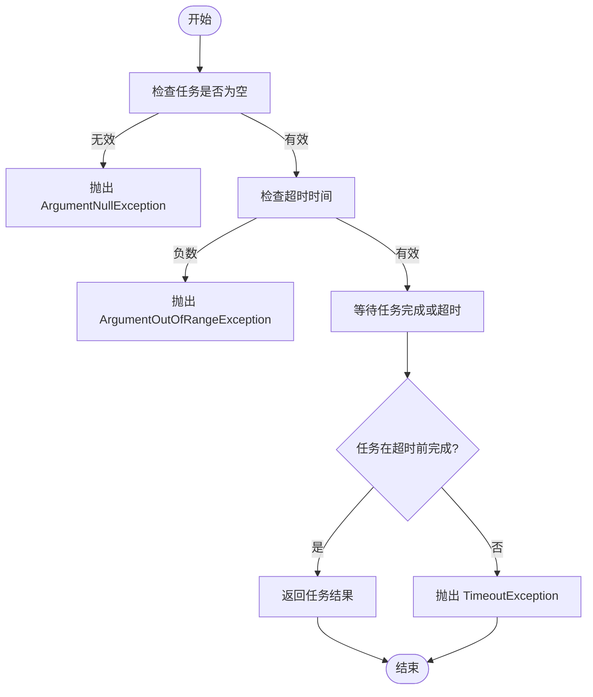
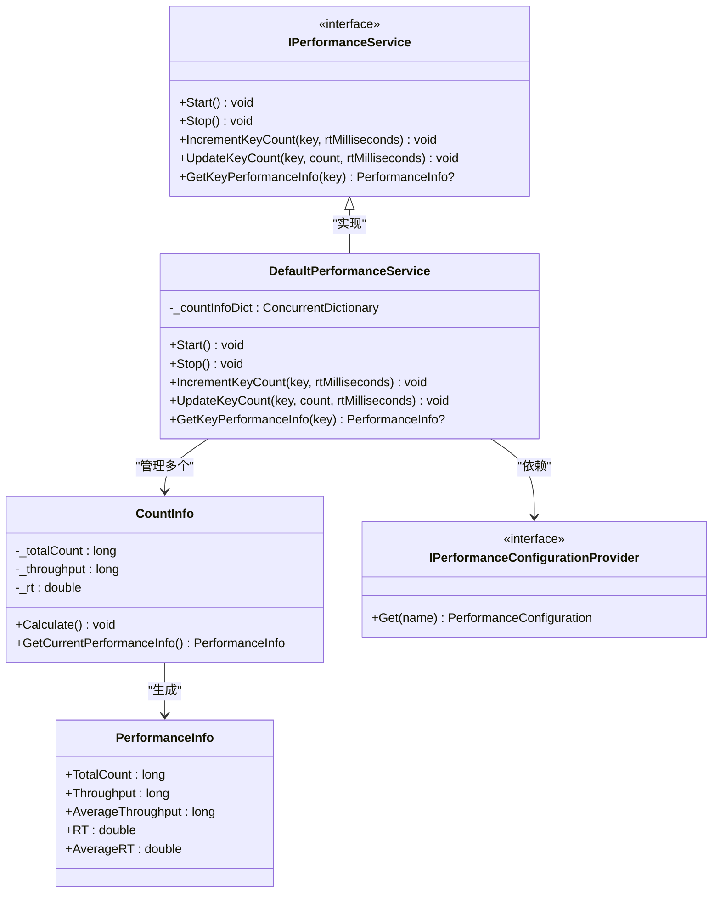
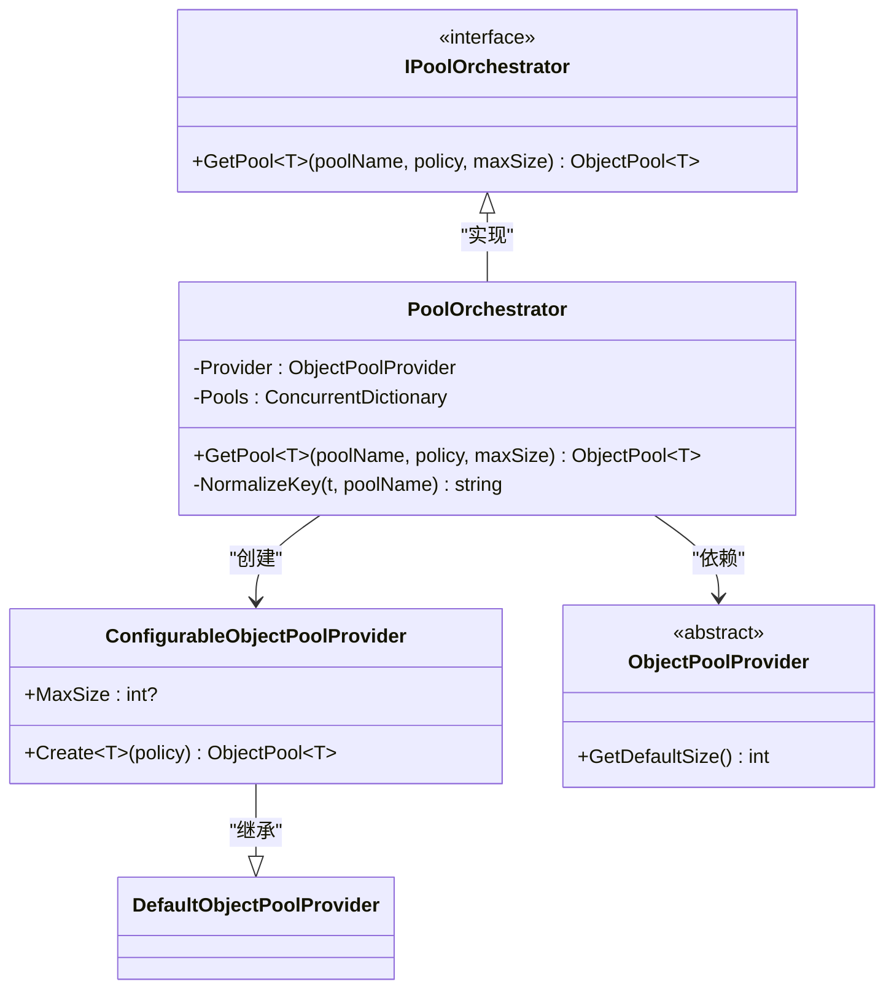

# 核心框架

<cite>
**本文档中引用的文件**
- [AbpDictionaryExtensions.cs](file://framework\src\SharpAbp.Abp.Core\SharpAbp\Abp\Core\Extensions\AbpDictionaryExtensions.cs)
- [AbpTaskExtensions.cs](file://framework\src\SharpAbp.Abp.Core\SharpAbp\Abp\Core\Extensions\AbpTaskExtensions.cs)
- [CountInfo.cs](file://framework\src\SharpAbp.Abp.DotCommon\SharpAbp\Abp\DotCommon\Performance\CountInfo.cs)
- [DefaultPerformanceService.cs](file://framework\src\SharpAbp.Abp.DotCommon\SharpAbp\Abp\DotCommon\Performance\DefaultPerformanceService.cs)
- [IPerformanceService.cs](file://framework\src\SharpAbp.Abp.DotCommon\SharpAbp\Abp\DotCommon\Performance\IPerformanceService.cs)
- [PerformanceInfo.cs](file://framework\src\SharpAbp.Abp.DotCommon\SharpAbp\Abp\DotCommon\Performance\PerformanceInfo.cs)
- [PoolOrchestrator.cs](file://framework\src\SharpAbp.Abp.ObjectPool\SharpAbp\Abp\ObjectPool\PoolOrchestrator.cs)
- [ConfigurableObjectPoolProvider.cs](file://framework\src\SharpAbp.Abp.ObjectPool\SharpAbp\Abp\ObjectPool\ConfigurableObjectPoolProvider.cs)
</cite>

## 目录
1. [简介](#简介)
2. [核心工具扩展](#核心工具扩展)
3. [性能监控组件](#性能监控组件)
4. [对象池架构](#对象池架构)
5. [实际应用示例](#实际应用示例)

## 简介
sharp-abp 是一个基于 ABP 框架的扩展库，提供了丰富的基础工具和增强功能。本文档重点介绍其核心模块中的关键组件：`SharpAbp.Abp.Core` 提供的基础扩展方法、`SharpAbp.Abp.DotCommon` 中的性能监控系统以及 `SharpAbp.Abp.ObjectPool` 的对象池实现。这些组件共同提升了开发效率和系统性能。

## 核心工具扩展

`SharpAbp.Abp.Core` 模块通过扩展方法增强了 .NET 基础类型的功能，主要集中在字典操作和异步任务处理上。

### 字典扩展方法

该模块为 `IDictionary<TKey, TValue>` 接口提供了一系列便捷的扩展方法，简化了常见的字典操作：

- **TryAdd**: 安全地向字典添加键值对，仅当键不存在时才添加。
- **GetValueOrDefault**: 获取指定键的值，如果键不存在则返回默认值。
- **TryRemove**: 尝试移除指定键的值，并通过输出参数返回被移除的值。
- **AsDictionary**: 将 `IEnumerable<KeyValuePair<TKey, TValue>>` 转换为字典。
- **ToDictionary**: 支持将字典转换为新类型的字典，可以同时转换键和值，或仅转换值。

这些方法避免了频繁的 `ContainsKey` 检查，使代码更加简洁和安全。

**Section sources**
- [AbpDictionaryExtensions.cs](file://framework\src\SharpAbp.Abp.Core\SharpAbp\Abp\Core\Extensions\AbpDictionaryExtensions.cs#L1-L133)

### 任务扩展方法

`AbpTaskExtensions` 类为 `Task` 和 `Task<TResult>` 提供了超时控制功能，这对于防止异步操作无限期挂起至关重要。

- **WaitResult**: 在指定的超时时间内等待任务完成并返回结果。如果超时，则返回结果类型的默认值。
- **TimeoutAfter**: 为任务添加超时机制。如果任务在指定时间内未完成，将抛出 `TimeoutException` 异常。

这些扩展方法利用 `CancellationTokenSource` 和 `Task.WhenAny` 实现了非阻塞的超时检测，是处理外部服务调用等不确定耗时操作的理想选择。



**Diagram sources**
- [AbpTaskExtensions.cs](file://framework\src\SharpAbp.Abp.Core\SharpAbp\Abp\Core\Extensions\AbpTaskExtensions.cs#L1-L93)

**Section sources**
- [AbpTaskExtensions.cs](file://framework\src\SharpAbp.Abp.Core\SharpAbp\Abp\Core\Extensions\AbpTaskExtensions.cs#L1-L93)

## 性能监控组件

`SharpAbp.Abp.DotCommon` 模块提供了一套完整的性能监控解决方案，用于实时跟踪系统的吞吐量（Throughput）和响应时间（RT）。

### 核心设计与类图

该组件的核心设计围绕几个关键接口和类展开：



**Diagram sources**
- [IPerformanceService.cs](file://framework\src\SharpAbp.Abp.DotCommon\SharpAbp\Abp\DotCommon\Performance\IPerformanceService.cs#L0-L37)
- [DefaultPerformanceService.cs](file://framework\src\SharpAbp.Abp.DotCommon\SharpAbp\Abp\DotCommon\Performance\DefaultPerformanceService.cs#L0-L123)
- [CountInfo.cs](file://framework\src\SharpAbp.Abp.DotCommon\SharpAbp\Abp\DotCommon\Performance\CountInfo.cs#L0-L181)
- [PerformanceInfo.cs](file://framework\src\SharpAbp.Abp.DotCommon\SharpAbp\Abp\DotCommon\Performance\PerformanceInfo.cs#L0-L20)

### 组件详解

#### IPerformanceService 与 DefaultPerformanceService
`IPerformanceService` 是性能服务的主接口，定义了启动、停止服务以及记录性能数据的方法。`DefaultPerformanceService` 是其默认实现，它使用一个 `ConcurrentDictionary` 来管理多个 `CountInfo` 实例，每个实例对应一个监控项（由名称和键标识）。服务通过定时任务（由 `IScheduleService` 驱动）周期性地调用所有 `CountInfo` 的 `Calculate` 方法来更新统计数据。

#### CountInfo
`CountInfo` 是性能数据的实际承载者。它维护着总请求数、吞吐量、平均吞吐量、响应时间和平均响应时间等指标。`IncrementKeyCount` 和 `UpdateKeyCount` 方法用于记录单次操作的耗时，而 `Calculate` 方法则负责计算周期性的统计值（如当前吞吐量），并根据配置决定是否自动写入日志或触发自定义处理器。

#### PerformanceInfo
这是一个简单的数据传输对象（DTO），封装了从 `CountInfo` 计算得出的最终性能指标，便于外部系统查询和展示。

**Section sources**
- [IPerformanceService.cs](file://framework\src\SharpAbp.Abp.DotCommon\SharpAbp\Abp\DotCommon\Performance\IPerformanceService.cs#L0-L37)
- [DefaultPerformanceService.cs](file://framework\src\SharpAbp.Abp.DotCommon\SharpAbp\Abp\DotCommon\Performance\DefaultPerformanceService.cs#L0-L123)
- [CountInfo.cs](file://framework\src\SharpAbp.Abp.DotCommon\SharpAbp\Abp\DotCommon\Performance\CountInfo.cs#L0-L181)
- [PerformanceInfo.cs](file://framework\src\SharpAbp.Abp.DotCommon\SharpAbp\Abp\DotCommon\Performance\PerformanceInfo.cs#L0-L20)

## 对象池架构

`SharpAbp.Abp.ObjectPool` 模块旨在优化资源重用，减少因频繁创建和销毁对象带来的性能开销。

### 架构设计

该模块的核心是 `IPoolOrchestrator` 接口和 `PoolOrchestrator` 实现类，它们作为对象池的协调器，统一管理和创建不同类型的对象池。



**Diagram sources**
- [IPoolOrchestrator.cs](file://framework\src\SharpAbp.Abp.ObjectPool\SharpAbp\Abp\ObjectPool\IPoolOrchestrator.cs#L0-L9)
- [PoolOrchestrator.cs](file://framework\src\SharpAbp.Abp.ObjectPool\SharpAbp\Abp\ObjectPool\PoolOrchestrator.cs#L0-L68)
- [ConfigurableObjectPoolProvider.cs](file://framework\src\SharpAbp.Abp.ObjectPool\SharpAbp\Abp\ObjectPool\ConfigurableObjectPoolProvider.cs#L0-L13)

### 组件详解

#### IPoolOrchestrator 和 PoolOrchestrator
`IPoolOrchestrator` 定义了获取对象池的契约。`PoolOrchestrator` 是其实现，它接收一个 `ObjectPoolProvider` 并使用 `ConcurrentDictionary` 缓存已创建的对象池。`GetPool` 方法通过类型和池名称生成唯一键，确保相同配置的池不会被重复创建。它还允许为每个池指定最大大小。

#### ConfigurableObjectPoolProvider
这是对 ASP.NET Core 内置 `DefaultObjectPoolProvider` 的扩展。通过设置 `MaxSize` 属性，可以在创建对象池时覆盖默认的最大容量（默认为 CPU 核心数的两倍），从而更精细地控制内存使用。

**Section sources**
- [PoolOrchestrator.cs](file://framework\src\SharpAbp.Abp.ObjectPool\SharpAbp\Abp\ObjectPool\PoolOrchestrator.cs#L0-L68)
- [ConfigurableObjectPoolProvider.cs](file://framework\src\SharpAbp.Abp.ObjectPool\SharpAbp\Abp\ObjectPool\ConfigurableObjectPoolProvider.cs#L0-L13)

## 实际应用示例

以下是如何在应用程序中使用这些核心工具的示例。

### 使用性能监控
```csharp
// 1. 获取性能服务
var performanceService = performanceServiceFactory.GetOrCreate("DatabaseQuery");

// 2. 记录一次数据库查询的耗时
var stopwatch = Stopwatch.StartNew();
// ... 执行数据库查询 ...
stopwatch.Stop();

// 3. 将耗时信息上报给性能监控系统
performanceService.IncrementKeyCount("UserQuery", stopwatch.Elapsed.TotalMilliseconds);

// 4. 查询性能数据
var perfInfo = performanceService.GetKeyPerformanceInfo("UserQuery");
Console.WriteLine($"吞吐量: {perfInfo?.Throughput}, RT: {perfInfo?.RT:F3}ms");
```

### 使用对象池
```csharp
// 1. 定义一个可池化的对象和策略
public class MyPooledObject { /* ... */ }
public class MyPooledObjectPolicy : IPooledObjectPolicy<MyPooledObject>
{
    public MyPooledObject Create() => new MyPooledObject();
    public bool Return(MyPooledObject obj) { /* 重置逻辑 */ return true; }
}

// 2. 通过协调器获取对象池
var objectPool = poolOrchestrator.GetPool("MyPool", new MyPooledObjectPolicy(), maxSize: 100);

// 3. 从池中获取对象
var obj = objectPool.Get();

try 
{
    // 使用对象...
}
finally 
{
    // 使用完毕后归还到池中
    objectPool.Return(obj);
}
```

这些示例展示了如何将 sharp-abp 的核心工具集成到实际应用中，以提升代码质量和系统性能。

**Section sources**
- [AbpTaskExtensions.cs](file://framework\src\SharpAbp.Abp.Core\SharpAbp\Abp\Core\Extensions\AbpTaskExtensions.cs#L1-L93)
- [DefaultPerformanceService.cs](file://framework\src\SharpAbp.Abp.DotCommon\SharpAbp\Abp\DotCommon\Performance\DefaultPerformanceService.cs#L0-L123)
- [PoolOrchestrator.cs](file://framework\src\SharpAbp.Abp.ObjectPool\SharpAbp\Abp\ObjectPool\PoolOrchestrator.cs#L0-L68)