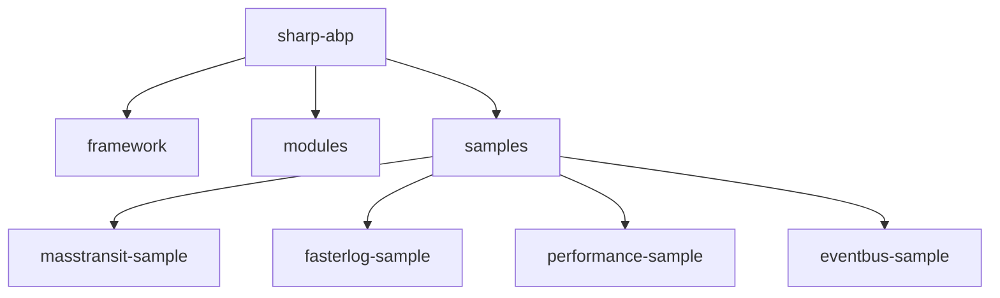
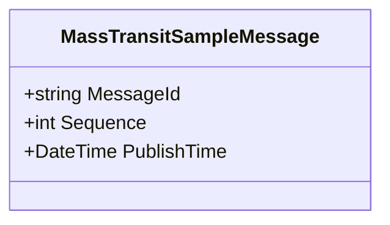
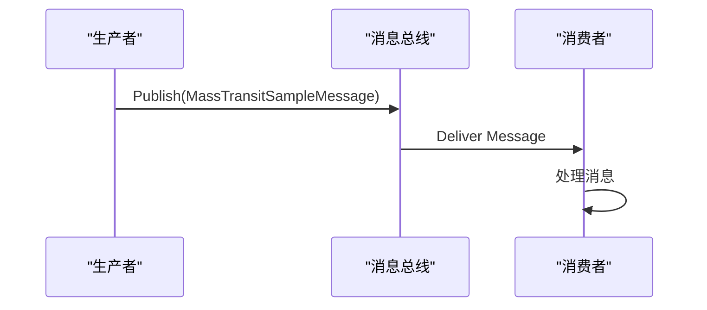
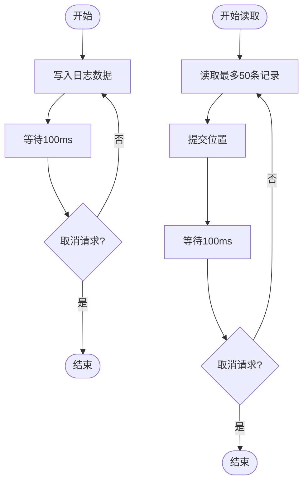
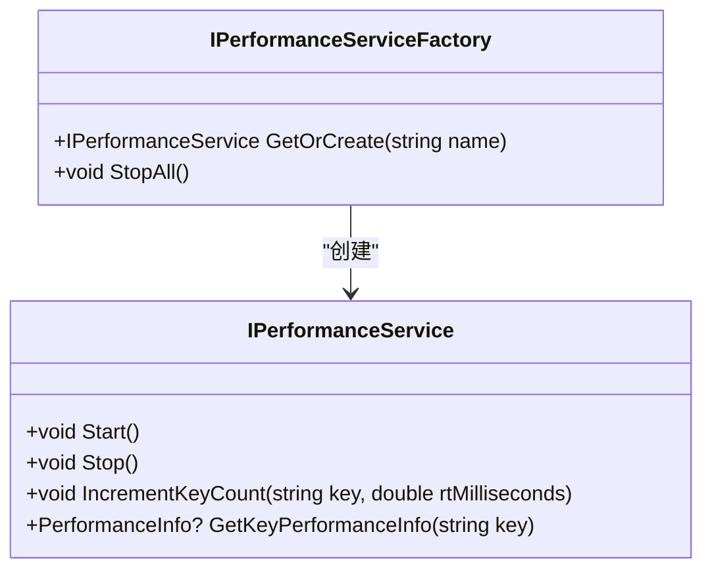
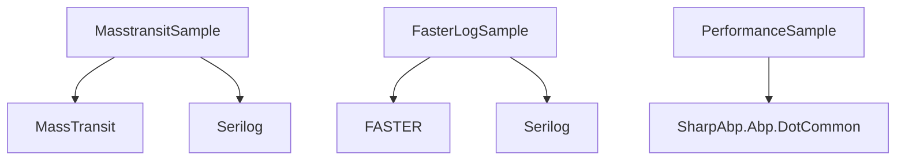

# 示例程序

<cite>
**本文档中引用的文件**
- [MassTransitSampleMessage.cs](file://samples/masstransit-sample/src/MassTransitSample.Common/MassTransitSampleMessage.cs)
- [ProducerService.cs](file://samples/masstransit-sample/src/MassTransitSample.Producer/ProducerService.cs)
- [MassTransitSampleProducerModule.cs](file://samples/masstransit-sample/src/MassTransitSample.Producer/MassTransitSampleProducerModule.cs)
- [MassTransitSampleConsumer.cs](file://samples/masstransit-sample/src/MassTransitSample.Consumer/MassTransitSampleConsumer.cs)
- [MassTransitSampleConsumerModule.cs](file://samples/masstransit-sample/src/MassTransitSample.Consumer/MassTransitSampleConsumerModule.cs)
- [Program.cs](file://samples/masstransit-sample/src/MassTransitSample.Producer/Program.cs)
- [appsettings.json](file://samples/masstransit-sample/src/MassTransitSample.Producer/appsettings.json)
- [FasterLogService.cs](file://samples/fasterlog-sample/src/FasterLogSample/FasterLogService.cs)
- [FasterLogSampleModule.cs](file://samples/fasterlog-sample/src/FasterLogSample/FasterLogSampleModule.cs)
- [appsettings.json](file://samples/fasterlog-sample/src/FasterLogSample/appsettings.json)
- [PerformanceService.cs](file://samples/performance-sample/src/PerformanceSample/PerformanceService.cs)
- [PerformanceSampleModule.cs](file://samples/performance-sample/src/PerformanceSample/PerformanceSampleModule.cs)
</cite>

## 目录
1. [简介](#简介)
2. [项目结构](#项目结构)
3. [核心组件](#核心组件)
4. [架构概述](#架构概述)
5. [详细组件分析](#详细组件分析)
6. [依赖分析](#依赖分析)
7. [性能考虑](#性能考虑)
8. [故障排除指南](#故障排除指南)
9. [结论](#结论)

## 简介
sharp-abp 是一个基于 ABP 框架的 .NET 开源解决方案，提供了多个示例程序来演示如何使用不同的技术栈构建高性能、可扩展的应用程序。本文档重点介绍三个核心示例：`masstransit-sample` 展示了如何使用 MassTransit 发布和消费消息；`fasterlog-sample` 演示了高性能日志记录的实现方式；`performance-sample` 说明了性能监控服务的集成和使用方法。通过这些示例，开发者可以学习到如何在实际项目中应用这些功能，并参考它们来构建自己的应用程序。

## 项目结构
sharp-abp 的项目结构清晰地分为几个主要部分：框架（framework）、模块（modules）和示例（samples）。其中，示例程序位于 `samples` 目录下，包含了多个独立的子项目，每个子项目都专注于特定的技术或功能点。这种组织方式使得开发者能够快速找到感兴趣的示例并进行研究。



**图示来源**
- [project_structure](file://project_structure)

**节来源**
- [project_structure](file://project_structure)

## 核心组件
本文档的核心在于对 `masstransit-sample`、`fasterlog-sample` 和 `performance-sample` 三个示例程序的深入分析。这些示例不仅展示了如何使用特定的技术，还提供了运行指南、代码结构说明以及关键实现点的剖析，帮助开发者更好地理解和应用这些技术。

**节来源**
- [MassTransitSampleMessage.cs](file://samples/masstransit-sample/src/MassTransitSample.Common/MassTransitSampleMessage.cs)
- [FasterLogService.cs](file://samples/fasterlog-sample/src/FasterLogSample/FasterLogService.cs)
- [PerformanceService.cs](file://samples/performance-sample/src/PerformanceSample/PerformanceService.cs)

## 架构概述
这三个示例程序共同构成了 sharp-abp 中关于消息传递、日志记录和性能监控的最佳实践集合。它们均基于 .NET 的通用主机模型（Generic Host），利用依赖注入和服务注册机制来管理应用程序的生命周期。此外，所有示例都采用了异步编程模式以提高性能和响应性。


**图示来源**
- [Program.cs](file://samples/masstransit-sample/src/MassTransitSample.Producer/Program.cs)
- [FasterLogService.cs](file://samples/fasterlog-sample/src/FasterLogSample/FasterLogService.cs)
- [PerformanceService.cs](file://samples/performance-sample/src/PerformanceSample/PerformanceService.cs)

## 详细组件分析

### MassTransit 示例分析
`masstransit-sample` 示例程序分为生产者和消费者两个部分，分别负责发布和接收消息。该示例支持多种消息代理，包括 RabbitMQ、Kafka 和 ActiveMQ，展示了如何配置和使用这些不同的消息队列系统。

#### 消息定义
消息类 `MassTransitSampleMessage` 定义了要传输的数据结构，包含消息ID、序列号和发布时间等属性。这个类被标记为 `[ExcludeFromTopology]`，意味着它不会自动参与拓扑结构的创建。



**图示来源**
- [MassTransitSampleMessage.cs](file://samples/masstransit-sample/src/MassTransitSample.Common/MassTransitSampleMessage.cs)

#### 生产者实现
生产者通过 `ProducerService` 类中的 `PublishAsync` 方法定期向消息队列发送消息。每次调用都会生成一个新的 `MassTransitSampleMessage` 实例，并将其发布到指定的主题或交换机上。



**图示来源**
- [ProducerService.cs](file://samples/masstransit-sample/src/MassTransitSample.Producer/ProducerService.cs)
- [MassTransitSampleConsumer.cs](file://samples/masstransit-sample/src/MassTransitSample.Consumer/MassTransitSampleConsumer.cs)

**节来源**
- [ProducerService.cs](file://samples/masstransit-sample/src/MassTransitSample.Producer/ProducerService.cs)
- [MassTransitSampleProducerModule.cs](file://samples/masstransit-sample/src/MassTransitSample.Producer/MassTransitSampleProducerModule.cs)

#### 消费者实现
消费者实现了 `IConsumer<MassTransitSampleMessage>` 接口，在接收到消息时会记录日志信息。这表明了如何处理传入的消息并执行相应的业务逻辑。

**节来源**
- [MassTransitSampleConsumer.cs](file://samples/masstransit-sample/src/MassTransitSample.Consumer/MassTransitSampleConsumer.cs)
- [MassTransitSampleConsumerModule.cs](file://samples/masstransit-sample/src/MassTransitSample.Consumer/MassTransitSampleConsumerModule.cs)

### FasterLog 示例分析
`fasterlog-sample` 使用 FASTER 技术实现了高效的日志记录功能。FASTER 是一种内存优化的日志存储引擎，能够在高并发场景下提供卓越的性能表现。

#### 配置设置
在 `appsettings.json` 文件中，可以通过 `FasterOptions` 节点配置根路径和其他相关参数。例如，将日志文件存储在 `D:\faster-logs` 目录下。

```json
{
  "FasterOptions": {
    "RootPath": "D:\\faster-logs"
  }
}
```

#### 写入与读取操作
`FasterLogService` 提供了 `Write` 和 `Read` 方法，用于向日志文件写入数据和从日志文件读取数据。写入操作是异步执行的，确保不会阻塞主线程；而读取操作则允许批量获取最近的日志条目。



**图示来源**
- [FasterLogService.cs](file://samples/fasterlog-sample/src/FasterLogSample/FasterLogService.cs)

**节来源**
- [FasterLogService.cs](file://samples/fasterlog-sample/src/FasterLogSample/FasterLogService.cs)
- [FasterLogSampleModule.cs](file://samples/fasterlog-sample/src/FasterLogSample/FasterLogSampleModule.cs)

### Performance 示例分析
`performance-sample` 展示了如何集成和使用性能监控服务。通过 `IPerformanceServiceFactory` 获取性能服务实例，并调用其方法来跟踪关键指标如吞吐量和响应时间。

#### 性能服务工厂
`DefaultPerformanceServiceFactory` 负责创建和管理性能服务实例。开发者可以通过名称获取已存在的服务或者创建新的服务实例。



**图示来源**
- [DefaultPerformanceServiceFactory.cs](file://framework/src/SharpAbp.Abp.DotCommon/SharpAbp/Abp/DotCommon/Performance/DefaultPerformanceServiceFactory.cs)
- [IPerformanceService.cs](file://framework/src/SharpAbp.Abp.DotCommon/SharpAbp/Abp/DotCommon/Performance/IPerformanceService.cs)

#### 运行性能测试
`PerformanceService` 中的 `RunPerformance` 方法启动了两个任务，模拟不同类型的请求负载。每个任务都会持续增加计数器，并随机生成响应时间，从而收集性能数据。

**节来源**
- [PerformanceService.cs](file://samples/performance-sample/src/PerformanceSample/PerformanceService.cs)
- [PerformanceSampleModule.cs](file://samples/performance-sample/src/PerformanceSample/PerformanceSampleModule.cs)

## 依赖分析
各个示例程序之间存在一定的依赖关系，但总体上保持了松耦合的设计原则。例如，`masstransit-sample` 依赖于 `MassTransit` 库来实现消息传递功能，而 `fasterlog-sample` 则依赖于 FASTER 引擎来进行高效日志记录。这些外部库通过 NuGet 包管理器引入，简化了项目的构建过程。



**图示来源**
- [Project files](file://samples/masstransit-sample/src/MassTransitSample.Producer/MassTransitSampleProducer.csproj)
- [Project files](file://samples/fasterlog-sample/src/FasterLogSample/FasterLogSample.csproj)
- [Project files](file://samples/performance-sample/src/PerformanceSample/PerformanceSample.csproj)

**节来源**
- [Project files](file://samples/masstransit-sample/src/MassTransitSample.Producer/MassTransitSampleProducer.csproj)
- [Project files](file://samples/fasterlog-sample/src/FasterLogSample/FasterLogSample.csproj)
- [Project files](file://samples/performance-sample/src/PerformanceSample/PerformanceSample.csproj)

## 性能考虑
在设计和实现这些示例程序时，充分考虑了性能因素。无论是使用 MassTransit 进行异步消息传递，还是利用 FASTER 实现高速日志记录，亦或是通过性能监控服务收集实时数据，都是为了确保应用程序能够在高负载环境下稳定运行。此外，合理的资源配置和错误处理机制也进一步提升了系统的可靠性和可用性。

## 故障排除指南
当遇到问题时，首先检查相关的配置文件是否正确无误。对于 `masstransit-sample`，确认消息代理服务器地址和凭据是否准确；对于 `fasterlog-sample`，验证日志文件路径是否存在且可写；而对于 `performance-sample`，确保性能服务已被正确初始化并且正在运行。同时，查看日志输出可以帮助定位潜在的问题根源。

**节来源**
- [appsettings.json](file://samples/masstransit-sample/src/MassTransitSample.Producer/appsettings.json)
- [appsettings.json](file://samples/fasterlog-sample/src/FasterLogSample/appsettings.json)

## 结论
通过对 `masstransit-sample`、`fasterlog-sample` 和 `performance-sample` 三个示例程序的详细分析，我们了解到了如何在 sharp-abp 框架中有效地使用 MassTransit、FASTER 和性能监控服务。这些示例不仅提供了实用的功能演示，还为开发者提供了宝贵的参考资料，有助于他们在实际项目中快速上手并构建高质量的应用程序。