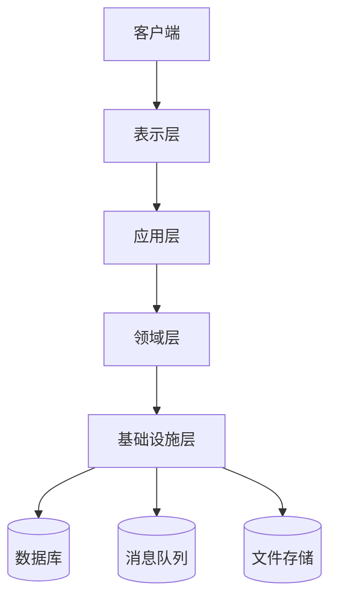
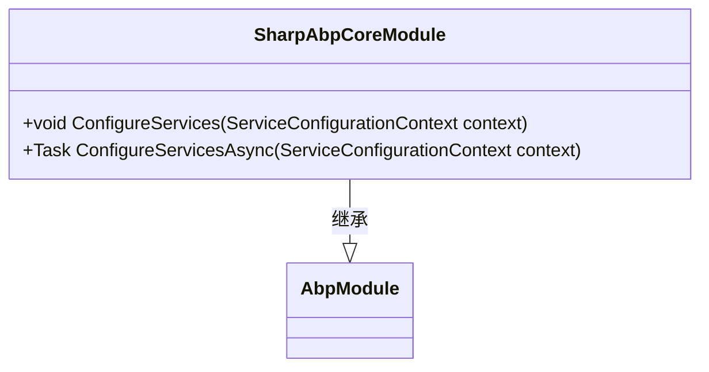
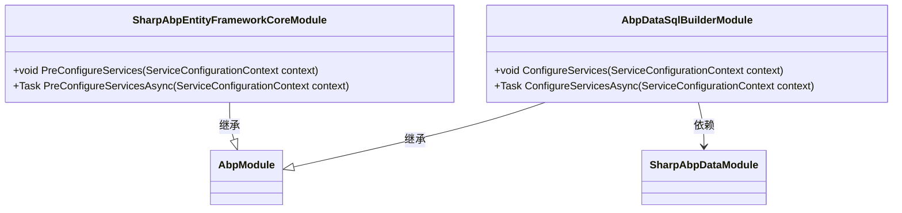
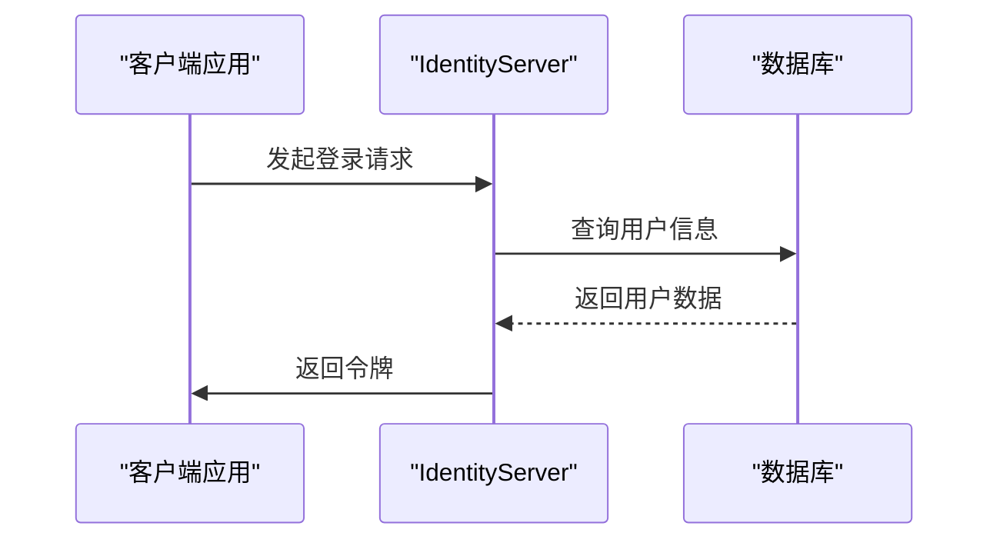
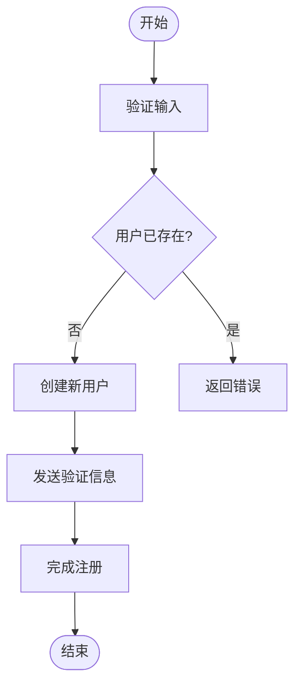
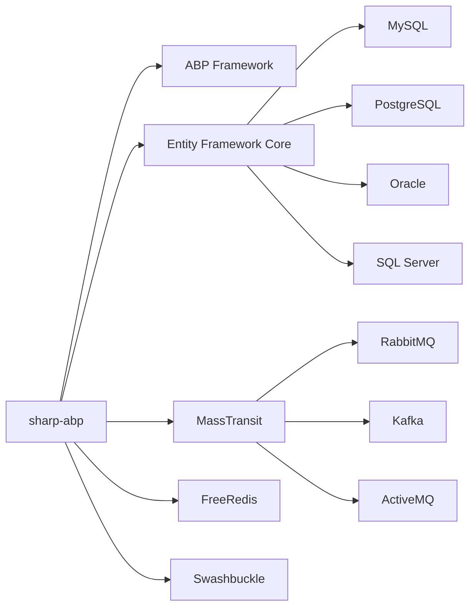

# 项目概述

<cite>
**本文档中引用的文件**
- [README.md](file://README.md)
- [SharpAbpCoreModule.cs](file://framework/src/SharpAbp.Abp.Core/SharpAbp/Abp/Core/SharpAbpCoreModule.cs)
- [SharpAbpAspNetCoreModule.cs](file://framework/src/SharpAbp.Abp.AspNetCore/SharpAbp/Abp/AspNetCore/SharpAbpAspNetCoreModule.cs)
- [AbpDataSqlBuilderModule.cs](file://framework/src/SharpAbp.Abp.Data.SqlBuilder/SharpAbp/Abp/Data/SqlBuilder/AbpDataSqlBuilderModule.cs)
- [SharpAbpEntityFrameworkCoreModule.cs](file://framework/src/SharpAbp.Abp.EntityFrameworkCore/SharpAbp/Abp/EntityFrameworkCore/SharpAbpEntityFrameworkCoreModule.cs)
- [AbpMassTransitModule.cs](file://framework/src/SharpAbp.Abp.MassTransit/SharpAbp/Abp/MassTransit/AbpMassTransitModule.cs)
- [SharpAbpDataModule.cs](file://framework/src/SharpAbp.Abp.Data/SharpAbp/Abp/Data/SharpAbpDataModule.cs)
- [IdentityServerApplication.csproj](file://modules/IdentityServer/src/SharpAbp.Abp.IdentityServer.Application/SharpAbp.Abp.IdentityServer.Application.csproj)
- [AccountApplication.csproj](file://modules/account/src/SharpAbp.Abp.Account.Application/SharpAbp.Abp.Account.Application.csproj)
</cite>

## 目录
1. [简介](#简介)
2. [项目结构](#项目结构)
3. [核心组件](#核心组件)
4. [架构概述](#架构概述)
5. [详细组件分析](#详细组件分析)
6. [依赖分析](#依赖分析)
7. [性能考虑](#性能考虑)
8. [故障排除指南](#故障排除指南)
9. [结论](#结论)

## 简介
sharp-abp 是一个为 ABP 框架设计的扩展生态系统，旨在增强和扩展原始 ABP 框架的功能。该项目通过提供一系列模块化组件来实现这一目标，这些组件可以无缝集成到基于 ABP 的应用程序中，从而提高可扩展性和可维护性。sharp-abp 的设计哲学是遵循 ABP 框架的核心原则，同时引入额外的功能以满足现代微服务架构的需求。

**Section sources**
- [README.md](file://README.md)

## 项目结构
sharp-abp 项目的结构清晰地分为两个主要部分：框架层（framework）和功能模块层（modules）。这种分层设计使得项目既具有良好的组织性又便于扩展。

- **framework**: 包含了所有基础框架级别的扩展，如 ASP.NET Core 集成、数据访问支持、事件总线集成等。
- **modules**: 提供了具体业务领域的功能模块，例如身份认证、审计日志、文件存储管理等。

每个目录下都包含了源代码（src）、测试代码（test），并且遵循标准的 .NET 项目布局。此外，还有 samples 目录用于展示如何使用这些模块。

```mermaid
graph TB
subgraph "顶层结构"
Framework[framework]
Modules[modules]
Samples[samples]
README[README.md]
end
subgraph "框架层"
F_ASPNETCORE[SharpAbp.Abp.AspNetCore]
F_DATA[SharpAbp.Abp.Data]
F_ENTITYFRAMEWORKCORE[SharpAbp.Abp.EntityFrameworkCore]
F_MASSTRANSIT[SharpAbp.Abp.MassTransit]
F_FILESTORING[SharpAbp.Abp.FileStoring]
F_CRYPTOVault[SharpAbp.Abp.CryptoVault]
end
subgraph "模块层"
M_IDENTITY[Identity]
M_ACCOUNT[account]
M_AUDITLOGGING[audit-logging]
M_FILESTORINGMANAGEMENT[file-storing-management]
M_TENANTGROUPMANAGEMENT[tenant-group-management]
end
Framework --> F_ASPNETCORE
Framework --> F_DATA
Framework --> F_ENTITYFRAMEWORKCORE
Framework --> F_MASSTRANSIT
Framework --> F_FILESTORING
Framework --> F_CRYPTOVault
Modules --> M_IDENTITY
Modules --> M_ACCOUNT
Modules --> M_AUDITLOGGING
Modules --> M_FILESTORINGMANAGEMENT
Modules --> M_TENANTGROUPMANAGEMENT
Samples --> SampleEventBus[eventbus-sample]
Samples --> SamplePerformance[performance-sample]
```

**Diagram sources**
- [README.md](file://README.md)

**Section sources**
- [README.md](file://README.md)

## 核心组件
sharp-abp 的核心组件包括但不限于以下几个方面：

- **SharpAbpCoreModule**: 作为整个 sharp-abp 生态系统的基石，它定义了最基本的模块配置。
- **SharpAbpAspNetCoreModule**: 扩展了 ASP.NET Core 的功能，提供了对前端主机、HTTP 响应头等的支持。
- **AbpDataSqlBuilderModule**: 支持多种数据库方言的 SQL 构建器，增强了跨数据库兼容性。
- **SharpAbpEntityFrameworkCoreModule**: 对 Entity Framework Core 进行了封装，简化了数据库操作。
- **AbpMassTransitModule**: 实现了与 MassTransit 的集成，支持 RabbitMQ、Kafka 等消息队线。

这些组件共同构成了 sharp-abp 的核心能力，使其能够适应各种复杂的微服务场景。

**Section sources**
- [SharpAbpCoreModule.cs](file://framework/src/SharpAbp.Abp.Core/SharpAbp/Abp/Core/SharpAbpCoreModule.cs)
- [SharpAbpAspNetCoreModule.cs](file://framework/src/SharpAbp.Abp.AspNetCore/SharpAbp/Abp/AspNetCore/SharpAbpAspNetCoreModule.cs)
- [AbpDataSqlBuilderModule.cs](file://framework/src/SharpAbp.Abp.Data.SqlBuilder/SharpAbp/Abp/Data/SqlBuilder/AbpDataSqlBuilderModule.cs)
- [SharpAbpEntityFrameworkCoreModule.cs](file://framework/src/SharpAbp.Abp.EntityFrameworkCore/SharpAbp/Abp/EntityFrameworkCore/SharpAbpEntityFrameworkCoreModule.cs)
- [AbpMassTransitModule.cs](file://framework/src/SharpAbp.Abp.MassTransit/SharpAbp/Abp/MassTransit/AbpMassTransitModule.cs)

## 架构概述
sharp-abp 的整体架构采用了分层设计模式，确保了高内聚低耦合的特点。其主要由以下几层构成：

1. **表示层 (Presentation Layer)**: 负责处理用户界面交互，通常基于 ASP.NET Core MVC 或 Web API。
2. **应用层 (Application Layer)**: 定义了业务逻辑的服务接口，并协调领域对象之间的交互。
3. **领域层 (Domain Layer)**: 封装了核心业务规则和实体模型。
4. **基础设施层 (Infrastructure Layer)**: 提供了持久化、消息传递、安全等底层服务。

各层之间通过明确定义的接口进行通信，保证了系统的灵活性和可维护性。

**Diagram sources**
- [SharpAbpAspNetCoreModule.cs](file://framework/src/SharpAbp.Abp.AspNetCore/SharpAbp/Abp/AspNetCore/SharpAbpAspNetCoreModule.cs)
- [AbpMassTransitModule.cs](file://framework/src/SharpAbp.Abp.MassTransit/SharpAbp/Abp/MassTransit/AbpMassTransitModule.cs)

**Section sources**
- [SharpAbpAspNetCoreModule.cs](file://framework/src/SharpAbp.Abp.AspNetCore/SharpAbp/Abp/AspNetCore/SharpAbpAspNetCoreModule.cs)
- [AbpMassTransitModule.cs](file://framework/src/SharpAbp.Abp.MassTransit/SharpAbp/Abp/MassTransit/AbpMassTransitModule.cs)

## 详细组件分析
### 框架层分析
#### SharpAbpCoreModule 分析
`SharpAbpCoreModule` 是所有其他模块的基础，它继承自 `AbpModule` 类并实现了基本的模块初始化逻辑。尽管该类本身没有添加太多特定功能，但它为后续模块提供了必要的扩展点。

**Diagram sources**
- [SharpAbpCoreModule.cs](file://framework/src/SharpAbp.Abp.Core/SharpAbp/Abp/Core/SharpAbpCoreModule.cs)

#### 数据访问组件分析
`SharpAbpEntityFrameworkCoreModule` 和 `AbpDataSqlBuilderModule` 共同作用于数据访问层，前者集成了 Entity Framework Core，后者则提供了针对不同数据库的 SQL 方言适配器。这使得开发者可以在不修改业务代码的情况下轻松切换数据库。

**Diagram sources**
- [SharpAbpEntityFrameworkCoreModule.cs](file://framework/src/SharpAbp.Abp.EntityFrameworkCore/SharpAbp/Abp/EntityFrameworkCore/SharpAbpEntityFrameworkCoreModule.cs)
- [AbpDataSqlBuilderModule.cs](file://framework/src/SharpAbp.Abp.Data.SqlBuilder/SharpAbp/Abp/Data/SqlBuilder/AbpDataSqlBuilderModule.cs)
- [SharpAbpDataModule.cs](file://framework/src/SharpAbp.Abp.Data/SharpAbp/Abp/Data/SharpAbpDataModule.cs)

**Section sources**
- [SharpAbpEntityFrameworkCoreModule.cs](file://framework/src/SharpAbp.Abp.EntityFrameworkCore/SharpAbp/Abp/EntityFrameworkCore/SharpAbpEntityFrameworkCoreModule.cs)
- [AbpDataSqlBuilderModule.cs](file://framework/src/SharpAbp.Abp.Data.SqlBuilder/SharpAbp/Abp/Data/SqlBuilder/AbpDataSqlBuilderModule.cs)
- [SharpAbpDataModule.cs](file://framework/src/SharpAbp.Abp.Data/SharpAbp/Abp/Data/SharpAbpDataModule.cs)

### 功能模块层分析
#### IdentityServer 模块分析
`IdentityServer` 模块提供了完整的身份验证和授权解决方案，基于 OAuth 2.0 和 OpenID Connect 协议。它不仅包含了标准的身份服务器功能，还增加了多租户支持和分布式事件处理机制。

**Diagram sources**
- [IdentityServerApplication.csproj](file://modules/IdentityServer/src/SharpAbp.Abp.IdentityServer.Application/SharpAbp.Abp.IdentityServer.Application.csproj)

#### Account 模块分析
`Account` 模块专注于账户管理和用户注册流程，集成了邮件发送、短信验证码等功能。它同样支持多租户环境下的独立账户体系。

**Diagram sources**
- [AccountApplication.csproj](file://modules/account/src/SharpAbp.Abp.Account.Application/SharpAbp.Abp.Account.Application.csproj)

**Section sources**
- [IdentityServerApplication.csproj](file://modules/IdentityServer/src/SharpAbp.Abp.IdentityServer.Application/SharpAbp.Abp.IdentityServer.Application.csproj)
- [AccountApplication.csproj](file://modules/account/src/SharpAbp.Abp.Account.Application/SharpAbp.Abp.Account.Application.csproj)

## 依赖分析
sharp-abp 项目广泛依赖于 .NET 生态系统中的多个库和技术栈，主要包括：

- **ABP Framework**: 作为基础框架，提供了模块化架构和依赖注入容器。
- **Entity Framework Core**: 用于 ORM 映射和数据库操作。
- **MassTransit**: 实现了可靠的消息传递机制，支持多种消息代理。
- **FreeRedis**: 提供高性能的 Redis 客户端实现。
- **Swashbuckle**: 自动生成 RESTful API 文档。

此外，sharp-abp 还支持多种数据库后端，如 MySQL、PostgreSQL、Oracle 等，并且可以通过插件形式扩展更多类型。

**Diagram sources**
- [AbpMassTransitModule.cs](file://framework/src/SharpAbp.Abp.MassTransit/SharpAbp/Abp/MassTransit/AbpMassTransitModule.cs)
- [SharpAbpEntityFrameworkCoreModule.cs](file://framework/src/SharpAbp.Abp.EntityFrameworkCore/SharpAbp/Abp/EntityFrameworkCore/SharpAbpEntityFrameworkCoreModule.cs)

**Section sources**
- [AbpMassTransitModule.cs](file://framework/src/SharpAbp.Abp.MassTransit/SharpAbp/Abp/MassTransit/AbpMassTransitModule.cs)
- [SharpAbpEntityFrameworkCoreModule.cs](file://framework/src/SharpAbp.Abp.EntityFrameworkCore/SharpAbp/Abp/EntityFrameworkCore/SharpAbpEntityFrameworkCoreModule.cs)

## 性能考虑
在设计 sharp-abp 时，性能是一个重要的考量因素。为了优化性能，采取了以下措施：

- 使用异步编程模型减少阻塞等待时间。
- 利用缓存机制降低数据库查询频率。
- 采用连接池技术提高数据库连接效率。
- 在消息传递中启用批量处理以减少网络开销。

这些策略有效地提升了系统的响应速度和吞吐量，特别是在高并发场景下表现尤为突出。

## 故障排除指南
当遇到问题时，建议按照以下步骤进行排查：

1. 检查日志输出，查找异常堆栈跟踪。
2. 确认配置文件是否正确设置。
3. 验证依赖服务（如数据库、消息队列）是否正常运行。
4. 查看是否有版本兼容性问题。
5. 参考官方文档或社区论坛寻求帮助。

对于常见的错误，如数据库连接失败或消息消费超时，应首先检查相关服务的状态和网络连通性。

**Section sources**
- [README.md](file://README.md)

## 结论
sharp-abp 作为一个强大的 ABP 框架扩展生态系统，通过精心设计的模块化架构和丰富的功能集，极大地简化了复杂企业级应用的开发过程。无论是初学者还是经验丰富的开发者，都能从中受益匪浅。未来的发展方向将继续聚焦于提升性能、增强安全性以及拓展更多的第三方集成选项。